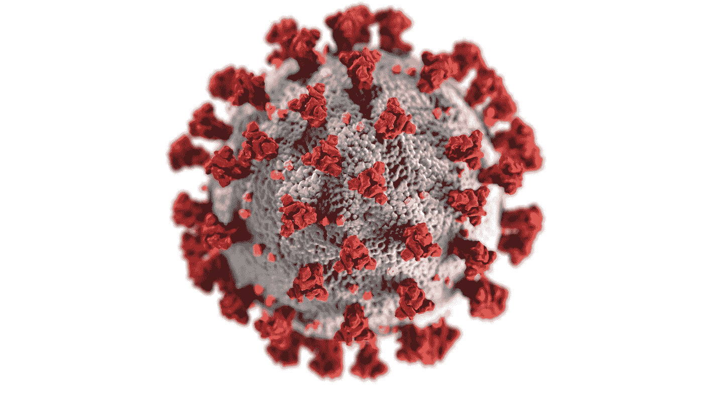

# 新冠肺炎疫情之后，哪些行业可以从区块链技术中受益

> 原文：<https://medium.datadriveninvestor.com/which-industries-can-benefit-from-blockchain-technology-after-the-covid-19-pandemic-3d0bada0cfa8?source=collection_archive---------15----------------------->

Photo by [CDC](https://unsplash.com/@cdc?utm_source=medium&utm_medium=referral) on [Unsplash](https://unsplash.com?utm_source=medium&utm_medium=referral)

新冠肺炎疫情以前所未有的方式冲击了全球经济。今年年初，西方国家似乎相对放松，但在 3 月份，这种病毒变得明显不分国界。但是，当全球经济仍在疫情效应下呻吟时，一些公司和行业表现得尤为顽强。对于区块链等新技术来说，这可能是期待已久的最初火花。纳什的联合创始人法比奥·卡内辛(Fabio Canesin)强调了最有可能适应的三个行业。

区块链技术即将在三个行业取得突破
据区块链公司 Nash 的联合创始人 Fabio Canesin 称，在科罗纳疫情之后，世界面临着一场根本性的变革。这一关键技术的无限可能性意味着区块链可以在塑造未来方面发挥主导作用。

因此，这位创始人指出，在后电晕时代，区块链目前可以用于三个领域

*   在政府环境中，
*   对于中小型企业
*   对于非营利组织来说

# 供应链领域的适应

正如我们在别处报道的那样，区块链技术可以在供应链管理中发挥关键作用。例如，IBM Food Trust 已经展示了如何使用区块链技术有效地跟踪食品工业产品。但分布式账本技术也可以在钴矿开采中创造附加值——钴矿是电池生产的基本原材料之一。

我们认为，区块链还可能在供应链管理中发挥关键作用，以提供更大的透明度和可追溯性。特别是，疫情的停产表明，供应链优化是必要的，以防止这种情况在未来发生。然而，在新技术的帮助下，可以更好地体现日益增加的透明度和对单个流程的数字化处理，如里程碑的无纸化记录。原则上，在现代供应链中，可以更快地回答以下关键问题:

*   目前交付在哪里？
*   货物什么时候到达？
*   是否有任何运输问题(延误或环境影响)
*   有海关检查吗？
*   谁造成了延误？
*   谁对缺陷负责？

# 区块链技术可能会彻底改变直升机撒钱

随着唐纳德特朗普(Donald Trump)宣布直升机撒钱，这位美国总统打破了一个新奇的东西。与此同时，美国公民会收到所谓的刺激支票。

对于 Canesin 来说，直升机撒钱是新技术的一个可能应用。

> “这可能意味着使用区块链进行直升机支付，而不是通过耗时更长且容易出错的传统系统进行支付。加上使用区块链来加速这一过程，目前的系统可以开始允许单个节点直接进入网络，而不需要中间媒介”。— [法比奥·卡内辛](https://medium.com/u/5d066a8526b?source=post_page-----3d0bada0cfa8--------------------------------)

税款的偿还、父母福利的分配或养老金的支付都可以使用区块链技术轻松、安全地绘制出来。此外，各国可以更快、更安全地向发展中国家发放补贴，从而消除一个主要的批评点。

非营利组织领域也有类似的应用。例如，非营利组织可以以类似的方式向受益人支付捐款。这种方法的优势是显而易见的，因为国际支付目前成本很高。因此，相当一部分捐赠是由交易成本造成的。此外，非营利组织也必须共同筹资。通过使用区块链技术，这种现状可能会被打破。捐款可以更快地到达接受者手中。此外，交易成本可以降低。

此外，捐助者的接受程度可能会提高。如今，许多纳税人对捐款的按需使用心存疑虑。经常有这样的丑闻，捐赠的资金只在很小的程度上到达实际的接受者手中。区块链还将有助于提高透明度，增加捐助者的接受度。

我在每月的[时事通讯中分享了更多的个人想法，你可以在这里查看](https://mailchi.mp/bf8f8e8ed697/keep-in-touch-with-lukas)。请在评论中告诉我，并在各种社交媒体平台上加入我:

[推特](https://twitter.com/WiesfleckerL) ● [Instagram](https://www.instagram.com/lukaswiesflecker/) ● [脸书](https://www.facebook.com/lukaswiesfleckerr)●[Snapchat](https://www.snapchat.com/add/luggooo)●[LinkedIn](https://www.linkedin.com/in/lukas-wiesflecker-1b11251a5/)

无论你做什么，都要带着爱和激情去做！