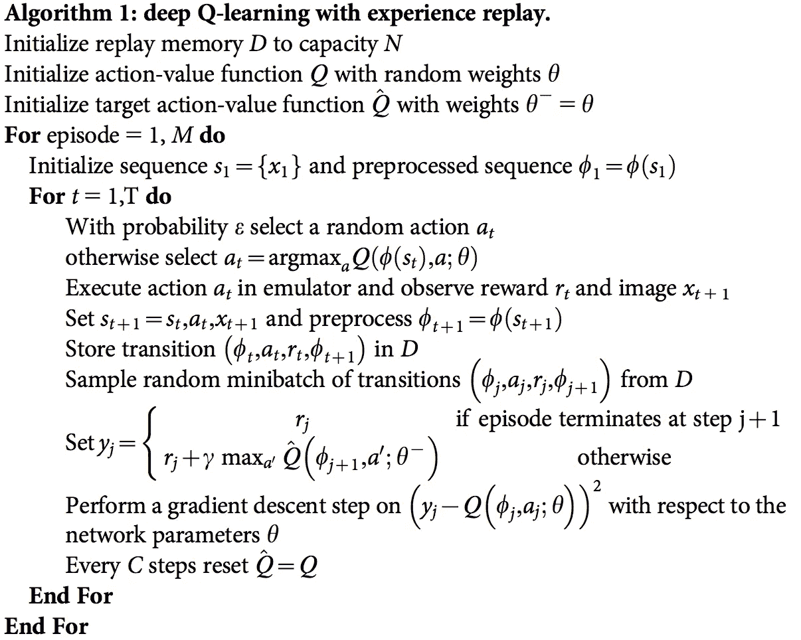
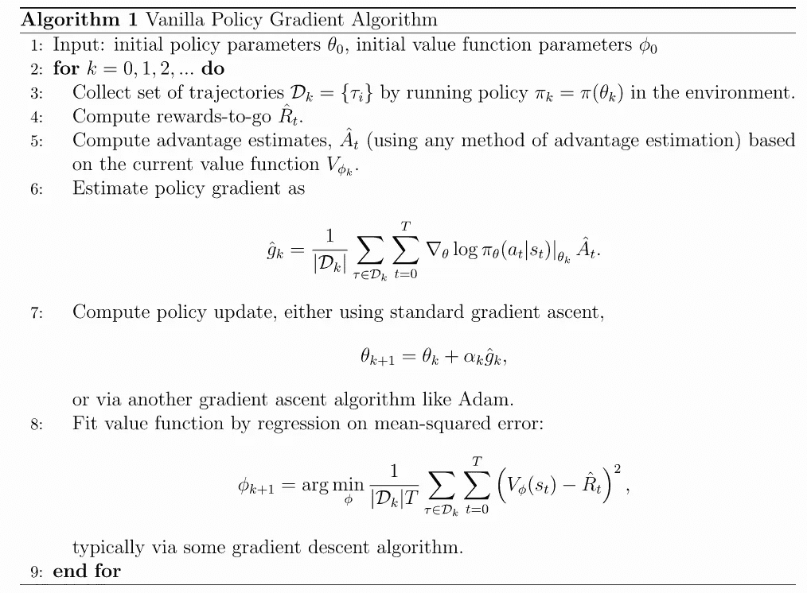
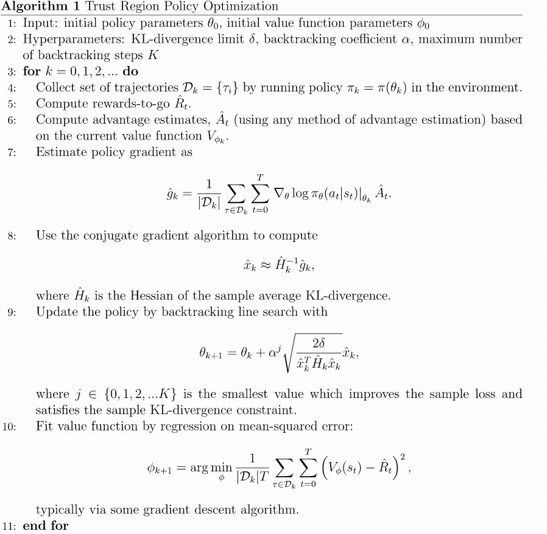
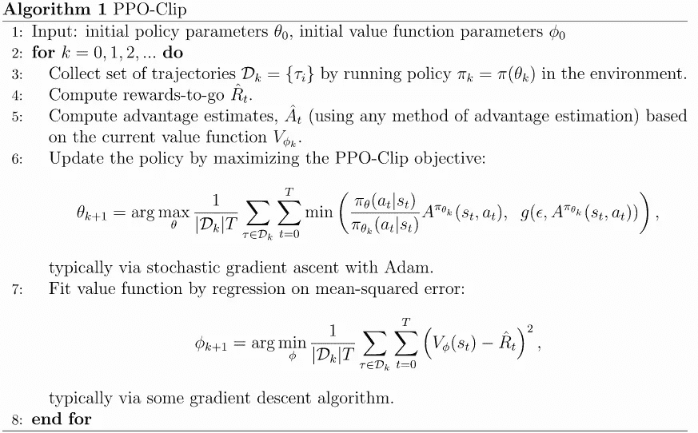
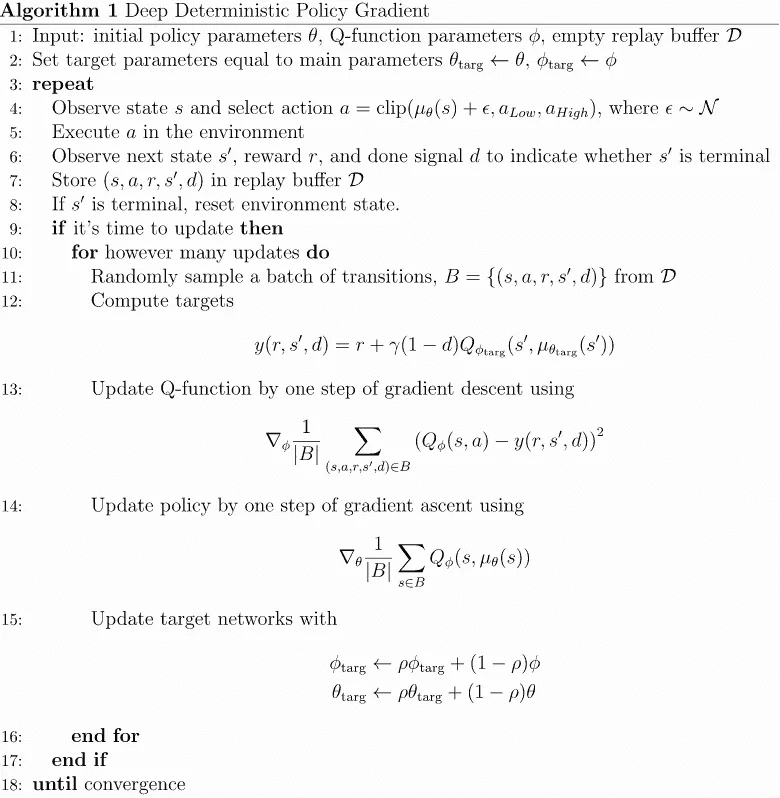
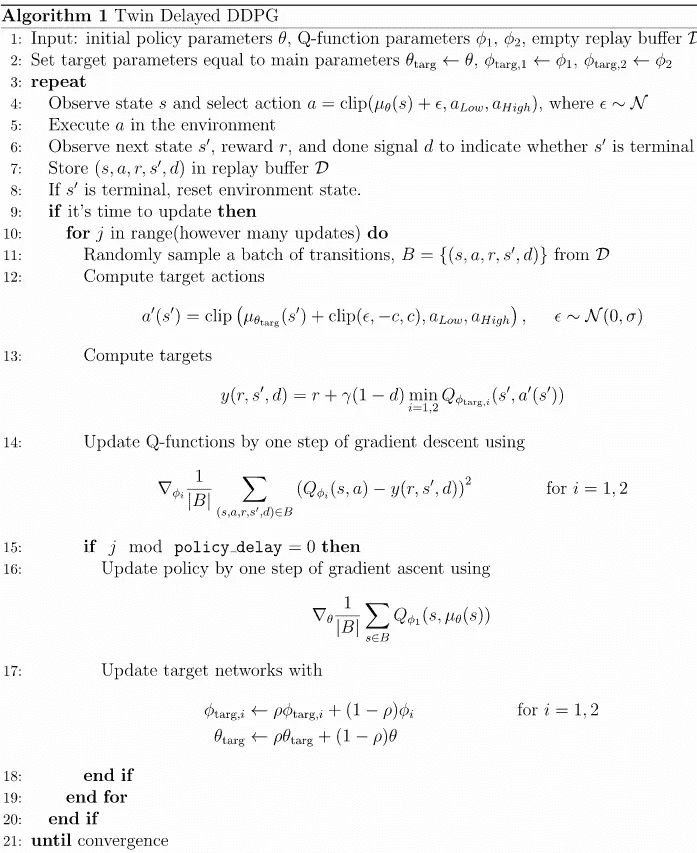
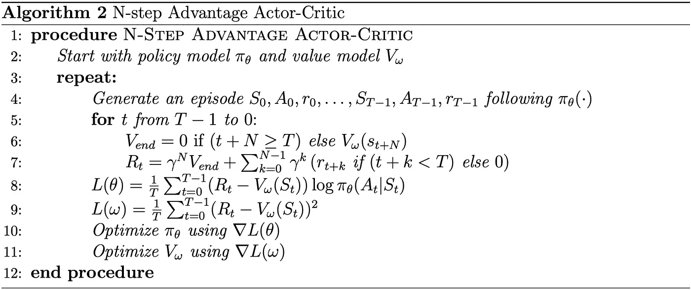
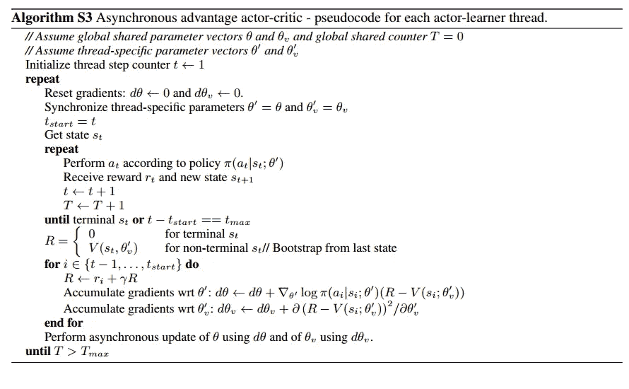
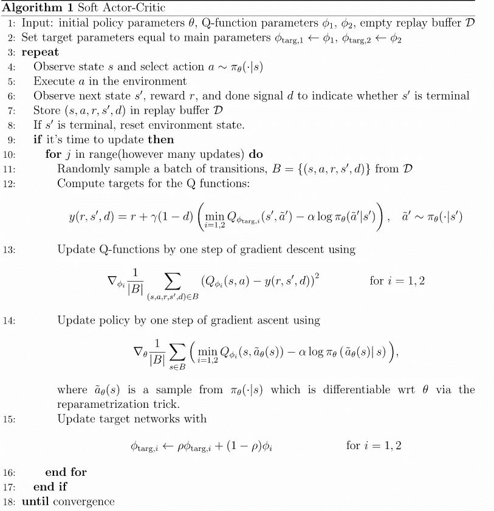

# 在哪里、什么时候、什么场景下使用哪种强化学习-RL 算法？

> 原文：<https://medium.datadriveninvestor.com/which-reinforcement-learning-rl-algorithm-to-use-where-when-and-in-what-scenario-e3e7617fb0b1?source=collection_archive---------0----------------------->

什么？为什么？什么时候？哪一个？强化学习算法和现有强化学习算法的快速事实。

[Asking the basic questions improves our understanding of the topic](https://www.google.com/url?sa=i&url=https%3A%2F%2Fwww.workfront.com%2Fblog%2Fproject-management-101-the-5-ws-and-1-h-that-should-be-asked-of-every-project&psig=AOvVaw0zUAFYrKwD1BAVslL2Ufim&ust=1586974663320000&source=images&cd=vfe&ved=0CAIQjRxqFwoTCNjy67vD6OgCFQAAAAAdAAAAABAD)

强化学习是一个复杂的机器学习领域，超参数的微小变化可能导致模型性能的突然变化。

首先，我们将讨论关于各种 RL 技术的快速事实，然后继续理解哪种算法有什么专长，哪种情况需要哪种技术。

# 深 Q 网(DQN):

[Psuedo code for DQN](https://www.google.com/url?sa=i&url=https%3A%2F%2Ftowardsdatascience.com%2Fintroduction-to-various-reinforcement-learning-algorithms-i-q-learning-sarsa-dqn-ddpg-72a5e0cb6287&psig=AOvVaw0AldQqVIfxeYiMBkycsQiM&ust=1587053501798000&source=images&cd=vfe&ved=0CAIQjRxqFwoTCLixhpTp6ugCFQAAAAAdAAAAABAD)

1.  基于 Q 网络
2.  需要一个稳定的目标网络
3.  需要优先体验重放，以实现高效采样
4.  非政策方法
5.  收敛慢但效率高

# **普通政策梯度(VPG):**

[Psuedo code for VPG](https://spinningup.openai.com/en/latest/algorithms/vpg.html)

1.  VPG 是一种基于策略的算法
2.  使用策略梯度实现融合
3.  VPG 可用于具有离散或连续动作空间的环境

# **信任区域策略优化(TRPO):**

[Psuedo code for TRPO](https://spinningup.openai.com/en/latest/algorithms/trpo.html)

1.  TRPO 是一种策略算法
2.  TRPO 通过采取尽可能大的步骤来更新策略，以提高性能，同时满足基于 KL 的关于允许新旧策略有多接近的分歧的约束
3.  TRPO 可用于具有离散或连续动作空间的环境

# **最近策略优化(PPO):**

[Psuedo code for PPO](https://spinningup.openai.com/en/latest/algorithms/ppo.html)

1.  PPO 是一种基于策略的算法。
2.  PPO 方法实现起来更简单。
3.  PPO 有两种变体。
4.  PPO-罚->(罚 KL 背离)
5.  PPO-Clip-->(剪辑目标函数)

# **深度确定性政策梯度(DDPG):**

[Psuedo code for DDPG](https://spinningup.openai.com/en/latest/algorithms/ddpg.html)

1.  DDPG 是一种非策略算法
2.  DDPG 可以被认为是连续动作空间的深度 Q 学习
3.  它使用非策略数据和贝尔曼方程来学习 Q 函数，并使用 Q 函数来学习策略
4.  DDPG 只能用于有连续活动空间的环境

# **双延迟 DDPG (TD3):**

[Psuedo code for TD3](https://spinningup.openai.com/en/latest/algorithms/td3.html)

1.  TD3 是一种非策略算法。
2.  TD3 只能用于有连续动作空间的环境。
3.  对于超参数和其他种类的调整，它经常是脆弱的。
4.  TD3 学习*两个* Q 函数而不是一个，并使用两个 Q 值中较小的一个来形成损失函数中的目标。
5.  TD3 更新策略(和目标网络)的频率低于 Q 函数。
6.  TD3 向目标动作添加噪声，通过平滑 Q 以及动作的变化来利用 Q 函数误差。

# 优秀演员兼评论家(A2C):

[Psuedo code for A2C](https://www.google.com/url?sa=i&url=https%3A%2F%2Ftowardsdatascience.com%2Funderstanding-actor-critic-methods-931b97b6df3f&psig=AOvVaw3PVGJko_f7Rd6cpCMIaZZy&ust=1587053644120000&source=images&cd=vfe&ved=0CAIQjRxqFwoTCICzgtjp6ugCFQAAAAAdAAAAABAD)

1.  A2C 是一种非政策方法
2.  它使用优势估计来计算每个行动状态对的价值主张
3.  A2C 是 A3C 的同步版本。

# **异步优势演员-评论家(A3C):**

P[suedo code for A3C](https://www.google.com/url?sa=i&url=https%3A%2F%2Ftowardsdatascience.com%2Funderstanding-actor-critic-methods-931b97b6df3f&psig=AOvVaw3PVGJko_f7Rd6cpCMIaZZy&ust=1587053644120000&source=images&cd=vfe&ved=0CAIQjRxqFwoTCICzgtjp6ugCFQAAAAAdAAAAABAD)

1.  A3C 是一种不符合政策的方法。
2.  演员和评论家以异步方式训练和更新
3.  与 A3C 相比，提供更快的多处理能力。
4.  由于多个实例同时运行，收敛速度更快

# 软演员兼评论家(SAC):

[Psuedo code for SAC](https://spinningup.openai.com/en/latest/algorithms/sac.html)

1.  SAC 是一种非策略算法。
2.  它以非策略的方式优化随机策略，在随机策略优化和 DDPG 式方法之间架起了一座桥梁。
3.  它结合了削波双 Q 技巧。
4.  SAC 使用**熵正则化**，其中策略被训练为最大化预期回报和[熵](https://en.wikipedia.org/wiki/Entropy_(information_theory))(策略中的随机性)之间的权衡。
5.  SAC 同时学习一个策略和两个 Q 函数

[Keep revising until the concept is clear people](https://www.google.com/url?sa=i&url=https%3A%2F%2Ftenor.com%2Fview%2Fits-gonna-take-alot-of-work-but-the-work-is-the-fun-part-guys-ted-danson-michael-the-good-place-gif-16132269&psig=AOvVaw2c5uR1aoDWSXHI59sfSr7y&ust=1586974521439000&source=images&cd=vfe&ved=0CAIQjRxqFwoTCPCn_ffC6OgCFQAAAAAdAAAAABAQ)

最后介绍了最流行的 RL 算法和它们的关键特性，这些特性揭示了它们的用途和新颖性。

现在，我们将看到哪种算法应该在什么场景中使用，以及哪种算法在给定特定问题陈述的情况下提供最佳性能。我们将根据动作空间的类型和多重处理的能力来划分问题。

> **离散动作——单个流程:**

DQN 与一些补充包括(目标网络，双 DQN，优先体验重播和决斗 DQN)和宏基(演员评论家与体验重播)。
DQN 通过重放缓冲提供更好的采样效率，但收敛时间更长。

> **离散动作—多重处理:**

PPO、A2C、ACKTR(使用克罗内克因子信任区域的演员兼评论家)和宏基。PPO 是首选，因为它提供了这里提到的更快的收敛->([https://openai.com/blog/openai-baselines-ppo/#ppo](https://openai.com/blog/openai-baselines-ppo/#ppo))

> **连续动作—单个流程:**

SAC 和 TD3

> **连续动作—多重处理:**

PPO、TRPO 和 A3C。A3C 的训练速度更快，但 PPO 的收敛速度更快，而 TRPO 在某些点上很吃力。

# 结论:

因此，在这篇文章中，我们了解了每个基于 RL 的算法的独特方面，从策略梯度到 Q 学习方法，还涵盖了演员评论方法。一些关键要点:

1.  可以观察到，PPO 提供了比其他技术更好的收敛性和性能速率，但是对变化敏感。
2.  单独的 DQN 是不稳定的，并且给出较差的收敛性，因此需要几个附加元件。
3.  由于熵因子正则化，SAC 对于基于能量的优化技术非常有效
4.  TD3 和 TRPO 在连续动作空间中工作良好，但是缺乏更快的收敛速度
5.  当大计算能力可用并且需要引入相似环境下迁移学习的概念时，A3C 非常有用。

# Bonus 部分:

[Bonus section -> Might wanna try training Mario gym environment using RL](https://www.google.com/url?sa=i&url=https%3A%2F%2Fgfycat.com%2Fslightfarawayballpython&psig=AOvVaw0H7fh8MIb3gX5rEOP89gL5&ust=1586989355511000&source=images&cd=vfe&ved=0CAIQjRxqFwoTCMD_hJn66OgCFQAAAAAdAAAAABAJ)

还有一个类别没有被发现，那就是如何处理目标或情景环境。

她的(事后经验回放)为完成轨迹的部分分配小奖励，并帮助代理更快地学习与最终目标相关的时间信息。

**GAEL(广义优势估计学习)**帮助 RL 代理从专家玩家或专家/预先学习的轨迹中学习。这有助于提供基于模仿的学习，并提高收敛和样本效率。使用 GAEL 来诱导半监督学习，然后进一步改进专家策略。

> 注意——GAEL 和 HER 将用作 PPO/A2C/TRPO/TD3 顶部的包装材料，而不是单独使用

[You did great. Best wishes for your future work and RL](https://www.google.com/url?sa=i&url=https%3A%2F%2Fgiphy.com%2Fgifs%2Fcongratulations-congrats-xT0xezQGU5xCDJuCPe&psig=AOvVaw1SvMlBKYfEIGmc4qMOzwCG&ust=1586990648581000&source=images&cd=vfe&ved=0CAIQjRxqFwoTCPD574H_6OgCFQAAAAAdAAAAABAI) training

希望这篇博文对你有所帮助。

# 创建此帖子所用的资源:

1.  [https://stable-baselines . readthedocs . io/en/master/index . html](https://stable-baselines.readthedocs.io/en/master/index.html)
2.  [https://openai.com/blog/openai-baselines-ppo/#ppo](https://openai.com/blog/openai-baselines-ppo/#ppo)
3.  [https://openai.com/blog/](https://openai.com/blog/)
4.  [https://spinningup.openai.com/en/latest/](https://spinningup.openai.com/en/latest/)

## 学习强化学习的有用资源:

1.  [https://sites.google.com/view/deep-rl-bootcamp/home](https://sites.google.com/view/deep-rl-bootcamp/home)
2.  大卫·西尔弗的 RL 课程
3.  通过 OpenAI 旋转 RL
4.  代码实现的稳定基线
5.  代码实现的 ChainerRL

.