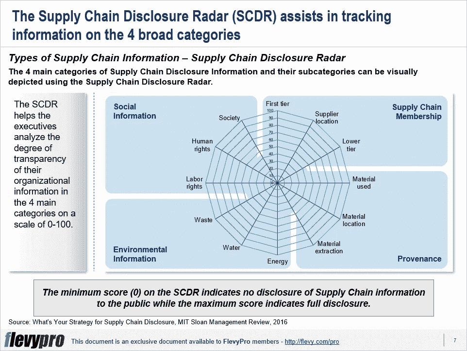

# 哪种供应链信息透明策略适合您组织的信息披露需求？

> 原文：<https://medium.datadriveninvestor.com/which-supply-chain-information-transparency-strategy-fits-your-organizations-information-e6c9e0dd25e6?source=collection_archive---------8----------------------->

今天，跨行业的供应链管理变得过于复杂和全球化。随着社交媒体的普及和使用，组织越来越面临公开披露信息的压力。这种对信息透明度的压力已经达到了一个水平，外部利益相关者期望了解一个组织的供应链实践的细节，远远超过通常需要依法披露的内容。

高管们发现很难处理这种情况。他们中的大多数对自己供应链的显著特征和能力了解有限，缺乏收集和报告供应链数据的专业知识，并且未能制定出[供应链信息披露策略](https://flevy.com/browse/flevypro/supply-chain-information-transparency-strategy-5098)。

首先，他们需要首先认识到推动信息透明趋势的力量——政府法规、法律、竞争对手的最佳实践和[非政府组织](https://flevy.com/business-toolkit/non-governmental-organization)。非政府组织经常通过媒体宣传揭露组织实施的不良供应链行为。这些活动可能会对品牌声誉产生不利影响。

一旦对这些力量有了一个公平的理解，只有这样，高管们才能制定出有效处理这些信息透明度趋势的方法。

# 供应链信息类别

组织对供应链信息透明化的需求和理解不断增长，这使得他们必须深入了解实现这一目标所需的条件以及其中的限制因素，例如，他们的数据收集能力、建立报告系统所需的资源、技术要求以及明确定义的报告系统标准。

供应链管理专家确定了组织可以公开披露的 4 类供应链信息:

1.  **供应链成员**
2.  **出处**
3.  **环境信息**
4.  **社会信息**

## 1.供应链成员

此类别属于与供应商相关的信息。它包括供应商的基本信息，如一级直接供应商的名称和供应商位置。例如，耐克公司共享其整个产品系列的全球供应商名单，包括每个供应商的名称、地点、劳动力构成和分包状态。

## 2.起源

此类别包含与确保生产产品所用材料符合监管标准相关的信息。具体来说，这包括来源(材料)的位置，材料提取的做法，以及遵守安全和质量标准。

## 3.环境情报中心

此类别与环境措施报告有关，包括碳和能源使用水平、水使用、空气污染和供应链中的废物水平。

## 4.社会信息

这一类别包括关于劳工政策(健康和安全条件、工作时间)、人权数据和供应链的社会影响(社区参与和发展工作)的报告。

# 供应链信息透明策略

没有适合所有公司的通用信息披露方法。一旦高级管理层对可以公开共享的供应链信息类型的最佳实践进行了评估，他们的重点应该是确定和商定对其组织来说最理想的供应链信息披露水平。高级管理人员可以从以下 4 个典型的[供应链信息披露策略](https://flevy.com/browse/flevypro/supply-chain-information-transparency-strategy-5098)中选择一个可行的策略:

1.  **透明**
2.  **秘密**
3.  **转移注意力**
4.  **暂扣**

## 透明的

这一战略包括最大限度地公开所有供应链信息。遵循“透明”战略的公司将信息披露视为核心竞争力。他们将供应链信息的完全公开视为满足外部利益相关者的承诺。

例如，耐克在整个 20 世纪 90 年代因其供应链中恶劣的工作条件而受到批评，但现在它被公认为负责任的供应链成员、来源、环境和社会可持续性信息披露的领导者。

有兴趣了解关于其余[供应链信息透明战略](https://flevy.com/browse/flevypro/supply-chain-information-transparency-strategy-5098)的更多信息吗？你可以在[Flevy documents market place](https://flevy.com/browse)的这里[下载一个关于**供应链信息透明战略**的可编辑 PowerPoint。](https://flevy.com/browse/flevypro/supply-chain-information-transparency-strategy-5098)

## 你在这个框架中找到价值了吗？

您可以从 [FlevyPro 库](https://flevy.com/pro/library)下载关于这个和数百个类似业务框架的深入介绍。 [FlevyPro](https://flevy.com/pro) 得到了数千名管理顾问和企业高管的信任和使用。有些人不得不说:

> “我的 FlevyPro 订阅为我提供了当今市场上最受欢迎的框架和平台。它们不仅增加了我现有的咨询和辅导产品和服务，还让我跟上了最新的趋势，为我的实践激发了新产品和服务，并以其他解决方案的一小部分时间和金钱教育了我。我强烈推荐 FlevyPro 给任何认真对待成功的顾问。”

–比尔·布兰森，战略商业建筑师事务所创始人

> “作为一家利基战略咨询公司，Flevy 和 FlevyPro 框架和文件是一个持续的参考，有助于我们为客户构建我们的调查结果和建议，并提高他们的清晰度、力度和视觉效果。对我们来说，这是增加我们影响力和价值的宝贵资源。”

–Cynertia Consulting 的咨询区域经理 David Coloma

> “作为一个小企业主，FlevyPro 提供的资源材料已被证明是非常宝贵的。根据我们的项目事件和客户要求按需搜索材料的能力对我来说很棒，并证明对我的客户非常有益。重要的是，能够针对特定目的轻松编辑和定制材料有助于我们进行演示、知识共享和工具包开发，这是整个计划宣传材料的一部分。虽然 FlevyPro 包含任何咨询、项目或交付公司都必须拥有的资源材料，但它是小公司或独立顾问工具箱中必不可少的一部分。”

–变革战略(英国)董事总经理迈克尔·达夫

> “作为一名独立的成长顾问，FlevyPro 对我来说是一个很好的资源，可以访问大量的演示知识库来支持我与客户的合作。就投资回报而言，我从下载的第一个演示文稿中获得的价值是我订阅费用的好几倍！这些资料的质量让我能够打出超出自己体重的水平，这就像是用很小一部分开销就能获得四大咨询公司的资源一样。”

–Roderick Cameron，SGFE 有限公司的创始合伙人

> “我每个月都会浏览几次 FlevyPro，寻找与我面临的工作挑战相关的演示文稿(我是一名顾问)。当主题需要时，我会进一步探索，并从 Flevy 市场购买。在所有场合，我都阅读它们，分析它们。我采纳与我的工作最相关和最适用的想法；当然，所有这些都转化为我和我的客户的利益。"

量子 SFE 公司首席执行官奥马尔·埃尔南·蒙特斯·帕拉

在 [**管理和企业咨询**](https://app.ddichat.com/category/management-and-corporate-consulting) **:** 中安排一个 DDIChat 会话

 [## 专家-管理和企业咨询- DDIChat

### DDIChat 允许个人和企业直接与主题专家交流。它使咨询变得快速…

app.ddichat.com](https://app.ddichat.com/category/management-and-corporate-consulting) 

在这里申请成为 DDIChat 专家[。
与 DDI 合作:](https://app.ddichat.com/expertsignup)[https://datadriveninvestor.com/collaborate](https://datadriveninvestor.com/collaborate)
点击此处订阅 DDIntel [。](https://ddintel.datadriveninvestor.com/)