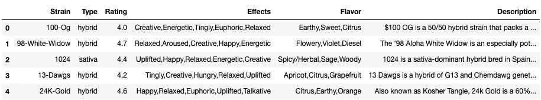
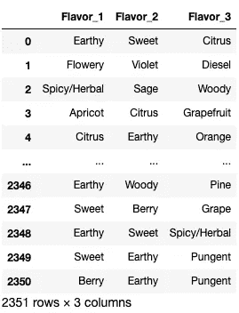
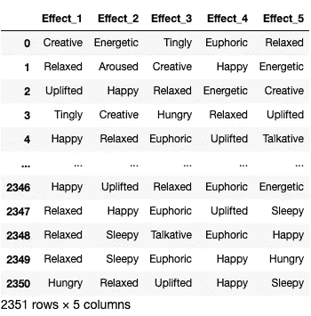
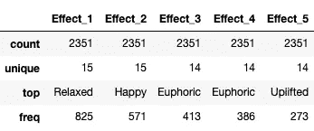
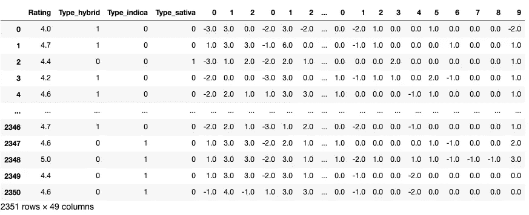
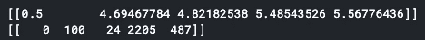

# 接下来你该抽哪种大麻？获得 AI 推荐

> 原文：<https://medium.datadriveninvestor.com/which-weed-should-you-smoke-next-get-recommended-by-ai-c38959f1054?source=collection_archive---------4----------------------->

## 我打赌一个杂草推荐系统会让你超嗨。噗噗传球！


Photo by [Louis Hansel @shotsoflouis](https://unsplash.com/@louishansel?utm_source=medium&utm_medium=referral) on [Unsplash](https://unsplash.com?utm_source=medium&utm_medium=referral)

> 声明:吸烟有害健康，本故事不提倡吸食大麻。

有几个国家像加拿大、格鲁吉亚、南非已经将休闲大麻合法化。最近，我在 Kaggle 上偶然发现了一个大麻数据集，并想到用它来制作一个推荐系统。

[](https://www.kaggle.com/kingburrito666/cannabis-strains) [## 数据集:大麻品种

### 大麻品系数据集

www.kaggle.com](https://www.kaggle.com/kingburrito666/cannabis-strains) 

推荐系统根据用户以前的历史，如购买历史、点击的链接、观看的产品等，向用户推荐不同的产品。

网飞和 Youtube 是最受欢迎的两家公司，它们使用人工智能和推荐系统来推荐电影和视频。

**推荐系统有两种类型**:

1.  **基于内容的系统**根据用户之前的行为，使用项目属性和相似性向用户推荐新的相似项目。
2.  **协同过滤系统**使用所有用户的属性和项目属性向特定用户推荐新项目。

数据集中没有可用的用户数据，因此我将使用**最近邻算法**来构建一个基于内容的推荐系统。

让我们开始建立我们的大麻推荐系统。


[Source: Tenor](https://tenor.com/view/the-simpsons-homer-simpson-smoke-smoking-joint-gif-4995960)

```
***# Import Libraries***import numpy as np
import pandas as pd
import matplotlib.pyplot as plt
from sklearn.feature_extraction import FeatureHasher
```

# 数据预处理

```
data = pd.read_csv("cannabis.csv")
data.head()
```



> 在这个数据集中，我们有 2351 种独特的大麻品种。

接下来的工作是找到独特类型的*效果*和*味道*。如果有任何*空值*，我将用*“无”来填充它们。*这样，我不是删除任何商品行，而是创建一个新类别。

风味柱

```
print(data["Flavor"].isnull().values.sum())
***# Will print 46\. i.e. there are 46 null values in Flavor column.***
data["Flavor"] = data["Flavor"].fillna("None")***# Find unique Flavors by seperating each entry with comma seperator*** total_flavor = []
max_len = 0
total_flavor.append("None")
for val in data["Flavor"].values:
    print(val)
    val = val.split(",")

    if len(val) > max_len:
        max_len = len(val)

    for f in val:
        if f not in total_flavor:
            total_flavor.append(f)print(len(total_flavor))
***# 50 unique flavors are present in flavor column.***print(max_len)
***# Max_len prints the maximum no of flavors present in single sample/entry.
# 4***
```

效果栏

```
***# Will follow the same steps we did in Flavor column.***print(data["Effects"].isnull().values.sum())
***# There are 0 null values in Effects column***total_effects = []
max_len = 0
for val in data["Effects"].values:
    print(val)
    val = val.split(",")

    if len(val) > max_len:
        max_len = len(val)

    for e in val:
        if e not in total_effects:
            total_effects.append(e)print(len(total_effects))
***# 16 unique effects***print(max_len)
***# 5 (max effects present in single entry)***
```

现在我们将拆分效果和味道列。

```
***# Split flavor column***
split_data = data["Flavor"].str.split(",")
split_data = split_data.to_list()
names = ["Flavor_1", "Flavor_2", "Flavor_3", "Flavor_4"]
new_flavor = pd.DataFrame(split_data, columns=names)
new_flavor = new_flavor.fillna("None")print(new_flavor["Flavor_4"].isnull().values.sum())
***# 2308 values of Flavor_4 column are Null, therefore dropping it.***
new_flavor = new_flavor.drop(columns=["Flavor_4"])
new_flavor
```



New Flavor DataFrame

```
***# Split the effects column***split_data = data["Effects"].str.split(",").to_list()
names = ["Effect_1", "Effect_2", "Effect_3", "Effect_4", "Effect_5"]
new_effect = pd.DataFrame(split_data, columns=names).fillna("None")new_effect
```



New Effect DataFrame

```
new_effect.describe()
```



将特征散列应用于新的效果和味道数据帧，因为我们不能将分类值提供给算法，并且一个热编码将创建一个稀疏矩阵。

```
***# Feature Hasher***effect_hasher = FeatureHasher(n_features=3, input_type="string")
x = effect_hasher.fit_transform(total_effects)flavor_hasher = FeatureHasher(n_features=10, input_type="string")
y = flavor_hasher.fit_transform(total_flavor)***# Applying effect_hasher in effect dataframe***names = ["Effect_1", "Effect_2", "Effect_3", "Effect_4", "Effect_5"]
num_effect = pd.DataFrame([])
for name in names:
    d = new_effect[name]
    temp = effect_hasher.transform(d).toarray()
    temp = pd.DataFrame(temp)
    num_effect = pd.concat([num_effect, temp], axis=1)***# Applying flavor_hasher to flavor dataframe***names = ["Flavor_1", "Flavor_2", "Flavor_3"]
num_flavor = pd.DataFrame([])
for name in names:
    d = new_flavor[name]
    temp = flavor_hasher.transform(d).toarray()
    temp = pd.DataFrame(temp)
    num_flavor = pd.concat([num_flavor, temp], axis=1)***# Make new copy of data dataframe***
new_data = data.copy()***# Convert "Type" column into dummy variable. There are only 3 types therefore using pandas get_dummies function (Similar to one hot encoding)***
new_data = pd.get_dummies(new_data, columns=["Type"])***# Drop the columns and add num_effect and num_flavor dataframes.***
new_data = new_data.drop(columns=["Strain", "Effects", "Flavor", "Description"])
new_data = pd.concat([new_data, num_effect, num_flavor], axis=1)new_data
```



Processed Data

我们的数据经过处理，可以输入到模型中。

# 建模

来自 Sklearn 的最近邻居:这是一个无监督的分类器，被称为基于记忆的系统。它会记住这些实例，然后根据与新出现的实例在数量上的相似程度来推荐商品。

```
from sklearn.neighbors import NearestNeighbors
nbrs = NearestNeighbors(n_neighbors=5).fit(new_data)
```

# 测试

假设一个顾客抽了 100 Og 的大麻，他很喜欢。所以，我用 100 个 Og 的特征来预测推荐。


[Source: Tenor](https://tenor.com/view/weed-ted-teddy-bear-seth-mac-farlane-bong-gif-5378451)

```
test_values = [ 4., 1., 0., 0.,-3., 3., 0., -2., 3., -2., -2., 0.,  0., -1., 3., -2., 1., 3., 3., 1., 0., 0., 0., 1., 0., 0., 1., 0., -1., 0., -1., 0., 0., 0., 0., 0., 0., -1., 1., 0., -2., 1., 0., 0.,  1., 0., 0., 0., -2.]dist, recommends = nbrs.kneighbors([test_values])***# Will print the distances of test item and recommended item.***
print(dist)***#Will print the index value of recommendations.***
print(recommends)
```



Prints of above commands

让我们打印所有推荐的大麻品种的详细信息。

```
for index in recommends[0]:
    print(data.values[index])
```

# 结果

```
['100-Og' 'hybrid' 4.0 'Creative,Energetic,Tingly,Euphoric,Relaxed'
 'Earthy,Sweet,Citrus']['American-Dream' 'hybrid' 4.7 'Focused,Euphoric,Tingly,Energetic,Relaxed'
 'Earthy,Sweet,Pungent']['Ak-48' 'hybrid' 4.0 'Happy,Energetic,Uplifted,Creative,Relaxed'
 'Earthy,Pungent,Citrus']['Tutti-Frutti' 'hybrid' 4.2 'Happy,Euphoric,Uplifted,Energetic,Relaxed'
 'Berry,Sweet,Tropical']['Chems-Sister' 'sativa' 4.5 'Creative,Euphoric,Happy,Focused,Relaxed'
 'Chemical,Pungent,Citrus']
```

测试大麻品系 *100-Og* 存在于数据中，因此也是系统推荐的。

如果你将其他大麻，如美国梦、Ak-48、Tutti-Frutti 和 Chems-Sister 与 100-Og 进行比较，会发现它们有很多相似之处。

1.  所有的 *100-Og、* *美国梦、Ak-48、Tutti-Frutti* 都是“混合”型。
2.  *100-Og* 和*美国梦*一样的*充满活力、兴奋、愉悦和放松的*效果。它们也有同样的*土味和甜味*。
3.  可以对比一下其他推荐:)

> Kaggle 内核:[https://www . ka ggle . com/kartikeyarana/大麻-推荐-系统](https://www.kaggle.com/kartikeyarana/cannabis-recommendation-system)

# 接下来呢？

可以用来构建基于内容的推荐系统的其他算法是:

1.  [余弦相似度](https://scikit-learn.org/stable/modules/metrics.html#cosine-similarity)
2.  [KMeans 聚类](https://scikit-learn.org/stable/modules/clustering.html#k-means) : KMeans 是一种无监督算法，用于将相似的项目聚类在一个聚类中。因此，如果用户喜欢一种大麻品种，我们可以向他推荐同一簇中的其他大麻。
3.  在基于内容的过滤中，我们不使用其他用户的数据。我们可以利用这些数据来构建一个使用神经网络的协同过滤系统。

[](https://www.datadriveninvestor.com/2020/03/04/on-artificial-intelligence-and-surveillance-capitalism/) [## 人工智能和监督资本主义|数据驱动的投资者

### 大科技，总是现在:人工智能推动的大科技，已经使购物，搜索，在你的…

www.datadriveninvestor.com](https://www.datadriveninvestor.com/2020/03/04/on-artificial-intelligence-and-surveillance-capitalism/) 

# 有用的资源

1.  [用 Python 机器学习构建推荐系统& AI](https://www.linkedin.com/learning/building-a-recommendation-system-with-python-machine-learning-ai/content-based-recommender-systems)
2.  [谷歌推荐系统](https://developers.google.com/machine-learning/recommendation/content-based/basics)
3.  [针对 YouTube 推荐的深度神经网络](https://storage.googleapis.com/pub-tools-public-publication-data/pdf/45530.pdf)

> 感谢您的阅读！继续学习！