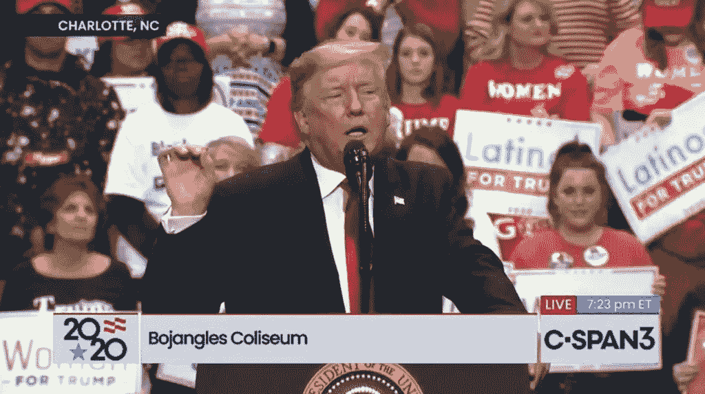
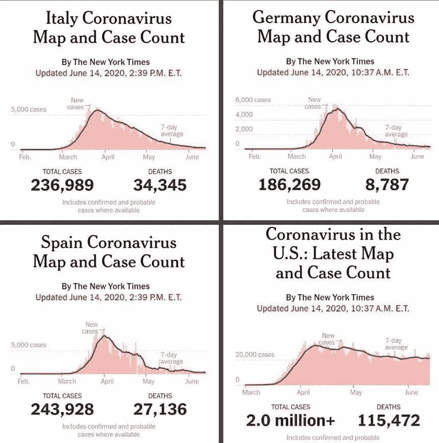

# 白宫本周发起了一场异常有组织的(对他们来说)关于新冠肺炎的造谣运动

> 原文：<https://medium.datadriveninvestor.com/white-house-this-week-has-launched-an-unusually-organized-for-them-disinformation-campaign-about-9340afd50314?source=collection_archive---------0----------------------->

Itching to do his next rally, after almost 4 months of abstention (this is a photo of the last one)

## 我们认为，这是为川普周六的塔尔萨集会做准备，这是川普自疫情掌权以来的首次集会

这场运动似乎以副总统迈克·彭斯发表在《华尔街日报》上的观点文章开始，这篇文章指责媒体将政府对新冠肺炎灾难性的反应小题大做。实际上，白宫所做的工作(总是被描述为“特朗普总统领导力的证明”)不亚于:

> *“*值得庆祝，而不是媒体的恐慌*”*

听起来熟悉吗？当特朗普的女婿兼顾问贾里德·库什纳宣称我们应该把总统的回应视为一个“伟大的成功故事”时，他使用了几乎相同的语言

尽管事实上根据疾病预防控制中心的统计，现在已经有将近 117，000 人死亡，而且这个数字还在增长。

彭斯吹嘘“死亡人数下降到每天不到 750 人”的事实。虽然彭斯没有明确表示这个数字长期来看是可以接受的，但他肯定指出这是好事。

 [## 保护主义、政治和经济动荡|数据驱动的投资者

### 美国股市昨日出现 400 多点的大幅反转，为未来的事情发出了警告信号。市场…

www.datadriveninvestor.com](https://www.datadriveninvestor.com/2018/06/28/protectionism-politics-economic-turmoil/) 

让我们来做些数学计算。一年还剩 197 天。因此，如果每天 750 人是一个值得骄傲的水平，这意味着今年又有 148，500 人死亡，总共有 265，500 人可以接受？

还记得特朗普说过[任何低于 20 万人的死亡都意味着他做了一件伟大的工作](https://www.syracuse.com/coronavirus/2020/03/trump-on-coronavirus-if-us-has-100000-to-200000-deaths-weve-done-a-good-job.html)？记得他说 [60，000 人死亡是将要发生的事情](https://www.cnn.com/world/live-news/coronavirus-pandemic-04-21-20-intl/h_a266b6f5fe37b3cc58cbd6c1655c0c84)吗？还记得他说现在是“ [15，过几天就要降到接近零的](https://nymag.com/intelligencer/2020/04/trump-coronavirus-cases-will-go-down-to-zero-ultimately.html)”吗？

但是真正引起我们注意的是彭斯的观点:

> 当关于病例增加的谈论占据了有线电视新闻报道的时候，超过一半的州实际上看到病例下降或保持稳定

*你可能会说，他只是想成为一个乐观主义者，看到杯子是半满的，公平地说，他也在努力让自己和特朗普连任。*

*但是“超过一半的州实际上看到病例下降或保持稳定”也意味着*在超过一半的州感染率仍然上升或不下降*。*

*“稳定”也不是胜利。这是一次令人沮丧的失败。因为这种病毒开始消失的唯一方式是如果每个被感染的人反过来感染少于一个其他的新人。“稳定”意味着不会发生。每个感染了这种疾病的人至少还会感染其他人。*

*更广泛的戴口罩可以改善这种情况。在其他不反对或无视公共卫生准则，更具体地说不戴口罩的国家，病例已经下降到如此之低，以至于一些人现在已经完全恢复了不戴口罩的状态。*

*但是不，我们没有。*

*正如特朗普自己的前 FDA 局长斯科特·戈特利布(Scott Gottlieb)指出的:*

> **“新的 Covid 病例因该国各地区而异，受影响最严重的地区现在出现最大幅度的下降，而其他地区则有所扩大。这可能在一定程度上反映出，在早期影响最严重的地区，如纽约，人们采取了更多的预防措施。**

**有鉴于此，我们相信你已经看到了这张美国与世界其他地方的对比图，但它值得重复。**

****

**伙计们，这不是媒体歇斯底里的错。然而，这可能至少部分是一位总统的错，他拒绝以任何方式树立榜样，事实上，他将不遵守公共卫生建议或规则作为一种荣誉:对特朗普忠诚的表现。这一事实应该在星期六的集会上充分展示出来。**

**今日华尔街日报称[川普在采访中告诉他们一些美国人戴着口罩](https://www.wsj.com/articles/trump-talks-juneteenth-john-bolton-economy-in-wsj-interview-11592493771):**

> **不是作为一种预防措施，而是作为一种方式来表示 d 对他的认可**

*   **首先，不是*万能的*关于*你的*，总统先生！！！！！**
*   **其次，这句话的潜台词当然是不戴面具是表达你对总统支持的一个很好的方式。**

**我们不会花超过一秒钟的时间来讨论特朗普在这场最新公关攻势中的剩余角色，这场攻势主要集中在政治收益上，导致他的集会还包括[在奥巴马政府 2009 年处理猪流感的记录上用“怎么办主义”](https://twitter.com/realDonaldTrump/status/1273597096105521155)抨击乔·拜登。**

**那年我们染上了 T2 猪流感。我们发了几天高烧。我们没有死。我们意识到这完全是轶事，但在我们的一生中，我们个人知道没有人死于猪流感，或定期季节性流感。我们知道至少有 6 人死于新冠肺炎病毒，还有许多人已经康复，但在一段时间内——通常会持续数周——他们被一种疾病残酷无情地打击，这种疾病比他们以前患过的任何疾病都更具毁灭性。**

****访问专家视图—** [**订阅 DDI 英特尔**](https://datadriveninvestor.com/ddi-intel)**