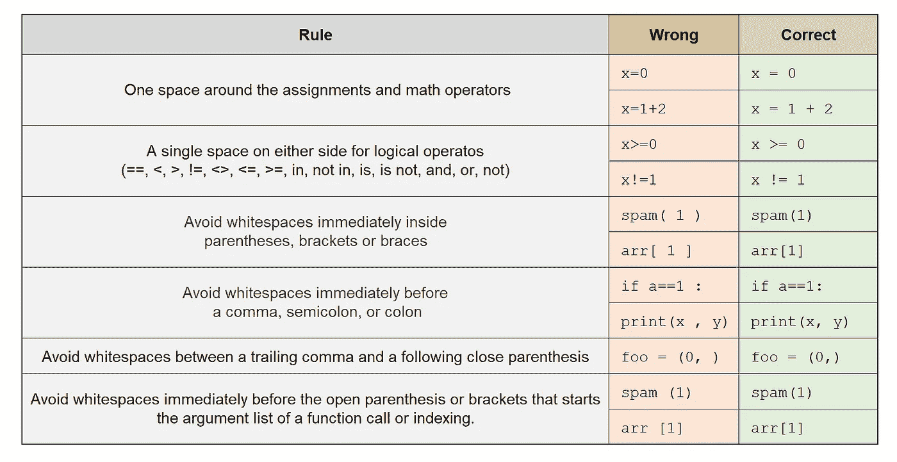
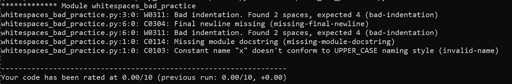
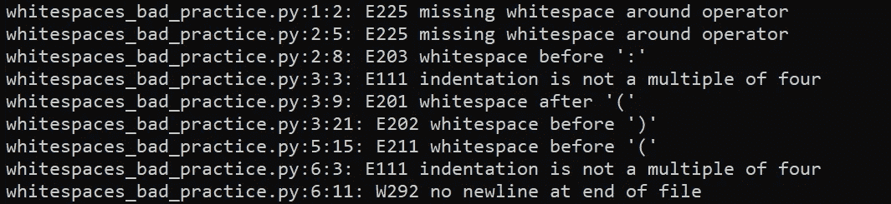

# 空格可以揭示你的编码技能，决定你的工资(可能！)

> 原文：<https://medium.datadriveninvestor.com/whitespaces-can-reveal-your-coding-skills-and-determine-your-salary-maybe-b5fb5c300cb4?source=collection_archive---------8----------------------->

## 编程；编排

## 如何正确使用空格来展示你的编码技能


Photo by [iMattSmart](https://unsplash.com/@imattsmart?utm_source=unsplash&utm_medium=referral&utm_content=creditCopyText) on [Unsplash](https://unsplash.com/s/photos/white-keyboard?utm_source=unsplash&utm_medium=referral&utm_content=creditCopyText)

在编程和数据科学的世界里，大多数人并不了解你个人，他们根据你的代码来判断你。事实上，他们不仅关注你的代码外观，还关注你的代码性能。代码的外观(即风格)会透露太多关于编码技能的信息。对于像我这样背景不是计算机科学但日常工作是写代码的人来说，学会“如何编码”后最重要的问题是如何让你的代码更专业。毕竟，我们正在编写机器和人类都可以阅读的代码，我们不想看起来像业余爱好者(尽管我们知道我们是业余爱好者)。通过我的工作和与专业开发人员的交流，我在这个领域学到了很多。但是编码风格中最棘手的部分之一是我们应该如何以及何时使用空白。有一些成文和不成文的规则，如果你遵守的话，你的代码会读得更好，人们会欣赏你的编码技能。

# 空白

在编程中，我们通常使用两种类型的空白:水平和垂直。在 Python 中，水平空格和缩进是语言的重要组成部分。我们必须使用缩进来告诉 Python 如何运行代码。在许多语言中，缩进和水平空格是可选的(仍然强烈推荐)，因为它们不依赖于空白来编译或解释代码。

除了缩进，其他类型的空白是可选的。但是正如您将看到的，有一些关于使用空白的推荐规则，使得人们更容易阅读代码。

> 注意:Python 有一个很好的、易于遵循的代码风格指南，叫做 PEP8。如果你对 PEP8 不熟悉，我强烈推荐你看完这篇文章再看。本文中的一些规则是从 PEP8 文档中借用的。这里有一个[链接](https://www.python.org/dev/peps/pep-0008/)了解更多关于 PEP8 的信息。

# 水平空白

顾名思义，水平空格是我们在一行代码中使用的空格。幸运的是，开发人员对这类空白的样式规则有了更多的定义和讨论。我们来看看一些最重要的。

## 用一个制表符或 4 个空格缩进代码块。

这是专业开发人员之间使用空格或 tab 进行缩进的一场圣战。显然，它甚至会影响你的工资([阅读此处](https://stackoverflow.blog/2017/06/15/developers-use-spaces-make-money-use-tabs/))，还会导致你和女朋友分手([看这里](https://www.youtube.com/watch?v=SsoOG6ZeyUI))。如果你没有偏好，选择一个一致的风格。谷歌建议其 Python 开发者对一个代码块使用 4 个空格([链接](https://google.github.io/styleguide/pyguide.html#34-indentation))。关于这个话题的最后一个想法是，只要你不混淆它们并且保持一致，你是否使用制表符或空格并不重要。

## 表达和陈述

你在代码中经常使用表达式和语句。关于如何使用空白来设计它们，有一些特殊的规则。这里有一个最重要的列表。



# 垂直空白

垂直空格是代码行之间的空白行。如前所述，与使用水平空白相关的规则是明确定义的。相反，使用垂直空格的规则并不明确。使用垂直空格是一个更个人化的偏好。这里有一些使用垂直空间的技巧，我想大多数专业开发人员都会同意。

## 代码结束

记住在你的代码末尾留一个空行。只要检查你的最后一个空行没有空格。这可能是你在关注 PEP8 的专业开发人员中发现的最著名的空白行。

## 函数、类和方法

类和顶级函数应该用两个空行隔开。同样，一个类中的方法应该用一个空行( [link](https://www.python.org/dev/peps/pep-0008/#id21) )分开。尽量避免在一个函数或方法中使用太多的空行，除非你的函数太长，而且它有不同的功能(这是一个警告信号)。

## 文档字符串和长注释

在代码中留下注释是一个好习惯。许多专业开发人员在其代码(版权、许可、作者和代码简介)的开头至少有一个 docstring(多行注释)。其他一些开发人员在代码中使用长注释和文档字符串来阐明他们的函数或类。如果您遵循这个良好的实践，在文档字符串和长注释的前后使用 1(或 2)个空行是很重要的。

## 条件语句和上下文管理器

尽管建议尽量少用空格，但我发现在长 IF(或任何条件)语句以及语句(或任何上下文管理器)周围使用一个空格是很专业的。

[](https://www.datadriveninvestor.com/2020/12/07/name-matching-techniques-with-python/) [## 使用 Python |数据驱动投资者的名称匹配技术

### 我们确实面临很多情况，我们必须匹配一个有很多变体的单词。这可能是因为错别字…

www.datadriveninvestor.com](https://www.datadriveninvestor.com/2020/12/07/name-matching-techniques-with-python/) 

# 不要记忆和使用棉绒。

我提到了使用空白的最重要的规则。还有许多我在本文中没有提到的其他准则(例如，悬挂缩进)。但是不要担心，你不需要一开始就记住所有的单词。相反，我建议你使用棉绒。Linter 或 lint 是一个根据 PEP8 等提供的准则检查代码的工具。Python 程序员通常使用`pylint`或`flake8`来检查他们的代码风格和许多其他静态错误。让我们快速安装并测试这两个工具。

```
pip install pylint flake8
```

现在，是时候写糟糕的代码了(我很擅长！！！)

这段糟糕的代码有几个问题。让我们运行`pylint`和 flake8，看看这些工具是否能找到错误。

```
pylint whitespaces_bad_practice.py
```

这是结果。



除了空格之外，pylint 还检查许多准则。在本报告中，它有三个与空白相关的问题。如你所见，有两个问题是关于缩进使用 2 个空格而不是 4 个空格。另一个问题是，我忘了在代码末尾留一个空行。

让我们测试一下第 8 层…

```
flake8 whitespaces_bad_practice.py
```

这是结果。



如您所见，flake8 可以找到更多错误，包括括号和冒号前的空格。然而，他们中没有一个人能抓住像`x= 1`或`x==1`这样的错误。

# 摘要

使用空白(水平和垂直)可以让你的代码更容易阅读和理解。我个人的经验是，初学者倾向于使用太多的间距或不够的间距，专业开发人员注意到这一点。请记住，您必须谨慎使用垂直空格，但是如果它有助于更好地理解您的代码，请使用它们。此外，请咨询您的公司，看看他们是否为开发人员提供了特定的 Python 风格指南。如果他们没有，你可以遵循 PEP8 通用指南( [link](https://www.python.org/dev/peps/pep-0008/) )，使用类似`pylint`或`flake8`的工具，或者遵循谷歌( [link](https://google.github.io/styleguide/pyguide.html) )等公司的指南。

让我知道你是否有空白的经验，以及如何正确使用它们。

**访问专家视图—** [**订阅 DDI 英特尔**](https://datadriveninvestor.com/ddi-intel)