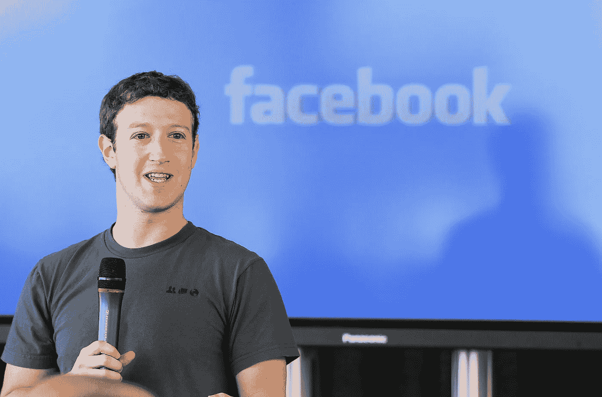
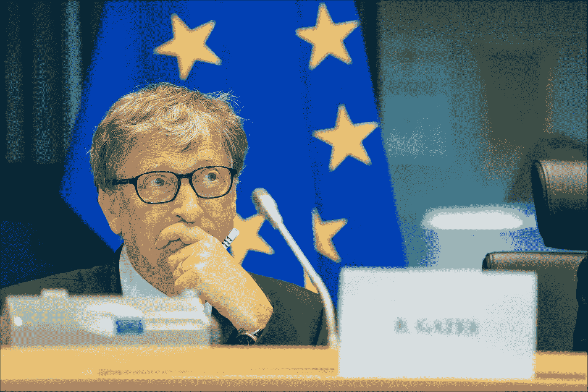
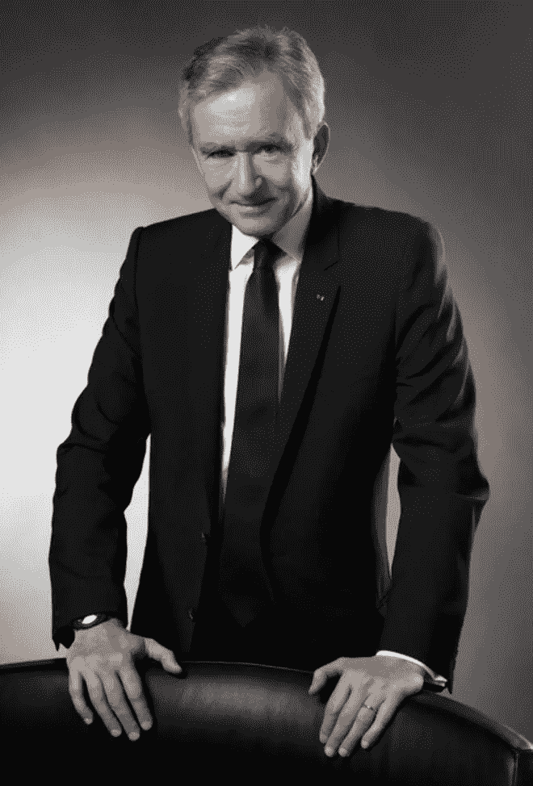
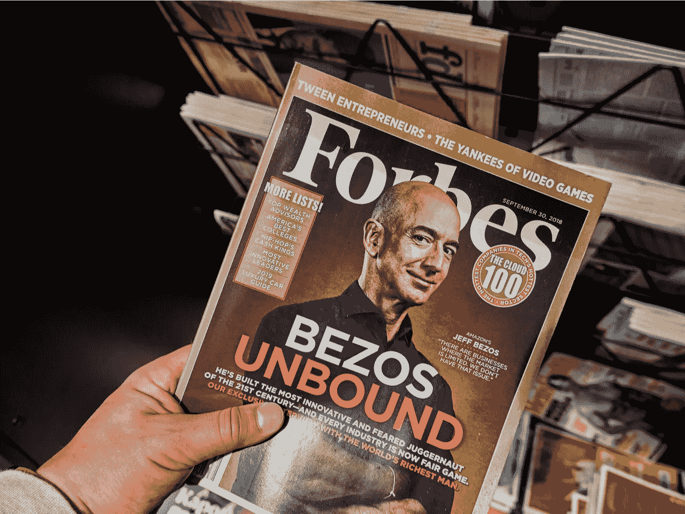
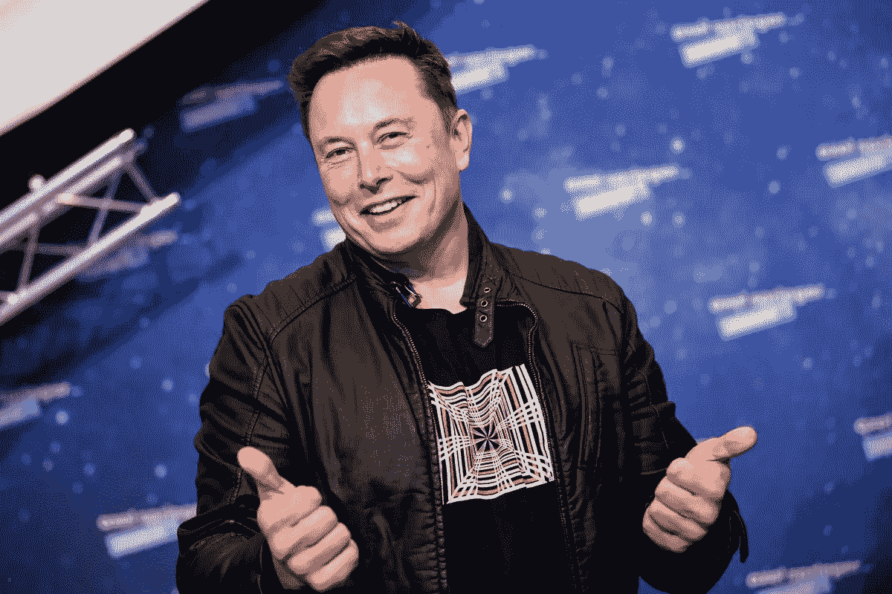

# 2021 年初，谁是世界上最富有的人？

> 原文：<https://medium.datadriveninvestor.com/who-are-the-richest-people-in-the-world-beginning-of-2021-ba9e034123e8?source=collection_archive---------10----------------------->

## 从他们的简历中我们能了解到什么？

Canva Pro Image

我在生活中遇到的几乎每个人都对高净值的人有一种情感。

有些人羡慕富人，想学习如何在经济上独立。

其他人嫉妒富人，有些人甚至讨厌富人，认为这些人应该被征税，因为他们不配拥有财富。

有趣的是，对金钱和财富几乎没有感情的人得到了百万富翁俱乐部的会员卡。

我一直想破译创造一个财务上可持续的生活的秘密，而不是在月底为了收支平衡而无休止的斗争。

让我们快速浏览一下全球最富有的七个人，看看他们是如何积累财富的。来源是[实时福布斯排行榜。](https://www.forbes.com/real-time-billionaires/#23ced88c3d78)

Source: [Flickr](https://www.flickr.com/photos/oracle_images/5015810337)

# 第七名:拉里·埃里森——890 亿美元

第七位是劳伦斯·约瑟夫·埃里森(生于 1944 年 8 月 17 日)，他是软件帝国甲骨文公司的联合创始人兼首席技术官

拉里·埃里森出生在纽约市，9 个月大时被他的叔叔和婶婶收养。

他在芝加哥一个中产阶级社区长大，上了高中和芝加哥大学。第二年，由于养母去世，他从大学辍学。

埃里森随后收拾行囊，搬到了加州伯克利，在创建软件开发实验室(后来成为甲骨文系统公司)之前，他在那里做过几份工作。

他把甲骨文公司建成了一个大帝国，使他在 2021 年 1 月 1 日成为世界上第七富有的人。

Source: [Forbes.com](https://www.forbes.com/profile/zhong-shanshan/?list=rtb/&sh=27f6588f49ae)

# 第六名钟睒睒——956 亿美元

钟睒睒(生于 1954 年)是中国最大的饮料公司农夫山泉的董事长，并拥有中国医药公司万泰。

钟山在杭州长大，12 岁时在中国文化大革命期间辍学，因为政府迫害他的父母。

在 1996 年创办瓶装水公司之前，他从事过不同的工作，后来发展成为中国最大的饮料公司，拥有由 4500 名经销商组成的庞大零售网络。

Source: [Britannica.com](https://www.britannica.com/biography/Mark-Zuckerberg)

# #5.马克·扎克伯格——974 亿美元

马克·扎克伯格(生于 1984 年 5 月 14 日)是美国媒体巨头和互联网巨头。

他是脸书的创始人之一，也是该公司的董事长、首席执行官和控股股东。

马克·扎克伯格和他的三个姐妹在纽约长大，他的母亲是一名精神病医生，父亲是一名牙医。

2002 年，他参加了哈佛大学的课程，在那里他已经有了编程神童的名声。2004 年，他与室友爱德华多·萨维林、T2、安德鲁·麦科勒姆、T4、达斯汀·莫斯科维茨和克里斯·休斯一起创立了 Thefacebook.com。

2007 年，他成为世界上最年轻的亿万富翁。

Source: [EU Parliament](https://www.europarl.europa.eu/news/en/headlines/world/20181011STO15883/bill-gates-eu-should-be-proud-of-its-generosity)

# 第四名比尔·盖茨——1217 亿美元

威廉·亨利·盖茨三世(生于 1955 年 10 月 28 日)在华盛顿州西雅图的一个中上阶层家庭长大，有两个姐姐。

他曾就读于哈佛大学，但他认为退学对他来说是最好的选择，于是他和童年好友保罗·艾伦一起创立了微软。

该公司在上个世纪因操作系统 Windows 和 MS Office 而闻名，这两款操作系统至今仍在使用。2014 年，比尔·盖茨交出了他作为微软首席执行官的职位，并在几年内将他的股份降至 1%。

自 2020 年以来，他和他的妻子梅林达专注于与他们的比尔和梅林达盖茨基金会对抗世界卫生挑战。

Source: [LVMH.com](https://www.lvmh.com/group/about-lvmh/governance/executive-committee/bernard-arnault/)

# 第三名伯纳德·阿诺特家族——1555 亿美元

伯纳德·让·蒂恩·阿尔诺(出生于 1949 年 3 月 5 日)是法国亿万富翁。

他是世界上最大的奢侈品牌公司 LVMH 酩悦轩尼诗-路易威登集团的董事长兼首席执行官。

伯纳德在里尔长大，就读于法国领先的工程学院——理工学院，并开始为他父亲的公司工作。

由于他父亲在建筑行业的努力，他在 1985 年投资 1500 万美元购买了克里斯汀·迪奥，这为他的帝国奠定了基础。

多年来，他将家族帝国发展成为拥有 70 多个奢侈品牌的公司，包括路易威登和克里斯汀·迪奥。

2019 年，他以估计 160 亿美元的价格收购了蒂芙尼公司，这是历史上最大的奢侈品牌收购。

Source: [Pandasecurity.com](https://www.pandasecurity.com/en/mediacenter/news/was-amazons-jeff-bezos-hacked/)

# 第二名杰夫·贝索斯——1845 亿美元

杰弗里·普雷斯顿·贝佐斯(生于 1964 年 1 月 12 日)是美国互联网企业家、实业家、媒体所有者和投资者。

他最为人所知的是通过创建 Amazon.com，率先定义了互联网上的商业。

杰夫·贝索斯生长在一个中产阶级家庭，以“最优异成绩”毕业于普林斯顿大学

在他开始金融生涯之后，在创建亚马逊之前，他为 D. E. Shaw 公司工作，在那里他成为了第四位 30 岁之前的高级副总裁。

1994 年，就在全部进入公共领域后，他创立了 Amazon.com。他在[1997 年](https://youtu.be/Y9fzC5pnNxw)的一次采访中陈述了原因，听起来很简单。他听说了互联网在线人数的巨大增长率。

在看到那项研究后，他列出了一个他认为可以在网上销售的产品清单，在他看来，最合适的产品是书籍。

此后，他将 Amazon.com 打造成为全球最大的电子商务和数据基础设施平台。他坚持以客户为中心的理念非常突出。最有可能是这种把客户放在第一位的哲学让他在 Amazon.com 取得了成功，而其他企业家却失败了——尤其是在 2000 年至 2001 年 dot.com 泡沫破裂期间。

2018 年 3 月，他成为世界首富，也是历史上第一位亿万富翁。

2020 年 8 月，他成为第一个身家高于 2000 亿美元的人。

这是一个短暂的名声，因为他在 2021 年 1 月 7 日被

Source: [Theverge.com](https://www.theverge.com/2021/1/7/22163361/elon-musk-billionaire-richest-world-jeff-bezos-tesla-stock-spacex)

# 第一名:埃隆·马斯克——1885 亿美元

埃隆·里夫·马斯克(1971 年 6 月 28 日出生于南非比勒陀利亚)。马斯克的母亲是加拿大人，父亲是南非人，在南非比勒陀利亚长大。

他离开南非，经由加拿大，转到宾夕法尼亚大学，在那里获得了物理学和经济学学士学位。1995 年，他搬到加利福尼亚，在斯坦福大学攻读应用物理和材料科学博士学位，但很快就辍学去经商了。

1995 年，他创建了 [Zip2](https://www.britannica.com/topic/Zip2) ，该公司被康柏公司以 3 . 07 亿美元收购。该公司提供了一个可搜索的公司名录，被称为在线版黄页。

退出 Zip2 后，他创办了 X.com，后来更名为 Paypal.com，专门从事网上转账业务。易贝在 2002 年以 15 亿美元收购了 PayPal。

2002 年，埃隆·马斯克(Elon Musk)创立了 SpaceX，旨在让太空旅行变得负担得起，从而实现火星殖民。

如今，埃隆·马斯克最出名的是他在特斯拉的成功。多年来，埃隆·马斯克一直对电动汽车感兴趣，并在 2004 年成为该公司的主要创始人时迈出了一大步。

特斯拉在 2010 年的首次公开募股筹集了 2.26 亿美元。2020 年，特斯拉的股价飙升，扶摇直上，一飞冲天，飞向月球，飞向更远的地方，飞向遥远的其他宇宙。

自 2020 年初以来，该公司的股价上涨了约 800%，这使得

> 埃隆·马斯克是这个星球上最富有的人。

对我来说，最重要的一点是，世界上最富有的人大多成长于普通的中产阶级家庭。至少有一个好像年轻时有过很多不愉快的挑战，只有一个继承了几百万才起步。

有一天，那些有使命感并懂得生活中的成功意味着为他人服务的人可能会出现在这个名单上。

**更多关于创业的故事:** [**点击这里**](https://christian-soschner.medium.com/resources-for-the-aspiring-entrepreneur-fc07414073d4)

自 1999 年以来，我是各行各业公司的执行官、顾问和教练。我专攻企业发展和金融，从种子轮到 IPO 级别，从 2006 年开始专注于生命科学。

[**加入我的邮件列表保持联系！**](https://mailchi.mp/5a50875fb5ea/newsletter)

# 读者:

 [## 世界亿万富翁

### 世界亿万富翁排行榜，按净资产排名世界亿万富翁的净资产从…

en.wikipedia.org](https://en.wikipedia.org/wiki/The_World%27s_Billionaires#2020) 

[https://www . credit-suisse . com/about-us/en/reports-research/global-wealth-report . html #:~:text = The % 20 global % 20 wealth % 20 report % 202020，and % 20 The % 20 distribution % 20 of % 20 wealth](https://www.credit-suisse.com/about-us/en/reports-research/global-wealth-report.html#:~:text=The%20Global%20wealth%20report%202020,and%20the%20distribution%20of%20wealth)。

 [## 哈兰·埃利森

### 拉里·埃里森于 1944 年 8 月 17 日出生在纽约的布朗克斯区，母亲是单身母亲弗洛伦斯·斯佩尔曼。当他九岁的时候…

www.biography.com](https://www.biography.com/business-figure/larry-ellison)  [## 哈兰·埃利森

### 劳伦斯·约瑟夫·埃里森(生于 1944 年 8 月 17 日)是一位美国商业巨头、投资者和慈善家，也是一位…

en.wikipedia.org](https://en.wikipedia.org/wiki/Larry_Ellison) 

[https://ABC news . go . com/Business/half-worlds-whole-wealth-hands-millionaires/story？id = 66440320 #:~:text =有% 20are % 20a %总共%20of，总共% 20own %大约% 20% 24158.3% 20 万亿](https://abcnews.go.com/Business/half-worlds-entire-wealth-hands-millionaires/story?id=66440320#:~:text=There%20are%20a%20total%20of,collectively%20own%20approximately%20%24158.3%20trillion)。

 [## 钟睒睒

### Zhong Shanshan ( Chinese: 钟睒睒, born 1956) is a Chinese billionaire businessman, who founded and chairs Nongfu Spring…

en.wikipedia.org](https://en.wikipedia.org/wiki/Zhong_Shanshan)  [## 泥瓦匠到亿万富翁:中国第二大富豪从一贫如洗到极度富有——但这是否会…

### 随着农夫山泉的上市，洪珊珊成为了中国第二富有的人，但是一些人…

www.forbes.com](https://www.forbes.com/sites/ywang/2020/09/15/bricklayer-to-billionaire-chinas-second-richest-man-rose-from-rags-to-extreme-riches-but-will-it-last/?sh=41e07aa97eeb)  [## 马克·扎克伯格|传记与事实

### 马克·扎克伯格，美国电脑程序员，世界上最大的…

www.britannica。](https://www.britannica.com/biography/Mark-Zuckerberg)  [## 马克·扎克伯格

### 马克·埃利奥特·扎克伯格(；生于 1984 年 5 月 14 日)是美国媒体巨头、互联网企业家和慈善家…

en.wikipedia.org](https://en.wikipedia.org/wiki/Mark_Zuckerberg)  [## 马克·扎克伯格|传记与事实

### 马克·扎克伯格，美国电脑程序员，世界上最大的…

www.britannica.com](https://www.britannica.com/biography/Mark-Zuckerberg) 

[https://www.biography.com/business-figure/bill-gates](https://www.biography.com/business-figure/bill-gates)

 [## 比尔盖茨

### 威廉·亨利·盖茨三世(生于 1955 年 10 月 28 日)是美国商业巨头、软件开发商和…

en.wikipedia.org](https://en.wikipedia.org/wiki/Bill_Gates#Books)  [## 伯纳德·阿诺特

### 伯纳德·让·蒂恩·阿尔诺(法语:[bɛʁnaʁʒɑ̃etjɛn aʁno]；生于 1949 年 3 月 5 日)是法国亿万富翁商人…

en.wikipedia.org](https://en.wikipedia.org/wiki/Bernard_Arnault) 

[https://www . Bloomberg . com/billionaires/profiles/Bernard-arn ault/](https://www.bloomberg.com/billionaires/profiles/bernard-arnault/)

【https://en.wikipedia.org/wiki/Jeff_Bezos 

 [## 杰夫·贝佐斯

### 企业家和电子商务先驱杰夫·贝索斯是电子商务公司亚马逊的创始人兼首席执行官

www.biography.com](https://www.biography.com/business-figure/jeff-bezos)  [## 埃隆·马斯克|传记与事实

### 埃隆·马斯克(1971 年 6 月 28 日出生于南非比勒陀利亚)，出生于南非的美国企业家

www.britannica.com](https://www.britannica.com/biography/Elon-Musk)  [## 埃隆·马斯克

### 1850 亿(2021 年 1 月)埃隆·里夫·马斯克(EE-lon；生于 1971 年 6 月 28 日)是商业巨头，工业设计师…

en.wikipedia.org](https://en.wikipedia.org/wiki/Elon_Musk)  [## 埃隆·马斯克

### 埃隆·马斯克(Elon Musk)联合创立并领导了特斯拉、SpaceX、Neuralink 和 The Boring Company。作为特斯拉的联合创始人兼首席执行官…

www.tesla.com](https://www.tesla.com/elon-musk)  [## SpaceX

### 太空探索技术公司(SpaceX)是一家美国航空航天制造商和太空运输服务…

en.wikipedia.org](https://en.wikipedia.org/wiki/SpaceX)