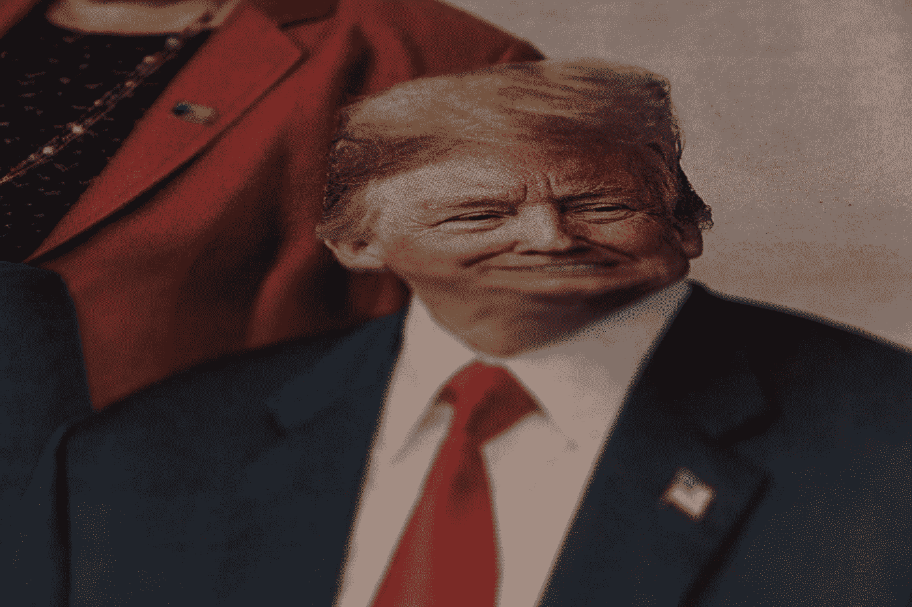

# 谁能打败川普？

> 原文：<https://medium.datadriveninvestor.com/who-can-beat-trump-3bc571e9e5e?source=collection_archive---------5----------------------->

共和党不可能赢得 2020 年的选举，但民主党可能会输掉。任何主要的民主党候选人都可以战胜特朗普。

Photo by [Pau Casals](https://unsplash.com/@paucasals?utm_source=medium&utm_medium=referral) on [Unsplash](https://unsplash.com?utm_source=medium&utm_medium=referral)

为了确定谁最有可能击败特朗普，重要的是要看看历史以及最近在我们的对等国家的选举中发生了什么。

# 1972 年的总统选举

在 1972 年的初选中，有 9 名民主党人获得了超过 1%的选票。Hubert Humphrey 在初选/党团会议中得票最多，得票率为 25.77%。[乔治·麦戈文](http://www.4president.org/brochures/mcgovern1972brochure.htm)以 25.34%的选票位居第二。尽管如此，麦戈文还是获得了最多的代表，并最终被提名。

麦戈文被认为是来自[党](https://www.presidency.ucsb.edu/documents/1972-democratic-party-platform)的[极端自由派](https://en.wikipedia.org/wiki/George_McGovern_1972_presidential_campaign#Issues_and_strategies)。他在伯尼·桑德斯和杨安泽的左边。麦戈文支持“最低收入保障”和单一支付者医疗体系。换句话说，“全民基本收入”和“全民医保”。他支持保障每个人的工作，类似于 AOC 的绿色新政。

尼克松已经被认为是一个狡诈的人。水门事件发生在 1972 年 6 月 17 日。消息立即传开。三天后，也就是 1972 年 6 月 20 日，“深喉”开始与鲍勃·伍德沃德对话。新闻里有这些东西，但是很少有人听。

尼克松以美国历史上最大的优势击败了麦戈文。里根后来在 1984 年给蒙代尔带来了更大的损失。毫无疑问，麦戈文今天的处境会好得多。但是，他会赢吗？今天的进步基础比 1972 年大得多，但也有大得多的极右翼基础。甚至尼克松在 20 世纪 70 年代也支持“保证最低收入”。1972 年，共和党人并不像今天这样极端。今天的共和党人会把里根和老布什踢出他们的政党。

 [## 保护主义、政治和经济动荡|数据驱动的投资者

### 美国股市昨日出现 400 多点的大幅反转，为未来的事情发出了警告信号。市场…

www.datadriveninvestor.com](https://www.datadriveninvestor.com/2018/06/28/protectionism-politics-economic-turmoil/) 

在今天的美国，我会被认为是一个极端自由主义者。然而，如果我被置于世界其它发达经济体之一，我最多会被视为温和派，更有可能是保守派。对于伊丽莎白·沃伦这样的“自由主义者”来说也是如此。美国在政治和经济领域是一个异类。我们的系统已经不再为美国人民服务了，而且在过去的三十多年里，它都没有很好地发挥作用。当然，你可以挑选一些过时的经济指标，然后说我们拥有世界上最强大的经济。仔细看看，你支持我们经济的论点每次都会失败。

1972 年的教训是，我们提名最自由/进步的总统候选人是在冒险。2020 年的伯尼·桑德斯符合这一描述，然而，他并不比麦戈文更偏左。是的，我很担心。我更担心的是，我不知道伯尼是否有耐心鞭打特朗普。我们也许能找到答案。如果桑德斯总统能够当选，我会很高兴。他是我的三大选择之一。在我的下一篇文章中，我将更多地讨论“如何击败特朗普”。出乎意料的简单。

# 其他国家最近的选举

其他国家最近选举的教训来自英国鲍里斯·约翰逊(Boris Johnson)，保守党无法在议会获得任何支持。然而，面对社会主义的杰里米·科尔宾，约翰逊以压倒性优势获胜。现在，这里有更多的故事。科尔宾和工党因反犹太主义指控而遭受损失。科尔宾也不是一个很有魅力的候选人。同样值得注意的是，英国的“社会主义者”远在伯尼的左边。就此而言，他们在丹麦的左边！幸运的是，我们不用担心桑德斯先生的反犹太主义。他是犹太人。他也很有魅力。但是他能赢吗？是的。

# 这些候选人中的任何一个都可以击败特朗普

伯尼、拜登、布蒂吉格、沃伦、克洛布查尔、彭博或斯泰尔都比川普聪明得多。他们都有能力打败他。他们都有包袱。除了伊丽莎白·沃伦，这两个国家都有弱点。当然，有一些愚蠢的丑闻，极右势力试图利用沃伦，但美国人民现在看透了这种愚蠢。我对最有可能击败特朗普的候选人的排名如下:

1.彭博

2.拜登（姓氏）

3.施泰尔

4.克洛布查尔

5.沃伦、伯尼和巴蒂吉格

现在，当读者跳起来说“他疯了”时，让我来解释一下。我已经仔细考虑了这件事。为了了解这些候选人在这些问题上的立场，这个来自*政治*的[工具是我发现的最好的。](https://www.politico.com/2020-election/candidates-views-on-the-issues/)

## 迈克·彭博

出于几个原因，彭博最有可能获胜。他有跨领域的吸引力。他可以轻而易举地从特朗普手里抢走大多数无党派人士和所有“永不特朗普”的共和党人。彭博将以压倒性优势获胜。最重要的是，从现在起到选举前，彭博可以购买每个电视网的每一秒钟的播出时间，而这几乎不会影响他的银行账户。即使他花掉 90%的财富，他仍将比特朗普净资产最慈善的估计值富有得多。查看我的故事， [*特朗普金融成功的真相*](https://medium.com/swlh/the-truth-about-trumps-financial-success-b7892896fa72) 了解更多关于特朗普的净资产。他目前在广告上的花费是每秒 37 美元。从现在起到选举日，他可以将这个数量增加到每秒 600 美元以上，而他不会注意到对他的财富的影响。他甚至不需要花那么多钱来让自己当选，并为民主党赢得参议院提供财政支持。

他的巨额财富并不是彭博最大的优势。是他的数据操作。俄罗斯人、中国人、沙特人和其他人都可能试图通过社交媒体的误导活动来帮助特朗普。他们会被彭博队打得落花流水。彭博在数据行业发了财。到 2018 年，一个特殊的彭博终端的价格是[每年 24000 美元](https://www.wallstreetprep.com/knowledge/bloomberg-vs-capital-iq-vs-factset-vs-thomson-reuters-eikon/)。人们付这么多钱是因为彭博有最好的数据，他有最好的数据是因为他有最好的人才。这些人中的许多人现在正在帮助他的竞选活动的数据操作。

现在，我是彭博的支持者吗？不，他在我的候选人名单中几乎排在最后，但如果他是党的提名人，我肯定会为他尽我所能。特朗普对我们国家构成的威胁比我们在二战中面临的威胁还要大。他不仅要被打败，还要被消灭。

特朗普有一个非常好的地方:他不聪明。如果彭博像川普一样无视我们国家的规范，我们将面临更大的危险。彭博有能力以特朗普只能在自己的梦想中实现的方式实现政府接管。出于这个原因，如果彭博当选，民主党必须表现出他们不是共和党那样的懦夫。众议院和参议院的民主党人将不得不站出来反对彭博，并让他承担责任。彭博的最佳竞选搭档是德瓦尔·帕特里克。

## 乔·拜登

拜登没有彭博行动，但他是一个非常可爱的人。如果他被提名，彭博会支持他。由于他是一个温和派，拜登将有交叉的吸引力。由于拜登是共和党人准备最充分的候选人，也由于拜登的失言史，拜登是最有可能犯致命错误的候选人。亨特·拜登/布里斯马丑闻对拜登没有影响。这可能会对他有帮助。拜登的最佳竞选伙伴可能是卡玛拉·哈里斯或斯泰西·艾布拉姆斯。

## 汤姆·斯泰尔

施泰尔被不公平地忽略了。他长期以来一直是一名基层组织者。他是第一个与特朗普对抗的人，并多年来支付播出时间，试图让特朗普被弹劾。他看起来是个好人。听到候选人仅仅因为成为亿万富翁而受到批评，我感到恶心。我不反对一个亿万富翁用诚实的方式挣钱，并把他们的财富回馈给我们国家的人民。斯泰尔符合这个条件。对施泰尔的试金石与对任何其他民主党人都应该一样:被提名人必须支持有意义的竞选财务改革——包括推翻 [*公民联合诉联邦选举委员会*](https://supreme.justia.com/cases/federal/us/558/310/) 《美国最高法院判例汇编》第 558 卷第 310 页(2010 年)的宪法修正案。施泰尔的最佳竞选伙伴是卡玛拉·哈里斯。

## 艾米·克洛布查尔

克洛布查尔是个讨人喜欢的候选人。一开始她是我最喜欢的人之一。然后，涉及她手下员工待遇的丑闻曝光了。我担心她的管理能力。我们已经有了一个不知道如何管理人的总统。我们不需要另一个。在我看来，这是民主党候选人最糟糕的丑闻。是的，彭博和其他人有一些种族问题。这些问题会自己解决的。没有非裔美国人的投票，任何民主党人都不能当选。无论谁当选，他们的当选都要归功于非裔美国人。他们将改变自己的方式，并强烈支持对大多数非裔美国人重要的事情。克洛布查尔丑闻更严重的原因是她可能无法改变。她可能不具备这项工作所必需的“管理技能”。前面提到过，在与特朗普的竞选中，我会毫不犹豫地支持克洛布查尔。由于她有些温和，并且有与共和党合作的历史，她是一个容易的赢家。Klobuchar 的最佳竞选伙伴是科里·布克。

## 伊丽莎白·沃伦和伯尼·桑德斯

沃伦和桑德斯(我最喜欢的)不像上面的候选人那样有可能获胜。原因是，极右翼将竭尽全力恐吓美国人民，让他们相信，如果这两个人中的任何一个成为民主党提名人，美国就会变成委内瑞拉。不幸的是，太多的美国人会为这种愚蠢而上当。沃伦的最佳竞选伙伴可能是科里·布克或朱利安·卡斯特罗。伯尼的最佳竞选伙伴将是安德鲁·吉勒姆或斯泰西·艾布拉姆斯，尽管我甚至不愿猜测伯尼会选择谁。

## 皮特·布蒂吉格

但蒂吉格是一个温和的候选人。他没有沃伦和桑德斯的“超自由派”标签。尽管如此，作为一个已婚的同性恋者，他还有一段艰难的路要走。他能打败特朗普吗？太好了。但是我担心我们会在投票中看到一个[汤姆·布莱德利效应](https://en.wikipedia.org/wiki/Bradley_effect)。人们会说他们支持皮特市长，但是当他们投票时，他们会投相反的票。说我指出这个事实很可怕，但它是真实的。几个月来，专家们一直在谈论一名女性是否能击败特朗普，然而，我没有在电视上听到任何人提到这个问题。再过一年，就不值一提了。然而，对特朗普四年任期的担忧让我提出了这个问题。**但蒂吉格的最佳竞选伙伴将是卡玛拉·哈里斯。**

# 结论

这些人中的任何一个人都可以轻松击败特朗普，但他们也很容易犯下巨大的错误并输掉比赛。民主党候选人需要进行一场非传统的竞选，因为他们的对手是一个白痴。为了预演我的下一个故事，我会说，他们需要“嘲笑他。”他们需要像舒格·雷·伦纳德在 1980 年的“没有马斯”之战中击败罗伯特·杜兰一样击败川普。这样做，民主党将在选举日之前赢得选举。