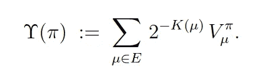

# 谁在乎什么是智能！智能是做什么的？

> 原文：<https://medium.datadriveninvestor.com/who-cares-what-intelligence-is-what-does-intelligence-do-dd267e6a3dd1?source=collection_archive---------7----------------------->

The Like button: Altering everyone’s choice in Facebook’s favor.

当谈到人工智能、AGI、深度学习等等时，人们经常说“我们甚至不知道什么是智能”。他们是对的！我们还没有就什么是智慧达成一致。但这无关紧要，因为像重力一样，我们可以测量它的作用。

尽管对什么是重力没有达成一致，但我们知道它的作用，并且我们已经学会了如何测量它。精确测量重力是仅次于准确了解重力的最好方法。

 [## 今年值得关注的 5 大人工智能趋势|数据驱动的投资者

### 预计 2019 年人工智能将取得广泛的重大进展。从谷歌搜索到处理复杂的工作，如…

www.datadriveninvestor.com](https://www.datadriveninvestor.com/2019/02/19/artificial-intelligence-trends-to-watch-this-year/) 

通过准确了解智力的作用，我们也发现了如何测量它。有了一个可靠的智力衡量标准，我们就有了一个如何获得更多智力的可靠指南。如果不是寻求更多的情报，AGI 是什么？

2007 年，现在主要以 DeepMind 的联合创始人而闻名的谢恩·莱格(Shane Legg)发表了一个关于智力的定义，DeepMind 的[仍在引用这个定义](https://daiwk.github.io/assets/dqn.pdf)，所以这可能是一个相当不错的定义。

非正式地说，莱格是这样定义智力的:

> 智能衡量代理在各种环境中实现目标的能力。

这是一个足够好的定义，但不是特别可行。他继续将其形式化为一种不太容易获得的[机器智能](https://www.youtube.com/watch?v=0ghzG14dT-w)的衡量标准:

It’s machine intelligence, capiche?

我们可以做得更好。

# 智能做的一件事

虽然我们每个人都能想到一些智力能做的事情，但大多数都很难衡量。

早在 1994 年，Linda Gottfredson [调查了[pdf]](http://www.udel.edu/educ/gottfredson/reprints/1997mainstream.pdf) 131 名情报专家，并设法让其中 52 人同意这一说法:

> 智力是一种非常普遍的心理能力，其中包括推理、计划、解决问题、抽象思考、理解复杂想法、快速学习和从经验中学习的能力。

正如你所料，它足够普通，没有什么是我们不知道的，列出了我们可以从智能中期待的七种能力。当我们讨论 AGI 时，七个似乎太多了。

如果我们可以把莱格对智力的定义归结为一种行动，那就是“实现目标”。不幸的是，这过于笼统，难以衡量。毕竟，我们如何衡量像实现 AGI 这样困难或不可能的目标的进展呢？我们没有参考点。

我相信，要达到 AGI，我们必须回答这样一个问题:智能做什么单一的、具体的事情，它概括了它所做的所有一般事情，并且是可测量的。

我是这样表述智能所做的一件事的:

> 智能改变其他智能的未来选择，以有利于自己的利益。

换句话说:

> 你能改变的对你有利的其他人的选择越多，你证明自己越聪明。

我打赌你已经不同意我的观点了。改变他人的选择？就这些吗？为什么会这样？

实现目标呢？推理、计划、解决问题、抽象思维呢？

智力肯定会做这些事情！

如何在复杂、快速变化的环境中生存？解决难题呢？对刺激的延迟反应呢？如何在嘈杂的环境中检测模式并做出准确的预测？

智力当然也做这些事情！

是的，智能做到了所有这些甚至更多，但它们是改变其他智能选择的核心功能的前兆和反应。

解决“改变选择”的好处是它同样适用于人类和人工智能。令人惊讶的是，它对两者都是可测量的，并允许在两个人、不同的人工智能和不同时间的相同人工智能之间进行有意义的比较。

# 生存的基石

众所周知，我们人类是群居动物。我们依赖其他人给我们提供食物、住所和技术。我们需要他人的帮助、支持，或者至少是合作，来实现我们的人生目标，无论目标是大是小。

因此，如果有一件事我们必须做好，我们必须学会如何做出更多的选择来铺平我们自己的道路。这意味着做出更多的选择，让其他人做出有利于我们 T2 而不是其他人的选择，不管这种选择有多轻微。这是每个人的底线。

想得到那份好工作吗？你必须说正确的话，做正确的事，有时提前几年，当然在面试过程中，来影响招聘经理对你有利的选择。

很自然地，你知道如何度过成年期，在这个过程中解决了许多难题(在别人的帮助下)。你实现了目标，推理，抽象地思考，从经验中学习，等等。但这并不能让你得到这份工作，除非你也做了安排，让招聘经理做出了有利的选择，这意味着你比其他求职者更有说服力。

尽管我们倾向于认为智力确实如此，但它归结为在竞争环境中改变他人的选择，使之对你有利。除非你改变足够多的其他人的选择，尤其是正确的人，否则你无法茁壮成长，也可能无法生存。

# 衡量智力的唯一作用

"但是选择的改变可以测量吗？"，你可能会想。的确如此，无论是直接还是通过代理。此外，像重力一样，测量从零开始，可以像我们希望的那样精确。

## 直接测量

在数字环境中，直接测量是可能的。

一个例子是在线广告:如果你把广告放在某人面前，他们点击购买你卖的东西，你就改变了他们的选择。否则，他们会继续他们的一天，或者从竞争对手那里购买，或者在那一刻做出任何其他选择。作为一个数字过程，它都被记录下来供以后分析。

你以这种方式改变的选择越多，你获得的收入就越多，你的企业生存的时间就越长。记录下所有的细节后，你就可以获得关于哪些有用哪些没用的反馈，这样你就可以根据需要调整你的广告、关键词和目标受众。

另一个例子是社交媒体:如果你在 Instagram 上发布了一张照片，你得到了 1000 个赞和 10 万个浏览量，那么至少有 1000 人(不包括机器人)的未来选择稍微有利于你。所有这些都记录在案。现在，越来越多的人更有可能给你发 DM，约你出去，买你的产品，或者推荐他们的朋友也关注你。

人们更有可能在聚会上与你交谈，对你友好，如果你问的话会帮助你，也许会在街上认出你(并在那里帮助你)。这些影响都不一定很大或很可能，但它们对你的潜在客户来说确实有所不同。

## 代理测量

在数字化之前，我们通常用代理来衡量。我们现在也是，但以前也是。我们使用几十种替代方法，包括:

*   你有多少朋友
*   当你讲一个笑话时，有多少人会笑？
*   你预计会有多少人参加你的葬礼？
*   有多少人投了你的票？
*   你的净资产是多少？
*   有多少员工向你报告？
*   你一场比赛进几个球？
*   你多久赢一次？

还有很多。每一项测量都代表了我们改变他人选择的能力。

# 随着测量而来的是指导和成长

当致力于更强的人工智能时，尤其是 AGI，我相信有一个清晰的智能衡量标准是至关重要的。否则我们甚至不知道我们是否取得了进展。

有了明确的衡量标准，我们不再需要坚持我们所知道的，避免犯错误。

有了从零开始的明确衡量标准，我们就有动力进行大量小而安全的实验，因为我们现在可以区分好的结果和坏的结果。当大量小而安全的实验摆在桌面上时，我们不再对 AGI 可以通过进化从地面生长出来的想法视而不见。

这是一个很大的问题，我们只能想象通过[大教堂](https://en.wikipedia.org/wiki/The_Cathedral_and_the_Bazaar)的方法而不是[集市](https://en.wikipedia.org/wiki/The_Cathedral_and_the_Bazaar)的方法到达 AGI。我认为这是我们目前僵局的主要原因:所有可接受的解决 AGI 问题的方法都非常复杂，只有资金极其充足的组织才有机会解决这个问题。然后我们看到这些同样的组织[像恶棍一样疯狂地秘密工作](https://www.technologyreview.com/s/615181/ai-openai-moonshot-elon-musk-sam-altman-greg-brockman-messy-secretive-reality/)，绝望地希望用一个主宰世界的 AGI 来给我们其余的人一个惊喜，夺取所有的奖励。

值得庆幸的是，从我们对重力的体验中我们知道，在我们可以测量智力之前，我们不需要确切地知道什么是智力。用正确的方法，我们给自己机会去发现什么是智慧，以及它是否重要。

有了正确的措施，我们也向自己开放了一个更安全的 AGI 方法，即集市方法，数百万个人可以同时生长和改进他们自己的微小内核，一次一小步，总是很容易被改进的版本取代。

所以，我认为智力的观点给了我们这样的衡量标准:

> 你能改变的对你有利的其他人的选择越多，你证明自己越聪明。