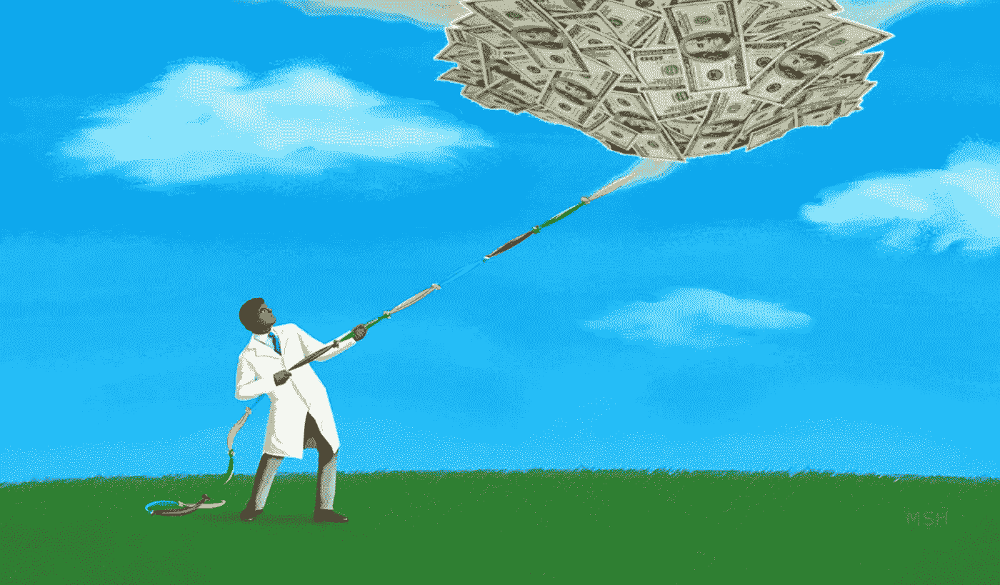
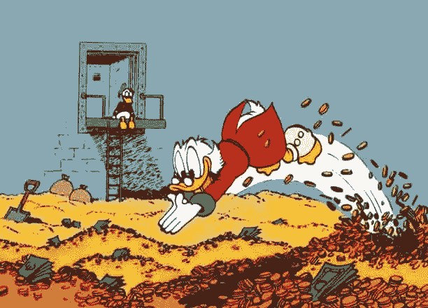
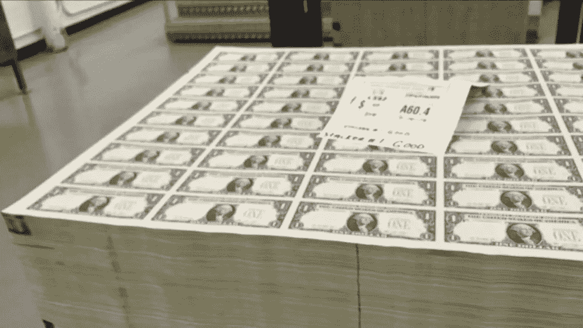

# 谁凭空创造了钱？

> 原文：<https://medium.datadriveninvestor.com/who-creates-money-out-of-thin-air-2df3eac8bf2b?source=collection_archive---------1----------------------->

Creating new money — where does it come from?

## 钱从哪里来，可用的总资金池是多少，这个资金池是恒定的&有限的吗？如果你猜到了，看看答案。

它是最重要的东西，也是现代社会的基础。我们都努力工作来获得其中的一些，以确保我们的孩子过得更好，享受更高的生活水平。但令人惊讶的是，没有多少人真正知道钱从哪里来。

追溯:工人

If we think of money only as a token, we may be completely misled. Imagine you are stuck on a desert island with 4 other people. You agree that the token to be used as money token will be some 50 pieces of bones of T-Rex one found. These are the only pieces that exist and each person will have 10 of them. The amount of money will only change if these pieces of bones are physically destroyed. No transaction between two parties will ever physically create or destroy such tokens. But in the real world, money is not only a token, but there are different *打*钱。我们稍后将讨论它们。今天我们有[1.8 万亿](https://fred.stlouisfed.org/series/CURRVALALL)美元的代币可用，而且还在增加。有趣的事实:如果杰夫·贝索斯卖掉他的亚马逊股票，他将拥有美国 11%的现金

Scrooge McDuck and his US dollars.

货币是不断被创造和毁灭的。我们先来看看金钱毁灭。

## **金钱毁灭**

金钱不仅会被某人焚烧现金(顺便说一句，这在某些司法管辖区是非法的)而毁掉。相反，每次你支付汽车贷款或抵押贷款时，你实际上是在摧毁金钱。这种破坏是通过计算机中简单的数字变化来实现的。我们稍后将讨论细节。

但是钞票和生活中的其他东西一样，都是有寿命的，也是不断被更换的。有趣的事实。这些是每张现金纸币的平均寿命。

*   一元纸币:3.7 年
*   5 元钞票:3.4 年
*   10 美元钞票:3.4 年
*   20 美元钞票:5.1 年
*   50 美元纸币:12.6 年
*   $100 bills: 8.9 years

Although we are living in a digital age, phone payments, "[现金仍然是全国流行的支付方式和金融工具](https://www.congress.gov/116/meeting/house/110420/documents/HHRG-116-BA00-20200130-SD002.pdf)，流通中的货币数量[稳步增加](https://fred.stlouisfed.org/series/CURRVOLALL)。

It will take some time until digital payment systems replace cash.

人们不应该把金钱和价值混为一谈——它们是不同的东西。如果你给你的孩子买了一个 40 美元的玩具，几个月后它坏了，你把它扔进了垃圾桶，这被认为是价值的损失。商店仍然有你的 40 美元，没有钱被创造或破坏。股票市场也是如此。当一只股票从 100 美元涨到 0 美元，这只意味着证券(所有权)一文不值。

 [## 分析 DeFi 协议中借款的高利率|数据驱动的投资者

### 我们最近看到，Aave 协议中 BAT 的借款利率从 100%提高了。这个…

www.datadriveninvestor.com](https://www.datadriveninvestor.com/2020/07/21/analyzing-high-interest-rates-on-borrows-in-defi-protocol/) 

## 货币创造——新的新鲜货币

出于本文的目的，假设有两种类型的货币(对货币类型进行分类和分段可能很困难，因此我们简化了语言):**实物**和**虚拟**。实物货币是你放在钱包里的印刷钞票——美钞。虚拟货币，或称账面货币，仅仅是电脑中的账户条目。只有 5%的钱是实物货币，而 95%是虚拟货币。

Printing Facility in Washington — Bureau of Engraving and Printing (BEP). Source: ABC News

实体货币(纸币/现金/货币)是由美国财政部下属的政府机构——铸造和印刷局(BEP)印制的。有趣的事实:美国日报每天印刷超过3 亿美元，一张纸币的成本是 0.10 美元。纸币的印刷数量由美国的中央银行美联储控制。美联储通过根据季节印刷更多或更少的现金来满足现金需求。例如，在关键节假日，人们更多地使用 ATM，对现金的需求增加。美联储不断从银行收集信息，以确保稳定的现金供应。在过去，实物货币是唯一存在的货币。今天，它只是整个资金池的一小部分。

虚拟货币是只存在于电脑中的钱，比如支票账户中的存款。这些数字记录与加密货币没有任何关系，加密货币官方不认为是货币。虚拟货币简单来说就是还没有印刷出来的货币。每次你把现金存入自动取款机，你就把实物货币转换成虚拟货币，反之亦然。有趣的事实:实物和虚拟货币不再像过去那样由任何东西支持，比如黄金。

两个行动者创造了这些货币:政府和商业银行(普通银行)。政府只创造了 10%的虚拟货币，而银行创造了其余的 90%。先说政府。

政府创造货币

联邦公开市场委员会(12 人，主席是杰罗姆·h·鲍威尔)定期开会决定应该创造多少货币。一旦定义完毕，美联储通过拍卖的方式向银行买卖债务票据(虚拟票据和交易)。例如，如果美联储的目标是为经济增加 50 亿美元，它将简单地购买 50 亿美元的虚拟债务，称为国债，从而增加 50 亿美元的新货币。美联储用虚拟货币支付给银行，并收到这些虚拟的纸张作为回报。美联储的账户上没有存款，所以它基本上是通过向银行付款来凭空创造货币。这些国债被用来资助政府活动。

政府创造货币以确保价格稳定(控制通货膨胀)和促进经济中的最大就业。为什么向经济中注入更多的货币会降低利率(货币供应量的增加会降低利率)，而较低的利率会鼓励人们消费。更多的支出增加了对工人的需求。简而言之:增加货币供应->降低利率->增加支出->增加销售->公司需要更多的工人。相反的效果发生在货币供应量的减少，以降低通货膨胀。

**银行创造了*几乎所有*的货币**

银行通过所谓的“部分准备金银行和货币乘数”来创造货币。听起来很恐怖？它不是。这意味着银行只从客户那里保留一小部分资金，其余的都贷出去了。

当你把钱存入银行账户时，比如说 100 美元，它被存放在一个金库里，没有人会动它，对吗？不对。其中只有一小部分被保留下来，比如 10 美元，其余的被放回流通中——从而创造出新的货币。这 90 美元是凭空创造出来的新钱，因为现在 A 在银行账户里有 100 美元，而 B 手里有 90 美元。然后，B 存入 90 美元，其中 9 美元被保留，81 美元被借出。你可以看到“乘数”这个词的来源。一笔 100 美元的存款会产生数倍的新钱。

[最近](https://www.federalreserve.gov/monetarypolicy/reservereq.htm)美联储将存款准备金率降至 0%。换句话说，银行现在可以贷出客户的所有存款，从而增加新的资金。

当贷款被偿还时，这一过程逆转，大部分新货币被销毁，但整个贷款的利息将永远是新创造的货币。它被称为[利润之谜](https://mpra.ub.uni-muenchen.de/21292/1/MPRA_paper_21292.pdf)。

注意:信用卡“信用额度”和其他一些可用的贷款在到达银行账户之前都不是钱。美联储只考虑货币 M1、现金、存款、旅行支票等。

所以回答我们最初的问题，银行通过从客户那里借出存款创造了今天存在的大部分货币。当贷款偿还后，这些钱就会被销毁。

**进入专家视图—** [**订阅 DDI 英特尔**](https://datadriveninvestor.com/ddi-intel)