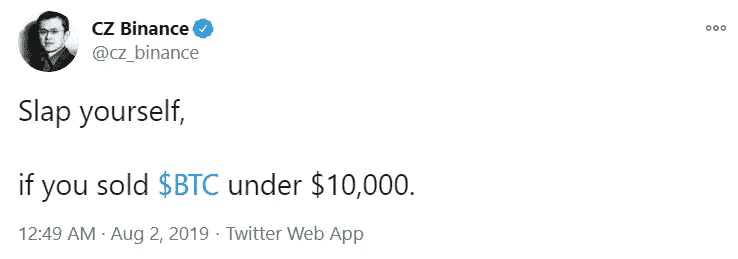
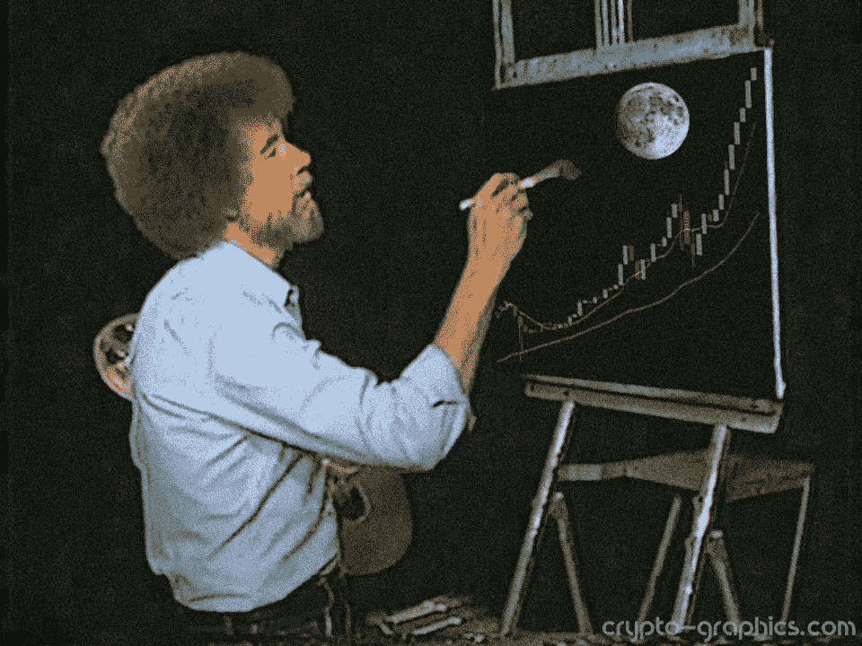
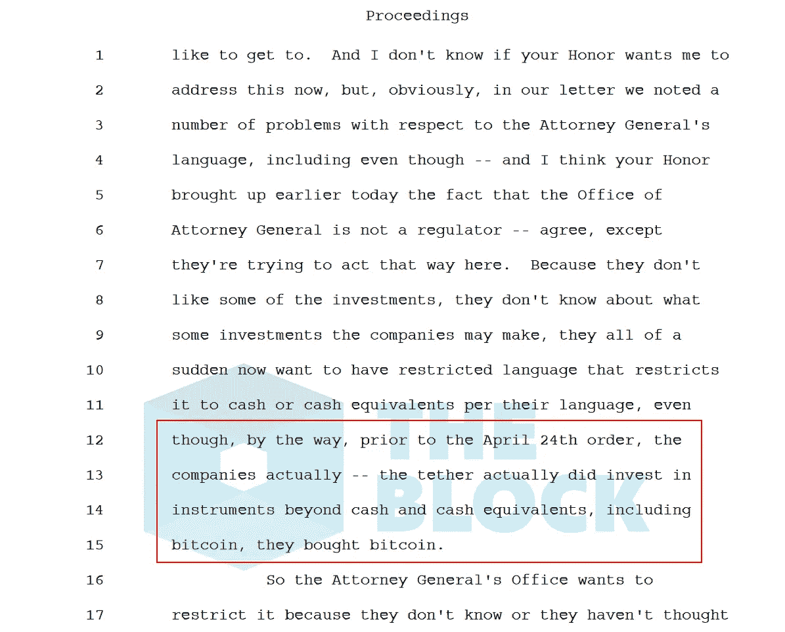

# 谁在 3 万美元以上购买比特币？

> 原文：<https://medium.datadriveninvestor.com/who-is-buying-bitcoin-at-above-30-000-usd-752be69768eb?source=collection_archive---------41----------------------->

“卖了一万美元以下的比特币就给自己一巴掌”，lol。只要你没有以非常惨重的损失卖掉你持有的加密货币，就没什么可遗憾的。但在这种情况下，你实际上应该责怪自己尽管获得了一些收益，但还是以这样的价格出售。顺便说一句，那不是我说的，而是这家伙说的:

这是一个旅程，之前的 19，000 美元的比特币历史高点看起来会持续更长时间，但我们在这里！好像打破 19，000 美元的记录还不够令人兴奋，比特币已经突破了 20 多美元，并突破了 30，000 美元。{ATH}！我打赌你没想到会这么快。

不管我们如何到达这里，这是一次有趣的旅程。比特币和以太坊享受了市场繁荣的最大份额，其他几个替代币也出现了合理的升值。对于大多数其他项目来说，情况并不完全相同，但不管怎样，这很正常。

承受能力和估值成反比。几个月前，1 万美元可以让你得到一个比特币；它会让你得到更少的东西。当其他人贪婪时，经验丰富的投资者会感到恐惧，但市场继续显示出强劲的迹象，看起来买方力量正在胜过卖方力量，从而推动价格上涨。

几乎没有人会质疑为什么有人会在 3 万美元以上出售比特币，但许多人会质疑为什么投资者会在比特币价格上涨到前一年开始时价值的三倍以上后，以目前的价格购买比特币。许多人实际上已经对目前的增长是否真的是有机的提出了质疑。

虽然我个人不反对当前增长的性质，但毫无疑问，人们实际上在当前价格下积累了大量比特币。但这可能是谁呢？让我猜猜…

## 机构？

嘿，迈克尔·塞勒，是你吗？或许彼得·希夫正在将黄金的部分利润偷偷投入到更好的投资中。杰克·多西的 square capital 应该已经从 5000 万美元的比特币投资中获得了大约 2 倍的收益，但我强烈感觉到他们正在慢慢购买更多。仅举几个例子。

[来源](https://pixabay.com/vectors/help-information-question-tip-1724292/)

2020 年最后一个季度，机构对新的“互联网黄金”产生了巨大的兴趣，在之前的一篇文章中，我发表了一篇关于比特币获得与黄金类似的声誉的声明，新一代人对比特币的偏好明显超过了这种被夸大的有光泽的金属。

> 像杰克·多西这样聪明的投资者会轻易向数字黄金投资 5000 万美元。像杰克这样的投资者正在增加。古老的黄金将永远在老投资者中流行，像彼得·希夫一样老…哈哈。时代在变，新时代视比特币为未来，真金已经过时了。替代币保留了其技术“进步者”的形象，而比特币继续其实现“数字黄金”数字的旅程。

继续阅读[这里](https://medium.com/datadriveninvestor/is-bitcoin-attaining-the-gold-figure-1b813f4338aa)

比特币和加密货币经受住了十年的激烈阻挠和严厉监管，这一挑战一直在持续，未来可能会变得更强。尽管如此，它继续以令人印象深刻的速度增长。

机构们似乎终于相信了比特币，相信了 30 万美元的预测。如果比特币能在七年内达到 19000 美元，并在两个月内从 9000 美元涨到 40000 美元，那么未来还有很大的空间。富裕的公司意识到了这一点，从他们的储备中拿出几百万投入比特币是一件很容易的事情……大约 3 万美元仍然是一个合理的价格。

## 加密货币交易商？

如果有一种加密货币可能在短期内获得一些不错的收益，那么毫无疑问它就是比特币。尽管已经取得了一些巨大的收益，它仍然准备在不久的将来甚至更高。活跃的交易者抓住这一点，不管当前的价格如何，两天内 7%的涨幅会让短线投资者高兴。当近期前景看好时，在 30，000 美元买入不成问题。

以这种方式投机和购买的交易者构成了主要的购买力量，这种想法正在发展。期货交易员对做空比特币伤痕累累。比特币交易者的能量比以往任何时候都更环保！买，买！3 万美元绝对不是问题！

## 散户炒家？

“八年前，比特币的价值还不到一美元，总有一天会超过一百万美元”。毫无疑问，这是一个随机投机者的话，他不受比特币当前价值的影响，认为阿尔法加密货币才刚刚开始。

随着机构购买和银行准备开始接受比特币，这场革命才刚刚开始。“只有 2100 万个比特币，而需求还在上升”，如果你关注安东尼·庞普利亚诺，那么你一定已经多次遇到这种说法。

[来源](https://news.bitcoin.com/2017-collection-six-months-dank-crypto-memes/)

比特币的动态和围绕它的传言将进一步推动它，尽管目前存在铰链，但未来看起来很乐观。没有价格规定，对于比特币这样一种非常不稳定的资产，每枚比特币价值 100 万美元是完全可以实现的。如果一个比特币在未来可以价值 100 万美元，那么一个比特币大约 3 万美元是一项非常聪明的投资。

许多预算长期持有人目前这样认为，如果价格继续上涨，更多的人会这样做。

## 系绳？

这听起来可能很奇怪，但是泰瑟可能在购买比特币！Tether 的“美元支持的稳定硬币”——USDT 无疑是加密领域最受欢迎和使用最多的稳定硬币。据报道，在实物资产和法定货币的支持下，Tether 已经发行了价值超过 190 亿美元的稳定硬币，与 1 美元挂钩。尽管其活动的真实性受到争议，但 Tether 稳定的硬币发行是加密货币主要主流投资的一项措施。

啊？

该组织发展如此之快，并将其翅膀伸向整个加密空间，毫无疑问，它正从其活动中获得一些利润，并将其投资于购买最热门的数字资产。当然，对于一个向投资者“发行”数亿枚稳定比特币的协会来说，一枚比特币 3 万美元不成问题。

你觉得现在的价格还有谁在买比特币？