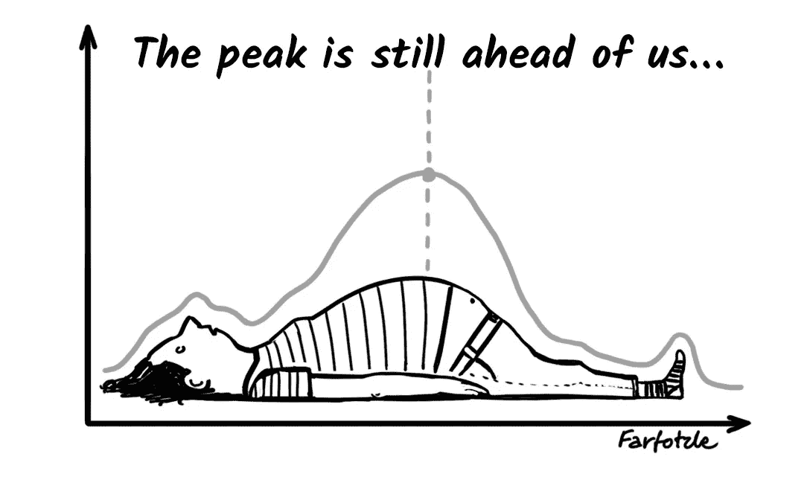
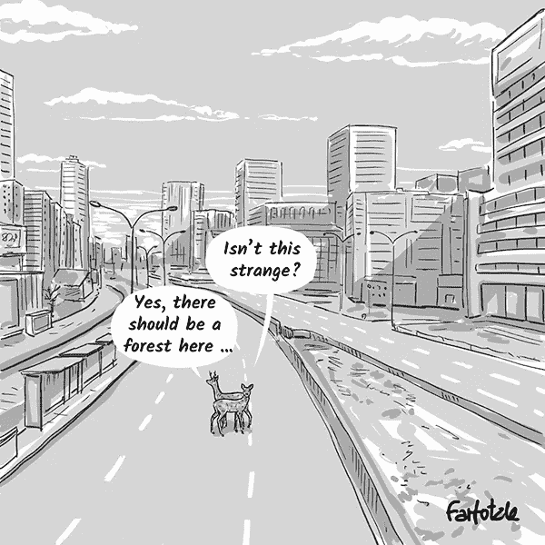

# 谁在给谁点火？

> 原文：<https://medium.datadriveninvestor.com/who-is-gaslighting-whom-b85592914554?source=collection_archive---------9----------------------->

© [Farfotzle](https://www.facebook.com/Farfotzle/)

在过去，我们会谈论迷惑、欺骗、洗脑或扰乱某人的思想。说波兰语的人会谈论用某人的大脑制造水。今天，同样的词是“煤气灯”在他的文章中:[为最终的点燃做准备*](https://forge.medium.com/prepare-for-the-ultimate-gaslighting-6a8ce3f0a0e0) ， [Julio Vincent Gambuto](https://forge.medium.com/@juliovincent) 警告我们它即将到来。他认为，在新冠肺炎·疫情之前，我们被价值数十亿美元的广告业务*点亮了，这让我们产生错觉，认为无论我们有什么问题，都可以通过购买他们提供的任何东西来解决。*

现在，在政府关门期间，所有不重要的企业都关门了，Gambuto 先生意识到生活中不仅仅只有购买。当我们都期待恢复正常的时候，他警告我们"*数十亿美元将会花在广告、信息、电视和媒体内容上，让你再次感到舒适。*“他告诉我们，渴望回归常态，“*作为一个社会，我们现在以一种全新的方式变得脆弱*”成为盲目消费主义的受害者。

# 为什么甘布托先生的信息是重要的，尽管他是错误的

当我第一次看到甘布托先生的文章时，我认为它是一个被我们先进文明的好处宠坏了的人的无意义的哭泣。然后，[Siobhan O ' Connor](https://medium.com/@siobhan),*Medium*的主编在她的时事通讯中写道，在读了 Gambuto 先生的文章几天后，她仍然无法摆脱这种困扰。她补充说，这篇文章已经被“数百万人阅读，我认为这是因为它表达了我们许多人都有的一个想法，只是我们还没有命名而已。”根据甘布托先生的网站，他的“*最新作品(……)在网上疯传，在全世界有 1900 万次点击量*。我又检查了一下*培养基*。发表两周后，它获得了 166，000 次鼓掌和 884 条评论，成为媒体上有史以来最受欢迎的文章之一。我看了大概 200 条评论。他们中的绝大多数都热情支持。

甘布托先生用文字表达了他的许多读者的想法。我在他的宣言中看到的困惑代表了我们社会中有意义的一部分人的观点。甘布托先生有才华和勇气写下它。因此，这不仅仅是关于甘巴里先生的困惑。这是关于为什么我们当中有这么多人迷失方向。

© [Farfotzle](https://www.facebook.com/Farfotzle/)

# 什么是常态

Gambuto 先生将其描述为:“*当问题是实际的和战术性的，解决方案就是‘在电视上看到的’，在家得宝就能买到。*“在正常情况下，可口可乐让我们快乐，奔驰让我们成功，皇家加勒比游轮让我们与众不同，等等。据甘布托先生说，我们在过去的一百年里都是这样被点燃的。Gambuto 先生没有具体说明是谁点燃了煤气灯，他也弄错了年份。

我同意，正如我们现在所知，消费主义在大约一百年前获得了动力，但大萧条把它削弱了。在漫长的痛苦恢复时期，接着是第二次世界大战的歉收时期，人们没有钱。即使有人尝试，也很少有人容易受到煤气灯的攻击。因此，在甘巴里先生看来，这种情况只存在了不到 70 年。而且只对富人开放。

几乎我们所有人都买得起可口可乐，所以甘布托先生可以说，我们喝它是因为广告商让我们相信它让我们快乐。但是不管可乐里有多少糖，当人们看着一堆过期的账单，考虑推迟哪一个以便在家得宝购买烟雾探测器的电池时，它都会留下苦涩的味道。对许多人来说，像这些电池这样的必需品可能是他们“点着煤气灯”去家得宝这样的商店的唯一原因。对很多人来说，这是美国的常态。

因此，我并不同情那些购买梅赛德斯以感受成功，或者乘坐皇家加勒比游轮以感受特别的人。我只能祝贺那些发现了需要花钱来支持自我的失败者的广告商。

纽约的常态不同于世界上大多数地方。直到 20 世纪 70 年代末，[饥饿](https://slate.com/technology/2014/04/why-does-china-not-have-famines-anymore-capitalist-and-socialist-reforms.html)是中国约三分之一人口的常态。即使在今天，世界上大多数人自然对煤气灯免疫，因为他们没有可自由支配的收入。朝鲜或委内瑞拉等国的人民可能会很乐意[用他们的“天堂”换取一点点被甘布托先生痛斥的腐朽资本主义。](https://www.datadriveninvestor.com/glossary/exchange/)

对甘布托先生来说，放荡的常态是对我这样的人的祝福。当我离开我的祖国波兰时，我并不比现在的 Gambuto 先生年轻多少。那时波兰有社会主义。为了买面包，我需要在凌晨 2 点左右赶到面包店，那时他们正在把面包从烤箱里拿出来，因为一个小时后，所有的面包都卖完了。我在抽屉里放了一堆旧螺丝钉和钉子，小心翼翼地把它们拉直，因为如果我需要的话，没有哪家商店像家得宝这样设备齐全。几乎买任何东西都是一场斗争。但是我没有受到广告商厚颜无耻的欺骗，按照甘布托先生的说法，这是美国人最大的危险。唯一的亮点来自官方宣传，他们向我灌输了同样的论点，即 Gambuto 先生现在向我灌输的消费主义的邪恶。

在美国，我和其他人一样，对无处不在的侵入式营销感到恼火。要花很多时间和精力去整理。但是我知道自己的人生目标，知道自己需要什么，也知道自己能负担什么，所以我做到了。至少，在一瞬间，我更喜欢它，而不是我以前经历过的那种选择。

© [Farfotzle](https://www.facebook.com/Farfotzle/)

# 危机从来都是正常的

在过去的几十年里，我们有幸实现了相对和平的经济增长。在 Gambuto 先生的推理逻辑背后，有一个假设，即这是正常的。他错了。评论家将 1918 年的西班牙流感与新冠肺炎相比，指出当时的政府几乎没有采取任何措施帮助美国人度过危机。大约一个世纪前，人们认为他们的生活是一连串的苦难，根本不期待任何帮助。这很正常。

直到最近，诸如黑死病、霍乱或疟疾等瘟疫使人口大量死亡。没有防洪措施；没有飓风的预警。像 1871 年在芝加哥发生的火灾，比现在的破坏力更大。地震造成的伤害比现在更大。如果这还不够，毁灭性的战争比现在更频繁地发生。有一个圣经故事，讲的是七只丑陋干瘦的母牛吃光了七只光滑肥壮的母牛。在这一睿智信息的指引下，人们知道如果有一段和平与繁荣的时期，那就是为下一次灾难做准备的时候了。

医学上的巨大进步保护我们免受过去经常发生的瘟疫。我们对洪水、火灾、地震和飓风有了更好的准备。结果，新常态的假象出现了，那就是我们完全控制了局面。新冠肺炎提醒我们，我们永远无法完全控制我们的环境。甘布托先生说得对，一旦新冠肺炎最糟糕的时期过去，广告商就会像没有明天一样引诱我们购买。做那件事是他们的工作。我担心的是我们是否有足够的智慧为未来的灾难做准备。

他们会来的。有些很明显。科学告诉我们，加利福尼亚的下一次大地震即将来临。此外，作为一个社会，我们现在能更好地抵御飓风、洪水和火灾；因此，对我们许多人来说，最具毁灭性的灾难都发生在个人层面。有了先进的药物，我们可以战胜致命的疾病。我们可能还活着，但由于医疗费用，我们在经济上被毁了。我们可能生存下来，但却有残疾，这可能需要额外的精神力量，而且更多的时候，需要金钱。技术进步的漩涡可以给我们带来今天的巨大胜利，也可能带来明天更大的损失。最后，我们政治体系的系统性失灵可能会爆发一场比新冠肺炎更有害的经济危机。

在 Gambuto 先生的文章中，虽然没有明确表达，但有一个假设，即我们作为一个社会，应该保护我们大多数人免受我们遇到的不幸。我给甘巴里先生带来了坏消息:这是不可持续的。我们社会的繁荣要求我们大多数人能够在力所能及的范围内解决我们的问题。我可以理解营销人员没有告诉我们这个发人深省的事实；他们想要我们的钱。警告我们不要将"*商业和政府*"捆绑"*在一起再次击晕我们，*"甘布托先生用瓦斯点燃我们的幻觉"*如果我们只想过更简单的生活，我们可以让它发生*"

© [Farfotzle](https://www.facebook.com/Farfotzle/)

# 生活是艰难的

只有最富裕的人才能享受 Gambuto 先生如此批评的无节制消费。我怀疑那些买了奔驰觉得自己很重要的人在读了甘布托先生的文章后有了启示；它们不读取*介质*。他的信息在那些幸运地坐上梅赛德斯优步之旅的人中引起了共鸣。他们支持甘巴里先生的信息，不是因为这给了他们道德上的觉醒。他们赞同它，因为它给了他们安慰。这让他们感觉高人一等，因为他们不会大量消费。简单地说，他们负担不起。

通过提到在关闭期间没有工业污染的天空，甘布托先生在*媒体*上讨好了许多气候变化倡导者。他毫不留情地批评美国的政治现实，这也是*媒体*上流行的口头禅。接着，他以《人民论坛报》的热情写道:“*如果我们希望我们的邻居和朋友获得体面的收入，我们就能做到。他没有想到，为了让任何人有收入，我们需要重新开放所有污染企业，让冒烟的汽车重新上路。即使我们想要我们的空气更干净，为了实现它，目前，我们需要部署我们的化石燃料驱动的经济来生产任何必要的东西，以建立一个污染更少的工业。甘布托先生比那些想鱼与熊掌兼得的人更贪婪。他想在蛋糕烤好之前吃一块。Gambuto 先生发现了他的听众的反商业和反政府情绪，因此大放异彩。*

# 我们需要一次严肃的谈话

[黛博拉·海登](https://medium.com/@deborahhayden_48536?source=post_page-----fea79aa5e2ab----------------------)贴出最好的[评论](https://medium.com/@deborahhayden_48536/as-a-former-investment-manager-who-has-lived-through-massive-economic-shifts-resulting-from-fea79aa5e2ab)。她担心花在救济项目上的数万亿美元会增加我们已经过高的 23 万亿美元的国债。这一债务的压舱物将导致一场这个国家和世界从未经历过的萧条。所有那些试图让我们再次疯狂购买的营销尝试都将是徒劳的。人家不会有钱。”

不管甘博托先生或他指责的那些人给我们加了多少气，都无法回避这一现实。借用 Gambuto 先生文章的标题，正如 Hayden 女士警告我们的那样，我们应该为我们经济的“最终下降”做好准备。

我们需要认真讨论我们作为一个国家和全人类所面临的挑战。甘巴里先生尖锐地指出，我们的领导人不能胜任这项任务。可悲的是，他的信息在智力上反映了这些领导人提供的东西，只是在意识形态上有所不同。

*原载于 2020 年 4 月 28 日 https://www.datadriveninvestor.com***。**