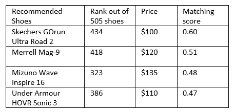
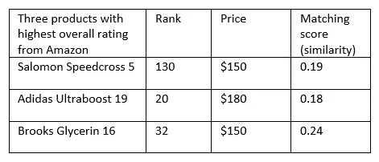
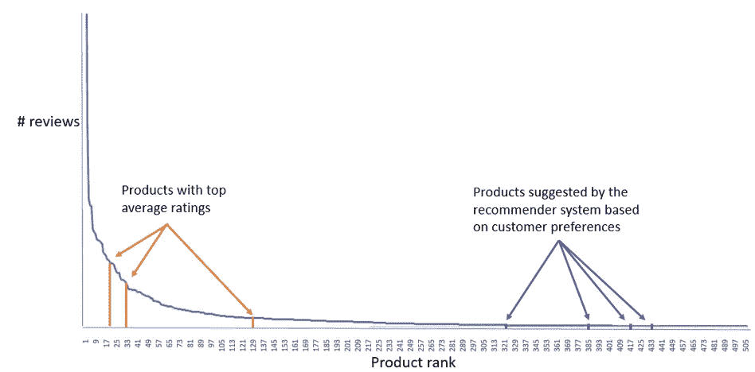
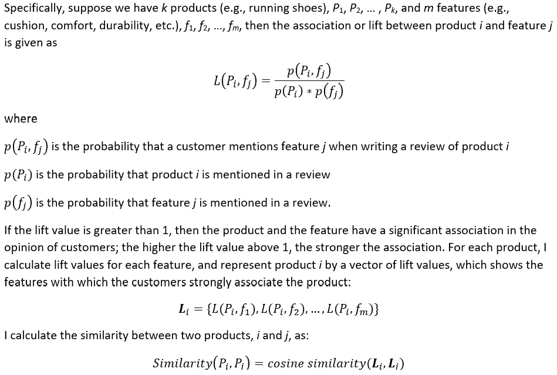
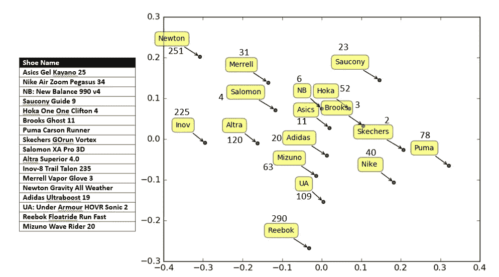
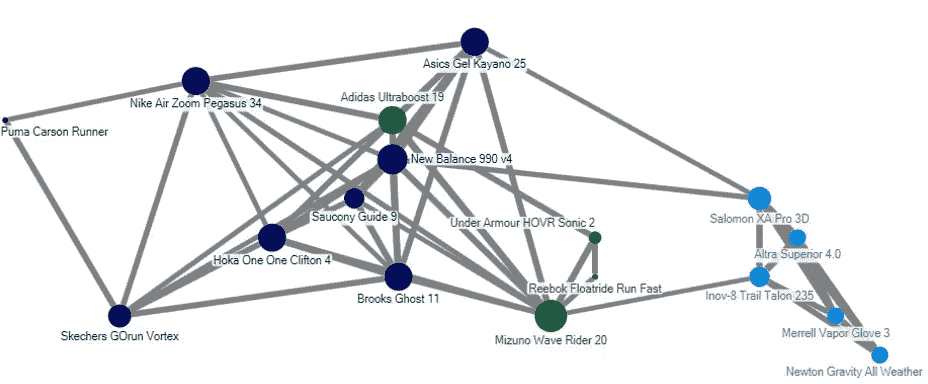
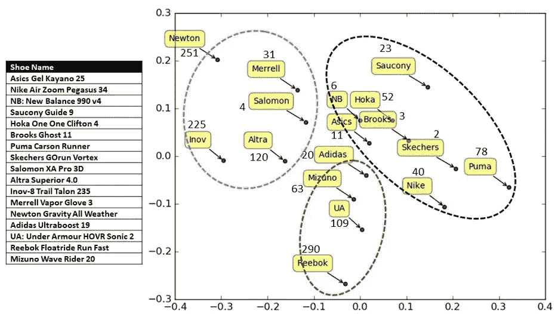
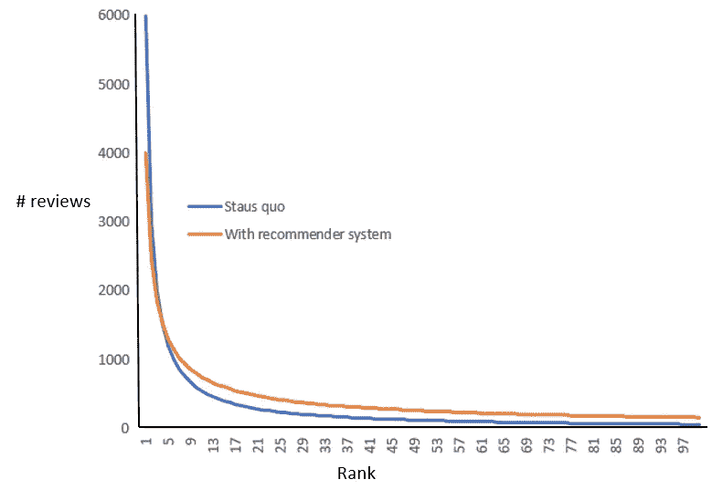

# 长尾时代你的竞争对手是谁？

> 原文：<https://medium.datadriveninvestor.com/who-is-your-competitor-in-the-era-of-the-long-tail-d0ac24fedde8?source=collection_archive---------5----------------------->

Photo by [Nicolas Hoizey](https://unsplash.com/@nhoizey?utm_source=medium&utm_medium=referral) on [Unsplash](https://unsplash.com?utm_source=medium&utm_medium=referral)

德克萨斯州奥斯汀市西湖高中乔希·巴鲁阿。

**竞争性质的变化**

不久前，任何产品类别的竞争都仅限于少数知名品牌，其余的都被贴上利基产品的标签。然而，这种情况近年来发生了巨大变化；如今有许多产品，其中许多产品的功能可以与大品牌产品相媲美，而且价格通常更优惠。已经开发了推荐系统来将产品与消费者的需求相匹配，这减轻了寻找可能不是最受欢迎或最显眼，但可能非常适合消费者需求的产品的负担。从零售到金融服务，我们随处可见这些推荐系统。但是这些系统对竞争和需求有什么影响呢？

我证明了推荐系统可以极大地增加推荐产品的多样性，从而加剧制造商之间的竞争，在这个消费者必须自己搜索和评估产品的世界里，制造商不是直接的竞争对手。这些推荐者也可能会改变需求曲线的形状，在头部下方的区域更少，在尾部区域更多，后者是难以发现的产品的所在地。因此，制造商必须更好地理解主流产品和利基产品之间的竞争，并相应地调整他们的策略。这种现象也代表了新的和创新的公司的机会，他们可能没有规模经济，巨大的广告力量或完善的分销渠道，但他们可以在一个拥有更大尾部区域的数字世界中取得成功。

**连接到长尾**

2010 年,《连线》杂志前主编克里斯·安德森观察到制造业“民主化”的大趋势。在电子商务革命之前，任何产品类别都只有少数几个主导者(例如耳机领域的 Bose 和 Sony，或者运动鞋领域的 Adidas 和 Nike)，而其他产品的销量微不足道，被称为“利基”产品。然而，由于现代制造技术的便捷性以及免费的在线设计工具，许多小型制造商如今正在生产各种各样的产品，其中许多产品可能具有卓越的质量和功能，且价格合理。大量产品的可用性被称为长尾，这是一种需求分布，纵轴是售出的单位数量，横轴是排名或受欢迎程度(图 1，我摘自 Dik 2018 年在 Medium 发表的一篇优秀文章)。安德森认为，虽然制造业的民主化使创造如此多种多样的产品变得可行，但正是电子商务使在线提供产品变得切实可行。例如，亚马逊列出了 6 亿多种产品，而沃尔玛超市则有 12.5 万到 15 万个 SKU。

Figure 1: The long tail of products (Source: J. Dik, 2018)

**分析竞争结构的变化**

基于顾客偏好的推荐系统推荐的产品可能是多样化的。为了说明这一点，我将使用一个我开发的推荐系统，在 TowardsDataScience.com 的一篇[文章](https://towardsdatascience.com/a-recommender-system-based-on-customer-preferences-and-product-reviews-3575992bb61?sk=decf35754ce0c79ff47e2a67acf19479)中有所描述。它的工作原理是询问购物者他们对一双跑鞋的偏好特征，并通过将偏好特征与顾客评论进行匹配来提出建议。例如，使用三个特征，舒适性、支撑性和耐久性，我的系统建议四双鞋，如表 1 所示。我假设评论的数量与售出的数量成正比。也就是说，一个比另一个卖得多的产品也可能有更多的评论。我给我的数据集中尽可能多的鞋子分配 1，2，…，505 的等级，从评论数量最多的那双开始。等级显示在表 1 的第二列中。

Table 1: Four recommendations for preferred features *comfort*, *support* and *durability*

在一个没有推荐系统的世界里，假设大多数购物者会选择评分最高的产品。表 2 显示了亚马逊上排名最高的三种产品，以及首选功能的匹配分数。

Table 2: Shoes with highest overall ratings on Amazon

这些建议深入到需求曲线的尾部(如图 2 所示)，在产品中找到更好的匹配，这些产品在通过总体评级选择时可能看不到。有趣的是，相对于推荐系统所建议的产品，最高评级产品的相似性得分(0 到 1 之间的值)明显较低。此外，推荐的产品通常也具有较低的价格。

Figure 2: Diversity of products suggested by a recommender system

**寻找相似产品:对竞争的影响**

虽然许多推荐系统通过使用产品描述来计算产品之间的相似性，但我们也可以确定客户与产品强烈关联的特征，然后找到与相同特征也有强烈关联的产品。Netzer 和他的同事(2011)展示了一种使用自然语言处理和基本统计的正式方法。

余弦相似性分数将在 0 和 1 之间变化，其中接近 1 的分数将指示强相似性。我也可以使用单词嵌入来计算相似度，但是在早先的[文章](https://medium.com/swlh/word-embeddings-versus-bag-of-words-the-curious-case-of-recommender-systems-6ac1604d4424?sk=d746da9f094d1222a35519387afc6338)中，我展示了对于基于特征的推荐系统，单词袋模型优于 word2vec。一旦我计算了每一对产品的相似度，我就得到一个余弦相似度矩阵。然后我得到一个多维标度(MDS)图，它提供了从消费者的角度看竞争产品的可视化。如果两种产品彼此接近，从客户的角度来看，它们是可比的，因此是竞争对手。为了便于说明，我对 18 种产品使用余弦相似矩阵(从我的跑鞋数据集的 18 个制造商中随机抽取一种产品)。MDS 地图如图 3 所示。该图类似于 Netzer 及其同事(2011 年)的图，但基于特征而不是共同提及的提升值来处理余弦相似性得分。轴只是由 MDS 算法选择的坐标系，以某种方式表示产品，使得它们的距离与产品之间的余弦相似性值成反比。

很明显，在竞争结构中，排名并不十分重要。排名较高的鞋子(如 Brooks Ghost 11 和 Skechers GOrun Vortex)被排名较低的鞋子(如 One One Clifton 4 和 Puma Carson Runner)包围。

Figure 3: MDS map of 18 shoes based on feature similarity

为了更深入地了解竞争的本质，我在这个 MDS 图中对产品进行了聚类。我首先将产品的余弦相似性矩阵转换成邻接矩阵[*AIJ*，其中如果产品*I*和*j*之间的余弦相似性大于阈值，比如说 60%，则*AIJ*= 1，否则为 0。这种表示帮助我创建了一个产品网络，在这个网络中，如果两个产品的相似度超过 60%,那么它们就是直接相连的。然后我在这个网络上使用克劳塞特-纽曼-摩尔聚类算法(见[https://www.smrfoundation.org/nodexl/](https://www.smrfoundation.org/nodexl/))，它提供了如图 4 所示的不同颜色的三个聚类。我在图 5 中用虚线椭圆形状表示了这种聚类的结果。

Figure 4: Network representation and clustering of 18 products based on similarity of features

Figure 5: MDS plot with clusters of products

对于每个聚类，很明显，使用产品之间的相似性的推荐系统发现许多排名较低的鞋作为那些排名较高的鞋的邻居。例如，在右侧的集群中，Sktechers Gorun Vortex(排名 2)和 Brooks Ghost 11(排名 3)与排名低得多的产品(例如，排名 23、40、52 和 78)共享该集群。因此，制造商必须超越具有相似受欢迎程度或总体评级的产品，以了解由于大规模使用推荐系统而可能出现的竞争的性质。

**需求曲线的转变？**

广泛采用推荐系统的一个可能结果是，需求曲线的形状发生了变化，尾部下方有更多的区域。推荐系统在促进产品多样性的同时，实现了与客户偏好的更好匹配。这种现象在下面的图 6 中显示，在我们的数据中有排名前 100 的鞋子。请注意，橙色曲线下的面积大于原始(蓝色)曲线下的面积。这可能是因为推荐系统会推荐更实惠的产品，这会增加需求。

Figure 6: A shift in the demand curve due to widespread use of recommender systems

**最终想法**

长尾理论将继续存在，因为有能力获得廉价设计和制造技术的创意公司会生产各种各样的产品。虽然电子商务使提供这种尾部产品变得可行，但它们成功的最大障碍是购物者在搜索、发现和评估大量不熟悉的选择时所付出的大量时间和精力。推荐的产品很可能来自需求曲线的尾部，就像头部或身体一样，因此增加了产品的多样性。由于这种推荐，尾部下面的区域可能会随着时间的推移而增加，代价是头部区域的一些减少。这种现象将导致行业内竞争结构的变化，处于分销渠道最前端的制造商可能会发现自己在与一些处于末端的制造商竞争。利用产品和特征之间的关联分析，制造商可以从顾客的角度评估竞争产品，从而更有效地竞争。

**参考文献**

迪克，J. (2018)。"长尾将如何影响休闲分支？"**[https://medium . com/briq-bookings/how-will-long-tail-affect-the-leisure-branch-dec 45338 a5a](https://medium.com/briq-bookings/how-will-long-tail-affect-the-leisure-branch-dec45338a5a)**

**Netzer、r . Feldman、j . golden Berg 和 m . fres ko(2011 年)。挖掘你自己的生意:通过文本挖掘的市场结构监视。*营销科学*。**