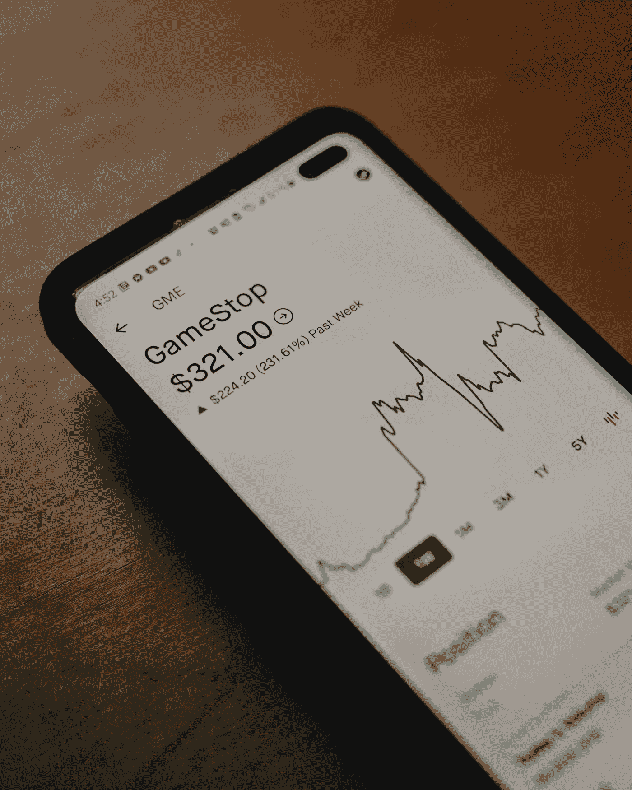

# 谁在游戏拉锯中真正输了？也许，我们所有人

> 原文：<https://medium.datadriveninvestor.com/who-really-loses-from-the-gamestop-whipsaw-maybe-all-of-us-9b96fc8aa299?source=collection_archive---------42----------------------->

Photo by [Clay Banks](https://unsplash.com/@claybanks?utm_source=unsplash&utm_medium=referral&utm_content=creditCopyText) on [Unsplash](https://unsplash.com/s/photos/gamestop?utm_source=unsplash&utm_medium=referral&utm_content=creditCopyText)

最近 GameStop[GME](https://www.forbes.com/companies/gamestop-corp)股票的投机热潮可能最终会在财务上伤害我们所有人。这完全取决于投资者对股市的看法。

正如许多人已经知道的那样，随着个人投资者(特别是那些使用 Robinhood 平台的人)涌入股票，这家视频游戏零售商的股票出现了惊人的反弹。这产生了连锁反应，至少有一家对冲基金因抛售借来的股票而大举押注股价下跌，从而遭受重大损失[。](https://www.independent.co.uk/news/business/gamestop-share-price-reddit-hedge-fund-melvin-capital-b1793543.html)

那又怎样？

对冲基金亏损的事实无关紧要。在华尔街，赌注有时会变坏。这种情况一直都在发生，大多数公司都是隔天再战。

# 看法很重要

在这种情况下，重要的是对股市总体情况的看法，尤其是对 GameStop 股票的看法。

在这种情况下，许多投资者认为 GameStop 是一家经营不善的企业。像许多其他公司一样，它的业务也受到了疫情和相关封锁的影响。这一因素可能是一些聪明的投资者押注该股继续下跌的原因。

尽管如此，该公司潜在的糟糕财务状况似乎并没有困扰一些投资者，他们共同设法推高了股价。反过来，这迫使卖空者回购他们借入的股票，从而进一步推高股价。在商业中，这被称为“空头挤压”

# 是操纵造成的吗？

有些人可能会说 GameStop 的股票被操纵了。我不知道发生的事情是否构成操纵。毫无疑问，在适当的时候，我们会从监管机构那里得到一些信息。至少，我希望如此。

我所知道的是，市场操纵的感觉可能就像真的发生了一样糟糕。

美国金融市场是世界上最深的，这在很大程度上是因为它们被认为是公平的，没有受到操纵，当然也没有受到任何系统性的操纵。

注意，这里的关键是*这个词。美国市场的诚信意识吸引了资本，这有助于我们发展经济和创造就业。*

# 在华尔街，谣言是“事实”

我的前同事、华尔街记者专栏作家杰森·茨威格(Jason Zweig)在他的书《魔鬼金融词典》(The[Devil ' s Financial Dictionary](https://www.amazon.com/Devils-Financial-Dictionary-Jason-Zweig/dp/1610396995/ref=sr_1_1?crid=UTHBNVJA9U9X&dchild=1&keywords=devils+financial+dictionary&qid=1611914018&sprefix=devils+financi%2Caps%2C226&sr=8-1)中说得很对，他将谣言一词定义为“事实的华尔街等价物”。

在这种情况下，市场可能被操纵的谣言、看法或信念可能与它们被操纵的效果相同。

这是因为如果投资者认为市场不干净，市场运作不公平，人们就不会把钱投资到美国上市公司。反过来，这将使经济放缓，最终我们都会受害。

正如我提到的，我不知道 GameStop 事件是否是操纵的一个例子，但我知道，如果美国市场被认为受到操纵，那将是非常糟糕的。

这就是为什么监管机构需要调查并告诉我们他们的发现。如果发生了不好的事情，他们需要处理。如果没有任何不幸发生，那也很好。

*这是 2021 年 1 月 28 日首次发表在《Forbes.com》上的一个故事的编辑版本*