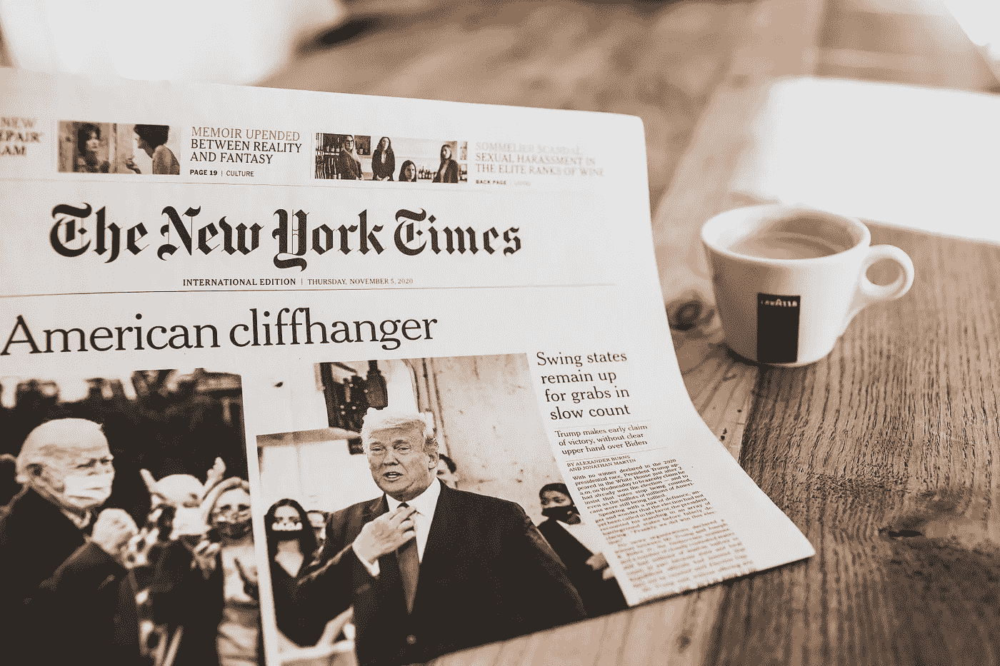

# 谁不应该为拜登的胜利邀功

> 原文：<https://medium.datadriveninvestor.com/who-shouldnt-take-credit-for-a-biden-victory-d919ea2cbbd4?source=collection_archive---------1----------------------->

## 那些知道特朗普是谁并投票给他的人

Photo by Markus Spiske on Unsplash

2016 年，唐纳德·特朗普在总统选举中获得了 62，984，828 张选票。希拉里·克林顿多了 300 万张选票，但这不是这篇报道的重点。随着计票工作的进行，特朗普在撰写本文时已获得 69，657，248 张选票。在看到特朗普四年来的表现后，比上次多了近 700 万人投票给他。

包括特朗普在内的许多人都吹捧这次选举是我们一生中最重要的一次选举；有人说在历史上，虽然我不同意。2016 年，虽然特朗普相当透明，但有些人可以说他们给他带来了好处。他将转向并变得更像总统。他会在工作中成长。

特朗普没有做这些事情。乔治·华盛顿曾经拒绝了成为美国国王的机会；特朗普试图成为国王。一路走来，他揭露了共和党的虚伪，赢得了他们的同意，支持他们从一开始就反对的政策。他增加了 36%的国债，在不到四年的时间里增加了 8.3 万亿美元的赤字。他摧毁了国务院，清空了它，只留下他的亲信和马屁精来管理事务。他把司法部变成了他的私人警察部队，比尔·巴尔(Bill Barr)是他的主要跟班，他与中国的贸易战损害了经济，除了与独裁者的关系之外，国际关系正在恶化，他未能对新冠肺炎做出充分回应，导致 23.5 万美国人死亡。

他治理国家的方式就好像只有他的基础很重要。他们中的大多数人都没有从他的政策中受益，除非他们很有钱，有关系。他拒绝从那些有利益冲突的业务中抽身；他关于盲目信托的想法是让埃里克和小唐纳德来运作。他的欺诈大学在支付了 2500 万美元的罚款后被关闭。根据穆勒的报告，他至少阻碍了司法十次，只是避免了对多项联邦指控的起诉，因为根据司法部的说法，现任总统不能被起诉。纽约州正在对特朗普组织提出州指控，“个人 1”是一个可能的目标。

更糟糕的是，他加剧了这个国家的种族冲突。他统治着，好像只有白人的生命才是重要的。特朗普把棕色人种的孩子关在笼子里，让一些孩子永远与家人分离。他表示黑人都来自“狗屎国家”，川普用种族诽谤来描述伊丽莎白·沃伦的遗产，嘲笑一名被杀士兵的穆斯林金星家庭，更不用说他的穆斯林禁令了。他在政府中安插了白人民族主义者，让他们负责他的移民政策。他暗示出生在奥克兰的卡玛拉·哈里斯可能没有资格竞选副总统。特朗普任命了数百名联邦法官和最高法院法官，其中没有一名黑人。

他的厌女症在他第一次当选之前就被好莱坞录像带曝光了。他为他的政府中每一个被指控性骚扰或性侵犯的成员辩护，甚至在有照片的时候。他买通了一个色情明星和一个花花公子模特来掩盖他的性关系，没有在披露表格或税收中正确披露资金。他可能是历史上担任过任何政治职务的最多产的说谎者？我们知道唐纳德·特朗普是谁；每个人都知道特朗普是谁，但这次有 670 多万人投票给他。可悲的是，对他们中的许多人来说，原因很清楚。白度！

事实上，特朗普的支持在一些白人亚型中略有下降。受过大学教育的人和郊区的白人女性一样下降了一点。这些数字被农村白人和那些被南方贫困和法律中心[认定为仇恨团体的人抵消了。](https://www.splcenter.org/hate-map)传统上，这些选民以前不会大幅度投票，因为他们最近没有像特朗普这样的支持者。他拒绝在夏洛茨维尔事件后谴责他们。川普告诉骄傲的男孩们“退后，袖手旁观”他从来没有遇到过他不喜欢的种族主义支持者，他们都出来支持他。

致在特朗普当选总统的第一天举行[妇女游行](https://www.history.com/this-day-in-history/womens-march)的白人妇女。你不能因为驱逐特朗普而邀功，因为总体而言，白人女性投票支持特朗普的人数更多。[四年来，受过大学教育的白人女性增加了对川普的支持](https://www.cnn.com/interactive/2020/11/politics/election-analysis-exit-polls-2016-2020/)你能想象吗？问问选举权运动的黑人女性，白人女性在历史上并不是最好的盟友。

人们可能会声称他们支持特朗普选择几乎全是白人的法官。有些人喜欢他的移民政策(种族主义)，他的贸易政策(种族主义)，他对法律和秩序的坚定立场(种族主义)，或者他对 COVID-10 的处理(既有种族主义，也有令人费解的)。要成为特朗普的选民，你不必是种族主义者；你必须忽略种族主义来实现不同的目标，我们看到了你。

如果拜登获胜，将会有大量媒体认为美国否定了特朗普及其政策。事实上，比以往任何时候都有更多的美国人，主要是白人，投票给他。任何拒绝特朗普的说法都是空洞的；好消息是我们现在知道你们很多人是谁了。你可能还会继续戴着你的 MAGA 帽子，举着你的 Trump yard 牌子，挥舞着你的 Trump flags。你对特朗普的支持既说明了他，也说明了你和这个国家。我们一直知道他是谁；我们现在也知道你了。

 [## 选举日和就职日之间的 78 天

### 唐纳德·特朗普会怎么做？

williamspivey.medium.com](https://williamspivey.medium.com/the-78-days-between-election-day-and-inauguration-day-1580afadfe2)