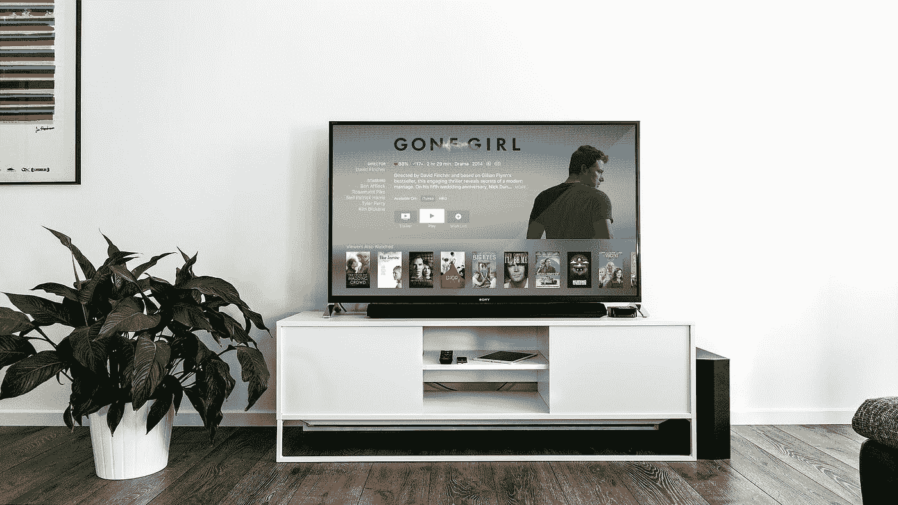

# 谁还在看有线电视？

> 原文：<https://medium.datadriveninvestor.com/who-still-watches-cable-tv-anyway-26826d03bf2a?source=collection_archive---------11----------------------->

## 探索数据。

Photo by [Jens Kreuter](https://unsplash.com/@jenskreuter?utm_source=medium&utm_medium=referral) on [Unsplash](https://unsplash.com?utm_source=medium&utm_medium=referral)

etflix，Hulu，Amazon Prime Video，甚至 YouTube——有了有线电视的所有替代品，你可能想知道谁还是有线电视的订户。

令人惊讶的是，只有大约 60%的美国人(T3)放弃了有线电视。今年在有线电视广告上花费了超过 160 亿美元(例如，几乎是美国在脸书的政治广告花费的 10 倍)，有线电视仍然对美国人的心理有着巨大的影响，包括投票行为。

在这里，我使用预测洞察工具 [Apteo](http://apteo.co) 分析了有线电视订户的一个小[数据集](https://www.kaggle.com/amansaxena/cabletv-subscriber-data)，以了解谁是有线电视订户。

 [## 一瞬间学会数据科学！？数据驱动的投资者

### 在我之前的职业生涯中，我是一名训练有素的古典钢琴家。还记得那些声称你可以…

www.datadriveninvestor.com](https://www.datadriveninvestor.com/2020/07/23/learn-data-science-in-a-flash/) 

## 数据

该数据是一个非常小的 300 人的样本，包括他们的年龄、性别、收入、是否有孩子、是否有房子以及是否订阅了有线电视。

虽然我们知道有线电视在年轻人中的渗透率正在下降，但仍然高得惊人，BI Intelligence 显示，2014 年，18-24 岁的有线电视用户比 50-59 岁的用户比例更高。

我们的数据也证明了这一点，因为我们有更多的年轻用户。然而，我们不知道数据是何时收集的，而且它也受到只有 300 行的严重限制——与数百万有线电视订户形成对比。

在我们的数据集中，收入和订阅率之间的关系实际上与其他研究发现的相反:越富有的人越有可能订阅，这是有道理的。有线电视不便宜！

在我们的数据集中，不太富裕的人订阅了更多的。然后，我们必须记住，我们的数据集是非常小和有限的。

## 数据质量

这是需要验证数据质量的一个很好的例子。在我们的数据集中，我们可以清楚地看到低收入、年轻的人订阅了更多的有线电视——但这并不是更广泛的统计数据所显示的，这意味着我们的数据集并不能代表整个人口。

不幸的是，除了这些公开的数据，没有任何可靠的替代品。在这种情况下，最好遵从研究，或者，如果可以的话，创建一个更有代表性的数据集。

## 这项研究

由于我们的数据集显然不具有代表性，让我们来看看这项研究告诉我们什么:

*   [年纪大的人订阅多](https://www.statista.com/statistics/322958/pay-tv-penetration-rate-usa/)。
*   [越有钱的人订阅越多](https://www.statista.com/statistics/659790/cable-tv-penetration-by-income/)。
*   2008 年，大多数有线电视观众是民主党人。
*   黑人和西班牙裔比白人略多。
*   男人在有线电视上有更多的屏幕时间。

随着有线电视的普及，我们可以很容易地找到每个属性的统计数据，但我们仍然受到没有自己的数据集进行分析的限制，因为我们看不到属性之间的真实交互。

## 访问专家视图— [订阅 DDI 英特尔](https://datadriveninvestor.com/ddi-intel)