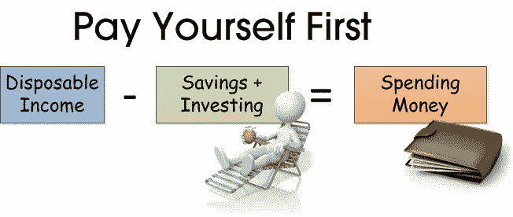
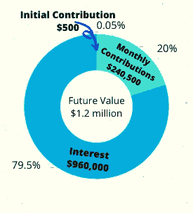
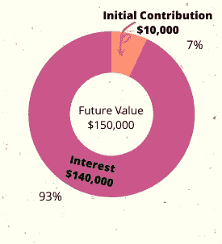

# 谁想成为百万富翁？第一部分

> 原文：<https://medium.datadriveninvestor.com/who-wants-to-be-a-millionaire-part-1-db332d95876b?source=collection_archive---------5----------------------->

I do!!!!

永恒的梦想，对幸福的追求(*穿越堆积如山的现金*)。毕竟金钱买不到幸福，但它能让你非常接近幸福。

这不是一封给资本主义和消费主义的情书(*对不起安·兰德*)。
这是我目前所学的速成班，旨在确保未来的 Avik 有饭吃，也被称为**基本个人理财**。

我的朋友和 30 天写作挑战的同胞 Pranjal Kalra 已经在这里制定了一些奇妙的基本原则，我打算在它们的基础上再增加一些我在这里和那里学到的东西。

> 在我开始用积分轰炸你之前，什么是个人理财？我最喜欢的定义是“管理你的储蓄、投资、收入和支出的艺术”

# 好吧，我的头在旋转，我们从哪里开始？

Numbers, words, confusion!!!!!!!

在这篇文章的后面，我会更深入地研究数字(*和即将到来的*)。第一点是让我们熟悉个人理财的基本概念。

# #1 保存

《金钱心理学》的作者摩根·豪斯尔(*读一下！*)通过指出“ [**财富是你不花的**](https://www.collaborativefund.com/blog/gains/) ”完美地总结了这一点。

也就是说，存钱是很难的，尤其是当你在财务上挣扎的时候。

那么我们如何解决这个问题呢？我先从一个事实开始，这个事实将在本文中反复出现，**人类的意志力是有限的**。这是一种说我们意志力有限的复杂方式。

既然我们明确了这一点，那么这对我们有什么帮助呢？一方面，我们可以尝试运用僧侣级别的延迟满足的能力(*尝试和失败在很大程度上*)或者我们可以**把意志力从等式中去掉！**

Tadaaaa, the magic solution!

通过自动化储蓄，确保发薪日到来的那一刻，你的银行账户余额最终大于零，你就消除了花钱的冲动。

黄金数字**有待商榷( *20%，30%，50%，谁知道*)，但经验法则是**至少你收入的 20%才是安全的。把它完全转移到一个独立的账户，最好是在另一家银行，这样你就不会被诱惑去花掉它。(*我们稍后会讨论投资它*)。****

> **这是省钱的最有效的方法之一。**

**这里的另一个重要提示是避免**享乐跑步机**。**

****

**Best Explanation**

 ****快乐跑步机本质上是:赚得更多，花得更多。让我用一些数字来说明****

****

**NUMBERS!!!!**

**如你所见，朱利叶斯和布鲁图( *et tu Brute？*)一开始是同事，收入相同。读了同样的书后，他们都小心翼翼地把工资的 20%存了起来。**

**2021 年来临时，Covid 离开了这个星球(*一厢情愿*)，他们慷慨的老板给他们加薪。朱利叶斯是一个明星演员，所以他得到了 100%的加薪，布鲁图斯花了太长时间磨他的匕首，所以他得到了 60%的加薪(*如果这是真实的生活！*)。**

**朱利叶斯租了更大的房子，买了宝马(*因为当然！布鲁图斯得到一套新的高尔夫球杆，然后就此收工。***

**朱利叶斯继续遵循他屡试不爽的 20%储蓄方法。
布鲁图斯决定把增加的薪水存起来，继续过没有宝马的生活。**尽管收入比朱利叶斯少 25%**,布鲁图斯却多存了 75%**!****

**这是因为他避免了跳到享乐的跑步机上。**

**简单地说，**享乐型跑步机**是那种你**如果你想积累财富就必须**避免的跑步机(相对于健身房里的那种，那种跑步机棒极了)。**

# **#2 投资**

**现在我们进入到对我们所有人来说最困惑的部分，什么是投资？对于普通人来说(在 Covid 的漫长旅程之前，我也是)，我们会将一些钱存入定期存款(FDs)，购买一些 ETFs 共同基金，并对自己感到非常满意。**

**这不是一个可怕的方法(*很少有正确或错误的答案*)，但是这是一种投资的常规方法。在没有真正考虑整体战略的情况下，选择安全且相当普遍的智慧。**

**在深入研究投资之前，让我先引用一句话
**复利是世界第八大奇迹** ( *有人将其归因于爱因斯坦，但未经证实*)。**

**为了更好地理解这一点，我们再次求助于我们的好朋友朱利叶斯&布鲁特斯。**

**布鲁图斯是一个谨慎的储蓄者，他决定每月投资 500 美元到一个与股票市场挂钩的指数基金，年回报率为 7%。他从 22 岁开始投资，一直投资到 62 岁，总共投资了 240，500 美元。退休时，他突然发现他的投资价值 1205297 美元！！这是他总投资的 398%的回报率。**

****

**Now Brutus can buy a BMW!**

**朱利叶斯考虑投资，在 22 岁的时候投了 10，000 美元到和布鲁图斯一样的基金中(*我不知道他从哪里得到的，问他*)。在那之后，他打算开始投资，但是买了一块劳力士( *SHINYYY* )。接着是一辆玛莎拉蒂，然后是一艘船(*朱利叶斯是个球员*)。当他退休时，他意识到他没有积蓄！然后他想起了那 10，000 美元，并检查了资金。**

**他们寄给他一张 149，744 美元的支票。那是一个 **1400%** ( *四舍五入*)的回报！如果他在 22 岁时投资了 20，000 美元，他将获得 299，489 美元！**

****

**Now Julius can afford McDonalds**

**这个相当长的例子的要点是**尽早开始投资！无论金额有多小，你开始得越快，就会在隧道的另一端为你创造出堆积如山的现金。****

**现在，我们已经完成了最重要的部分，我们最终如何获得 7%的回报呢？(*撇开定期存款？*)**

****#1 指数基金:**这些是**共同基金或 ETF**(*暂且认为两者相同*)持续投资于某些股票市场指数。指数不过是基于各种因素(通常是资本总额和行业)的公司集合。最广为人知的是标准普尔 500 指数(S & P 500 ),它衡量美国不同行业的 500 家最大的公司，或者是印度的 Nifty 50。

这些是最容易和最可靠的投资，因为历史上最大的公司已经变得更大了(*和指数变化，根据业绩增加和删除公司*)。从 1920 年至今，S & P 500 每年的回报率为 **~10%** 。过去 20 年，Nifty 50 的回报率为 11.1%。**

**进入标准普尔 500 最简单的方法就是买[先锋 S&p500](https://investor.vanguard.com/etf/profile/VOO)进入俏皮 50 最简单的方法就是通过 [HDFC 俏皮 50](https://www.valueresearchonline.com/funds/1368/hdfc-index-fund-nifty-50-plan/) 。**

****#2 集中资金**:现在我们进入稍微高级一点的领域(*不要惊慌！*)。这些基金通常由不同的基金经理管理，比如黑石、先锋、HDFC、安讯士、富达等知名基金经理，或者像 T4·凯西·伍德的方舟投资公司(Ark Invest)这样的新基金经理**

****首先从**开始，我们来讲讲基础知识(*熟悉的名字*)。专注基金有三个你需要关注的关键点。**行业/主题、费用率和历史回报率**。**

****部门/主题**:这定义了基金的方法(*示例*[*DSP health care Fund*](https://www.moneycontrol.com/mutual-funds/nav/dsp-healthcare-fund-regular-plan-growth/MDS1485)*专门投资于印度&【美国* )
所有公共基金都必须公开其主题、分布(*大盘股、中盘股、小盘股*)、投资的公司和持股比例。实际上，这让你可以投资你喜欢的、希望更多参与的行业或主题。**

****费用率:**基本上这是基金经理管理和运营基金的费用(*不，他们这样做不是出于好心*)。这是一个需要关注的重要数字，因为它告诉你你的实际回报是多少(*基金 A 回报 5%但收费 1.5%，基金 B 回报 4%但收费 0.2%，因此基金 B 更有吸引力*)**

****历史回报**:首先，过去的表现并不等于未来的成功，但它会给你一个非常好的主意，如果基金能让你赚钱:P .具有强劲历史表现的基金往往更安全(*不要引用我的话*),因为经理们有着可靠的回报记录。**

**专注型基金的吸引力在于，你可以投资于你感兴趣的行业，而不必自己管理股票投资组合(*相当痛苦*)，通常比指数型基金( ***)产生更高的回报，当然风险也更大！*** )**

**我非常看好的几个是[方舟创新](https://ark-funds.com/arkk)、 [DSP 医疗基金](https://www.moneycontrol.com/mutual-funds/nav/dsp-healthcare-fund-regular-plan-growth/MDS1485)和 [FDN 互联网基金](https://finance.yahoo.com/quote/fdn?guccounter=1&guce_referrer=aHR0cHM6Ly93d3cuZ29vZ2xlLmNvbS8&guce_referrer_sig=AQAAAGpgQuEcFkEjhHfNXH6Kpqi3T_8-COX7izdk0a-THFLJnMlHaDZWThUKI9sHcLKezSh0VB7uqxznUCMeaJGH1peawxKa_6eGaDyPMF9EOIxDj0UQgzXry0rIWN46XZP9rBCdy81gqadPNEjIda2GFEo0zf2AkZWSsGAl1wZ8bXQt)。一定要记住，指数基金**风险更大，**毕竟，
**没有风险，就没有回报！****

****#3** **债券:**债券实际上是公众借给公司的贷款，由公司直接支付利息(*过于简化*)。
债券是由大公司(*有很多规则可以这么做*)直接向公众(*即你和我*)发行的，承诺支付年利率。**

****为什么要买债券？把债券想象成公司的定期存款。虽然它们永远不会产生你从股票中获得的那种增值，但它们也会保护你免受股市涨跌的影响，并每年给你固定的收入。****

**随着年龄的增长，每年的固定收入非常重要，因为它给了我们有保证的现金流。！)**

**4 只股票:我最终不得不这么做。这是大多数人在谈到股票市场时想到的投资方式，坦率地说，我一直在谈论它们，但让我们长话短说。**

****股票是公司的一小块**。当你购买一只股票时，你实际上购买的是一家公司一小部分的所有权。这个**并不意味着**你买一股就拥有可口可乐，但是它确实给了你一定的权利。我们现在关心的是**你有权以分红的形式分享一部分收益。****

**股息是公司利润的一部分，他们决定返还给投资者(*比如你*)。**

****

**Make Money? Get Banana?**

**那么，我们怎么才能得到香蕉呢？哎呀，我的意思是，我们就是这样从股票中赚钱的吗？通过分红？**

**答案是既肯定又否定，但现在让我们坚持否定**

**一个人通过购买我们认为将持续增长的公司来从股票中赚钱(*或者只是购买特斯拉并祈祷*)。有许多指标可以帮助你解决这个问题，但开始的方法是基本面分析(*我不可能涵盖这么大的一个话题，* [*在这里阅读更多*](https://www.investopedia.com/fundamental-analysis-4689757) )。**

**一旦你发现一家公司的规模和利润会持续增长(T8，因此价值 T9)，那就去买一些吧。这里一个安全的选择是定期购买蓝筹股，基本上是大家熟悉的大公司(比如谷歌、微软、甲骨文、联合利华、3M、信实等)。**

**有一个合理的假设，蓝筹股将继续以稳定的速度增值，因此你的股票将更有价值。**

**值得一提的是，在你**账面盈利** ( *卖出股票*)之前，股票是账面盈利的，尽管它们的流动性极强，这意味着你几乎可以立即卖掉它们，然后把钱存入银行。**

****#5 房地产**:赚钱(*或赔钱(*)的可靠方法是购买房地产。对大多数人来说，这意味着买一栋房子，然后出租或住在里面(对豪赌客来说，这可能意味着买下整个商业或住宅建筑，然后出租)。**

**这是几代人积累财富的最稳定的方式之一，因为房屋往往会升值。**值得一提的是，随着远程办公的出现，世界正在发生变化，**未来几年，房地产业将会呈现出截然不同的面貌。**

> **如果你没有埋在后院的一桶金来买房，也可以选择投资房地产投资信托( *REIT* )。房地产投资信托基金本质上是一个基金经理，购买房地产而不是股票，并给你每年的回报(*部分租金*)。**
> 
> **把房地产投资信托基金想象成债券和股票的宠儿。**

**所有其他的事情:我把这一条留得相当开放，因为每个人都有自己独特的投资。朱利叶斯喜欢收集劳力士(*不是伟大的投资*)，我买比特币( *WOOHOO* )，投资创业公司( [*在这里了解更多天使投资*](https://avik-ashar.medium.com/so-you-think-you-can-angel-invest-9f024f0743a5) )。**

**无论你是喜欢购买一罐真正的黄金(*到目前为止相当安全的价值储存手段*)还是投资于企业，都有一整套的投资选择来帮助提高你的回报。**

**今天的帖子到此结束，到目前为止我们已经介绍了**储蓄&投资**！
我明天会回来讨论**收益&支出**。我希望你喜欢这个，让我们开始通往百万富翁之路吧！！！**

**附加阅读**

1.  **[https://psychology . Columbia . edu/sites/default/files/2016-11/3 . pdf](https://psychology.columbia.edu/sites/default/files/2016-11/3.pdf):一篇关于延迟满足及其背后的心理框架的优秀研究文章**
2.  **[快乐跑步机上的摩根·豪斯尔](https://www.collaborativefund.com/blog/saving-money-and-running-backwards/)**
3.  **[先给自己发工资](https://investmentmoats.com/budgeting/get-rich-how-to-pay-yourself-first/)**