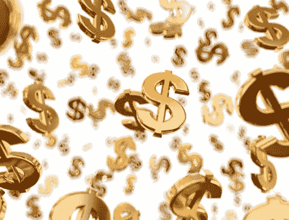
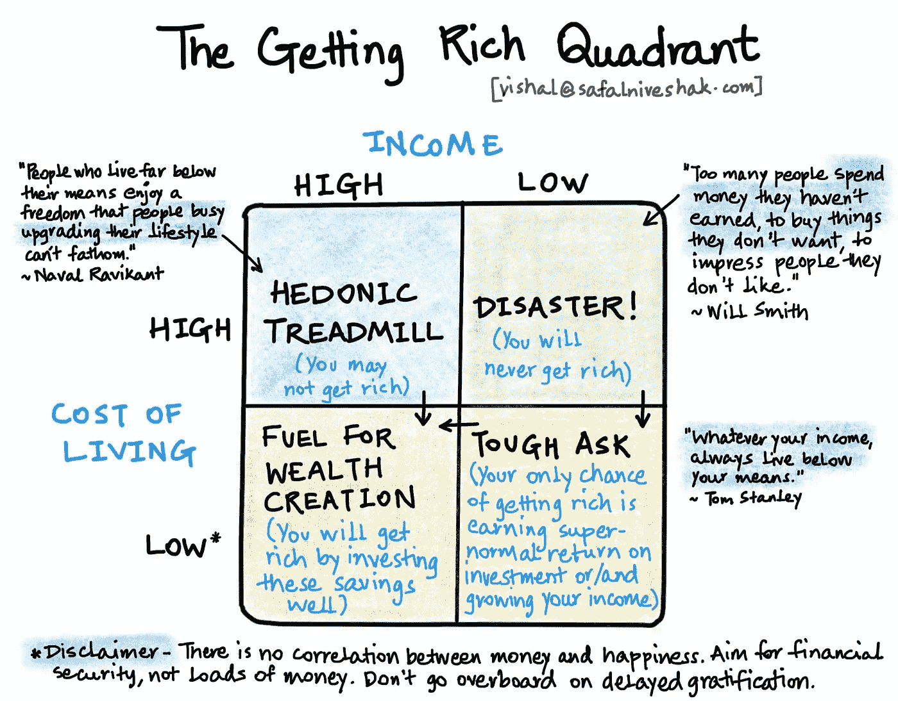
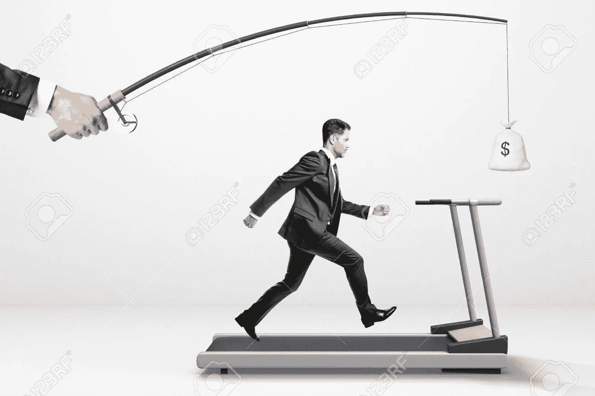
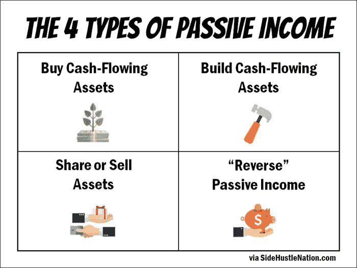
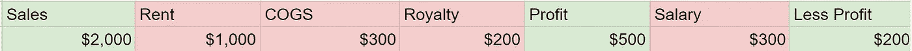
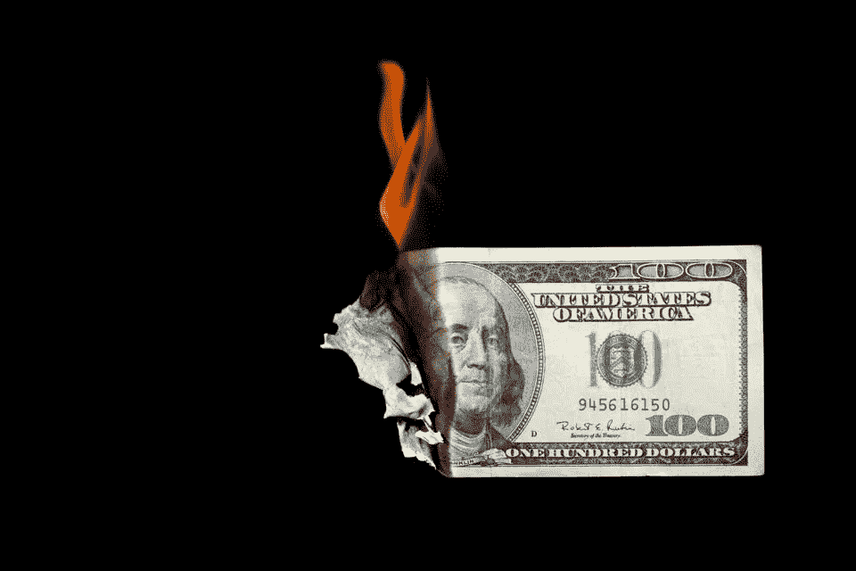
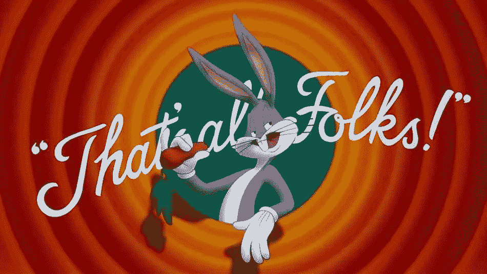

# 谁想成为百万富翁？第二部分

> 原文：<https://medium.datadriveninvestor.com/who-wants-to-be-a-millionaire-part-2-7c9d09d13f78?source=collection_archive---------15----------------------->

Boooyakasha

大家好！从我昨天停下的地方继续。**如果你还没有机会阅读第一部分，** [**这里有链接**](https://medium.com/datadriveninvestor/who-wants-to-be-a-millionaire-part-1-db332d95876b) **。**

在我的上一篇文章中，我谈到了个人理财的基础知识，谈到了**#储蓄&#投资**，触及了像**复利** ( *这是让你变得富有的原因*)和**享乐跑步机** ( *这是阻止你变得富有的原因*)这样的话题。

今天我们要解决这个难题的下两个部分，收入。

Pretty much sums it up eh?

先说**#收益。**

收入是产生现金的一个重要部分，这些现金将用于你的储蓄和最终投资(*和食物一样，Avik 喜欢食物*)，收入在开始时往往是相当一维的，从你的工资开始。

我仍然记得我的第一张工资支票，以及我是如何迅速地放大它的

那时，我生活中唯一的控制力量是我的父亲和我的姑奶奶，他们让我坐下来，告诉我储蓄的重要性。我专注地听着，然后开始销毁我的下一张工资支票。

毕竟，我每个月都会收到一封，对吗？这种对薪水的依赖是一个陷阱。

Run for it, there’s a good boy

随着年龄的增长(*可悲的是没有变得更聪明，只是变得更宽*)我觉得自己在消磨时光，挣着越来越高的薪水，却没有意识到自己完全完全依赖于它。

一天，我爸爸把我拉到一边，给我看了我的股票投资组合(*他强迫我建立的*)和我收到的股息。**我的脑子被炸了**。我刚刚收到钱！除了我的薪水之外的来源(*和我家人无尽的慷慨*)。

那天引发了一场瘾(*善良的*)。我想创造更多可以赚钱的渠道。**注意我说的生成。** 这个不是我‘赚’的。我没有出卖我的时间来换取现金。我的钱让我赚了更多的钱！真是奇迹！

我当时就决定，我不会把薪水作为我唯一的收入来源。肯定还有更多。

## 这就把我们带到了…

> **什么是被动收入？**

我觉得上面的图片大致涵盖了被动收入，所以让我们深入了解一下！

购买现金流资产:真的不需要解释吗？
买一些能产生收入的东西，可以是房子，一栋建筑，一张卡门·伊莱克特拉的海报(*这是一台提款机*)或者热狗摊，让它填满你的银行账户，让你喝一杯冰镇果汁朗姆酒放松一下。

Sadly not me

这确实需要你有一点现金来开始，所以这是一个比较难实现的目标，尽管有一些变通办法。

# **部分所有权** : [Strata](https://strataprop.com/) ，一家印度初创公司，允许你以低至 35，000 美元的价格购买商业房地产的一部分(*CRE*)(*一栋完整建筑的成本可能高达 5，000，000 美元*)，赚取 7-9%的租金收益率，并参与房地产价值的升值(*它们在预定的时间期限*后出售)。

**#加盟店**:爱巴斯金罗宾斯冰淇淋？购买特许经营权！
严肃地说，随着中产阶级和消费主义的兴起，特许经营在今天是一个有趣的机会。这往往更贵，而且取决于特许经营，可能会消耗你更多的时间。

我觉得特许经营是一个未被充分重视的资产类别，因为你可以根据你想要参与的程度来调整运营。

让我们假设一家冰淇淋连锁店。

Oversimplified

恭喜你，你现在拥有一家冰淇淋店了！如果你选择整天坐在这里供应冰淇淋，你可以，但这不是被动的，所以你雇佣了一个热切的冰淇淋专家。

你的取款机刚刚产生了**200 美元！**为了简化模型，我完全忽略了所有的建立成本，尽管有一些简单的计算将它考虑在内，[在这里阅读更多关于回收期的信息](https://www.investopedia.com/terms/p/paybackperiod.asp)。

分享或出售资产:让我们假设你在这里拥有一项资产(*一辆汽车，你自己的家，你为一个疯狂的聚会买的一台可爱的烟雾机..在互联网这个奇迹的某个地方，有人会付钱给你使用它！可以理解的是，让别人使用你的私人物品需要一定程度的舒适，但是，想想更大的图景，
也就是财富！*

# **租吧！** : [新加坡的一家初创公司 DriveLah](https://www.drivelah.sg/?gclid=Cj0KCQiAvbiBBhD-ARIsAGM48byuA85IdpEuSEt7po34jryYMUW9kUUwQ8QyIP8pOrmJDyNzlftyfL8aAmI6EALw_wcB&gclid=Cj0KCQiAvbiBBhD-ARIsAGM48byuA85IdpEuSEt7po34jryYMUW9kUUwQ8QyIP8pOrmJDyNzlftyfL8aAmI6EALw_wcB) ，可以让你把自己的车出租给邻居。它为用户造成的所有损害提供了全额保险(*以防你只是运气不好*)，并允许你每月产生高达 600 美元的收入(*假设你拥有一辆丰田卡罗拉和 magic？*)。

我喜欢这个概念，因为汽车是典型的资产，坐在那里就会贬值，在今天的在家工作时代，不是你每天都需要的东西。

**#卖了它！**:利用互联网的早期商业模式之一，像[易贝](https://en.wikipedia.org/wiki/EBay)和[carousel](https://en.wikipedia.org/wiki/Carousell_(company))这样的公司让你通过出售旧货来赚钱。**毕竟一个人的垃圾是另一个人的宝！**

我并不真的相信这一点，直到我最近搬家，注意到一堆自从恐龙在地球上漫游以来就没有用过的东西。把它们掸掉灰尘，放在传送带上，人们一路来到我家买我的(*极度二手的*)垃圾！

**建立现金流资产:**也被称为旁门左道，这是一个由来已久的创造财富的传统。

这确实需要一开始做最多的工作(*和一些种子资金*)，但却是最有回报的方法之一。我不会去探究你可能开始的成千上万的兼职。

相反，我将分享我对副业和被动收入的想法。
被动收入，顾名思义就是**被动**。因此，你的目标应该是建立你的 side hustle，这样它就可以**运行、调节和扩展**而不需要你的日常干预。

这并不意味着你可以放松下来，忘掉它..给你的员工。你仍然需要定期关注客户，与你的团队和客户保持接触，并塑造业务愿景。

一些关键的提示( ***适用于我们的一生*** )是:

**建立**强流程。一旦你建立并记录了运营业务的流程(*处理客户、物流、退货*)，你的团队会发现操作起来更容易，而不必马上给你打电话。

**雇佣令人惊奇的人，然后信任他们。你能为副业做的最好的事情就是找到有才华的值得信赖的团队成员，并授权他们来经营你的企业。这意味着让他们做出判断(*偶尔可能是错误的*)，并在事情变糟时支持他们。**

激励你的员工。你想要一只受过训练的猴子还是团队成员？
设计一个薪酬结构，在业务表现良好时给予团队奖励。毕竟，如果他们投资于你事业的成功，那么**每个人都是赢家**。

**“反向”被动收益**:我爱这个名词。我不知道它是什么意思，直到我为这篇文章谷歌它。意思是**减少你的支出！**

这就把我们带到了本文的最后一部分**#支出**。

《金钱心理学》的作者摩根·豪斯尔(Morgan Housel)有一个简单的想法。

> 拥有更多钱的最简单方法就是少花钱！

Bye Bye Benjy!

支出是一个复杂的话题，没有一个放之四海而皆准的标准。
你可能有生病住院的父母，三个上学的孩子，或者只是非常非常喜欢昂贵的寿司。

谢天谢地，这里有一些指导方针。

预算:这不是老年人无休止地争论然后诅咒政府的事情。这是引导你消费的最有力的工具。

归结起来就是计算你的税后收入。把你的基本开支(*房租、食品杂货、基本设施和费用*)加进去，然后把你的储蓄也算进去。

这还不包括你的新手袋、威士忌或 playstation 游戏。

一旦你为所有这些做好了计划，请在此之前增加存款，记住，你是在为未来的自己买单，把钱存起来，然后你可以把剩下的钱拿出来…

WOOOHOOOOO

**是的，你可以把它的每一分钱都吹光** ( *如果你真的想*)。我是完全认真的。一旦你做好了收入预算，把必要的开支和储蓄放好，你就可以毫无愧疚地消费了。

这就结束了！实际上没有更多的消费点了。

互联网上充斥着类似“*停止购买拿铁*”或“*不要吃鳄梨吐司*”的建议，但我发现这些建议**完全没有意义。**

你可能喜欢拿铁，我可能想买风笛和短裙，**没关系**。一旦你有了预算(*你* ***坚持*** )，把钱花在让你开心的事情上是完全没问题的。

