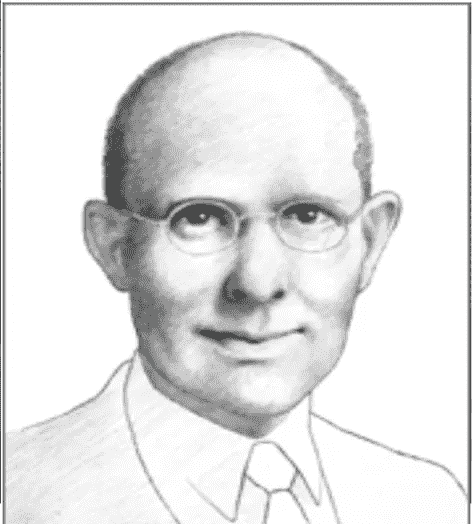

# 查尔斯·凯特林是谁？

> 原文：<https://medium.datadriveninvestor.com/who-was-charles-kettering-f852313f830f?source=collection_archive---------16----------------------->

美国企业家、发明家和慈善家

Picture via lemelson.mit.edu

是的。他就是凯特灵，他的名字出现在纽约市内外的斯隆-凯特灵癌症纪念中心。查尔斯·富兰克林·凯特林被认为是美国历史上最伟大的发明家之一，但他远不止于此。他是企业家、工程师、商人和慈善家。

## 早期成就

凯特林于 1876 年出生于俄亥俄州。高中毕业后，他在进入大学之前，在他家附近的一个单间校舍里教书。最终，他在 1904 年获得了电子工程学士学位。在大学期间，他在一家电话公司工作，增加了实践经验。

大学毕业后，他搬到了俄亥俄州的代顿市，在那里，他刚从学校毕业就被聘为国家收银机公司(NCR)研究实验室的负责人。

凯特林立即开始大量发明。他注意到售货员需要简化零售程序，并开发了一个简单的信用审批系统，这是今天的信用卡的前身。他还开发了一种电子收银机，使销售人员更容易记录销售情况。在他的许多发明中，电的使用变得很重要。

他只在 NCR 呆了五年，但在此期间，他获得了 23 项专利。后来，他又获得了 163 项专利。

## 汽车发明

1909 年，凯特林离开 NCR，并(与一位合伙人)创立了后来的德尔科电子公司。他们致力于为使用电气系统的汽车改进申请专利；他们就这么做了。

一项有趣的发明是电动启动器，它能让任何人轻松启动汽车。在那项发明之前，要发动一辆汽车，司机必须用手转动发动机，使它转向，并让它“挂住”。虽然对大多数女性来说这几乎是不可能的，但这对男性来说也是一个问题，通常以手腕、肩膀和手臂骨折而告终。此外，在寒冷、下雨或下雪的天气里，站在室外处理一台坏掉的(双关语)发动机并不是一次愉快的经历。

凯特林的电动系统首次安装在 1912 年的凯迪拉克上，但很快就推广到了其他车型。通用汽车公司对此印象深刻，于 1916 年收购了德尔科，并将其作为通用汽车研究公司的基础。

## 通用汽车公司的凯特林

1920 年，凯特林被任命为通用汽车研究部门的负责人，并成为公司的副总裁。从 1920 年到 1947 年退休，他一直担任通用汽车公司的研究总监。

他对汽车新技术的热爱导致了火花塞、含铅汽油、自动变速器和四轮刹车的发明和改进。在他的领导下，通用汽车公司还开发了柴油发动机、安全玻璃和制冷剂氟利昂。

与此同时，凯特林(本质上仍是一名教师)是创建一所工程学校以教授实用工程的驱动力。他坚持认为实用应该先于理论。

## 其他凯特林发明

凯特林在 1918 年开发了第一枚空中导弹。它叫做“臭虫”它导致了导弹的发展。

凯特林为农场发明了便携式照明系统、冷冻冷却剂，甚至太阳能设备。他的医学发明包括早产儿保育器、性病治疗和磁诊断设备。

其他专利包括便携式照明系统。他将发动机驱动的发电机与蓄电池结合起来，为那些远离电网的人提供电力。

凯特林致力于开发杜科涂料；他协助开发柴油发动机。

## 慈善家凯特林

凯特林的发明，尤其是电动汽车启动器，使他成为一个非常富有的人。他的钱使他能够支持许多慈善活动。1945 年，他和通用汽车公司总裁阿尔费雷德·斯隆一起建立了斯隆-凯特林癌症研究所。他们都主张将工业研究技术应用于癌症研究。

## 奖励

凯特林因其对技术研究的贡献获得了许多荣誉。他被授予数十个荣誉博士学位，并入选国家发明家名人堂。虽然他死于 1958 年，但他最骄傲的时刻可能是在 1998 年，当时通用汽车学院更名为凯特林大学。

## 最后一句话。

他的一些名言是:“如果你尝试了又尝试，失败了也没关系。如果你尝试失败了，再尝试也失败了，这很重要。”“失败是通往成功之路的路标。”“我对未来感兴趣，因为我将在那里度过余生。”