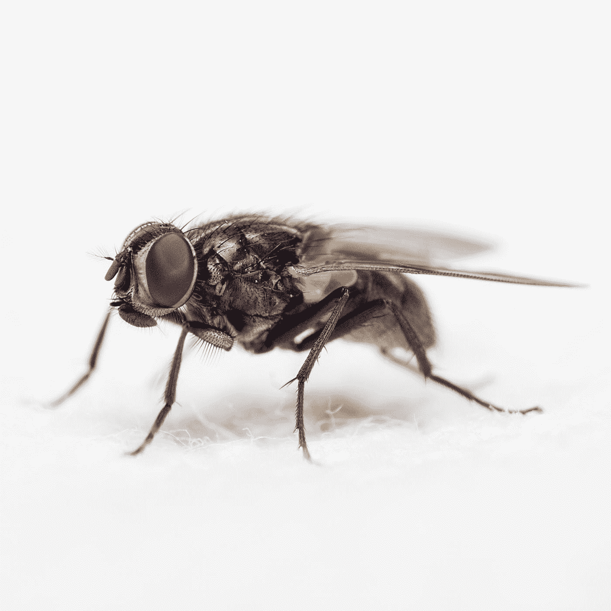

# 2020 副总统辩论谁赢了？

> 原文：<https://medium.datadriveninvestor.com/who-won-the-2020-vice-presidential-debate-9eb0bb476bd8?source=collection_archive---------15----------------------->

## 政治

## 这只苍蝇是特朗普总统任期腐败的完美象征

Photo by [Gabriel Manlake](https://unsplash.com/@osomax?utm_source=medium&utm_medium=referral) on [Unsplash](https://unsplash.com?utm_source=medium&utm_medium=referral)

看了 2020 副总统辩论，非常激动。如果特朗普或拜登都是老年人，由于无能或死亡而不得不下台，这是一个看到两位潜在的 2024 年总统候选人甚至潜在的 2020 年总统的机会。候选人没有让人失望。

## 彭斯和特朗普现实泡沫

我发现便士真的很可怕。他作为辩手、公共演讲者和主持人的经验让他能够让特朗普的谎言看起来真实。他流畅的台词创造了一个我们其他人生活的另一个现实。

分隔物只是增加了幻觉。听着 Pence 和 Harris 的演讲，每个人都坐在他们的树脂玻璃泡中，给人的印象是两个完全不同的平行宇宙同时存在于同一空间，就像一部糟糕的科幻电影中的场景。

辩论进行到一半时，我查看了一个支持川普的朋友在脸书的页面。果然，她和其他评论者都说彭斯“杀了它”。他们完全投入到他在辩论舞台上创造的另一个现实中。

当苍蝇落在彭斯的头上时，他似乎没有注意到它，我开始怀疑他是否是某种机器人或机器人，被编程为传递特朗普的平台，没有感情地撒谎，只有缺乏激情或信仰的平板声音。

还有谎言。特朗普竞选团队似乎已经完全接受了这样一个信念:如果你说同样的谎言足够多，它们就会成为真相。即使，在彭斯的例子中，它们以同样单调的声音一遍又一遍地重复。这几乎是催眠。

也许这就是目的。

 [## 区块链投票和美国选举|数据驱动的投资者

### 在不到 70 天的时间里，这个世界上最古老的民主国家将以前所未有的方式面临最大的摊牌…

www.datadriveninvestor.com](https://www.datadriveninvestor.com/2020/08/26/blockchain-voting-and-the-american-elections/) 

## 哈里斯已经排练完了

哈里斯的教练应该给自己一个大大的鼓励。她是一个聪明的学生，能准确无误地完成她的台词。问题是，与优雅的演讲者彭斯相比，哈里斯听起来排练过度了。就像一个孩子尽职尽责地背诵一课。

唯一一次，她似乎活了过来，听起来很自然，是在她警告彭斯打断她的时候。虽然他没有像特朗普上周辩论拜登时那样经常或大声打断，但彭斯明确表示，他除了蔑视规则、主持人，尤其是他的对手之外，别无其他。

哈里斯在辩论中很好地反击了他，并夺回了她的空间。她不应该这么做的。这是主持人的工作，面对彭斯对有毒男子气概的学生式模仿，他似乎无能为力。

哈里斯做了她来做的事情，指出了特朗普的失败，阐述了拜登的政纲，并在从未见过有色人种女性担任副总统或总统的美国人民眼中，确立了自己作为领导人和潜在总统的地位。

## 苍蝇的象征意义

当这只苍蝇落在彭斯的头上，两分钟不动时，我几乎失去了理智。虽然 Twitterverse 认为这是一个可以成为迷因的时刻，但我认为这是特朗普政府腐败的完美象征。苍蝇会被腐烂的尸体吸引，而 Pence 是特朗普式腐烂尸体的典型例子。我满心期待看到蛆开始从他的眼睛、鼻子和嘴里爬出来。

## 那么谁赢得了这场辩论？

老实说，没有人赢得辩论。我们在舞台上看到的是两个相互竞争的现实泡沫。由于特朗普，这个国家现在变得如此两极分化，特朗普的支持者认为彭斯赢得了辩论，拜登的支持者认为哈里斯赢得了辩论。除了惊天动地的启示或挫折，没有什么能改变这一点。

悬而未决的选民实际上是辩论的目标。辩论中没有决定性的关键时刻来说服他们进入哈里斯或彭斯现实泡沫。他们停留在自己的泡泡里，里面只有糟糕的选择。

我们其他人也有糟糕的选择。我们只是没有意识到这一点，因为我们已经与我们喜欢的候选人结盟，完全拒绝任何其他可能性。

没有选择也是不好的选择。

## 访问专家视图— [订阅 DDI 英特尔](https://datadriveninvestor.com/ddi-intel)