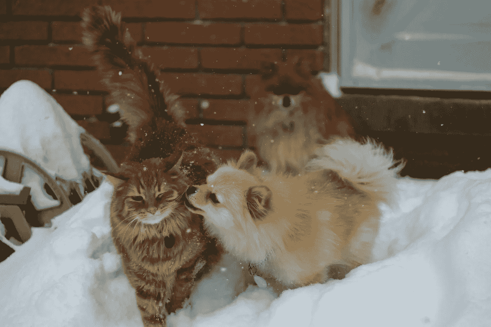

# 如果动物竞选总统，谁会赢得普选

> 原文：<https://medium.datadriveninvestor.com/who-would-win-the-popular-vote-if-animals-ran-for-president-f40542ce0a0a?source=collection_archive---------34----------------------->

通常，我会投票给我的猫，但它有橙色的毛。请不要再过 4 年！

我知道，我知道我们人类都把事情搞得一团糟。在我的记忆中，很少有哪一年如此混乱，除非是前三年。

为了好玩，我抛给你一个问题:如果我们可以投票选举一种动物来管理这个国家，哪一种会赢得大众的投票？就像人类一样，我们的总统可能不是最果断、最有勇气、最有激情、最谦逊或最有远见的。最终的赢家可能缺乏以下能力:细腻、沟通、学习、影响、尊重、移情或说出真相。不幸的是，候选人所要做的就是赢得选举人票。

 [## 美国人永远不该学的一课|数据驱动的投资者

### 美国人永远不应该吸取安妮·劳里在她的文章《美国人的教训》中所提倡的教训

www.datadriveninvestor.com](https://www.datadriveninvestor.com/2020/09/03/the-lesson-americans-should-never-learn/) 

以下是动物候选人的名单以及大众投票结果:

【2020 年世界地图集，请:

单位美国家庭拥有:

1.狗 48255413

2.猫 31896077 只

3.鱼 104.75 万

4.爬行动物 366，900

5.其他哺乳动物 197，800

6.兔子 153400 只

7.宠物家禽 139700 只

8.宠物牲畜 49，400 只

9 只雪貂 32，600 只

10 所有其他 32，200

而且，至少我们不要忘记我们的国家动物:美洲野牛

我敢肯定，美国之鹰会得到一些选票。

几乎和人类一样多的动物候选人*在 2020 年的民主党候选人名单上把旧帽子扔进了环*！

你认为这个国家能和动物候选人一起经历两党合作吗？这在人类身上似乎是不可能的。更好的种族，民族，经济，执法领导？更高级的身心保健？

面对现实吧:无论这个国家的形势在此时显得多么可怕，我们所拥有的只是我们人类。你的*美国*可能不是我的*美国。*

我们的动物依赖于我们。

**访问专家视图—** [**订阅 DDI 英特尔**](https://datadriveninvestor.com/ddi-intel)