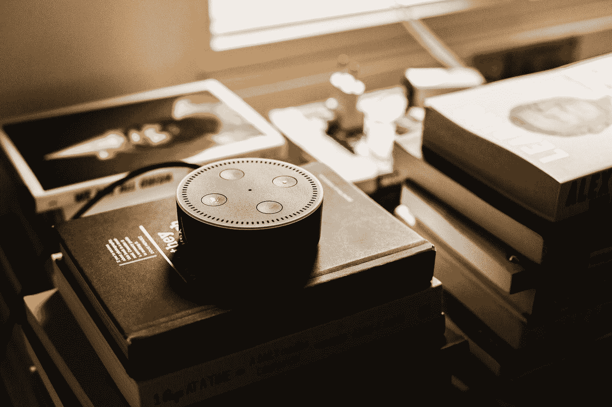

# Alexa 和 Google Home 助手的笑话背后是谁？

> 原文：<https://medium.datadriveninvestor.com/whos-behind-the-jokes-alexa-and-the-google-home-assistant-c87915182d15?source=collection_archive---------11----------------------->

## 它从哪里来？有没有和经典段子抗衡的算法？谁写的那些笑话？

Photo by [Andres Urena](https://unsplash.com/@andresurena?utm_source=medium&utm_medium=referral) on [Unsplash](https://unsplash.com?utm_source=medium&utm_medium=referral)

mazon 和 Google 通过他们的设备用与传统笑话相匹配的笑话来增加我们的生活情趣。

虽然我们之前在智能手机上有这个功能，但这是在 2018 年 6 月到 10 月**之间，虚拟助手设法潜入我们的家中。**

通过他们的智能音箱，谷歌和亚马逊能够**将祖父母的流行笑话**，姐夫的笑话和小家伙的歌合成一个。

 [## 挑战你对人工智能和社会看法的 4 本书|数据驱动的投资者

### 深度学习、像人类一样思考的机器人、人工智能、神经网络——这些技术引发了…

www.datadriveninvestor.com](https://www.datadriveninvestor.com/2019/02/28/4-books-on-ai/) 

而这一切的同时他们告诉你斯里兰卡是否在**下雨**，在哪个纽约电影院可以看最新的热门电影，在上一版的“***master cheft”***中谁被开除了。

> 什么都逃不过他们。

Photo by [Toni Reed](https://unsplash.com/@trfotos?utm_source=medium&utm_medium=referral) on [Unsplash](https://unsplash.com?utm_source=medium&utm_medium=referral)

当研究谷歌助手的团队意识到他们的人工智能的个性时，他们显然决定**包括一些类似于人类拥有的幽默感的东西**。

然而**，**当然，在一个喜剧已经被卷入**永无休止的争论**的时代，一家顶级全球公司最不想要的就是**持续不断的噪音**。

这个因素，加上需要找到行话来适应每个国家的民间传说，导致了我们今天的“ ***Ok 谷歌*** ”显示的漫画风格。

# 人类的手在后面

Photo by [Praveen Kumar](https://unsplash.com/@praveen443?utm_source=medium&utm_medium=referral) on [Unsplash](https://unsplash.com?utm_source=medium&utm_medium=referral)

写笑话的团队也是准备这种类型的回应的团队，总是考虑文化习俗和传统，以确保助理是“本地的”，有趣的，并能帮助你。

这些笑话是人类写的，但取决于你如何与设备互动，它会告诉你这个或那个。

> 在**随机性**本身内，根据用户之前交互的类型显示笑话。

# 奖金

这里有一个非常好的关于 Alexa 笑话的视频

我希望你喜欢这篇文章，欢迎任何反馈！😉