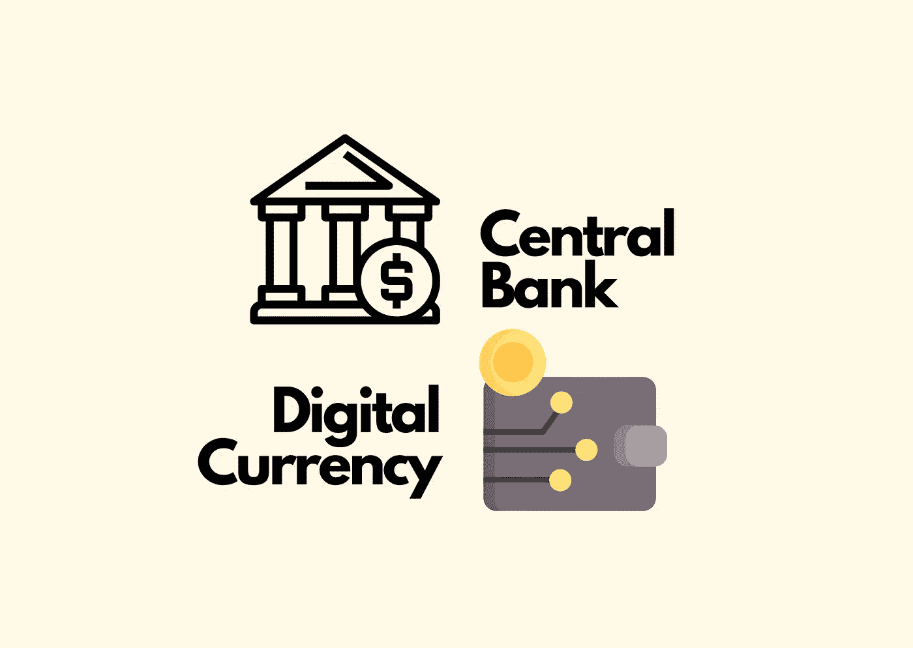
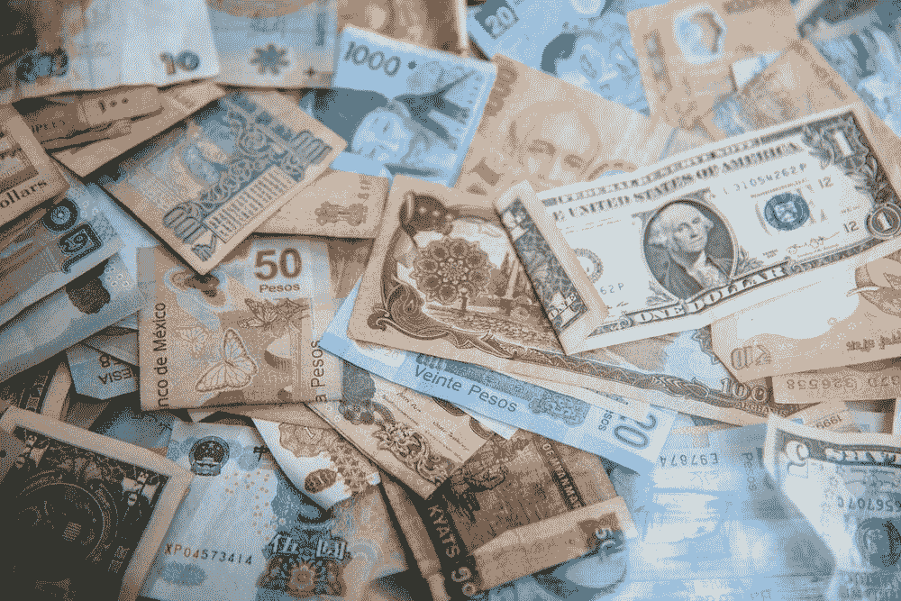
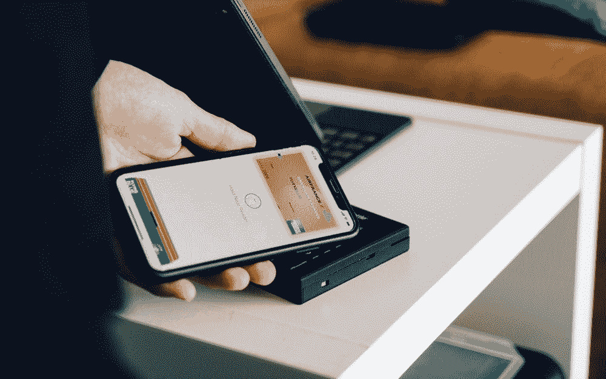

# 谁在引领下一次突破？央行数字货币的现状

> 原文：<https://medium.datadriveninvestor.com/whos-leading-the-next-breakthrough-the-current-landscape-of-central-bank-digital-currencies-6b08ec94d044?source=collection_archive---------14----------------------->

image made by Americana using Canva

# 1.央行数字货币(CBDC)简介

由于本文的重点是探索中央银行数字货币的现状，因此这将只是对什么是 CBDC 的简短而概括的解释。

简而言之，CBDC 是中央银行发行货币的数字变体，与中央银行发行货币的传统实物形式有所区别。它可以进一步细分为两个主要类别:**、【批发】CBDC** ，这是一种用于批发结算的**限制访问数字令牌**，以及**通用 CBDC，它将对普通公众开放。前者用于银行间支付、证券结算、联邦基金等，后者针对零售交易。**

Image Source: Unsplash

大多数国家都希望在发行 CBDC 的同时发行实物现金作为补充。然而，随着前所未有的技术发展速度和新冠肺炎对加速数字化趋势的影响，以数字形式取代实物形式的法定货币并非完全不可能。

# **2。央行数字货币与区块链**

CBDC 的一个关键特征是不同国家正在尝试探索使用**区块链(分布式账本技术，或 DLT)** 。区块链技术的主要特点是:**透明性、不变性和去中心化系统**。请注意，区块链技术在 CBDC 的使用将不会像比特币使用的系统那样是一个无许可的区块链，而是一个限于一组批准参与者的**许可或私人网络**，这确保了各国央行仍然对每个国家的货币系统拥有**控制权**并有**能力实施货币供应和利率等政策，从而确保基本的货币稳定。**

# **3。当前景观概述**

根据国际清算银行在 2019 年末进行的一项调查， **80%的银行已经参与研究，并开始将 CBDC 的潜力概念化**，其中 40%的银行在建立概念证明方面取得了进展，并正在进行实际试验。1 **0%的中央银行已经在运行试点项目**，将概念变为现实。此外，参与调查的 66 个国家中有 20%表示他们可能会在 2026 年之前**向公众发布他们的 CBDC。试点项目的例子包括加拿大银行的“Jasper 项目”、新加坡银行的“Ubin 项目”、马绍尔群岛共和国的“主权货币”等等。**

人们通常认为，是脸书推出天秤座货币的举措推动了这一趋势。Libra 不同于比特币等加密货币。比特币主要用于投机目的，而 Libra 将其与法定货币和国际货币挂钩，目标是零售国际交易。这在很大程度上引发了各国政府对控制本国货币流入和流出的担忧，从而推动并加速了对 CBDC 的研究。各国政府正寻求利用 CBDC 作为一种方式，通过实物和数字手段维持对本国货币的控制和货币稳定，在快速变化的数字世界中建立权威。

# **4。世界上第一个 CBDC——巴哈马中央银行——设计和动机**

不是中国，不是美国，也不是英国，你可能会惊讶地发现**第一个成功在全国范围内大规模采用 CBDC 的国家是巴哈马**。为了理解巴哈马 CBDC 快速采用率和发展背后的动机，我们需要承认巴哈马有一个独特的地理特征。它由散布在广阔海洋中的 700 个岛屿组成，这意味着实物货币的标准化将极具挑战性。此外，巴哈马中央银行声称，该项目旨在提高**金融包容性**，让更多人获得受监管的支付和各种金融服务，并降低**交易成本和效率。**

image source: Unsplash

巴哈马群岛的 CBDC 被命名为**【沙元】**。就其设计和结构而言，它由一组**授权金融机构(AFI)、**包括商业银行、支付服务提供商组成。这些 AFI 向**零售客户**提供服务，执行了解客户、反洗钱检查、钱包服务和保管服务。通过一个数字钱包应用程序进行支付，该应用程序**分为三层**:每一层对 KYC 都有不同的要求，并对钱包中可以存放的沙币数量有相应的限制。CBDC 区别于大多数现有数字钱包的一个关键特征是，它们**可以在断开互联网**时使用，进一步提高了便利性并降低了交易成本。

# **5。新加坡——雄心勃勃的实验者——“乌宾计划”**

Ubin 项目由五个阶段组成，是一个精心设计的综合性项目。2016 年，该项目进入第一阶段，该项目**专注于使用区块链的银行间交易**，在瑞士瑞信银行、汇丰、摩根大通等 10 家领先银行之间形成了一个**财团。最后一个阶段——第五阶段已经结束，报告于 2020 年 7 月 13 日发布。这一阶段的重点是**评估用例，并证明 CBDC 可以为各种行业带来的价值，如贸易和供应方金融、保险。**这种有组织的循序渐进的实践实验方法让新加坡中央银行对 CBDC 的可行性和经济价值有了深刻的理解。**

然而，项目**并没有回答我们什么时候才能真正看到新加坡向公众发行全国性的 CBDC。该项目采用了一种基于探索和研究的方法，而不是会导致实际采用的试点方法。**

然而，项目中使用的**支付网络原型和各种技术基础设施**为新加坡在这场 CBDC 竞赛中确立了强大的领导地位，为其配备了**成熟且久经考验的技术**。下一步将是一个更加具体的公共政策框架，供公众采纳。

 [## 面向开发者的区块链；API 提供商的重要性|数据驱动的投资者

### 在过去的几年里，区块链突然成为这个领域最热门的新技术。每一个…

www.datadriveninvestor.com](https://www.datadriveninvestor.com/2020/11/25/blockchain-for-developers-the-importance-of-api-providers/) 

# **6。美国的方法——更慢但更谨慎**

当其他国家正在积极推出试点项目时，在技术进步方面一直领先的美国似乎在发行 CBDC 方面有点落后。其中一个原因是，对于国内消费者来说，美国现有的**数字支付系统已经非常方便**，大多数消费者不愿意改变他们的支付方式并适应新的数字支付系统。由 Genesis Mining 进行的一项由 400 名参与者组成的调查显示，**不到 25%的参与者同意一美元 CBDC 的提议。**大多数受访者将 CBDC 的概念与加密货币引发的**犯罪活动**联系在一起，这可能是美国公众反对 CBDC 的主要原因。

美国美联储对美国 CBDC 的发行格外谨慎。与大多数关注 CBDC 好处的国家相比，美国已经确定了许多潜在的挑战和问题，这些挑战和问题将随着 CBDC 的发行而出现，主要涉及安全挑战，如**网络攻击、欺诈和 CBDC 反洗钱法的实施。**

image source: Unsplash

财政部副部长贾斯汀·穆齐尼奇也表示，“在防止非法活动和尊重消费者隐私之间找到平衡将是一个挑战。”**安全和隐私之间的两难境地**对美国 CBDC 来说是一个重大挑战，因为美国公民对网络隐私问题更加敏感。

> “我们确实认为**做对比第一个**更重要，做对意味着我们不仅要考虑 CBDC 的潜在好处，还要考虑潜在风险，还要认识到必须仔细考虑的重要权衡因素，”
> 
> —美国美联储主席杰罗姆·鲍威尔

美国一直在与麻省理工学院的研究人员一起研究和开发一种假想的 CBDC，但是其可行性和进展比中国、日本和新加坡等其他国家要慢得多。

# 7.结束语

疫情加速了从实物支付向数字支付的转变。区块链技术和数字支付系统的成熟促使更多政府积极参与央行数字货币的研究、实验和实施。

虽然数字钱包**设计、KYC 指标**等许多设计问题已经解决，但是**更多关于利率、货币供应量、反洗钱**等公共政策框架的问题仍有待解决。

除了政府方面，消费者和企业对这场革命的准备情况也需要得到关注。需要努力**提高公众的金融素养**，同时**让企业做好准备，适应并转变其当前的支付机制和商业模式，以接受 CBDC 支付。**

# 关注我/连接到:

领英:[美国陈](https://www.linkedin.com/in/americana-chen-94432219a/)

insta gram:[@ africccana](https://www.instagram.com/africcccana/)

美国陈

# 参考

1.  巴拉森，维平。"中央银行数字货币:巴哈马推出了世界上第一个全国性的 CBDC . "*福布斯*，福布斯杂志，2020 年 10 月 22 日，[www . Forbes . com/sites/vipinbharathan/2020/10/21/central-bank-digital-currency-the first-nationwide-in-the-world-has-launched-by-Bahamas/？sh=3363a541506e。](http://www.forbes.com/sites/vipinbharathan/2020/10/21/central-bank-digital-currency-the-first-nationwide-cbdc-in-the-world-has-been-launched-by-the-bahamas/?sh=3363a541506e.)
2.  德，尼基莱什。"财政部副部长讨论美国 CBDC 计划." *CoinDesk* ，CoinDesk，2020 年 10 月 7 日，[www.coindesk.com/muzinich-treasury-digital-currency.](http://www.coindesk.com/muzinich-treasury-digital-currency.)
3.  “数字巴哈马货币。”*www.sanddollar.bs/.*，
4.  "美联储的鲍威尔:对美国来说，正确使用数字货币比抢先一步更重要."路透社，汤森路透，2020 年 10 月 19 日，uk . Reuters . com/article/us-USA-fed-Powell-digital currency/feds-Powell-more-important-for-u-s-to-get-digital-currency-right-than-be-first-idukkbn 2741 oi。
5.  国际结算银行。"即将到来——央行数字货币调查的续篇."*国际清算银行论文*，第 107 期，2020 年 1 月。
6.  地图人约书亚。"调查显示，大多数美国人反对数字美元 CBDC . "cbdc 调查显示，大多数美国人反对数字美元。
7.  新加坡金融管理局。" UBIN 项目第五阶段创造了广阔的生态系统机会."2020.
8.  " Ubin 项目:使用分布式账本技术的中央银行数字货币."*新加坡金融管理局*，[www . MAS . gov . SG/schemes-and-initiatives/project-ubin #:~:text = The](http://www.mas.gov.sg/schemes-and-initiatives/project-ubin#:~:text=The)的圆满结束，并建立在区块链技术之上。
9.  普华永道。"中央银行数字货币的兴起."*普华永道*，2019 年 11 月。

## 访问专家视图— [订阅 DDI 英特尔](https://datadriveninvestor.com/ddi-intel)