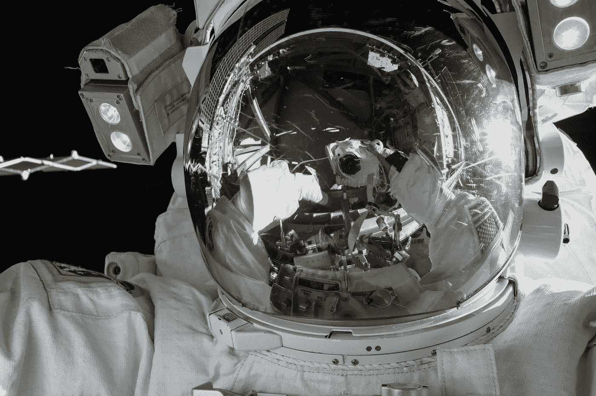
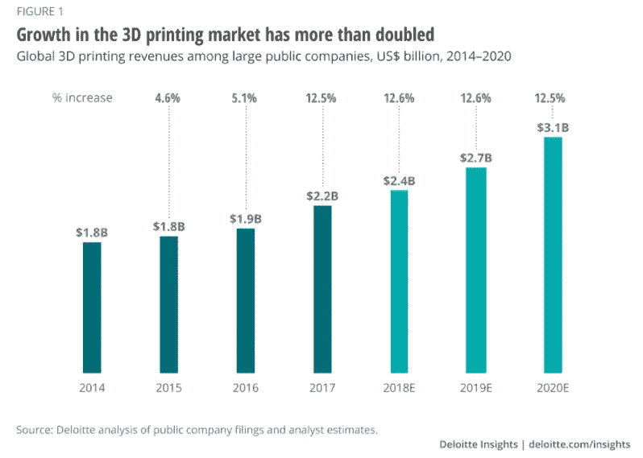

# 为什么 3D 打印会颠覆 12 万亿美元的制造业

> 原文：<https://medium.datadriveninvestor.com/why-3d-printing-will-disrupt-the-12-trillion-manufacturing-industry-91b54ac9ec1?source=collection_archive---------5----------------------->

## 3D 打印机如何用于消费产品

Image by [NASA](https://unsplash.com/@nasa)/Unsplash

我们不知道未来会带我们走哪条路，但跨越国界的伟大思想正在汇聚，开发将迅速改善我们世界的技术。3D 打印机、人工智能、机器人、增强现实、区块链、DNA 测序、储能等技术的进步让人们能够快速创新。

也许在我们生活的这个历史时期，技术会让我们所有人感到惊讶，并且由于摩尔定律，技术的飞跃会比我们预期的更快。然而，与此同时，许多不属于数字生态系统的传统企业可能需要更长时间来调整，需要“迎头赶上”。

# 摩尔定律和指数增长

1965 年，工程师戈登·摩尔预测，每个硅片上的晶体管数量每年都会翻一番。[摩尔定律](https://www.britannica.com/technology/Moores-law)是以[牛顿运动定律](https://www.britannica.com/science/Newtons-laws-of-motion)为保证的技术定律。基本上，一旦一个产品或服务被转化为数字世界，它就有可能按照摩尔定律呈指数增长。

第一台 3D 打印机诞生于 20 世纪 80 年代，但我们只是在近 40 年后的最近才看到 3D 打印产品在各行各业的多种应用。随着 3D 打印机背后的技术越来越好，越来越便宜，我们可能很快就会拥有一台个人 3D 打印机。

# 太空制造

3D 打印机最有趣的应用之一是在太空中制造产品。

“太空制造”是一家制造宇航员在太空使用的 3D 打印机的公司，但是为什么你在外太空需要 3D 打印机呢？

由于产品的重量，当宇航员需要某些供应品时，将材料运输到太空的成本太高。这就是太空制造存在的原因。在近地轨道，该公司为宇航员制造重要、关键和可靠的供应品。

2016 年，一种扳手被制造出来，这样宇航员就可以在太空中进行维护。2017 年,【太空制造的 制造了医疗用品，以及第一个用于宇航员槌状手指的手指夹板。

但是你不必看向太空就能看到 3D 打印机给我们的世界带来的巨大好处。

# 3D 打印机将提升你日常需要和使用的产品

想象你刚刚搬进你的新家。

今天，你在网上寻找各种家居用品和物品来装饰你的房间。

明天你将拥有自己的 3D 打印机和材料。

一旦你购买了蓝图来创造你自己的墙壁装饰品、花瓶、小雕像或牙刷架，你将立刻拥有你所需要的。

你已经可以买到像这样的个人 3D 打印机 [Maker Bot](https://tablet4u.nl/products/replicator?variant=37428658766022&currency=EUR&utm_medium=product_sync&utm_source=google&utm_content=sag_organic&utm_campaign=sag_organic&gclid=Cj0KCQiAgomBBhDXARIsAFNyUqOtLFDk1eBIphzz131YB2Fepgl4gqdjgbe0ySOl3PERL6CulPYg89YaAl8fEALw_wcB) 。

## 1.消费品

使用 CAD 软件为你的客厅打印你自己的艺术作品可能会非常有趣，但让迪士尼出售一整套《星球大战》、漫威或皮克斯电影雕像的蓝图是令人兴奋的。你可以从 [Etsy](https://www.etsy.com/market/3d_printed) 上的人那里买到 3D 打印产品，比如书夹、花盆、雕像和达斯·维德笔筒。

像乐高这样的公司可能会提供人们可以在家里用 3D 打印机打印的材料和蓝图。

## 2.技术设备

通过 3D 打印机进行的增材制造使发明家能够解决笔记本电脑、智能手机和可穿戴设备等日常设备中的许多挑战。我们在 3D 打印机中使用的技术意味着我们现在可以生产更薄的多层电路板，并创建更好的电子电路。基本上，我们可以使用 3D 打印将电路板更紧密地层叠在一起，并使它们更轻，以便我们的设备更强大、更高效。

电子印刷仅仅处于发展的早期阶段。想象一下[像你的苹果手表这样的可拉伸电子产品](https://www.holstcentre.com/technologies/hybrid-printed-electronics/)能够缠绕在你的手腕上，或者智能手机的宽度只有现在的一半。

## 3.卫生保健

医疗专业人员现在为患者使用 3D 打印的膝盖替代物。这些植入物是质量最好的，因为 3D 打印机可以分层建造物体，使它们中空且难以置信地复杂。这只是开始。生物打印项目现在正被用于制造人类的肝脏、肾脏和心脏。

世界卫生组织估计已经有 490 万人完全失明。在没有足够的盲人捐赠者的情况下，2019 年，[纽卡斯尔大学](https://www.3dnatives.com/en/bioprinting-projects-3d-printed-organs-070420205/#!)能够只用一个健康的人类角膜 3D 打印 50 个人造角膜。

## 4.建筑

3D 打印允许建筑师和工程师为航空航天、汽车和其他工业部件构建[复杂材料](https://www.nano-di.com/ame-markets-2020/aerospace)，用于快速成型和批量制造。从本质上讲，它允许创新者使用高度复杂的数学和物理来创建蓝图，否则成本太高，几乎不可能创建。

中国已经 3D 打印了 10 栋全尺寸的独立单层房屋。它花费了不到 5000 美元，花了[一天时间建造](https://www.bbc.com/news/blogs-news-from-elsewhere-27156775)。对于生活在世界各地社会经济水平较低的弱势群体来说，3D 打印机有着巨大的潜力。

# 3D 打印机的优势

如果你仍然没有被 3D 打印机已经带来的所有优势所打动，那么这里还有其他巨大的好处。

*   在生产过剩的商品中没有浪费。
*   不需要运输，运输货物的车辆会产生污染。
*   无需使用会造成浪费的塑料或不必要的包装。
*   入门级 3D 打印机目前的价格从 200 美元起，这意味着从长远来看，当你生产自己的产品时，你将节省资金。
*   使用计算机辅助设计(CAD)软件(见 [AutoCAD](https://www.autodesk.com/products/autocad/overview?term=1-YEAR&support=null) ，你将能够创建自己的蓝图并在网上出售。
*   3D 打印机是经济的，因为使用了添加制造，而传统制造切割更大尺寸的材料(减去)，这产生了更多的废物。

# 3D 打印在过去 5 年中增长了一倍

随着 3D 打印机在各行各业的广泛应用，我们正处于一个转折点。包括福特、欧莱雅和西门子在内的公司已经转变了他们的业务，并且提高了员工的技能来采用这项技术。

随着人们开始拥有自己的 3D 打印机，能够制造自己的消费品，大型制造企业将开始变得多余。除此之外，目前的制造商将被采用 3D 打印技术的灵活公司所颠覆，这将不再需要目前的生产生命周期。

# 最后的想法

现在，世界上的不确定性比以往任何时候都多。就好像我看到的每个地方都有经济理论家或分析师试图预测我们经济的未来。一个肯定会让未来出错的方法是在某件事将要发生的时候打上时间标签，不管它是一个事件还是一个股票价格。

我们目前生活在人类历史上最有趣的时期。我们才刚刚开始驾驭这场技术进步的海啸，它将在未来 10 年内降临到我们头上。3D 打印机等技术将很快让生活变得更加舒适，新的就业机会已经开始出现。

如果你是一名建筑师或工程师，并且使用 CAD 软件，你可能已经知道如何设计产品。人们已经通过 Etsy 销售了近 20 万种不同类型的精心设计的 [3D 打印商品。我迫不及待地想投资一台 3D 打印机来进行修补，但如果你已经是一名设计师，也许 3D 打印机是你下一个激情项目的入口。](https://www.etsy.com/market/3d_printed)

🧠 📚想要了解如何将你的兼职变成成功的生意的见解和战略工具吗？在亚马逊上看我的书→ [**内容巨头**](https://www.amazon.com/dp/B09YQ33TDJ) **: *如何在数字经济中创造 6 位数。***

 [## 通过我的推荐链接加入 Medium—Rick Govic

### 作为一个媒体会员，你的会员费的一部分会给你阅读的作家，你可以完全接触到每一个故事…

rickgovic.medium.com](https://rickgovic.medium.com/membership) 

***感谢阅读，***

***里克·戈维奇***