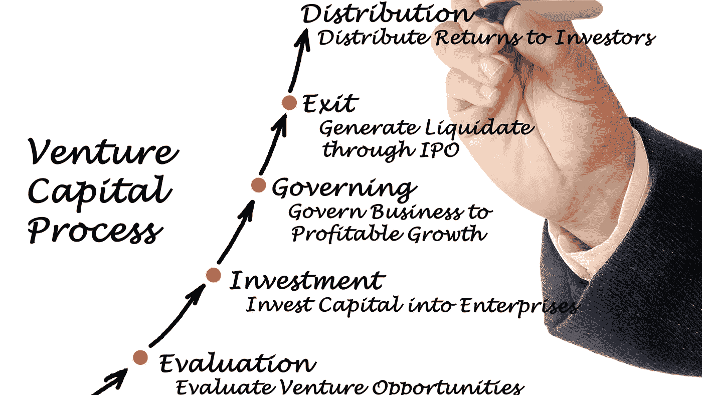

# 为什么 99.95%的企业家应该停止浪费时间寻求风险投资

> 原文：<https://medium.datadriveninvestor.com/why-99-95-of-entrepreneurs-should-stop-wasting-time-seeking-venture-capital-204c1dba4588?source=collection_archive---------3----------------------->

## 接触风险投资基金前你需要考虑的 5 点

All pictures are CANVA PRO images

许多孵化和加速项目围绕“如何获得风险投资”这一主题举办网络研讨会。他们很少解决核心问题:怎样才能吸引风投资金？这导致许多初创公司浪费了大量宝贵的时间，走上了错误的道路。

在问这个问题之前，

> “我如何获得风投资金”

先问这些问题

> “我为什么需要钱？”

和

> "我是否有一个商业案例落入风险投资的甜蜜点？"

我的职业是并购。2006 年，我决定开始在生命科学行业工作。我的第一个项目是从诺华公司分离出来的。它获得了 4000 万欧元的风险投资。我从一开始就有机会与世界上最好的生命科学风投合作。这是一次艰苦的训练，但我很快就学会了一个商业案例如何变成风险投资案例。

自从我开始从事生命科学以来，经常有没钱的公司来找我。生命科学行业的固有特点是，从大学水平到被大公司收购的产品，需要大量的资金来开发一项技术。要解决这个问题，需要钱，而风险资本家解决了这个问题。

# 描述风险投资的 5 个要点

在我描述你在接触风投之前应该考虑的 5 点之前，让我们先了解一下什么是风投:

Investopedia 将风险投资定义为:

> 风险投资家(VC)是一种私募股权投资者，向表现出高增长潜力的公司提供资本，以换取股权。这可能是为初创企业提供资金，或支持希望扩张但无法进入股票市场的小公司。风险资本家愿意冒险投资这些公司，因为如果这些公司成功了，他们可以从投资中获得巨大的回报。由于新公司和未经证实的公司的不确定性，风险投资的失败率很高。

## 私募股权投资者

风投是私募股权投资者。通常情况下，风投不会投自己的钱。该基金投资其他人或组织的钱。因此，风险投资不是一个人，而是一个团队。我合作过的一些基金:

*   [Seroba 生命科学](https://www.seroba-lifesciences.com/)
*   [Hadean Ventures](https://hadeanventures.com/)
*   [威灵顿合伙人](https://www.wellington-partners.com/welcome/)

## 高增长

投资者投资其他人或组织的钱。他们需要与市场竞争其他投资机会。目前，储蓄产生 0%的利率。但一只标准普尔 500 ETF 平均每年创造 10%的收益。这意味着每投资 100，000 欧元，你每年就能得到 10，000 欧元的回报。

他们如何激励其他人投资高风险基金？没错。高额奖励。因此，他们中的许多人承诺每年 20%-30%的回报。要走这条高增长路线，他们需要投资高风险的故事。

## 改变世界

风投对投资者的期望不能通过投资一般的故事来实现。他们大多寻找独特的、改变游戏规则的公司，比如亚马逊、苹果、特斯拉或脸书。只有这种极端的故事才有可能带来令人着迷的回报。

## 冒险精神

那些投资者正在紧张地生活和投资。对于 100 次失败，他们有 2-3 次成功。这些点击带来了迷人的回报。想象一下成为亚马逊、苹果、特斯拉或脸书的种子投资者。你不仅会得到 10 倍的回报，还会得到 1000 倍的回报。

## 不是第一批行动者

虽然他们想冒险，但他们不会第一个进去。他们不是特种部队。一旦第一批投资者——通常是种子投资者——清除了第一个风险，他们就会进入第二或第三个。

为什么这与启动资金相关？只有符合风投所有标准的商业案例才有机会获得大笔资金。

所以让我们看看谈判桌上的另一面。

# 初创公司吸引风投需要考虑的 5 点

在世界上，风投的数量是有限的。这些有限的风险投资公司分配给公司的资本也是有限的。最重要的是，启动和完成一个更大的公司投资过程是耗时的、资本密集型的。除了日常事务之外，它还需要团队的大量投入。

经常有公司找我，他们认为 5000 万欧元的投资只需一个电话就能搞定。没有工作——一个电话——收到钱。不幸的是，这是错误的。从时间上看，平均约为 12 至 18 个月。团队需要做好准备

*   投资故事
*   沥青甲板
*   业务计划
*   数据室
*   协调当前创始人和投资者的利益
*   谈判时间
*   法律工作

这足以让你坐下来重新思考你的公司故事。它是否足够坚实，值得投入时间和资源去接触投资者？让我们从最强到最弱分别处理每一点

## 你有改变游戏规则的技术吗？

风险投资基金需要大海捞针。在一个充满公司和潜在机会的世界里，它们需要吸引合适的公司，为投资者带来足够的回报。回报足够高，足以支付运营费用、破产投资，并为投资者带来 20-30%的年均回报率。

最好的方法是投资改变游戏规则的故事。最优秀的团队通常会寻求投资基金，投资苹果、微软、特斯拉、脸书、谷歌或推特。谁不想推销“我得到了让谷歌变大的家伙们的资助？”为了让这个故事继续下去，风投就像一个精英俱乐部。

所以问问你自己:你的技术真的改变了游戏规则吗？如果你的答案是肯定的，那么进一步探索是有意义的。

## 高增长

改变游戏规则的技术伴随着许多风险。不是每一个好主意都出现在正确的时间。最重要的问题为什么是现在？很多游戏改变想法其实并不难搞清楚。此外，组建一个有执行力的团队是一项工作，但并不神秘。

社会和经济环境现在也必须处于正确的状态，才能真正让故事起飞。让我们回想一下社交媒体。在 90 年代，互联网还很年轻。很明显，它将改变我们交流的方式。即时消息服务出现了。我记得很清楚，ICQ。

对我来说，这是世界奇迹之一。1996 年，ICQ 打开了网上聊天的世界。在一个没有连接的世界里，我们在游戏中一天一天地交换我们的 ICQ 档案。免费聊天。它将我与亚洲和韩国联系起来。

我还参与创建了两个项目，其重点是连接人们。那是在 1997 年。在 2020 年的今天，所有 90 年代的项目都已经灭绝或者相当小。赢家是脸书、Twitter 或 LinkedIn。仅举几个例子。

为什么？想法是非常相似的。为什么在 1995-1997 年到 2006-2008 年的项目开发中会有如此大的差异？我的观点是:智能手机和让每个人都能使用技术的成功。

在 90 年代，上网是一个复杂的过程。没有什么是自然而然的。10 年后，技术变得更加先进——用户群比 10 年前大得多。马克·扎克伯格和杰克·多西正在驾驭这股潮流。做一些比他们的前辈更好的东西，并获得大笔投资。

扪心自问:现在的技术是世界需要的改变游戏规则的技术吗？

## 私募股权

投资不是捐赠。最终，一个投资者想要投资赚钱。他需要这样做来满足他自己的投资者。当你弄清楚前两个部分——改变游戏规则和正确的时间点——问问你自己:

这个案例能赚到足够的钱给投资者 10 倍的回报吗？每投入 100 万，至少能回报 1000 万？我很惊讶，在我与企业家的交谈中，有多少人没有回答这个问题。退出？退款吗？为什么？投资人拿到股权了？她为什么想要更多？

技术上市的正确时机是一回事。但是，这种吸收是否足够大，以至于在 5 至 10 年的时间内，你就能从投资者那里收回投资？

## 冒险精神

当你掌握了第一点，记住你是在和人类打交道。不是机器。投资者投资是为了赚钱。是的。但是他们也想帮助世界，做好事。后者你已经用改变游戏规则的技术叙述过了。

所以重点看第二个。我知道银行账户里有钱很好。但是你为什么需要投资者呢？她如何能帮助拯救公司？你目前有什么问题可以通过投资来解决？

“因为你觉得银行账户上有 1000 万英镑比 10 万英镑更舒服，这没有问题，有助于吸引投资者。”

声称钱达到下一个该死的价值拐点，这是 24 个月和 2000 万。没有投资者的帮助，这项伟大的技术将永远不会走向世界，也不会消失在变革的浪潮中。

做你的功课，让你的筹款叙事部分理顺。讲述一个引人入胜的故事，让投资者安全度过这一天。

## 商业天使先来，投资者最后才是派对。

投资者不会承担第一个风险。如果你刚刚发表了一篇论文或创建了一个想法的第一个大纲，不要浪费时间和风险投资家交谈。在没有成立团队或公司的情况下，他们极不可能涉足概念艺术。

风投不是商业天使或种子投资者。在接触风投有意义之前，你至少应该把你的公司向前推进一点。有了团队，向前发展了两三步。并且清楚地知道大笔资金可以帮助你的公司和技术腾飞。

我的建议很简单。如果你对以上所有问题都没有明确的肯定答案，不要浪费时间去联系风险投资家。宁愿选择公共基金或建立销售队伍。

自 1999 年以来，我是各行各业公司的执行官、顾问和教练。我专攻企业发展和金融。从种子轮到 IPO 级别。我从 2006 年开始关注生命科学。

如果你喜欢这篇文章，[关注我](http://linktr.ee/soschner)了解更多内容。

# 读者:

 [## 风险资本家(VC)的定义

### 风险投资家(VC)是一个私募股权投资者，为表现出高增长的公司提供资本…

www.investopedia.com](https://www.investopedia.com/terms/v/venturecapitalist.asp)  [## 为什么 99.95%的企业家应该停止浪费时间寻求风险投资

### 今天，如果不阅读有关风险投资家(VCs，定义为…

www.forbes.com](https://www.forbes.com/sites/dileeprao/2013/07/22/why-99-95-of-entrepreneurs-should-stop-wasting-time-seeking-venture-capital/?sh=25f78cf146eb)