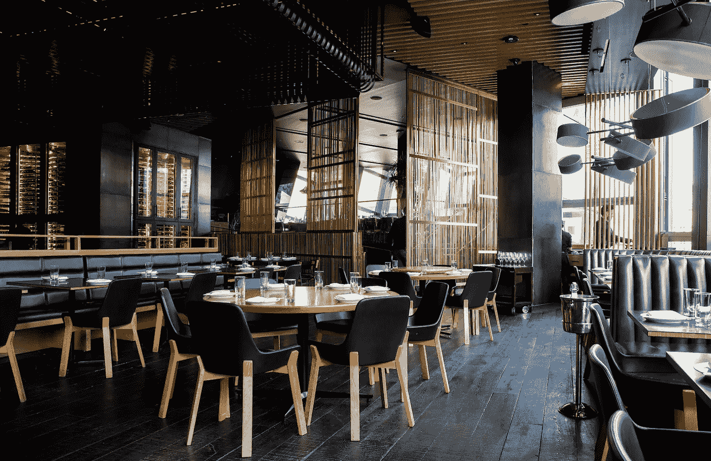
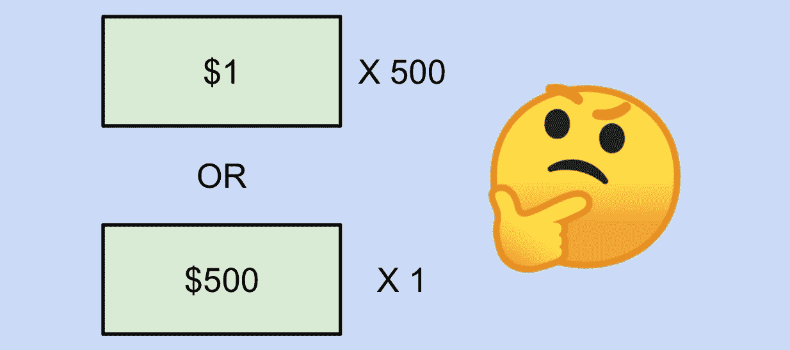
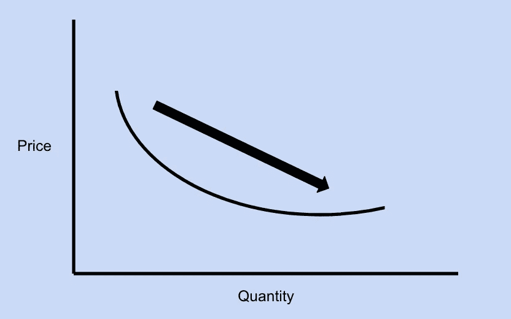

# 为什么高产量低利润战略在商业上获得如此大的成功

> 原文：<https://medium.datadriveninvestor.com/why-a-high-volume-low-margin-strategy-reaps-so-much-success-8d10c7895854?source=collection_archive---------1----------------------->

## 了解越来越多地采用的策略的优势

Photo by [Jason Leung](https://unsplash.com/@ninjason?utm_source=unsplash&utm_medium=referral&utm_content=creditCopyText) on [Unsplash](https://unsplash.com/s/photos/restaurant?utm_source=unsplash&utm_medium=referral&utm_content=creditCopyText)

# 介绍

如果你必须在赚一美元五百次和赚五百美元一次之间做出选择，你会选择哪个？

我很肯定大多数人会选择第二种选择，因为你可以一次拿到所有的钱，而且麻烦更少——谁会愿意带着 500 美元的钞票(或者在我来的地方是疯子)？！

现在想象你是一家餐馆的老板。你是愿意从 500 个顾客那里每个顾客赚 1 美元，还是愿意从一个顾客那里每个顾客赚 500 美元？

Image created by Author, Emoji from Google

你有没有去过评价很高的餐厅，也是高价值的餐厅？又名，你有没有去过一个餐厅，以公平的价格提供大量惊人的食物，想知道他们是如何赚钱的？这个问题可以通过回答之前的问题来回答。

让我先说，我知道一家公司的利润率如此之低是不可行的，但我想说的是，总的来说，一家餐馆最好是利润率更低、业务量更大。这不仅适用于餐馆，也适用于任何类型的公司。

 [## 如果资本主义失败了，那么还有什么选择呢？数据驱动的投资者

### 在当前政治领域的修辞之旅中，我们都可以面对面地接触到流行词汇，如…

www.datadriveninvestor.com](https://www.datadriveninvestor.com/2020/03/16/if-capitalism-is-a-failure-then-what-is-the-alternative/) 

你可能会想“我去过一家米其林星级餐厅，一次只能坐四个人，他们似乎做得很好”或者“像路易威登这样的奢侈品牌怎么样？”事实是，高端业务只占所有业务的一小部分。

因此，虽然本文适用于大多数企业，但这并不能解释某些商业模式，如奢侈品牌。对于本文，术语*餐馆*和*商业*可以互换使用。

回到解释为什么对一家餐馆来说，利润越小，业务量越大越好。**我的意思是，为什么高销量低利润战略会取得如此大的成功。**

原因有四:

1.  规模经济
2.  更高的利用率
3.  顾客评论的网络效应
4.  减轻声誉风险

# 1.规模经济

Image created by author

规模经济的概念是产量的增加会相应地节约成本。商品供应商通过将固定成本分摊到更多的单位来实现规模经济。在这种情况下，拥有大量顾客的餐馆也实现了规模经济，因为供应商通常为大量采购提供更高的折扣。供应商这样做有很多原因，但其中一个原因是，当一件商品被批量购买时，剩余库存的风险大大降低。

因此，通过拥有更高的客户量，所需商品(原材料)的数量增加，这意味着可以获得批量折扣，单位成本下降。我刚刚提到了两件关键的事情——数量上升，单位成本下降。

通过实现这两个目标，餐馆老板获得了许多子利益:

*   **更高的议价能力**:当你从给定的供应商那里购买更多的商品时，你就变得更有价值了。随着你变得越来越有价值，你的**买家议价能力**也增加了，这让你可以向你的供应商施压，让他们给你更好的价格，这样他们就不会失去你。
*   **更高的现金储备**:在其他条件不变的情况下，更低的成本会带来更高的利润率，给你现金，从而有能力为你的客户提供更多的价值。

# 2.更高的利用率

**利用率**是运营管理中使用的一个基本术语，它告诉我们资源的使用情况。资源的利用率是给定资源的**流量**除以资源的**容量**的函数，也就是实际产出水平除以最大产出水平。流率被定义为单位时间内通过一个业务流程的单位(客户、货币、生产的商品)。在餐馆的情况下，顾客的流动率从降低价格开始增加，最终提高餐馆本身的利用率。

例如，如果一家餐厅平均只有 80%的满座率，而该餐厅通过降价来增加平均 25%的顾客数量，那么它的利用率将达到 100%！虽然在现实生活中并不那么简单，但是这个例子展示了利用率是如何工作的。

让一家餐厅的利用率尽可能接近 100%的好处不仅仅是拥有一家繁忙的餐厅。餐厅的利用率接近 100%意味着餐厅可以接待的顾客数量的差异较小。这是有意义的，因为餐馆利用率的上限随着利用率本身的增加而降低。最终，这意味着一家利用率较高的餐厅可以为 it 部门提供更多的可预测性，使其能够更轻松地计算库存，更准确地制定预算，甚至能够更加一致地烹饪新鲜食物！

# 3.顾客评论的网络效应

你获得的客户越多，你获得客户评论的可能性就越大。这与一个有趣的商业概念有关，网络效应。网络效应是一个概念，它表明一种商品或服务的额外用户为其他人提供了额外的产品价值。

展示网络效应的公司的一个完美例子是优步。随着越来越多的用户使用优步，它会变得越来越好。用户越多，司机开车去优步的吸引力就越大，这使得用户对这项服务更感兴趣，如此循环往复。

同样，更多的顾客会导致更高的评论数，这将吸引更多的用户到餐厅(假设餐厅是好的)，循环继续。最终，这导致了低容量和高容量餐厅之间的口碑和评论数量的指数差异。

# 4.减轻声誉风险

最后，与第三点相关的是，更多的顾客会降低特定餐厅的声誉风险。声誉风险被定义为对企业地位的危险或威胁[1]。

举个例子，假设一个企业在某一天有 10 个客户，假设服务器意外出错，导致 1 星评级。这意味着 10%的收视率是一星。现在想象一下，同一家餐馆在某一天有 50 名顾客，但由于一个错误而获得了 1 星评级。现在，只有 2%的收视率是一星，而不是 10%。

因此，继续假设一家餐厅是好的，更多的顾客降低了公司的声誉风险。

# 结论

最后，我知道从利润的角度来看，情况可能并不总是这样。参考供求曲线，有时候为了利润最大化，最好提高你的价格，损失一些客户。然而，本文的重点不是利润最大化。相反，它专注于建立一个具有高认知度的令人难忘的品牌，为您的客户创造并提供卓越的价值，并最终通过降低风险来维护您已经建立的品牌。

最后，重申一下，这些想法不仅适用于餐馆，也适用于所有类型的企业。

# 感谢阅读！

我希望你从阅读这篇文章中学到了一些新的东西。欢迎关注更多关于商业、教育和数据科学的文章。

# 参考

[1]声誉风险定义， *Investopedia* ，【https://www.investopedia.com/terms/r/reputational-risk.asp】T4