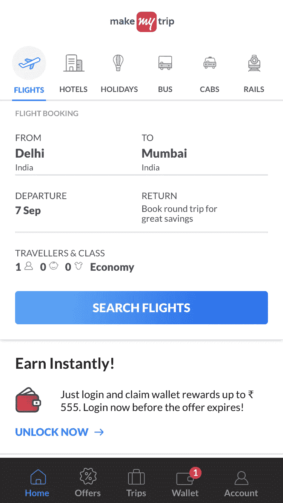
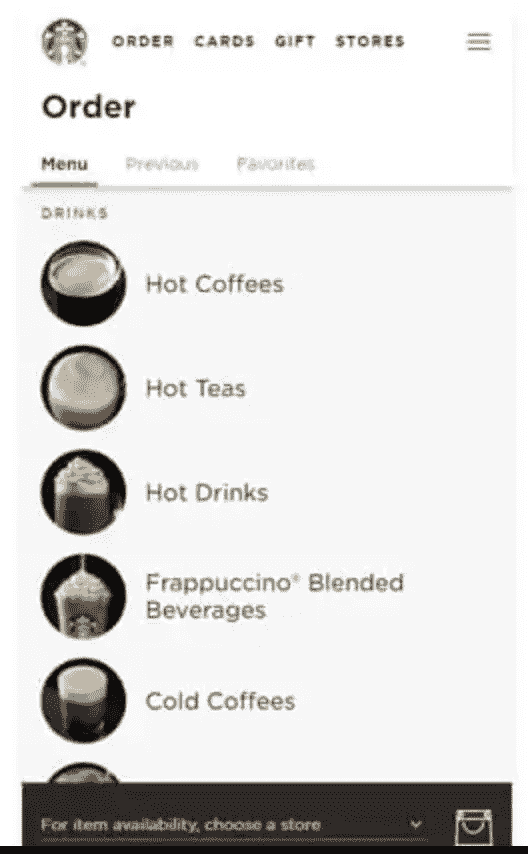

# 为什么渐进式 Web 应用程序可能是您的企业所需要的？

> 原文：<https://medium.datadriveninvestor.com/why-a-progressive-web-app-could-be-what-your-business-needs-ee8c03d45739?source=collection_archive---------11----------------------->

渐进式 web 应用程序是一种通过使用现代 web 功能向用户提供类似应用程序的体验的 Web 应用程序。它不是一个新的框架或技术。这是使网站/ web 应用程序的功能类似于原生移动应用程序的一组最佳实践。

PWA 的顶级功能:

*   应用速度
*   无需安装应用程序，因此几乎可以在所有设备上运行
*   类似原生应用的用户体验
*   通过 HTTPS 增强应用程序安全性，使未经授权的用户无法访问应用程序内容
*   离线使用—像在移动应用程序中一样的实时推送通知

因此，以下是制作 PWA 相对于构建全功能 Android 应用的优势:

**性价比** —对于一个 app 发行商来说，最显著的优势就是在 app 开发和维护方面的成本节约。

**跨平台**——我们不必为 Android 和 iOS 分别开发不同版本的应用。它适用于所有—相同的代码。

**可靠** —即使在恶劣的网络条件下也能即时加载。PWAs 使用的数据比普通移动应用少，所以它们首先在互联网连接不畅的新兴市场起飞。

**快速** —通过流畅的动画和滚动快速响应用户交互。

**用户友好型** —吸引人，感觉像设备上的原生应用程序，全屏和身临其境的用户体验使他们能够在用户的主屏幕上赢得一席之地。

以下是一些将渐进式网络应用应用于在线平台的著名企业

# 那么 PWA 最适合什么类型的应用呢？

如今，用户可以使用三种类型的应用程序:

*日常使用浏览器、Gmail、脸书、WhatsApp 等应用。

*偶尔使用的应用程序，如送餐、在线预订、银行应用程序等。

*很少使用的应用，如订阅应用、账单支付等。

对于第二和第三类，渐进式网络应用程序通常运行良好。他们很难让用户从应用商店下载应用程序并保存在手机上。

所以如果你喜欢

-预订和订阅业务

-在线交付服务

-电子商务商店

-媒体和内容交付网站

-社交媒体平台

可能是时候重新考虑你的数字战略，决定是否要建立一个进步的网络应用来运行你的在线业务了。PWA 将减少未来本地应用的出现，它有可能改变我们消费应用的概念，并改变互联网和现代浏览器的工作方式。

 [## 数据驱动的投资者|微软比 Chrome 有“优势”

### 简史我从来不是浏览器的粉丝，确切地说，我只是一个浏览器的粉丝，Chrome。这是我的…

www.datadriveninvestor.com](https://www.datadriveninvestor.com/2020/03/29/microsoft-having-an-edge-over-chrome/)