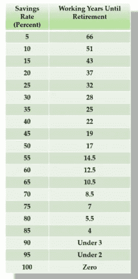

# 为什么作为一个节俭者实现财务独立是一个糟糕的策略

> 原文：<https://medium.datadriveninvestor.com/why-achieving-financial-independence-as-a-frugalist-is-a-bad-strategy-fast-track-a0206da22c82?source=collection_archive---------22----------------------->

## 许多人梦想经济独立，因此全球范围内有越来越多的 FIRE(经济独立和提前退休)社区。节俭是帮助任何人实现财务独立的主要哲学之一。有些人认为，成为一个完全节俭的人可以更快地实现财务独立。然而，我认为这是一个糟糕的策略。原因如下。

## 财务独立号

根据 trinity 的研究，基于 4%法则，你可以通过下式计算你的火灾次数

**财务独立数=年生活费 x 25**

如果你每年提取总资产的 4%,就足以让你在生活的同时保持财富，因为你的投资回报率预计至少为每年 4%。如果你想了解这是如何工作的，你可以阅读我的文章 [<提前退休>](https://www.fasttrack.life/blog/do-this-to-retire-early?rq=do%20this%20to%20retire%20early) 。

你可以想象，你每年和每月的生活费用越低，你的 FI 数就会越小。你就能越快实现财务独立。

让我们看一个具体的例子:

*   莎拉每年的生活费是**4 万美元**。因此，她需要积累 40，000 美元 x25 = 1，000，000 美元的总资产，才能实现财务独立。
*   莎莉每年的生活费是 2 万美元。他们住在同一个城市，但生活方式不同。她需要积累 20000 X 25 = 500000 美元才能经济独立。这只是莎拉所需的 50%。

如果他们同样月薪 5000 美元，平均投资回报率为 8%，经济独立后还有 40 年可活。

下表是基于你的储蓄率和退休前的年数的一般计算。扣除通货膨胀因素后，假设投资回报率为 5%。

source: mrmoneymustache.com

## 节俭以增加储蓄率

节俭可以大幅提高一个人的储蓄率，并缩短实现财务独立的时间。因此，许多人跳上船，试图成为节俭者。如果你把你每月的生活费用降低到极限，这也意味着当你经济独立时，你仍然被这个生活费用水平所束缚。我最近看了一个视频，是关于一个德国博客作者，奥利弗，他计划在 40 岁退休，成为一个节俭的人。

另一个来自奥地利女孩的视频解释了她如何计划在 35 岁前达到 FI。她说她计划的解雇人数是 50 万欧元，每月生活费是 1500 欧元。

我个人觉得这个策略有点令人不安。虽然他们的意图是好的，可以教育很多人节约并谨慎消费，但这也会误导很多人。

我认为通过节俭来实现财务独立是一个糟糕的策略，主要有三个原因:

1.  有限的预算意味着有限的自由。在德国、奥地利或法国，每月 1500 欧元的免费生活费并不算多。当你 35 岁实现财务独立，有 1500 的预算，你会做什么？是的，许多人会说，然后他们可以找到一份自己喜欢的工作，然后他们可以做爱好项目，然后他们可以…

所以你这些年省吃俭用，就是为了做自己喜欢的事，不工作？！为什么不现在就找一份自己热爱的工作呢？！为什么不现在就开始你的业余爱好项目呢？！为什么不现在就做一些能带给你快乐的事情呢？！

如果财务自由如此重要，我看不出一个人如何在每月预算很少的情况下获得自由。如果你想去旅行，你必须仔细计划。如果你想支持一些家庭成员，你必须三思而行，否则你根本不能。如果你想投资一个企业，你不能。如果你想做任何超过每月 1500 欧元预算的事情，你没有这样做的自由。

**2。退而求其次是懒惰的另一种方式。**30 岁至 40 岁是你通过工作或个人项目提供专业知识，为社会和社区创造价值的黄金时期。你作为一个人学习，你发展专业技能，你可以教别人，创造更多的社会价值。

**3。对增加收入的无知。节俭意味着对支出极其小心，小到一分一毫。作为一个年轻人，你应该培养良好的花钱习惯，而不是乱花钱。但你不应该只关注如何储蓄，相反，你应该关注如何提高自己，如何提升自己的技能，如何对公司更有价值，并产生更多的收益。因此，随着你不断提高技能，你的市场价值也会不断增加。在投资节俭之前，先投资你自己。**

让我给你举个简单的例子:

*   莎拉在周末学校和职业培训上投资了 20，000 美元。然后，她找到了一份年薪 12 万美元或月薪 1 万美元的工作。她的储蓄率是 12 万美元到 4 万美元/12 万美元= **67%** 。
*   莎莉像往常一样每年挣 6 万美元。她的储蓄率是(6 万美元——2 万美元)/(6 万美元= **67%** 。

他们都有相同的储蓄率，但生活方式完全不同。由于 Sarah 的生活费用预算是 Sally 的两倍，她可以旅行，住在舒适的公寓里，支持她的家人，并为自己节省更多的投资。他们都可以在相同的年限内实现财务独立。之后，莎拉比莎莉有更多的选择，因为她有财力尝试更多的东西。

‘节约’只能做到这么多。“挣钱”可以做更多的事情。

## 首先投资自己

如果你想实现财务独立，谨慎消费并努力提高储蓄率是一个很好的做法。但如果你还在 20 多岁或 30 出头，不要盲目地用公式计算你需要多少年退休，并计划一个最低的每月预算。即使你做到了，你也不能做更多，因为你没有“花钱”的自由。你应该做的是:

1.  **培养良好的理财习惯。**
2.  **投资你自己，成为专业的就业者。**
3.  **找一份让你满意的工作，这样你就不需要渴望有一天可以辞职的财务独立日。做一些你现在喜欢的事情。**

通过[快速金钱课程](https://www.fasttrack.life/moneycourse)，学习如何以正确的方式实现财务独立。

*原载于 2021 年 2 月 4 日*[*https://www . fast track . life*](https://www.fasttrack.life/blog/why-achieving-financial-independence-as-a-frugalist-is-a-bad-strategy)*。*