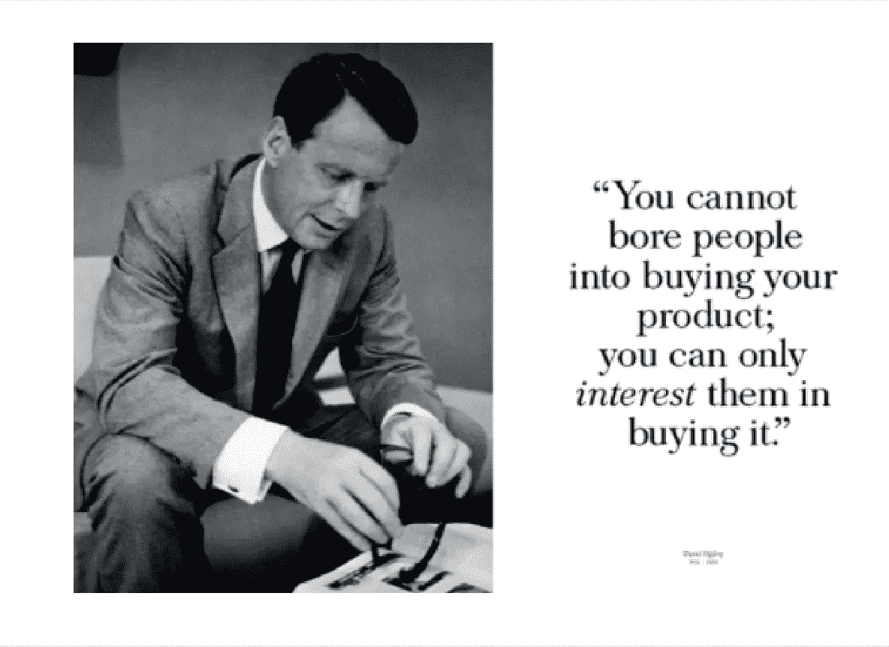

# 为什么广告不再畅销。

> 原文：<https://medium.datadriveninvestor.com/why-advertising-doesnt-sell-anymore-9efe8f8ea79f?source=collection_archive---------11----------------------->

## 我们是如何失去真正的说服艺术的。

我在 70 年代进入广告业的原因只有一个:我喜欢长篇广告。不是因为他们用产品承诺填满了每个句子，而是因为他们讲了一个故事。当时讲故事是一门艺术。《如何写好文章》的作者威廉·津瑟描述了人们如何在《纽约客》*上阅读长篇小说，“纯粹是为了看到作者会出现在哪里。”*

*广告业从未享受过如此奢侈的待遇，但从历史上看，最好的广告文案仍然知道并实践着讲故事的艺术。在 Tom McElligott 为保时捷工作期间，他写了一整页的广告，至今仍是我的最爱之一。标题(粗体 Helvetica)简单地写道:“向异教徒致敬。”通过这篇文章，他描述了保时捷的工程师们是如何不遵循汽车工程的传统规则，而宁愿成为异端。*

> *谁不喜欢一个把世界放在完全不同视角的故事？*

*如果你坚持汤姆的观点，他解释了新的道路是如何更多地由反对者而不是墨守成规者创造的。我买了逻辑，因为我喜欢这个故事。谁不喜欢一个把世界放在完全不同视角的故事？*

*就像汤姆·麦吉利戈特让我们尊重异教徒一样，当时的另一位广告文案汤姆·托马斯也让我们尊重手工艺。在他的广告“坐在不需要汽车的车里享受经济复苏”中，他解释了旧宝马是如何保持其价值的，有时售价比新的运动型轿车还高。*

*然后是大卫·艾伯特，他著名的广告谴责现成的西装:“你的丈夫在另一个男人的怀里吗？”谁会不看这样一个标题后的副本呢？这不仅仅是聪明，这种聪明有着不可抗拒的吸引力。我们必须知道 Abbott 会怎么做。*

*这些广告文案——以及其他许多人——都在练习说服的艺术。他们遵循大卫·奥格威的信念，“你说得越多，你卖得越多。”不幸的是，多年来，客户决定他们想要的是简短的报道和头条新闻。他们不相信注意力持续时间。*

*研究人员证实了这一点，他们是一群有趣的实用主义者，他们认为长篇大论很无聊。在即将到来的信息过载的世界里，他们相信只有最简短的信息才会被阅读。*

* [## 抓住智能营销，获得巨大成果|数据驱动的投资者

### 网上的人都看过。每当人们在谷歌上搜索某样东西，他们最终都会与类似的广告互动…

www.datadriveninvestor.com](https://www.datadriveninvestor.com/2020/08/19/grab-on-to-intelligent-marketing-for-great-results/) 

很少有人意识到——现在仍然没有意识到——消费者的注意力持续时间并不短。想想他们花在互联网上的时间。长度不是问题，让人们抓狂的是公司坚持要说的话。

> 无聊就是无聊，大多数公司仍然不明白他们到底有多无聊。

当互联网出现时，人们渴望信息。但是，就像广告一样，他们厌倦了公司认为他们全神贯注。无聊就是无聊，大多数公司仍然不明白他们到底有多无聊。

说服是理解如何引起某人的兴趣。伟大的销售人员不会依赖他们的顾客。他们阅读它们，准确地感觉到顾客需要什么。有时甚至顾客也不知道他们需要什么，但是一个伟大的销售人员要么感觉到了，要么*创造了*。

本质上，这就是讲故事的意义所在。甚至在观众知道他们想要什么之前，就能感觉到他们想要什么。这就是为什么研究经常失败。他们不停地问实验对象:“你喜欢这样吗？”主体不知道。他们在等你告诉他们想要什么。

我记得推广一种降低血管紧张素 II 的药物。由于我不知道血管紧张素是什么，我通过数百次临床试验，发现了这种导致动脉粥样硬化斑块的恶魔种子。所以我写了一个故事，挑出我觉得有趣的(如果它让你着迷，它也会让其他人着迷)。

研究当天，第一个医生推开广告，说:“我知道血管紧张素是什么。”主持人，这个才华横溢的年轻女子，看着他问道:“你能给我解释一下吗？”

> 医生最后把广告甩来甩去，说道:“这里写的是什么。”

医生耸耸肩说:“我们经常看到这种情况。我不明白你为什么要在医生已经知道的事情上浪费大量的描述。”所以主持人问是什么让血管紧张素ⅱ和血管紧张素ⅰ不一样？医生最后把广告甩来甩去，说道:“这里写的是什么。”

每个产品都有一个故事——不是一系列产品细节——而是一个可以改变人们对你所卖产品认知的故事。在合适的人手里，这可以把犹豫不决的买家变成热情的买家。

相反，我们看到的是客户转向新技术:横幅广告，支柱广告，大盒子广告。它们的效果如何？我喜欢这句名言:“比起点击横幅广告，消费者更有可能在鲨鱼袭击中幸存。”这与事实相差不远，它表明广告费用被浪费在了可以说服潜在客户的地方。

另一位作家给出了更具毁灭性的描述，称今天的广告，“……只不过是老生常谈，就像一辆运送沃尔玛传单的邮政卡车一样令人兴奋。”

或许，就像 B.B .金说的那样，“激动已经过去了。”关于“质量”和“独特的设计”，我们已经说得够多了我们要一直拖着旧的描述吗？还是我们应该停止让消费者厌烦，并学会*吸引*他们？

正如我一开始所说的，我们喜欢故事，最好的故事还在那里，等着被讲述。这样想:如果你是唯一一个讲述故事的人——一个真实的 T4 故事——这会让你远远领先于你的竞争对手。

> 历史上最畅销的书是什么？圣经。它包含什么？故事。

永远不要低估语言的作用。威廉·津瑟曾写道:“写作比赛的不是速度，而是原创。”。如果你认为你的产品是原创的，独一无二的，或者只是比别人好，那么你就有故事了。做得好，你就能卖出产品。

我怎么知道这个？历史上最畅销的书是什么？圣经。它包含什么？故事。

考虑到圣经激励人们的时间有多长，我们现在真的可以说我们不同了吗？我们不会遭受信息过载。我们饱受无聊之苦。我们深受广告商的影响，他们认为自己是最重要的。

没有人是最重要的。如果你想要你的市场份额(我指的是真正的份额),那就去争取吧。引起消费者的兴趣。迷住他们。迷住他们。做任何事，但不要坐在那里，以为世界会向你走来。

> 他们去是因为每个人，不管他们是否意识到，都在等待被说服。

为什么人们——大部分是文盲——去读圣经？他们去是因为这个故事。他们去是因为每个人，不管他们是否意识到，都在等待被说服。

不是哄骗。不是骗人的。说服了。

罗伯特科马克是一个讽刺作家，小说家，前广告文案。他的第一部小说[“你可以把马带到水边(但你不能让它潜水)”](http://robertcormack.net/)在网上和大多数主要书店都有售。查看[天马出版社](http://skyhorsepublishing.com/)或[西蒙和舒斯特](http://simonandschuster.ca/)了解更多细节。

## 访问专家视图— [订阅 DDI 英特尔](https://datadriveninvestor.com/ddi-intel)*