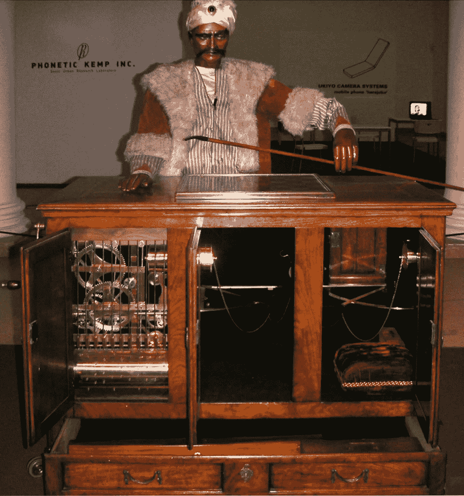

# 人工智能可能永远不会有智能

> 原文：<https://medium.datadriveninvestor.com/why-ai-might-never-be-intelligent-or-why-it-already-is-7aa59150d9ca?source=collection_archive---------6----------------------->

## 还是已经有了？

从 1960 年到 2020 年，人工智能领域既经历了巨大的进步冲刺，也经历了艰难的“人工智能冬天”。头条新闻总是伴随着许多关于计算机如何变得智能并将很快超过人类的突破，随后是对当前技术有多么有限的悲观看法。目前，这一领域正处于有史以来的最高点，然而，迄今为止还没有任何迹象表明存在一种普遍形式的智能，也没有一个关于什么是智能或意识应该是什么样子的结论性定义。五十多年来，这个领域一直在追逐科学史上最难以捉摸的目标之一。

很长一段时间，公众的观点是，任何能下好国际象棋的东西都是智能的。有一个名为“土耳其人”的著名骗局，这是一台内部隐藏着玩家的象棋机器。众所周知，它击败了本杰明·富兰克林和拿破仑·波拿巴等名人，他们都认为它具有魔力。1997 年，IBM 用一台真正的计算机打败了加里·卡斯帕罗夫，满足了智能设备的标准。但事实并非如此。这台机器没有进行任何智能推理。它只有一个手动调整的成本函数上的阿尔法-贝塔剪枝算法的(残酷的)快速实现。赛后，这是科学界的共识。

By [Carafe](https://commons.wikimedia.org/w/index.php?curid=7860391), [CC BY-SA 3.0](https://creativecommons.org/licenses/by-sa/3.0)

像专家系统和语音识别这样的想法也被认为是只有智慧生物才能做好的壮举。直到他们成功了，所以标准改变了。这样的系统高度依赖于我们给出的指令和我们建立的规则。智能系统可以从例子中学习，只需要最少的手工调整。他们会进行特征学习。

到 2012 年，AlexNet 架构将 ImageNet 挑战赛的性能提高了 15 个百分点以上，所有这些都使用了卷积神经网络(CNN)的学习功能。仅仅三年后，在概念的基础上进行改进，VGG 和雷斯内特系统在基准测试中取得了超人的地位。然后，现在是 2016 年，对图像进行分类是不够的。数据集复杂性的增长再次证明了定义智能的难以捉摸的本质。分类问题解决后，科学转向了检测，然后是分割，现在是实例分割。简单的人体检测系统发展到关键点检测和现在的全身网格提取。

 [## 挑战你对人工智能和社会看法的 4 本书|数据驱动的投资者

### 深度学习、像人类一样思考的机器人、人工智能、神经网络——这些技术引发了…

www.datadriveninvestor.com](https://www.datadriveninvestor.com/2019/02/28/4-books-on-ai/) 

尽管具有开创性，CNN 也没有逃脱批评。“用局部特征包模型近似 CNN 在 ImageNet 上惊人地有效”给出了它们局限性的一个精彩演示。总之，如果你把一幅图像分解成拼图一样的小块，把它们打乱，然后输入 CNN，它就能相当准确地预测图像的类别，尽管我们人类没有能力这样做。换句话说，现代建筑不依赖于全球水平的模式和形状；它们主要聚集局部特征，这使得它们非常容易受到简单的对抗性攻击。缺乏全球理解足以成为断言这些系统不“智能”的理由。

学习和元学习研究也指出了其他一些显著的局限性。人类不需要看到成千上万只猫才能可靠地发现它们，也不需要玩几千年的 Dota 2 才能精通它。我们可以获得更多的知识，而不会显著降低我们在以前学过的科目上的表现，我们不需要不断地复习我们所知道的知识来保持它。总的来说，所有这些特征都可以作为将某物归类为智能的要求。

这里的关键是，怎样才能让我们人类接受机器是智能的？时至今日，所有已被克服的挑战也被认为是不够的。国际象棋是搜索，专家系统只是规则，语音识别是特征工程，CNN 缺乏全球理解，等等。与此同时，大脑仍然是不可思议的，神秘的，不可解的。

可以说，当前这一代面临的挑战是自动驾驶汽车。将视觉、推理和决策结合起来的任务。它必须快速完成，并且必须经受住恶劣的气候和不确定的数据。然而，最大的问题不是计算机是否会开车，而是当它们开车时，我们是否会认为它们是智能的。

## 聪明意味着什么

考虑以下命题:如果我们能够完全解释大脑，我们也将能够制造或增强它。通过分析，某人的决定可以被完全解释或预测。更重要的是，我们将能够精确定位大脑的所有局限性。在这种情况下，如果可能的话，大脑会被认为是智能的吗？本质上，它与非常精细的专家系统或图灵机有什么不同？

回想一下“土耳其人”的骗局。它的所有对手都被允许检查机器，没有人发现这个精心设计的诡计。因此，这个装置被认为是智能的，神秘的。我们也是，检查大脑。到目前为止，我们还没有找到运行机制，人里面的人。因此，我们给它贴上了更多的标签，一些有智慧的东西，一个灵魂，一种神秘的品质。大脑不是机器。它不是一个算法。

在这种观点下，智能意味着被人类莫名其妙。

如果你愿意遵循这一思路，智力的一个可能的定义是:能够以一个观察者无法理解/无法预测的方式行事，难以解释。虽然这可能不是最有用的定义，但它包含了一个难以捉摸的概念:只要我们能解释我们的机器，它们就永远不会达到我们的地位。

值得一提的是，这一表述与智力的标准、“积极”定义无关，例如能够获得知识和对过去经验进行推理，或者能够有意识地行动或适应不可预见的事件。这个定义更多的是一个“负面”的定义；它说任何可以解释的东西都不会被认为是智能的。

## 难以理解的机器

使用给定的定义，建造一台智能机器就是建造一台能够以我们无法解释的方式运行的设备。在某种程度上，这是对我们最初问题的重新表述:我们必须找到我们认为无法解释的东西，而不是问我们需要什么来建造我们认为有智慧的东西。

一个考虑是可解释性依赖于观察者。一个有能力的芯片设计师可以充分解释一个简单的处理器是如何工作的，而普通人不能，因此，它对大多数人来说是智能的，但不是所有人。一个更严格的要求是所有人，而不仅仅是大多数人，都不能理解这个装置。这个要求揭穿了“土耳其人”的骗局:尽管它对对手来说很聪明，但只有少数人知道它的秘密。

Photo by [Lucas Benjamin](https://unsplash.com/@aznbokchoy?utm_source=medium&utm_medium=referral) on [Unsplash](https://unsplash.com?utm_source=medium&utm_medium=referral)

考虑到 CNN，我们完全能够解释它们是如何构建和训练的。然而，我们仍然无法证明所有权重矩阵中的数字或所有激活图的目的。神经网络是非线性的野兽，被训练来优化成本函数——我们到目前为止都知道。

狗很聪明，但能力有限。他们不会说英语，也不会制定周密的计划，但他们确实以不可预测的方式行动，超出了我们的理解范围。我们可以训练他们，让他们的行为或多或少可以预测，但在许多层面上仍然难以理解。CNN 也是如此，他们被训练，他们的行为大部分如预期，他们有许多限制，但他们工作，我们不能解释它的价值。

在这一点上，你可能会同意 CNN 并不聪明，因为它们可以被解释；或者你可能会反对，他们周围的神秘程度足以承认他们的智能状态。假定两种立场都是无辜的，它们会把我们带向何方？

## 建筑困境

到目前为止，我们构建的所有看似智能的系统都被认为是非智能的，因为我们可以解释它们的程序并指出它们的局限性。这种思路回避了一个问题:我们能建造一些我们无法解释如何建造的东西吗？

我们当然无法解释分娩的每一个方面，以及新生儿的大脑是如何完全发育并如此轻松快速地学习如此多的概念的，然而，我们不是生殖背后的设计师。对于所有科学的东西，必须给出证据；必须写一篇论文。科学方法本身就是一种寻找答案和解释的工具。这样的机器能科学吗？

关键是人工智能永远不会变得聪明。只要我们是设计它的人，它在某种程度上是可以解释的。以 CNN 为例，我们知道它们的一些局限性，我们无法证明它们的权重，但我们可以描述优化过程。因此，这在某种程度上是可以解释的。及物性在这里也起着关键的作用。如果 CNN 可以制造机器，它们也是可以解释的。

## 后智能

在某种程度上，我们也许能够解释大脑拼图的每一小片以及人体的任何其他过程，包括熟练地复制它们。我们用硅和钢制造现在的机器；未来的机器可能基于有机化合物和化学过程，就像我们人类一样。说到我们自己，我们也可能开发人体增强器或替代部件。

Photo by [Greg Rakozy](https://unsplash.com/@grakozy?utm_source=medium&utm_medium=referral) on [Unsplash](https://unsplash.com?utm_source=medium&utm_medium=referral)

跳过科幻小说，对于这样一个先进的文明，把智力作为一个特征来讲有意义吗？在这种情况下，智力仅仅是处理能力的问题:增加更多的神经元，增加更多的突触。谈论智能机器或人工智能追赶没有什么意义。他们一直都在这里。

在这种情况下，人工智能也不会变得智能。*我们会接受自己是机器*。我们将生活在后智能时代，我们一直追求的难以捉摸的目标将永远远离我们。

转向争论的另一方。如果我们认为 CNN 是智能的，因为我们只能部分地解释它们，那会怎么样？

## 非人的智力

考虑两个数相乘，我能做，你能做，一个十岁的孩子能做，手机也能做。然而，手机每秒可以处理数百万次，而我们每分钟只能处理一到两次。如果每秒钟的乘法运算是衡量智力的标准，计算机将遥遥领先。

我们根据智能机器像人类一样行动、执行人类任务以及产生类似人类的反应的能力来评判它们。然而，我们忽略了一点，机器可能在其他方面具有智能，这不一定对我们有吸引力。Web 服务器每分钟可以处理数百万个请求，向客户端提供内容并跟踪其内部状态的变化。它们解决了一个复杂的、不确定的问题，并满足了一些重要的需求，如安全性和容错性。虽然它们的行为被人类编码了，但它一定是非智能的吗？

在这场争论中，*为什么 AI 要努力成为类人* *或者把自己约束在类人智能上？*达到智能状态是一种需要还是一种虚荣心？自动驾驶汽车在行为上类似人类；他们模拟人类驾驶人类汽车。或者，我们可以设想一种不同的交通方式，它不受人的限制，但在计算上更容易处理。最终，整个想法是更安全和更便宜地运输人们，像人类一样做只是方便。更好的想法可能会出现。

## 中国室

想象一个房间，里面有一台神奇的电脑，可以接收中文查询，产生中文答案，并通过图灵测试。任何说中文的人都会相信他们在和另一个中国人交谈。问题是，这台机器真的拥有对中文的理解，还是只是一种算法？现在，房间里不是一台机器，而是一个说英语的人，有完整的算法描述和大量的纸张来执行它。如果机器通过了图灵测试，操作员也能通过，尽管他一个中文单词也不懂。所以对中文没有实际的理解，无论是对运算符还是对算法。

这个论点提出，机器中没有实际的理解；他们没有做什么的意图，他们只是做。这个房间没有中文意识，也不理解任何一个字的意思。它只是假装懂中文。相反，我问:章鱼有意识思维吗？他们知道所有的八个肢体和其中的数百个吸盘吗？他们的皮肤能感知光线和颜色，他们能对看到的所有颜色形成心理图像吗？这样的概念对我们来说是完全陌生的:用皮肤感知颜色，感觉(并控制)八个肢体，或者可靠地随意移动数百个吸盘。我们比章鱼更没有意识吗？这重要吗？

Photo by [Masaaki Komori](https://unsplash.com/@gaspanik?utm_source=medium&utm_medium=referral) on [Unsplash](https://unsplash.com?utm_source=medium&utm_medium=referral)

最后，知道这个房间是否真正理解中文是没有意义的，它的理解(或缺乏理解)只能由这个房间感觉到。同样，只有章鱼自己才知道八肢是什么感觉，透过皮肤看，那是我们无法想象的。在这方面，*人工智能系统可能已经有意识，或者意识可能根本不存在，因为这是一种本质上的个人现象*。

## 结论

五十多年来，人工智能领域一直在追逐建造智能机器的想法。迄今为止，所有的尝试都未能说服科学界。方法被认为是简单或廉价的模拟。只要我们能够解释我们制造的机器，就很容易指出它们的局限性，并因此得出它们缺乏智能的结论。

有鉴于此，智力可以被定义为令人费解、不可预测的特性；将对智慧的追求重新定义为对一个我们无法解释的系统的探索。在这方面，当前的卷积神经网络(CNN)是一个分界点。我们可以完全描述他们是什么和他们的训练程序，但我们目前无法证明他们所有的学习参数或使他们有意义。我们已经建造了一个半可解释的机器！

从这里，有两种立场:要有智慧，系统必须完全无法解释，或者，要有智慧，我们可以理解部分，但不是整体的涌现行为。在智能不可理解的视角下，这些立场最终导致人工智能永远不会智能，或者人工智能已经智能。哪个是正确的，如果有的话，是一个开放的问题，然而，我敦促你思考这个问题:我们用人工智能追逐什么？