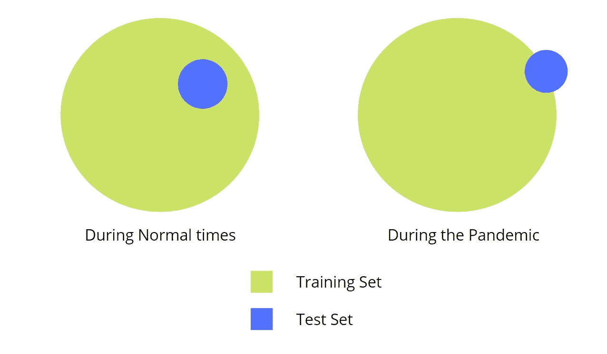

# 为什么人工智能模型在疫情失败了

> 原文：<https://medium.datadriveninvestor.com/why-ai-models-failed-in-the-pandemic-1e57bd0c29fc?source=collection_archive---------9----------------------->

## 和 3 个策略来训练你的模型处理“新常态”

Photo by Fabio on [Unsplash](https://unsplash.com?utm_source=medium&utm_medium=referral)

过去十年，消费科技行业的大量数据涌入，使得机器学习模型在预测用户需求和需求方面变得极其强大和高效。

正是由于这些海量的数据，网飞和亚马逊上的推荐系统可以为我们提供我们从来不知道自己需要的选择。

数据对于这些模型的正常工作极其重要。对网飞来说，我所说的数据是指这样的特征:用户选择看什么电影，看多长时间，他们搜索什么，等等。

基于用户的这些“特征”,网飞然后推荐下一步应该看什么样的内容。

同样，对于亚马逊来说，这是用户在他们平台上的活动。他们搜索什么样的产品，他们购买什么产品，是否有更频繁订购的某些产品，等等。

然而，当新冠肺炎击中，事情发生了变化。突然间，我们开始买以前从未买过的东西。这种转变是突然的:通常在亚马逊上总是排在前 10 名的产品——手机壳、手机充电器、乐高积木——在几天之内就从排行榜上消失了。

深度学习模型通常对异常足够稳健，因为大量正常数据点抵消了异常造成的影响。但是当异常变成新的“正常”时，他们表现很差，因为现实世界的数据与他们接受训练的数据相差太多。

让我们看一个例子。在线杂货配送服务 Instacart 利用模型来预测特定商店某些产品的可用性。从三月中旬开始，他们的准确率[从 93%下降到 61%](https://fortune.com/2020/06/09/instacart-coronavirus-artificial-intelligence/) 。

这意味着什么，为什么这是一个问题？这么想吧。假设你订购的东西在平台上显示为“可用”,但实际上并不可用。因此，它永远不会被送到你家。是的，你确实拿回了你的钱，但是你可能会感到有点恼火。

现在，想象这种事件的发生率增加了五倍(从 7%到 39%)。你会生气的。大概吧。

解释很简单。Instacart 的工程师输入到机器学习模型中以训练它们了解消费者习惯的数据，没有考虑到新的“冠状病毒现实”。

Image by Author via [Canva](https://www.canva.com/)

上图是现有情况的简化 2D 版本。虽然以前训练空间可以成功地“覆盖”大多数测试数据点，但是现在已经不能做到了。

接下来，我将讨论如何优化您的 ML 模型，以应对疫情带来的新形势。

## 1.改变训练集

通常情况下，经验法则是:训练数据集越大，数据驱动模型就越可靠。这是因为更多的数据意味着您能够在更广阔的空间中训练您的数据，涵盖更多的可能性。

然而，在这样一个前所未有的时代，消费者的行为已经发生了变化。这与以前大不相同。

因此，测试集的数据分布与训练集的数据分布截然不同。

在这种时候，让你的训练集更能反映真实世界是明智的。

有两种情况可以做到这一点:

1.  **进行数据合成或数据扩充。**从历史上类似的消费者行为已被证明的先前事件中收集数据点，并以此为基础创建当前时代的数据点。例如，你可以用 2008 年的金融危机。*警告:*你可能仍然得不到反射数据点。我的一个朋友在一家炙手可热的 HFT 公司工作，他告诉我，由于缺乏可靠的先例，他们训练自己的模型变得更加困难。因此，下面是一个更好的选择。
2.  **减少你训练集的规模。**这听起来可能是一个反直觉的想法，所以请听我说完。为了创建高性能模型，理想情况下，训练数据的数据分布应该与开发集的数据分布非常相似。这里有一个必须平衡的权衡:训练数据集有多大与测试集(真实生活)有多相关。不要在成千上万个以前的数据点上训练您的模型，而是在由最近的数据点组成的数据集上训练您的模型。例如，不是根据过去 60 天的数据进行训练，而是根据过去 15 天的数据进行训练。

## 2.更频繁地估计开发集错误

你需要仔细检查你的模型的性能。因此，考虑更频繁地评估开发集错误。

这有助于保持模型的灵活性，并对可能发生的任何新变化做出响应。

> “形势太不稳定了。上周你在努力优化卫生纸，而本周每个人都想买拼图或健身器材。”
> ~ Rael Cline，总部位于伦敦的人工智能咨询公司 Nozzle 的首席执行官[对福布斯](https://fortune.com/2020/06/09/instacart-coronavirus-artificial-intelligence/)

面对如此快速变化的需求，必须不时地估计误差，以确保敏捷性。

一旦计算出误差，就可以在行为专家的帮助下进行分析，以决定可以对模型进行哪些更改。

## 3.调节超参数:

所谓超参数，我们指的是这样的变量:
-学习速率
-执行的迭代次数
-大小和小批量的数量
-优化函数的参数

随着训练集规模的减小，计算量也随之减少。这允许您增加迭代和开发更健壮的模型的时间。

如果实施得好，这三个步骤可以帮助你开发可靠的模型来预测疫情期间的消费者行为。