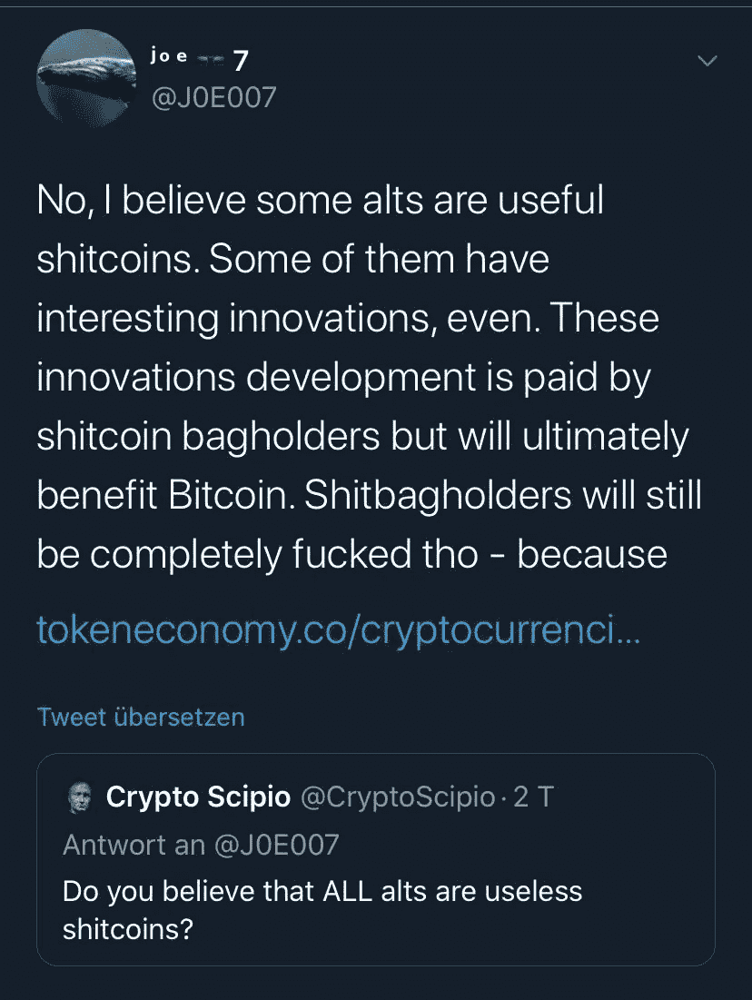

# 为什么所有的 Altcoin 创新最终都会让比特币受益

> 原文：<https://medium.datadriveninvestor.com/why-all-altcoin-innovations-will-ultimately-benefit-bitcoin-9dc9380f18fc?source=collection_archive---------16----------------------->

由于最近几周替代硬币的表现明显优于比特币，许多加密项目的长期效益和有效性引发了一场辩论。

许多著名的比特币支持者公开反对替代币，称它们与比特币相比几乎没有任何价值。例如，一些分析师表示，以太坊目前领先的用例 DeFi 并不比传统金融产品好。

然而，根据一位知名的比特币交易者 Wal 的说法，一些替代币是有用的。警告是，他们提供的创新最终将影响比特币区块链。

Altcoins 有一些好处，但比特币最终会胜出。
2018 年底，一个名为“Joe007”的神秘人物出现在 Krypto Twitter 上。起初，他不是很出名。但当他将自己的账户与一个高利润的 Bitfinex 账户联系起来时，他获得了一大批粉丝。事实证明，Bitfinex 账户每月能带来数百万美元的收入。

除了短暂的停顿，这位投资者已经分享了他对加密市场近一年的强有力的想法。7 月 15 日，当他加入 Altcoin 辩论时，他说

“不，我认为有些 ALTS 是有用的例子。他们中的一些人甚至有有趣的创新。这些创新的开发由 S**TCOIN BAGHOLDERS 支付，但最终将使比特币受益。”

这一评论是在比特币巨鲸表示 FOMO 最终将在 chainlink(链接)市场失败后不久发表的。自 3 月份的退保低点以来，广受欢迎的 Altcoin 的价值已经上涨了近 500%。

该评论与 rt 上的 Keiser Report 的联合组织者、首批公开看涨比特币的人之一 Max Keiser 的说法有些类似。凯瑟最近在接受伦敦皇家银行(London Real)的布莱恩·罗斯(Brian Rose)采访时表示，他认为替代币相对于比特币几乎没有基本面价值。原因是:

“替代币做不到比特币能做或最终会做的任何事情。”

对于匿名应用，BTC 有即将推出的技术，如 Taproot 和 Schnorr 签名。为了立即和便宜的交易，BTC 的用户和开发者使用并集成了闪电网络。对于智能合同，BTC 有砧木和其他产品。

一场大规模的经济冲击即将到来吗？Joe007 是这样认为的
在其中断之前，这位比特币投资者警告说，加密市场最终可能会经历一场大规模的经济冲击。他重复了许多华尔街分析师和经济学家的担忧:

“这将是我们这一代最大的经济冲击。随着时间的推移，它会一波一波地展开，带来虚假的希望，然后摧毁它们。危机的焦点将转移到不同的领域。试图缓解和解决危机将导致更大的混乱”。

然而，他没有提到这次经济冲击会如何影响加密市场。

我在每月一期的 [**简讯中分享了更多私密的想法，你可以在这里**](https://mailchi.mp/bf8f8e8ed697/keep-in-touch-with-lukas) 查看。请在评论中告诉我，并在各种社交媒体平台上加入我:

[**推特**](https://twitter.com/WiesfleckerL)●[**insta gram**](https://www.instagram.com/lukaswiesflecker/)●[**脸书**](https://www.facebook.com/lukaswiesfleckerr)●[**Snapchat**](https://www.snapchat.com/add/luggooo)**●[**LinkedIn**](https://www.linkedin.com/in/lukas-wiesflecker-1b11251a5/)**

**无论你做什么，都要带着爱和激情去做！**