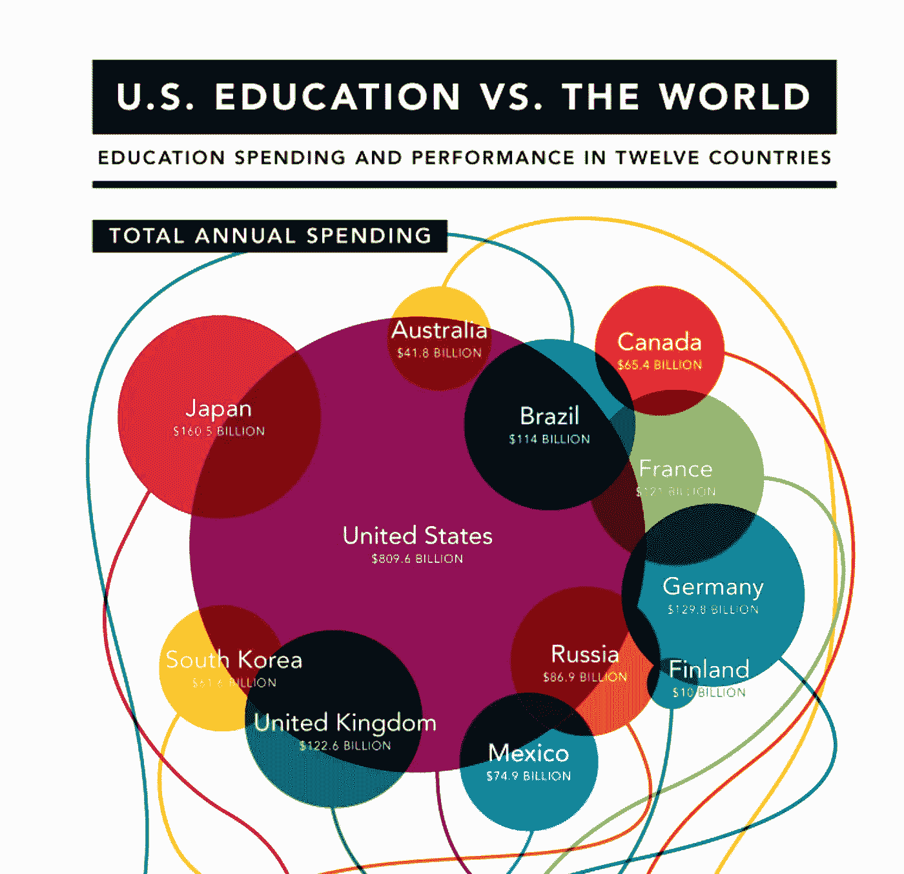
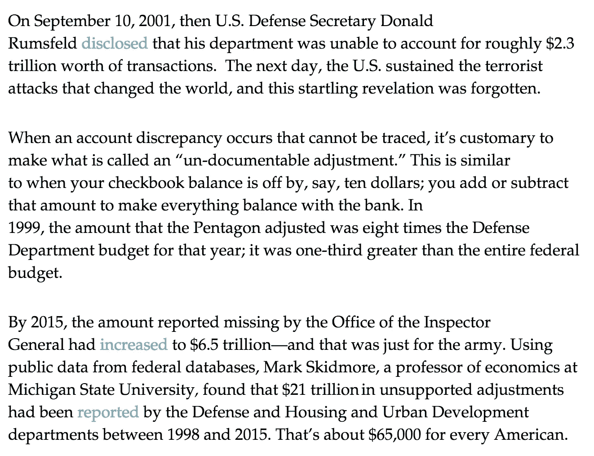
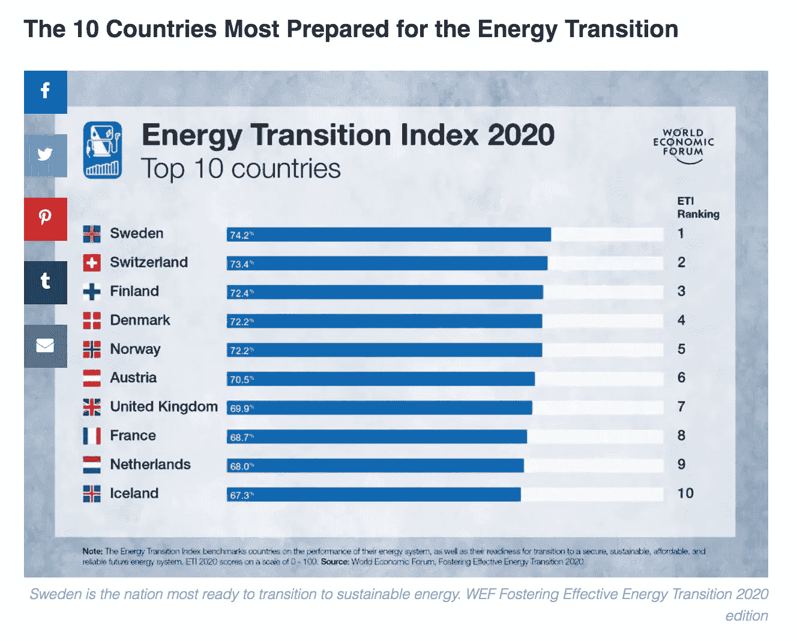

# 为什么美国在前进中会遭受痛苦

> 原文：<https://medium.datadriveninvestor.com/why-america-will-suffer-going-forward-d029c593ca9?source=collection_archive---------15----------------------->

## 美国旧价值观是狗屎吗？

Photo by [Jacob Morrison](https://unsplash.com/@jacobmorrison?utm_source=medium&utm_medium=referral) on [Unsplash](https://unsplash.com?utm_source=medium&utm_medium=referral)

把你的手肘收起来

“进去了。”

“不，它不在。把球放进你的口袋，把你的胳膊肘伸进去。”

我小时候想踢我爸的小腿。像骡子一样，只要他走过就踢他。我爸爸很固执。老派。胡子刮得干干净净，最糟糕的是，他从不在早上五点以后睡觉。他总是告诉我如何打扫我的房间。整理我的床。如何做人。如何行动。如何玩我喜欢的游戏？

公平地说，他在很多事情上都是对的。

"特雷弗，最重要的是，你要珍惜做最好的自己."

“我听到了，爸爸。”

*但是真的，*在我的脑海里，我期待着从他的版本中释放出我最好的自己。我迫不及待地向世界展示我作为一名年轻企业家和运动员的勇气，以一种对我有意义的方式。

然而，当我的家庭价值观与美国价值观(我会不惜一切代价成为最棒的)混合在一起时，我意识到我们在美国玩的是一场多么致命的游戏。我们的美国价值观正在无声无息地杀死我们吗？我们今天的美国价值观是什么？

对美国以外的世界来说，我们是又大又胖的恶霸，手持大棒。

# 美国将会遭殃，因为他们的价值观没有进化到反映一个整体的、繁荣的社会或团队。

我的父亲是一名篮球教练，为人谦逊。他从不吹嘘我的游戏。当我成为职业选手时，我从不夸耀自己的表现。他教会了我谦逊。让你的游戏来说话。

> 如果我们看看美国，我们对世界说了什么？我们的游戏在说什么？

我的大学和职业教练练习谦逊、纪律和努力。我认为在一个人尽最大努力和半吊子努力之间划一条清晰的界线是很重要的。我让美国人民投票给特朗普，即使他们不理解他作为我们自由世界领袖的价值观。人们受够了当权派。人们受够了水中的铅。但是无论我们的政府变成了什么样子，它都没有引领我们走向更好的价值观。

 [## 美国人永远不该学的一课|数据驱动的投资者

### 美国人永远不应该吸取安妮·劳里在她的文章《美国人的教训》中所提倡的教训

www.datadriveninvestor.com](https://www.datadriveninvestor.com/2020/09/03/the-lesson-americans-should-never-learn/) 

提示，看推特就知道了。

不管我们的政府对 COVID 的反应，对创造数万亿美元的债务(同时允许说客，欺诈和无休止的腐败由纳税人支付)，对扩大不平等的差距，最糟糕的是，没有更新我们的基础设施，健康，最大限度地减少资源，拯救地球母亲…

> 我会说美国的价值观是狗屎，鱼从头开始腐烂。

全世界都在嘲笑我们。

是的，我们就是那个在中学穿着皮夹克留着胡子威胁要找书呆子麻烦的恶霸。我们在世界各地都有军队。我们在军事上的花费越来越多:

> 2018 年美国军费/国防预算为**6488.0 亿美元**，比 2017 年**增长 7.1%**。
> 
> 2017 年美国军费/国防预算为**6058.0 亿美元**，比 2016 年**增长 0.95%**。
> 
> 2016 年美国军费/国防预算为**60011 亿美元**，比 2015 年**增长 0.67%。**
> 
> 2015 年美国军费/国防预算为**59610 亿美元**，比 2014 年**下降了**2.26%。

常识告诉我，我们美国人的肤浅、奢侈和试图维持军事帝国的扩张最终会导致我们的灭亡(就像我小时候读过的所有其他衰落的帝国一样)。

贪婪在美国是真实的。我们得到的比我们需要的多，我是那些试图回归简单的人之一。回报，这很难，因为我的美国价值观一直告诉我消费，使用，赚钱，努力，竞争地位。

依我拙见，我们应该伸手下去，把美国一些陈旧的低劣价值观装进塑料袋，然后扔掉。

## 我们需要一个告诉美国真相的领袖或教练:

"把胳膊肘伸进军队，你就不能再经营一个低劣的退伍军人管理局或花费超过你所需要的."

“把球装进你的口袋政府，我们每年不能占几十亿美元(*像什么*？)."

“玩聪明点，谦虚点，不要吹嘘自己的天赋美国。”

大多数人想来美国寻找美国梦。平等。自由。对幸福的追求。自由。然而，在这里，在这个美国辉煌的地方，工人和美国人感到比以往任何时候都更加孤独，与他们的人民和国家脱节。*

# 在我们正在消亡的社会中，美国梦是什么？

来密歇根州的弗林特吧，这里的水是有铅的。

来到印第安纳州的加里，我们的教育和社区都失败了。

来到芝加哥南部，这里几乎没有投资、教育、医疗和社区。

来到华盛顿特区，自由世界的首都，哥伦比亚特区的学生在美国的数学成绩[最低，落后于 29 个国家的学生，但领先于 14 个国家。](https://www.greatschools.org/gk/articles/u-s-students-compare/)

来美国吧，在这里，邮政编码和教育、医疗保健和资源的不平等决定了你最有可能为自己创造的世界。

来美国吧，在那里我们在教育、能源和医疗保健上的花费比世界上任何一个国家都要多，但结果却乏善可陈。

不要误解我。

美国确实有巨大的潜力。

因为我们的人民很特别。

我们可以关心。

我们可以努力工作。

我们可以一起分享和工作。

只需要领导才能把我们团结起来。

在社交媒体上创造对话，而不是愤怒的爆发和发脾气。

# 在世界各地生活了几十年后，我意识到美国是如何未能响应某些我想要庆祝和珍视的价值观的号召。

*   我不想在 65 岁之前朝九晚五地工作。
*   我不想每月支付 500 美元的医疗保健费用。
*   我不想住在一个不关心彼此的地方，最重要的是，我不想再感到孤独。*
*   我想不断学习和教育自己新的行业、技能和概念，帮助我创造一个平衡的生活、联系和有意义的工作(不用抵押我的房子)。

事实是，在美国，我很少感到与我的部落或社区有联系，因为我们许多人似乎都庆祝和持有这些价值观。

住在这里有错吗？

也许吧。也许我应该离开。

也许我会的。

但还没有。现在，我想试着在我出生的国家谈论更好的价值观——因为我们已经到了也许应该发展它们的时候了。

# 个人或社区层面的价值观有什么意义？

我重视努力工作。保持我的手肘在里面。我重视分享和帮助他人实现目标。我重视联系和笑声、健康和自由。我不重视支付令人发指的税或金钱的东西不能有效地工作。

我们纳税人的钱花在了我们作为一个国家所坚持的价值观上，就像我们的钱花在了我们所重视的企业和产品上一样。

但是如果他们不给我们更多的回报，我们为什么要重视他们呢？

为什么我们要在我们的军工复合体上花费数万亿？我们是在第三次世界大战中吗？然而，几十年来，我们一直在全球范围内花费在战争和军队住宿上(还记得罗马帝国是如何失败的吗？)

我的继父在密歇根改造退伍军人事务部工作，他说那是在赔钱。我的军事朋友告诉我，他们必须使用全部的军事预算(在他们根本不需要的东西上)，否则他们可能会失去明年的一些钱。

***我相信他们俩。***

> 与此同时，在弗林特，仍有纳税人死于铅水。

[Photo credit](https://www.city-journal.org/html/americas-missing-money-15725.html)

> 2.福利诈骗 15 亿左右。失业诈骗 20 亿。*
> 
> 3.自掏腰包支付健康保险，你知道这是欺诈行为。在比利时，我花很少的钱就能得到很好的护理。我们每年实际的医疗保险诈骗高达 1000-3000 亿美元。*
> 
> 4.我们的公司购买立法者(和法律)，然后以数万亿美元的金额，欺骗在他们那里投资或存款的普通人，每个公民花费他们超过 45，000 美元。*
> 
> 5.我们使用的能源比世界上任何一个国家都多，甚至不准备为一个实际上需要可持续能源的地球尝试转向可持续能源。

# 我真正关心的是帮助我们到达我们想去的地方。

我只是不知道那是哪里，美国？

这是我对自己生活的看法:

我会找到一个健康的地方，在那里我可以胜任我想做的事情。

我会感觉到一种归属感，与周围的人和环境的联系和分享。

我将过真实的生活，关心我周围人的平等、幸福和自由。

我希望我们能以更好的价值观开始生活，为我们的整个社会创造更好的东西。

为我们整个美国队。

*   从书上看， ***部落*** 出自塞巴斯蒂安·荣格尔。

**访问专家视图—** [**订阅 DDI 英特尔**](https://datadriveninvestor.com/ddi-intel)