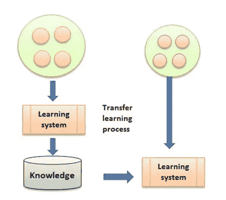
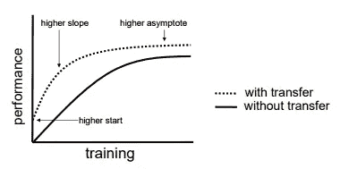
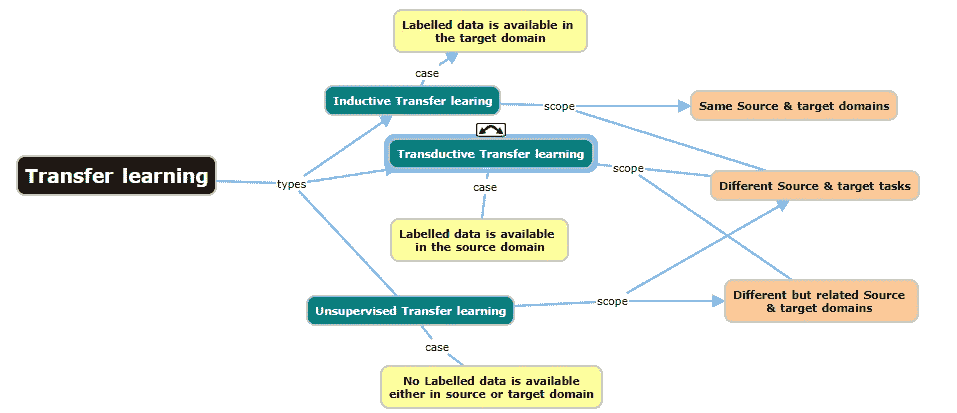
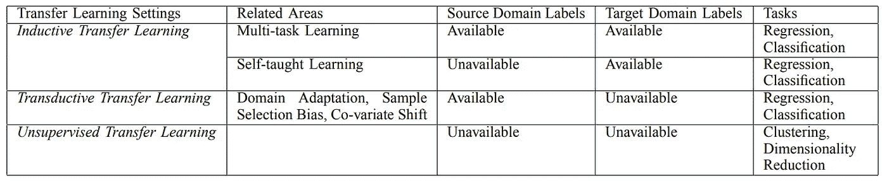
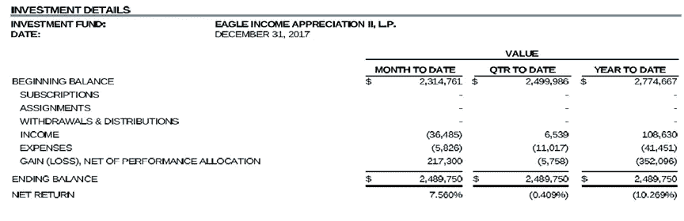
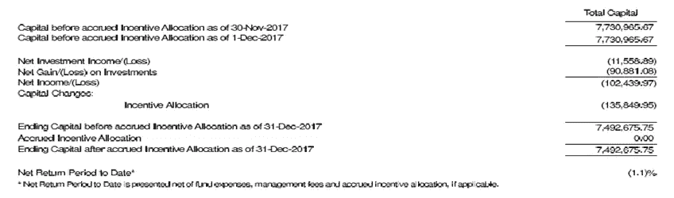

# 企业为什么以及如何采用迁移学习？

> 原文：<https://medium.datadriveninvestor.com/why-and-how-enterprises-are-adopting-transfer-learning-9f599a137f3d?source=collection_archive---------7----------------------->

我们看到，在使用机器学习和深度学习的同时，整个企业都在采用迁移学习技术。这就是为什么…

传统上，对于每个新的学习问题，所有的机器学习算法都假设从头开始学习。假设之前的学习不会被利用。迁移学习在学习周期时间和提高模型性能方面不同于其他方法。在学习问题的领域相关的情况下，将会有一些可以从过去获得和使用的知识。一些常见的例子包括:

1.  法语知识可以帮助学生学习西班牙语
2.  数学知识可以帮助学生学习物理
3.  驾驶汽车的知识可以帮助司机学习驾驶卡车
4.  识别猫的知识可以帮助计算机识别老虎

在机器学习环境中，这指的是识别从先前任务中积累的知识，并将其应用于相关领域的新任务。这里的关键是识别领域间共性的能力。强化学习和分类回归问题应用迁移学习。迁移学习流程如下所示:

在迁移学习中，终端用户可以选择使用历史数据训练一个选定的模型。将算法的结果与实时结果进行比较。一旦结果显示具有可接受的误差范围的相当数量的准确性，最终用户可以使用相同的算法来分析实时数据。这种功能在生产前和生产环境之间，或者在边缘和数据中心环境之间最适用。更复杂用例的发展需要供应商和最终用户双方的成熟和高级技能

当迁移学习作为洞察力生成的一部分应用时，其优势如下:

*   由于来自源模型的输入为学习者提供了前进的道路，因此有可能在开发时间上获得**。**
*   当所谓的无知学习者(在筒仓中学习的学习者)面对来自源模型的知识时，基线性能可能会由于潜在的知识转移而提高，从而导致基线性能的整体提高。从而导致**车型**的总体**改善**最终**性能**。

如果发现下面的表示对于理解迁移学习的好处非常有价值，那么很明显，当应用迁移学习时，训练数据性能得到了缓解。

Source: Transfer Learning, Lisa Torrey and Jude Shavlik

# 迁移学习类型

基于迁移学习的定义，我们总结了传统机器学习和各种迁移学习设置之间的关系，其中我们根据源和目标域和任务之间的不同情况，将迁移学习分为三个子设置，归纳迁移学习、直推迁移学习和无监督迁移学习。下面的思维导图显示了不同类型的迁移学习，以及每种类型的范围和基本定义。

标记数据的可用性因迁移学习的类型而异。下表显示了带标签的数据和任务的详细信息。

# 训练模型是一个复杂的过程

迁移学习的最大优势之一是，它有助于克服训练模型所需的大量训练数据，因为它有助于应用现有知识。企业现在正在开发多用途的机器学习模型，帮助优化模型训练时间。

 [## 金融中的机器学习|数据驱动的投资者

### 在我们讲述一些机器学习金融应用之前，我们先来了解一下什么是机器学习。机器…

www.datadriveninvestor.com](https://www.datadriveninvestor.com/2019/02/08/machine-learning-in-finance/) 

为了使机器学习模型具有更高的预测精度，应该有足够的训练数据可用，或者甚至在某些情况下，注释训练数据是耗时的，并且可能变成繁重的手动任务。迁移学习仍然可以使用可用的数据质量来完成任务，甚至减少注释数据所需的资源。

# 神经网络中的迁移学习

我们看到在自然语言处理和图像识别的神经网络中使用迁移学习的许多应用。最近，迁移学习在机器人流程自动化(RPA)工作流中的应用。

众所周知，神经网络在细粒度级别上有效地解决问题，因此解决模糊问题，如视觉、机器翻译、语音到文本和现代 NLP。

使用迁移学习训练神经网络的用例广泛用于使用非结构化文本的智能文档处理。自然语言处理和文本分析平台涉及定义词汇表、分类法、词类和详尽的属性列表，以从文本中分类和提取信息。在金融服务和医疗保健等特定业务领域中，使用神经网络有一个特定的优势，即构建特定的自定义数据字典可以从金融或患者记录文档中提取所需的数据属性。

# **用例:**来自非结构化图像的发票数据(未标记)

这是一个特定于领域的用例，其中来自供应商的多张发票被处理，提取的数据被接收到一个会计系统中。收到的发票格式不同，在某些情况下可能包含手写内容。下面给出了一些发票样本:

样本 1:

样本 2

需要提取的一些重要的域特定数据标签是“季度至今”、“年初至今”、“总金额”、“发票日期”等

在这种情况下，使用迁移学习来标记从发票中提取的非结构化数据。领域特定的单词包是关键的和可重用的。视觉和 NLP 处理步骤都使用迁移学习过程。

# 结论

这些不同的迁移学习方法对于减少组织训练深度神经网络所需的示例数据量至关重要。当与深度学习计算配对时，神经网络适用于大多数企业流程自动化任务，包括复杂的文本分析用例。目前，迁移学习可能是解决抑制机器学习采用的训练数据问题的最有效的方法。

*重要参考文献*

1.  TensorFlow 教程:[用预训练的 ConvNet 进行迁移学习](https://www.tensorflow.org/tutorials/images/transfer_learning)
2.  r 代码:[使用预先训练好的模型](https://cran.rstudio.com/web/packages/keras/vignettes/applications.html)

***IMP:*** *这篇博客摘自我的一篇关于机器学习的出版物，更新后包括了迁移学习的最新进展。欢迎读者的反馈和评论*