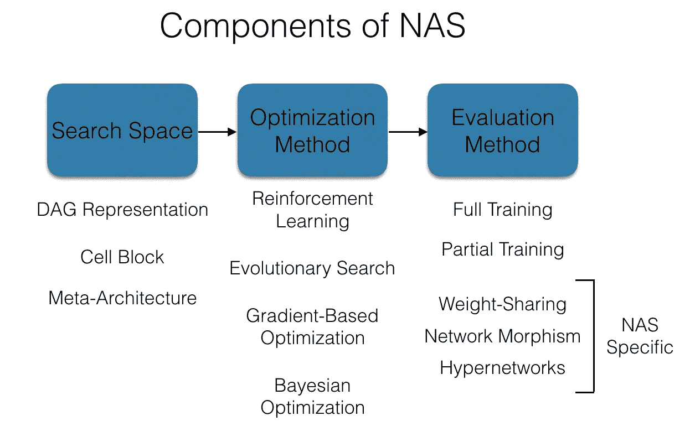
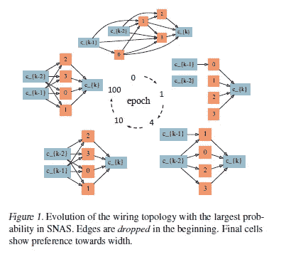
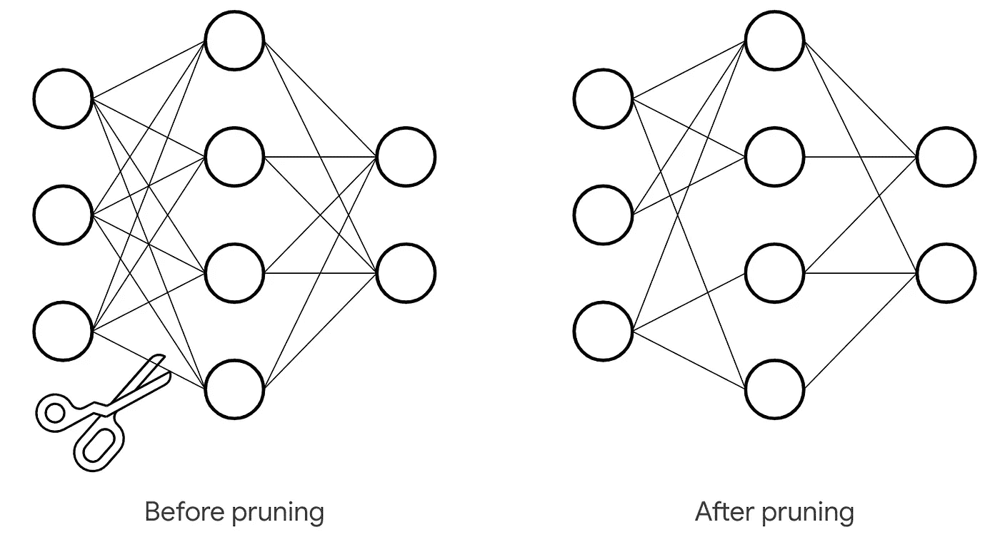
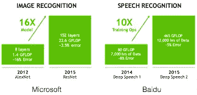
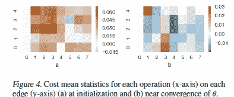
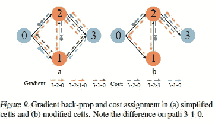
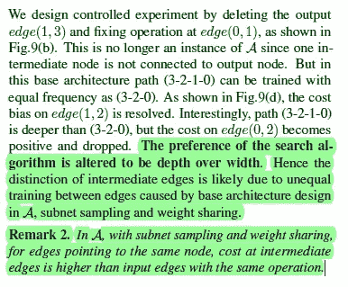
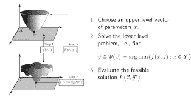
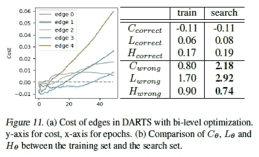

# 神经架构搜索为什么会有偏差，如何有偏差？

> 原文：<https://medium.datadriveninvestor.com/why-and-how-is-neural-architecture-search-is-biased-778763d03f38?source=collection_archive---------10----------------------->

## 这对他们的表现意味着什么？

神经架构搜索(NAS)被吹捧为机器学习的重大突破之一。这是一种自动设计神经网络的技术。作为一个对自动化和机器学习感兴趣的人，这是我已经关注了一段时间的事情。最近谢思睿等人的一篇名为《[理解可分化神经结构搜索](https://arxiv.org/pdf/2009.01272.pdf)中的连线进化》的论文引起了我的注意。深入研究了“*神经架构搜索方法是否有效发现布线拓扑*”的问题。本文通过提出“*现有框架搜索算法的统一观点，将全局优化转化为局部代价最小化*，提供了一个评估偏差的框架。它清楚地表明，差异化 NAS 在设计网络时是有偏见的，并在 3 种常见类型的基础上进行扩展。

A quick overview of the NAS. The paper looks at Differentiable (calculus-based) NAS

在这篇文章中，我将解释偏见的类型，它们为什么存在，以及它们是如何被发现的。通过理解这些技术，您将能够理解如何实现它们来评估您自己的 NAS(以及其他相关技术)。请务必留下您对本文的反馈，如果您觉得有用，请分享。**注意:我使用的是 NAS，但本文和文章是专门针对差异化 NAS 的。其他的实验还没有完成。**

如果您想更全面地了解 NAS，请观看下面的视频

Don’t forget to like, sub, and comment

# 三种偏见的故事

Read like a clock.

该团队对通过 NAS 创建的差异化网络中的 3 种常见模式进行了彻底的调查。用团队的话说:“*我们的研究是由可区分 NAS 的三种观察到的搜索模式激发的:1)它们通过增长而不是修剪来搜索；2)较宽的网络比较深的网络更受青睐；3)在双层优化中不选择边”。*图 1 是论文中以简明的方式显示前两种方法的插图。

该团队为每种模式提供了可能的原因，并对他们的理论进行了验证。我将详细解释每一个问题。

## 模式 1:生长而不是修剪

Pruning as an example

那些熟悉树木和反向传播的人会认识到术语修剪。修剪是指删除树(或一般图形)中所有冗余或无用的边。这对于优化算法非常有用，并用于简化决策树。由于神经网络具有与有向加权图相同的结构，所以可以实施修剪来降低网络的成本，同时有时通过减少由于使用较低质量的节点而可能发生的错误来提高结果。

A quick Demo of how effective it can be

但是，在可区分的 NAS 框架中，我们看到了其他情况。第一步不是对网络中的低质量边进行神经网络狙击，而是让网络丢弃所有边。然后，它继续挑选分数最高的。这本身可能不是问题，但会导致一些棘手的情况。这个证明的许多细节和细微差别涉及大量的数学运算，这将需要整个系列来分解。如果你感兴趣，它们在第 5-7 页。在我的论文注释版(链接在文章末尾)中，我已经强调了重要的方面。它们应该有助于更好地理解流程。在这里，我将附上显示趋势的图表，这些图表清楚地显示了增长的趋势。

*令人惊讶的是，对于除 None 以外的所有操作，成本在初始化时都倾向于正值(图 4(a))。类似地，我们在更新 150 个时期的权重参数 4 后，在架构参数仍然固定的情况下，估计成本均值统计。如图 4(b)所示，大部分成本为负。很明显，在开始时，没有哪种操作是首选的，因为它们可以最小化这些成本。而在培训后，成本最小化者会更喜欢负成本最小的操作*。无操作的成本为 0，因此最容易降低成本。随着训练的进行，我们看到了从积极到消极的转变。这表明单元布线拓扑实际上正在增长。

 [## 什么是数据目录，它如何使机器学习取得成功？数据驱动的投资者

### 数据目录是机器学习和数据分析的燃料。没有它，你将不得不花费很多…

www.datadriveninvestor.com](https://www.datadriveninvestor.com/2020/08/27/what-is-a-data-catalog-and-how-does-it-enable-machine-learning-success/) 

## 模式 2:重宽轻高

这个稍微好理解一点。证据来源于对第一个假设(NAS 偏向增长超过修剪)收集的数据的分析。简而言之，我们想知道 NAS 创建的网络是否偏向宽神经网络而不是深神经网络。要理解这种区别，请看下图。宽网络会有很多输入图层，而深网络会有更多图层。另一种理解方式如下:**宽网络层数少但每层神经元多，而深网络层数多但每层神经元少**。

A standard Neural Net

这以一种简单的方式表明了自己。还记得 NAS 网络是如何从一开始就丢弃所有层的吗？在成长过程中，我们看到网络明显倾向于在进入中间(隐藏)神经元之前恢复输入神经元的边缘(连接)。为了理解宽度偏差，我们需要理解两件事:1) NAS 区分输入神经元和中间神经元；2)偏向前者。我们还需要证明这些问题是由 NAS 中的偏差引起的。

Cell refers to neurons

这篇论文假设偏差的产生是因为中间细胞(神经元)训练不足。举一个论文中的例子:"*注意，在 A 中，每个输入后面都必须有一个输出边沿。反映在简化单元格中，0；1 和 0；2 总是被训练，只要它们不被采样为无。特别是 0；1 使用两条路径(3–2–1–0)和(3–1–0)的渐变进行更新。当在边沿(1；2), 0;1 可以用来自路径(3–1–0)的渐变进行更新。然而，当在边沿(0；1), 1;无法更新 2，因为其输入为零。即使 edge(0；1)，共享训练信号的路径(3–2–1–0)上的模型实例比路径(3–2–0)和(3–1–0)上的模型实例多。”*

通过以下实验验证了这一点:

通过训练，我们可以改变从宽度到深度的偏好，我们发现不平等的训练是偏差的原因。

## 模式 3:在双层优化中没有选择边

Bi-level optimization visualized

双层优化是一种特殊的优化，其中一个问题嵌入(嵌套)在另一个问题中。外部优化任务通常称为上层优化任务，内部优化任务通常称为下层优化任务。出于某种原因，我们发现双层优化任务无法与 NAS 生成的网络相融合。

这篇论文没有详细说明原因和证据。它通过“*来解释这种模式。图 11(b)显示了训练集和搜索集中 L 和 H 的比较。为了正确分类，L 和 H 在训练集和搜索集中几乎是可比较的。但是对于分类不正确的数据，分类损失 L 在搜索集中要大得多。也就是说，搜索集中的数据分类很差。这可以用过度拟合来解释…总之，子网络错误地相信保留集，在保留集上，它们的较大部分实际上表明了它们的错误分类。因此，双层优化中的成本和变得越来越正。在所有边上都选择了无操作。*

如果这是有点多，这里的总结:有一个过度拟合的迹象(错误分类的大错误)。这导致双层优化的成本上升，导致 NAS 在边缘选择无。

# 扩展ˌ扩张

这篇论文很好地揭示了通过可区分的神经结构搜索方法创建神经网络背后的秘密。对其他协议(进化算法)等的分析将是有趣的。除此之外，这篇论文非常全面。

# 向我伸出手

请在下面留下您对这篇文章的反馈。如果这对你有用，请分享并跟我来这里。我这里有很多文章。拍手对我帮助很大。使用以下链接与我保持更多联系。

查看我在 Medium 上的其他文章。:[https://rb.gy/zn1aiu](https://rb.gy/oaojch)

我的 YouTube。这是一个正在进行中的工作哈哈:【https://rb.gy/88iwdd 

在 LinkedIn 上联系我。我们来连线:【https://rb.gy/m5ok2y】T4

我的推特:[https://twitter.com/Machine01776819](https://twitter.com/Machine01776819)

我的子任务:[https://devanshacc.substack.com/](https://devanshacc.substack.com/)

如果你想和我一起工作，请发邮件给我:devanshverma425@gmail.com

twitch 现场对话:[https://rb.gy/zlhk9y](https://rb.gy/zlhk9y)

获取我的内容更新-insta gram:[https://rb.gy/gmvuy9](https://rb.gy/gmvuy9)

获得罗宾汉的免费股票:[https://join.robinhood.com/fnud75](https://www.youtube.com/redirect?redir_token=QUFFLUhqa0xDdC1jTW9nSU91WXlCSFhEVkJ0emJvN1FaUXxBQ3Jtc0ttWkRObUdfem1DZzIyZElfcXVZNGlVNE1xSUc4aVhSVkxBVGtHMWpmei1lWWVKNzlDUXVJR24ydHBtWG1PSXNaMlBMWDQycnlIVXNMYjJZWjdXcHNZQWNnaFBnQUhCV2dNVERQajFLTTVNMV9NVnA3UQ%3D%3D&q=https%3A%2F%2Fjoin.robinhood.com%2Ffnud75&v=WAYRtSj0ces&event=video_description)

# 高亮纸

下面是论文。我强调了我认为重要的东西，并给一些重要的概念添加了定义。希望有帮助。这篇论文有很多关于数学的细节，你可能会感兴趣。

## 访问专家视图— [订阅 DDI 英特尔](https://datadriveninvestor.com/ddi-intel)