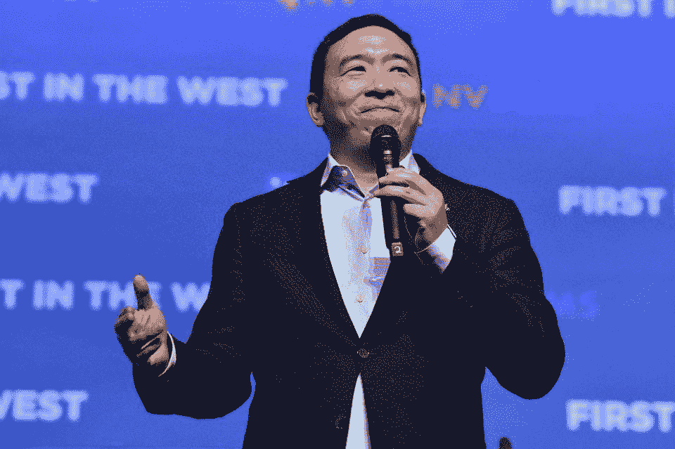
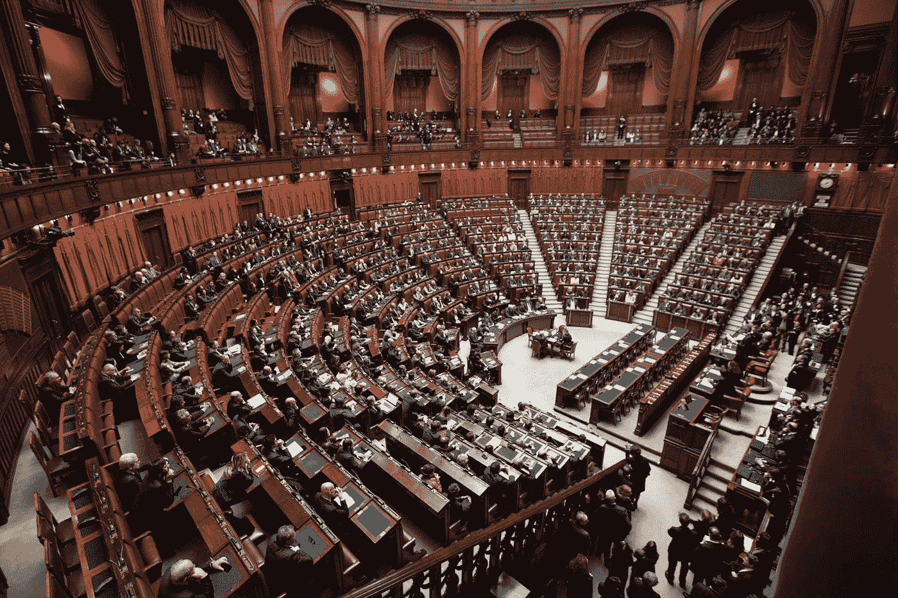
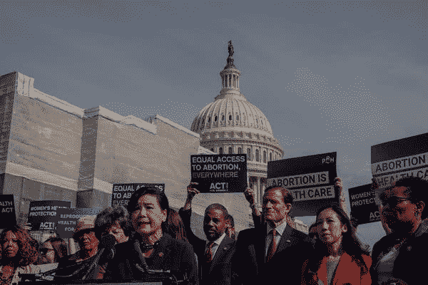
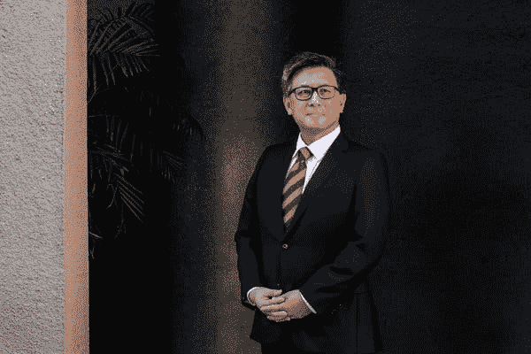
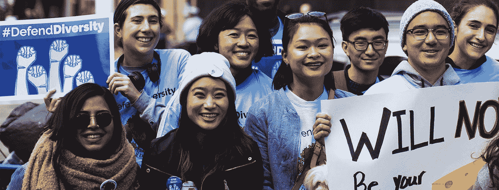

# 为什么杨安泽对所有亚洲人都很重要

> 原文：<https://medium.datadriveninvestor.com/why-andrew-yang-matters-to-all-asians-1898e959bf87?source=collection_archive---------9----------------------->

## 他可能输掉了总统竞选，但他帮助解决了所有亚洲人面临的一个更广泛的问题

Source: [https://www.forbes.com/sites/michelatindera/2020/12/30/here-are-the-billionaires-donating-to-andrew-yangs-presidential-campaign/](https://www.forbes.com/sites/michelatindera/2020/12/30/here-are-the-billionaires-donating-to-andrew-yangs-presidential-campaign/)

杨安泽出生于纽约州的斯克内克塔迪，一直处于总统竞选的最前沿。只是在上周，他决定退出，因为他认为他不会赢得整个事情。

> 杨在曼彻斯特对支持者说:“虽然还有很多工作要做，但你们知道我是个搞数学的，今晚的数字很清楚，我们不会赢得这场比赛。”。

更著名的是他在 Joe Rogan 播客上发现的“自由红利”，这是一项专注于提供 1000 美元普遍基本收入的政策，因为他认为人工智能和自动化将取代数百万个工作岗位。

 [## 保护主义、政治和经济动荡|数据驱动的投资者

### 美国股市昨日出现 400 多点的大幅反转，为未来的事情发出了警告信号。市场…

www.datadriveninvestor.com](https://www.datadriveninvestor.com/2018/06/28/protectionism-politics-economic-turmoil/) 

杨安泽不仅带来了新的观点，而且他是全世界所有亚洲人的代表，尤其是在西方国家。

但是为什么杨安泽在这一切中如此重要呢？

# 杨安泽给了我们一些话题

Photo by [Marco Oriolesi](https://unsplash.com/@marcooriolesi?utm_source=medium&utm_medium=referral) on [Unsplash](https://unsplash.com?utm_source=medium&utm_medium=referral)

首先，我是在澳大利亚出生的中国人，所以我甚至不是美国人。

我在美国有很多朋友，但我对政治从来不感兴趣，更不用说在别的国家了。

直到其中一个人问我:

> “那你听说过杨刚吗？”

我的第一个想法是，哦，听起来像是某个*犯罪组织。*

在发现他是一名美国台湾总统候选人后，我的兴趣有所增加。

> “是的，他正在为每个人制定某种 1000 美元的基本收入政策”

老实说，我对此的第一个想法是，“*这听起来有点傻*”但是当我深入研究后，它变得更有意义了。

自从杨安泽成名后，我越来越多地听到他出现在人们的对话中。

这些对话不一定都是积极的。一些人把对他的政策的批评作为讨论的焦点。

但有一点是清楚的，我们投资于他所做的事情，因为他是一位我们可以尊敬的亚洲政治家，因为很难找到一个人处于他的政治地位。

这让我们更加惊讶，因为我们正在谈论一些我们以前从未谈论过的事情，一个亚洲人成为美国总统的可能性。

***但是为什么这个首先就要惊艳呢？***

# 亚洲人在历史上一直代表不足

Source: [First Chinese American, Congresswoman Judy Chu](https://www.nytimes.com/2019/12/19/us/politics/Andrew-Yang-2020-Democrats-Debate.html)

在职业层面上，亚裔美国人占劳动力的 27%以上。这是相当可观的，但当你进一步挖掘，你开始看到模式出现在某些行业以及高管。

仅从美国的政治来看，我们看到亚裔美国人在政府中的代表性非常低。

> “亚裔美国人在政治上被忽视，这是我们长期以来的一个问题，”第一位当选国会议员的华裔女性、代表加州帕萨迪纳市的朱女士说。“当谈话涉及有色人种时，我们总是确保我们被包括在内，我们必须参与到这个过程中来。”

不仅如此，在公司阶梯上，财富 500 强中只有 1.5%是亚裔美国人。

# 亚裔美国人争取领导权(以及在西方国家)的原因是什么？

正如加州前财政部长姜大卫所说，“*很多时候，亚洲人不被视为领导者，但他们被视为有能力”。*

Source: [John Chiang](https://www.nytimes.com/2019/12/19/us/politics/Andrew-Yang-2020-Democrats-Debate.html)

这几乎形成了一种观点，即亚洲人更适合中低层管理职位，因为他们有能力胜任这些职位。

**作为一个少数民族**，亚洲人在几乎每一个领域(公司、演员、政治等)都严重缺乏代表性并受到歧视。)在西方社会。

像“竹天花板”这样的概念存在于许多亚洲人在西方社会面临的障碍中，由于这些刻板印象，他们无法攀登公司的阶梯。以下是一些统计数据，以强调该问题在各种角色中的普遍程度:

*   30-31%的 AAPIs 报告了工作场所的歧视，这是所有种族中最高的比例。
*   亚裔美国人占硅谷科技公司专业职位的 47%,但仅占高管职位的 25%。
*   64%的电视节目没有亚裔美国人或太平洋岛民的代表

虽然看起来已经取得了很大的进步(我可以肯定地说已经取得了)，但在更广泛的对话中，亚裔美国人(以及全球西方社会中的亚裔)也经常被排除在关于有色人种的对话之外。

正如日裔美国民主党议员马克·高野所说，问题变成了亚洲人如何经常被排除在与“有色人种”有关的事情之外。

> 高野先生说，“即使在进步人士中，这也是一个盲点。”。“根据我的经验，进步人士被许多受过教育的白人所控制。他们往往认为非裔美国人和拉丁美洲人是有色人种，而亚裔美国人不知何故不算。”

尽管杨安泽历来回避任何有关种族的话题，但很明显，在他的集会上，有很多年轻的亚裔美国人支持和参加。

他们中的许多人不仅支持他的政策，还因为他们很高兴在舞台上看到像他们一样的人。

***那么，为什么杨安泽在这一切中如此重要呢？***

# **这对我很重要，因为他代表了什么**

Source: [https://insights.som.yale.edu/insights/stereotypes-of-asian-americans-skew-estimates-of-racial-wealth-gap](https://insights.som.yale.edu/insights/stereotypes-of-asian-americans-skew-estimates-of-racial-wealth-gap)

对我来说，他退出总统竞选并不重要。

## 对我来说，杨安泽是一个值得尊敬的人，他会说，“是的，这本来是可能的”。

对我来说，这比赢得总统竞选重要得多，即使我同意或不同意他在竞选中的观点。

最重要的是，它让西方国家的亚洲人得以一瞥亚洲人如何超越刻板印象。

他代表了亚洲人打破统计数字、追求历史上不利于他们的行业角色的一个原因。

就我个人而言，这是我与他人分享我对某个人的看法的一个原因，我们可以把这个人看作是全世界所有亚洲人的榜样，甚至是非西方国家的亚洲人。

当然，对他来说赢得它是令人敬畏的，但是现在，这就是我们所拥有的，我们必须开始并让这个问题更加明朗。

但是谁知道呢，也许在不久的将来我们会有一位亚裔美国人领袖。