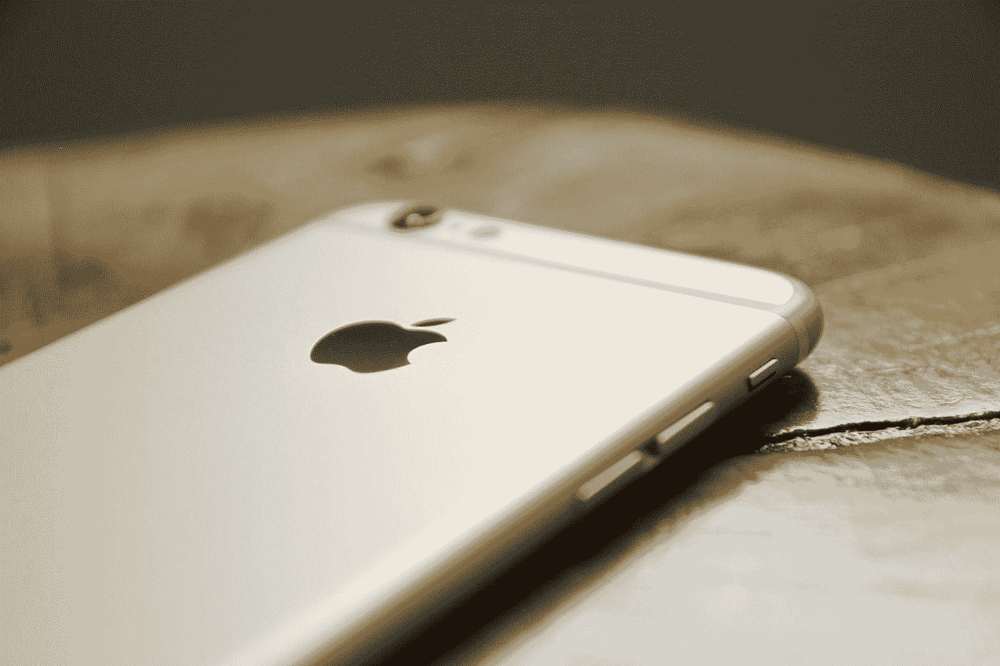

# 为什么苹果一直是统治所有这些公司的人

> 原文：<https://medium.datadriveninvestor.com/why-apple-continues-to-be-the-one-to-rule-them-all-f1e9ead93094?source=collection_archive---------9----------------------->

## 技术

## 苹果不仅仅是一家科技公司，它还是一种生活方式。

Photo by [Marc-André Julien](https://unsplash.com/@majulien?utm_source=medium&utm_medium=referral) on [Unsplash](https://unsplash.com?utm_source=medium&utm_medium=referral)

如果你今年没有看过苹果的任何活动，你真的应该看看。首先，这可能会让你感到震惊，但我不是在苹果电脑上写的。没有 MacBook，没有 M1 芯片。我不是一个每年不断升级设备、拥有苹果电视、使用 iCloud 的苹果粉丝。我在一台老式笔记本电脑上写这篇文章，这台电脑看起来比恐龙还要早，目前键盘旁边贴着“能源之星”和“英特尔”芯片标签。是的，英特尔贴纸是一个东西。

话虽如此，我每年都会认真观看苹果的活动。它们真的是事件。不仅仅是在展示方面，而且在创新、创造力和灵感方面。如果你认为这是一个延伸，再想想。上一次任何科技活动或设备发布重塑并彻底改变人类相互交往、工作和生活的方式是什么时候？作为 80 年代的孩子，诺基亚和索尼是计算机、创新和通信的先驱。不知何故，一路走来，他们停止了发明。这也是史蒂夫·乔布斯让所有人大吃一惊的地方。还记得那些 1 万美元的 Vertu 手机吗？没有吗？对你有好处。它只是一部为超级富豪打造的手机，镀有金和钛，以证明其天文价格的合理性，其基本功能与当年标准的诺基亚手机相同。

然而，苹果不仅通过其操作系统，而且通过产品变化和定价，通过越来越多的普通公众可以获得的产品，革新了并继续处于技术的前沿。除此之外，苹果还在桌面上提出了艰难的对话以及所有的技术进步。今年，苹果比以往任何时候都打了许多重要的本垒打，从让世界嗡嗡作响的 M1 硅芯片到让每个人都头晕目眩的多种尺寸的 iPhone 12！你想要 iPhone 12 mini 吗？正常？亲？还是 pro max？这让我重温了我站在星巴克排队的经历，在那里我的咖啡选择需要像军队一样精确地考虑。双摄？大杯还是大杯？豆奶还是 2%牛奶？嗯，你明白了…

在 2020 年 10 月 13 日举行的[苹果活动上，苹果确认其公司全球运营现在是碳中和的。其办公室、商店和数据中心 100%使用可再生能源。到 2030 年，苹果计划在其整个业务中实现零气候影响。这包括其制造供应链和苹果的所有产品生命周期。特别是对于 iPhone 12，苹果已经去除了有害的化学物质，并使用可再生和可回收的材料。苹果并没有就此止步，它还开始将其 iPhone 制造合作伙伴转向可再生能源。苹果也在积极寻求减少浪费，在产品中使用更少的材料。苹果意识到有 7 亿个 lightning 耳机和超过 20 亿个苹果电源适配器。他们随后决定从 iPhone 12 包装盒中移除这些物品，以减少碳排放，避免开采和使用稀有材料。苹果为 iPhone 12 做出的所有这些改变，每年减少了超过 200 万公吨的碳排放。据苹果公司称，这相当于每年从道路上移除 45 万辆汽车。这可不是一个小壮举！这是其他制造商和科技公司都不谈论的。这是除了苹果公司之外没有人发布的信息。拯救人类的呼声！](https://www.youtube.com/watch?v=KR0g-1hnQPA)

苹果现在已经开始谈论房间里的大象，并向大众提出重要的话题。苹果的 [One More thing event](https://www.youtube.com/watch?v=5AwdkGKmZ0I) 的片尾字幕不是关于谁制作了视频，谁编辑了视频，谁提供了音乐。这是对我们面临的极具挑战性和困难时期的认可。这是对新冠肺炎、社会距离、尊重他人以及提醒我们所有人保持警惕的一种认可。这是迄今为止唯一一家关心人类的科技公司。其他科技公司在推销和宣传他们的产品时，不断强调和展示过去的美好时光。所有 20 岁的年轻人都愉快地戴上耳机，使用手机或笔记本电脑。其他科技品牌都没有意识到这些日子对每个人来说有多艰难。这一切都是关于“提高生产力”，“购买我们最新的小工具”，到目前为止，苹果是唯一一个说“嘿，我们知道你在挣扎，这就是为什么我们尽我们的努力向你提供最好的工具来帮助你工作，但请记住，戴上你的面具，做你的社交距离，保持安全！”在所有的 M1 芯片、无风扇的 Macbook Air 中，片尾字幕最能引起我的共鸣和触动。苹果在乎的事实。如果你读过我的文章[“为什么同理心会让你在新冠肺炎期间和之后保持理智”](https://nonggol-darapati.medium.com/why-empathy-will-keep-you-sane-during-and-after-covid-19-a0d35318ac53)，你会知道我非常相信同理心，帮助陌生人，体谅他人的挑战，因为这些在当今社会是罕见的品质。没有任何一家科技公司像苹果公司那样展示和分享同情和希望。

作为某个韩国品牌的安卓用户，我的 feed 上不断充斥着最新手机型号的广告。无论是折叠智能手机，带智能笔的手机，最好的游戏，任何热爱技术的千禧一代都想要的所有类别，除了一件事:什么是可持续发展因素？这些手机和制造商都没有解决我的担忧，作为地球公民，如果我把它升级到他们的新型号，我的手机会怎么样。会被回收吗？零件会被使用吗？它会被送到垃圾填埋场吗？现在，随着全球变暖、疫情和世界各地的大规模裁员，不仅每一分钱都很重要，我也不想进一步破坏我们的绿色地球。

> 苹果为 iPhone 12 做出的所有这些改变，每年减少了超过 200 万公吨的碳排放。据苹果公司称，这相当于每年从道路上移除 45 万辆汽车。

碳中和，使用再生铝，更小的包装，没有手机充电器，在纸面上，这些都是加分，但在现实中，这些点收到了一些主要的批评。最受欢迎的反馈是“苹果公司想向消费者收取更多像充电器这样的基本东西的费用”，以及“没有充电器？但这意味着苹果现在必须运送一个单独的盒子，里面装着要单独出售的充电器，这对环境有什么好处？”让我们现实一点，我们是不是每次得到新设备都需要一个充电器？我可以直接说，我的安卓手机充电器从我 4 年前买的时候就开始工作了。我最近给我女儿买了一个安卓平板电脑，我们又买了一个充电器，去年我给她买了一个小的诺基亚手机，附带一个可以用于所有安卓设备的充电器。所以现在我们家里有 3 个充电器。老实说这太多了。两个充电器就够了。一个让我放在包里，带去工作和旅行。一个给我们在家用。实际上，适配器或充电器的头部从来没有断过，为什么会呢？它的用途有限，动作也有限。连接到适配器头的 USB 电缆总是需要更换。因此，在这一点上，我必须支持苹果，尽管许多人认为这是让消费者在苹果花更多钱的另一种方式。恕我不能苟同，如果你第一次购买苹果产品，没收到充电器的确令人失望，但考虑到苹果已经降低了 MacBook Air 等最受欢迎产品的价格，并推出了 iPhone SE，我相信与苹果产品之前的定价相比，多付 20 美元购买充电器仍将为消费者节省资金。然而，如果你每年都购买苹果产品或升级设备，假设你每年都升级 iPhone、iPad 和 apple watch，那么两年内你总共需要六个苹果充电器吗？这也是苹果介入并停止我们如此习以为常的过剩心态的需要的方式。便利、粗心和“现在就必须拥有”的心态与快速时尚并驾齐驱，导致世界各地的垃圾填埋场被填满。

随着苹果做出的所有改变，它现在已经进入了物超所值的类别。每个人都有适合自己的东西。无论你是在寻找 MacBook Pro 和 iPhone Pro Max 等顶级产品，还是寻找 MacBook Air 和 iPhone SE 等高性能产品，都可以让你度过几年美好时光。你的第一个苹果产品现在触手可及。我以前买过 300 美元的装有 Windows 操作系统的笔记本电脑，老实说，如果当时不是绝对需要一台电脑，我会等一等，买一台苹果 MacBook Air。为什么？是的，最便宜的 MacBook Air 的价格是我买的笔记本电脑的三倍，但你知道吗，它的寿命和性能也是我买的笔记本电脑的三倍。最终，MacBook air 的价格和每次使用的成本会达到收支平衡。这也意味着我不必大喊大叫，向宇宙祈祷我的笔记本电脑重启时间会比我的瑜伽课时间短。

这就把我们带到了 Apple TV，它不仅仅是另一种流媒体服务。正如许多人提到的那样，苹果既是一个梦想家，同时也是流媒体游戏的迟到者。一个有远见的人，因为它的竞争对手没有一个拓展到推出流媒体和内容创作，也没有一个在游戏中迟到，因为现在街区周围的每一个娱乐和技术都有自己的流媒体服务，从网飞到霍尔马克，从脸书到 Mailchimp。尽管姗姗来迟，苹果还是选择了质量而不是数量。起初，我以为这只是他们的营销团队想出来的一个宣传口号。然而，看过他们的内容，如早间节目，神话探索:乌鸦的宴会，特德拉索，德黑兰，我不得不百分之百地同意，苹果在数量上的缺失，他们在质量上进行弥补。这些节目不仅仅是表演。将近一年前，我看了《神话探秘》和《早间秀》,它们仍然引起我的共鸣。最近我看了《泰德·拉索》和《德黑兰》,我再次发现我不仅对人性，而且对作为一个人的我自己有了深刻的了解。苹果的节目阵容不仅仅是周末可以疯狂观看的无聊娱乐节目。它们是关于生活，关于我们自己，最重要的是关于人性的教育。这些节目中的每一个都带来了永恒的艰难主题，如对或错、共谋或行动、自满或变化。无论我们使用何种技术，这些都是我们日常生活中面临的挑战。

> 苹果的节目阵容不仅仅是周末可以疯狂观看的无聊娱乐节目。它们是关于生活，关于我们自己，最重要的是关于人性的教育。

我和无数其他人最终会转向并进入苹果生态系统的主要原因是，到目前为止，他们是对他们生产的所有产品负责的先锋。最后，一个有责任的公司被考虑到制造、分销，而不仅仅是底层的美元。通过回收零件，使它们成为新产品的一部分，除了减少碳足迹，倡导可再生能源，苹果已经展示了为什么它是行业的领导者。不管我们喜欢与否，他们每年都会把艰难的对话带到桌面上。碳中和、回收和减少对珍贵资源的开采都是我们需要考虑但却常常没有考虑的困难而必要的事情。苹果迫使我们照镜子，并在镜子上呼唤我们。这就是为什么苹果已经进入了我们的内心。这就是为什么它是一个先锋，并继续成为希望的灯塔。因为苹果在乎。