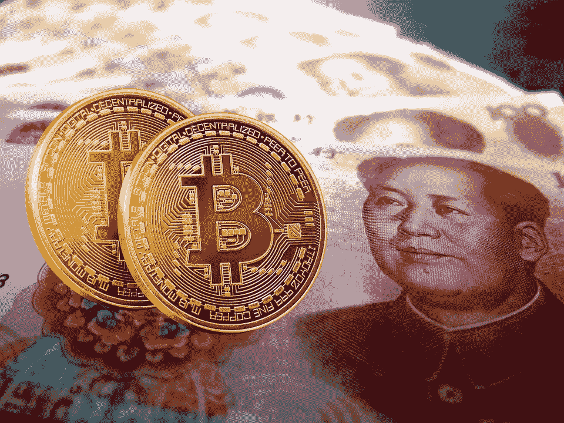

# 为什么所有的目光都集中在中国的数字元上？

> 原文：<https://medium.datadriveninvestor.com/why-are-all-the-eyes-on-chinas-digital-yuan-a97c4b31bf38?source=collection_archive---------5----------------------->

中国不断出现在全球新闻中，无论是电晕危机、外交关系、军事冲突还是贸易和商业。最近几周以来，每个人都在谈论中国的数字货币。

***我们已经有了数十种其他数字货币，是什么让“数字元”如此特别？* *让我们一探究竟！***

与比特币、以太坊、Dogecoin 等完全去中心化、可以在全球范围内匿名使用的加密货币不同，数字元是一种国家支持的数字货币。

中国的中央银行——中国人民银行将在数字人民币的帮助下，获得实时、高精度记录每一笔交易的自由。

是的，你没看错！与加密货币不同，数字人民币是高度集中的。

 [## 为什么参与正确的加密交换至关重要|数据驱动型投资者

### 到目前为止，与黄金和美元相比，加密货币，尤其是比特币，已经显示出巨大的增长

www.datadriveninvestor.com](https://www.datadriveninvestor.com/2020/07/16/why-engaging-with-right-crypto-exchange-matters/) 

那么，这是否意味着它不是基于区块链？

是的，绝对的！数字元(DCEP)刚刚借用了区块链的概念，以利用对等支付、可追溯性等优势，并使其防篡改。它不是基于区块链。

**那么到底什么是 DCEP(数字货币电子支付)或者“数字元”？**

数字元或 DCEP 是中国在经济中取代现金的努力。在传统的电子支付系统中，交易只发生在两个银行账户之间，但 DCEP 交易可以在两个钱包之间进行，而无需将它们与银行账户联系起来。DCEP 的这一显著特征有助于它更像现金一样流动。

但是中国需要无现金吗？

***尽管是先进的无现金经济体之一，为什么中国一直关注 DCEP/数字元？***

在中国，阿里巴巴的支付宝和腾讯的微信支付是两大流行的在线移动支付平台，注册账户超过 20 亿。事实上，中国经济已经高度无现金化。

即使在成为先进的无现金经济体之一后，中国自 2014 年以来一直在不知疲倦地努力推出数字货币。

**但是“为什么”？**

在回答这个“为什么”之前，我想让你知道一些事实。

很久以来，中国一直在尝试各种方式让人民币国际化。中国已多次尝试推动人民币在国际交易中占据中心位置。早些时候，它推出了“点心债券”，这种债券在外国发行，但以人民币计价。中国还推动了与一些国家的货币互换，以加速人民币的全球化。

随着与美国关系的恶化以及对美元结算全球支付的依赖，中国在 DCEP 中找到了解决方案。中国与发展中国家的双边贸易仍然依赖美元，随着其全球角色的扩大，北京希望扩大其数字货币的使用，这将为美元结算系统提供替代。

所以，是的！我们可以得出结论，推出 DCEP 背后的深层意图是打破美元在全球支付系统中的既定霸权。

很想知道中国在“数字元”的使用案例或试验方面已经走了多远？

中国已经开始在一些城市进行试点，包括北京南部、苏州和成都。中央政府正在一些将举办 2022 年北京冬季奥运会的地区大力推广新货币。央行发布的一份名单列出了将在小额交易中测试数字货币的美国连锁店星巴克、麦当劳和赛百味。

媒体报道称，中国政府雇员和公务员是他们数字试验的一部分，将从 5 月开始以数字货币支付工资。这种货币将用于补贴交通，试验主要集中在食品和零售上。

**让我们来看看正在进行的数字竞赛！**

由于缺乏对其使用的监管以及网络安全问题，加密货币总是面临投资者和中央当局的强烈反对。政府支持的数字货币比原始版本更容易被当地民众接受。这就是为什么许多国家都在考虑发行数字货币。

去年，脸书宣布了推出数字货币 Libra 的计划，这将允许超过 24 亿人每月使用脸书在全球范围内进行金融交易。

最近，美国表示有兴趣让人民币成为一种全球数字交易手段，与中国一较高下。

**“数字元”的生存假设是什么？**

与比特币等加密货币不同，数字人民币有望取代纸币，其价值与普通人民币挂钩。由于央行将能够监控每一笔交易，预计交易会相对稳定。

中国认为，数字货币将简化对农村地区的援助分配，特别是在新冠肺炎疫情期间，并导致可能改变世界贸易方式的转变。

此外，中国在金融技术领域的主导地位(通过华为对 5G 技术的快速适应可以看出)以及对移动设备友好的货币兑换方法可以推动数字人民币的增长。让我们拭目以待中国数字人民币的未来，以及全球支付系统将如何受到同样的影响。

*最初发表于*[*【https://www.linkedin.com】*](https://www.linkedin.com/pulse/why-all-eyes-chinas-digital-yuan-pratibha-yadav/?published=t&trackingId=nQ13JEXGQy6D7WZifEwnzA%3D%3D)*。*

**访问专家视图—** [**订阅 DDI 英特尔**](https://datadriveninvestor.com/ddi-intel)