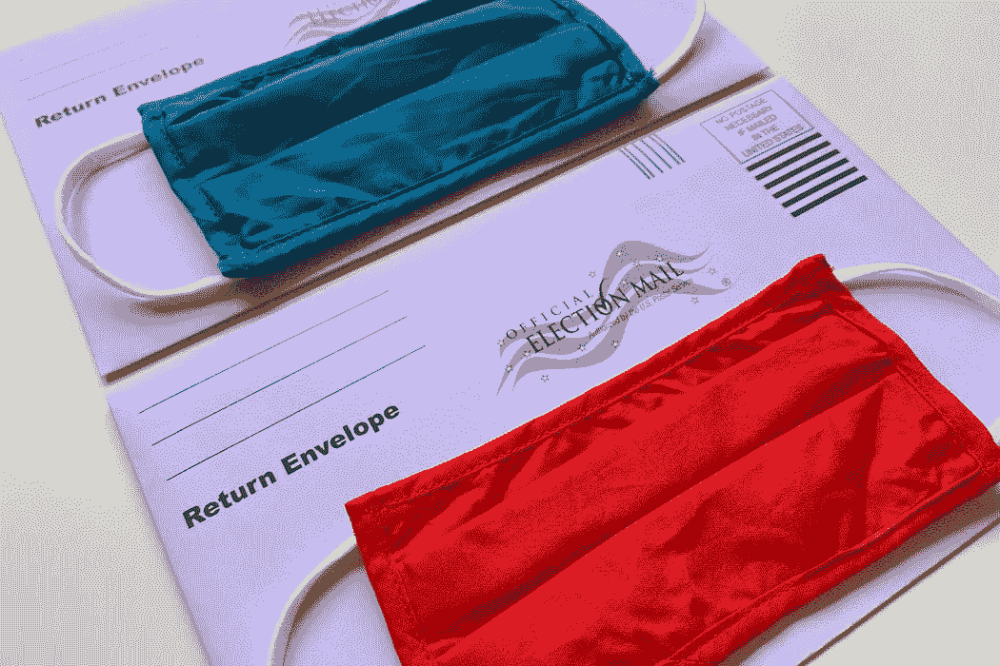

# 为什么保守派选民可以接受选民压制？

> 原文：<https://medium.datadriveninvestor.com/why-are-conservative-voters-ok-with-voter-suppression-a232d0b44c7f?source=collection_archive---------9----------------------->

Image via [Unsplash](https://images.unsplash.com/photo-1595265616827-2cbbd0c39418?ixlib=rb-1.2.1&ixid=eyJhcHBfaWQiOjEyMDd9&auto=format&fit=crop&w=1050&q=80)- Tiffany Tertipes

## 一场散布错误信息和限制投票的运动正在展开，希望赢得总统大选

共和党传统上是政府较少的政党。对公民日常生活的干预越少越好。除非他们准备输掉总统选举，并看到他们党内的知名人士转向各种形式的试图压制选民以阻止潮流。尽管有强烈的获胜愿望，但为什么更多的保守派不谴责这种明显的、不道德的(如果不是非法的)试图通过邪恶的手段影响结果的冲击呢？

唐纳德·特朗普总统支持“让美国再次伟大”和“保持美国伟大”的竞选口号。这与今年试图限制投票形成了鲜明对比。随着新冠肺炎疫情尚未达到美国最严厉的水平，美国许多地区已经使邮寄投票变得更加容易，以确保人们在投票时感到安全。

人们普遍认为民主党会从更多的邮寄投票中受益，但是研究表明事实并非如此，唯一的实际影响是更多的人投票。这并没有阻止特朗普和其他共和党高层抨击邮寄选票，声称它们导致了广泛的欺诈。然而，再一次，没有证据表明这是真的。虽然这并不奇怪，但他的说法不仅毫无根据，事实上，他最近还通过邮件[投了自己的一票](https://www.npr.org/2020/08/19/903886567/trump-while-attacking-mail-voti)。

还有其他限制选民投票的尝试。美国邮政局开始拆除一些邮箱，这可能是一种常规做法，但却有了全新的含义，因为在这个疯狂和不可思议的颠倒年份，投票应该得到帮助和鼓励，而不是受到积极的围攻。由共和党代理人掌控的对邮局的公开攻击只会加剧人们对这是阻碍投票的策略的担忧。

传统上保守的德州最近限制每个县只能有一个投票箱(由选举官员收集)。许多人认为这种箱子是比邮寄更安全、更直接的方式将选票送到最终目的地，尤其是在离选举越来越近的时候。这一行动是由格雷格·阿博特州长的命令引起的，该命令在法庭上受到质疑，但最终被上诉法院的三名法官支持。没有人会忘记，这三名法官都是特朗普任命的。一名法官在他们关于限制投票箱的决定中写道，“人们很难看出这给投票带来了什么负担。”他们没有解释，在面积超过 1000 平方英里的几十个德克萨斯县中的[只有一个地方，因此可能会迫使选民开车几个小时去投票，这不可避免地会受到负面影响。](http://List_of_counties_in_Texas)

还有一系列旨在抹黑民主党候选人乔·拜登的错误信息宣传。这些证据主要是试图证明他的大儿子 Hunter 由于其父亲的政治干预，在乌克兰工作期间获得了不适当的好处。没有任何证据表明这已经发生，包括[共和党领导的调查](https://www.nytimes.com/2020/09/23/us/politics/biden-inquiry-republicans-johnson.html)没有发现任何不当行为的证据。不幸的是，这并没有阻止特朗普代理人传播误导和无来源信息的行为，试图让故事继续下去。

川普的律师鲁迪·朱利安尼[发布了一个故事](https://www.usatoday.com/story/news/politics/2020/10/21/rudy-giuliani-gives-alleged-hunter-biden-laptop-authorities/6005040002/),讲述了他得到了一台笔记本电脑，这台电脑本该属于亨特·拜登，却被遗弃在特拉华州的一家电脑维修店。尽管在叙述和事件链中存在重大漏洞和问题，更不用说白宫已经[事先警告过](https://thehill.com/policy/national-security/521328-intelligence-officials-warned-trump-that-giuliani-was-target-of)纽约市前市长是俄罗斯干预选举的目标，但他仍继续兜售他的诽谤活动。笔记本电脑现在在联邦调查局手中；一个由特朗普任命的人领导的单位。他们或其他执法官员没有提供任何最新消息或采取任何行动，这充分说明了这一拙劣的颠覆企图的有效性。

这整个混乱的丰富性是朱利安尼自己的交易是多么令人讨厌和可疑。他不仅[与已知的俄罗斯特工](https://thehill.com/policy/national-security/521328-intelligence-officials-warned-trump-that-giuliani-was-target-of)有关联，在最近上映的*波拉特*电影中，在一段他与一名女子在酒店房间里的视频记录中，他几乎很难把手从裤子里拿出来，这名女子假装是 Sascha Baron- Cohen 角色的 15 岁女儿。一些人不惜一切代价为摧毁拜登辩护，而忽视那些实施空洞阴谋的人的重大违法行为，这是一个史诗般的讽刺。

尽管朱利安尼的揭露失败了，但本周,*福克斯新闻频道*“个性”塔克·卡尔森更进了一步。在广播中，他[声称](https://www.businessinsider.com/tucker-carlson-gave-no-details-hunter-biden-docs-damning-2020-10)一批对拜登竞选和亨特的行为“不利”的文件在由一家国家承运商(后来发现是 UPS)运送给他时失踪了。没有解释为什么如此重要的材料在放入盒子之前没有记录(图片？扫描？个人快递？)，他含糊不清地详细描述了它们对拜登一家的破坏性和绝对性。尽管 UPS 找到了丢失的包裹并送到了最终目的地，但除了确认他们正在接受真实性审查之外，几乎没有说什么。

事实上，一个主要的国家媒体人物会播出这种未经证实和分裂的信息，是令人难以置信的不负责任和犯罪干预选举的边缘。如果他有什么可说的，他完全有权利这么做，但他所做的只是播下了不信任和困惑的种子。

当人们被逼到一个角落时，自然本能是尽一切可能逃出去。那些认为保守的人希望特朗普获胜，这是可以理解的。然而，如此强烈地认同美国价值观和理想的群体需要后退一大步，并理解他们如何不仅接受，而且还参与了一场完全缺乏证据的不道德闹剧，如果成功实现，将有效地扼杀美国民主。

美国的理想支持的是正确的，而不是感觉良好的，是为了个人利益的。这些可能只是支撑一个可能垂死的国家的空洞话语，但如果任何人真正相信这个国家，他们不能继续看着这种破坏、谎言和丑陋的闹剧，并自称为爱国者或美国人。