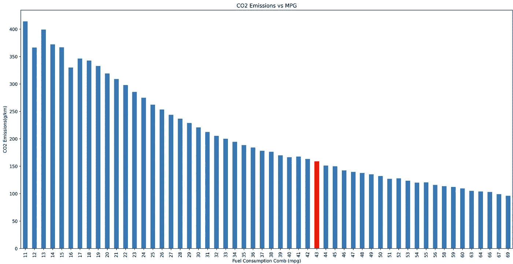
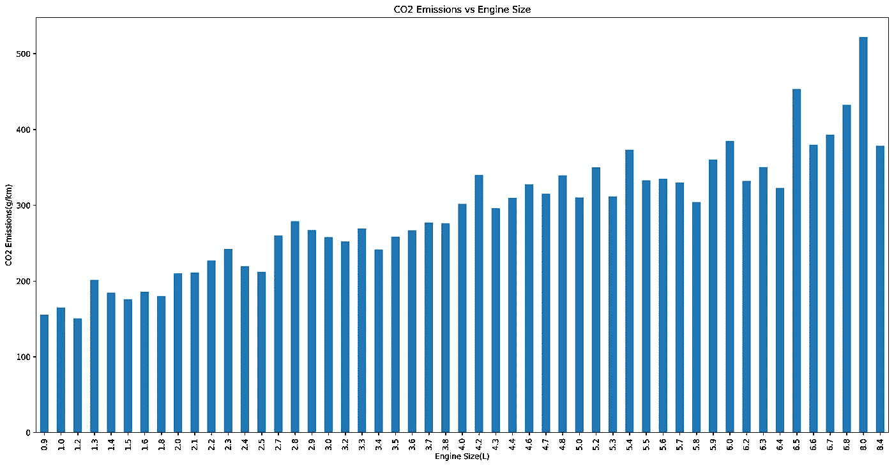
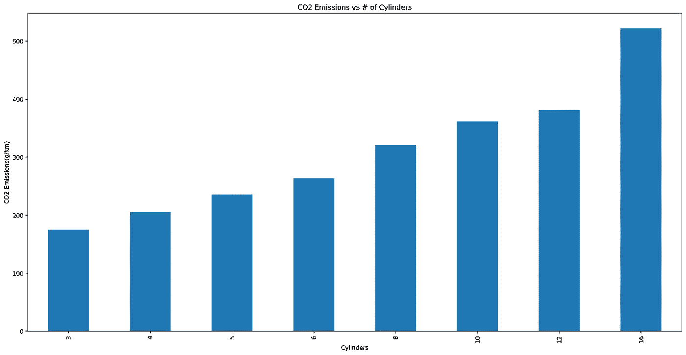
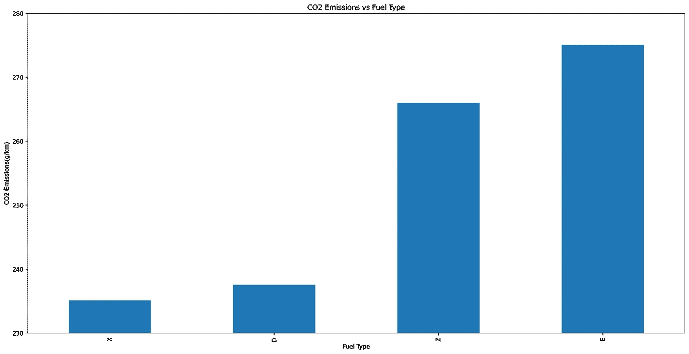
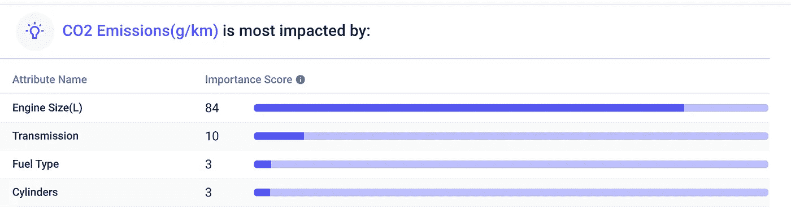

# 为什么燃气汽车效率这么低？

> 原文：<https://medium.datadriveninvestor.com/why-are-gas-cars-so-inefficient-c3ebd07bc72?source=collection_archive---------9----------------------->

## 7 年油耗数据的硬道理。


Photo by [The New York Public Library](https://unsplash.com/@nypl?utm_source=medium&utm_medium=referral) on [Unsplash](https://unsplash.com?utm_source=medium&utm_medium=referral)

我们正在接近福特 t 型车的 112 周年纪念日。看看 2020 年最酷的新车，我们会发现像凯迪拉克 CT4 这样的光滑驾驶，每加仑 24 英里(在城市中每加仑 20 英里)。T 型车跑了 21 英里。

如果超过一个世纪，你会期望更好的里程。我分析了一个零售车辆排放的数据集，以理解为什么燃气汽车仍然如此低效。

```
· [Background](#f000)
· [Exploring the data](#8959)
· [Dirtiest and Cleanest Cars](#eccd)
· [What impacts emissions?](#8528)
  ∘ [Fuel Consumption](#c891)
  ∘ [Engine Size](#305d)
  ∘ [Number of Cylinders](#c943)
  ∘ [Fuel Type](#e97c)
· [The Limits of Gas Cars](#1f10)
· [Finding Predictive Insights](#cbdd)
· [Conclusion](#4fb0)
```

# 背景

加拿大政府维护着关于零售车辆排放的公共数据集。Kaggle [数据集](https://www.kaggle.com/debajyotipodder/co2-emission-by-vehicles)汇编了 7 年的数据，得到 7385 行(或特定车辆)和 12 列，包括汽车品牌、型号、级别、发动机尺寸、变速器、燃料类型、气缸、燃料消耗指标和二氧化碳排放量。

我用 Python 和 [Apteo](http://apteo.co) 分析数据。

# 探索数据

首先，我们来看看一辆典型的燃气汽车是什么样子的，通过探究每个定量柱的中值。

```
df = pd.read_csv(open('CO2 Emissions_Canada.csv'))
df.describe()
```

一辆典型的汽车有一个 3 升 6 缸发动机，每加仑能跑 27 英里，在城市里比在高速公路上每 100 公里多消耗 3.4 升燃料，每公里排放 246 克二氧化碳。

现在，让我们使用`value_counts`来看看定性列。有各种各样的品牌、型号、级别和变速器，实际上有 4 种燃料类型。

```
df['Fuel Type'].value_counts()
```

数据集中有 3637 辆普通燃气汽车、3202 辆高级燃气汽车、370 辆乙醇汽车、175 辆柴油汽车和 1 辆天然气汽车。

# 最脏和最干净的汽车

```
df['CO2 Emissions(g/km)'].max()
df['CO2 Emissions(g/km)'].min()
```

数据集中最脏的汽车是布加迪凯龙星，每公里排放超过半公斤的二氧化碳。驾驶布加迪凯龙星行驶 10 公里，从排放角度来看，相当于吃一个麦当劳双层汉堡(两者都是疯狂的，对环境有害)。

数据集没有说明一辆车是否是混合动力的，所以我在谷歌上搜索了“最干净”的排序汽车列表，直到我找到一辆纯汽油汽车。三菱幻影是最环保的纯汽油汽车，每公里排放 0.15 公斤二氧化碳。

最环保的混合动力车是现代 Ioniq Blue，每公里排放 96 克二氧化碳。真正的电动汽车一生中排放的二氧化碳比汽油车少 81%。

[](https://www.datadriveninvestor.com/2020/05/12/private-equity-investors-need-to-keep-up-with-data-analytics/) [## 私募股权投资者需要跟上数据分析|数据驱动的投资者

### 如果你有一把钥匙，可以打开商业成就和职业成功的捷径，你会不会用它…

www.datadriveninvestor.com](https://www.datadriveninvestor.com/2020/05/12/private-equity-investors-need-to-keep-up-with-data-analytics/) 

# 什么影响排放？

## 燃料消耗

自然，低效的燃料消耗是排放的最大驱动力。更好的里程=更低的排放。

```
df.groupby('Fuel Consumption Comb (mpg)')['CO2 Emissions(g/km)'].mean().plot(kind='bar')
```

最高效的纯汽油汽车，三菱幻影，以每加仑 43 英里的速度出现在下面。此后所有的柱代表混合动力汽车的排放。



## 发动机尺寸

另一个主要驱动因素是发动机尺寸。较大的发动机往往燃料效率较低，导致更多的排放。



## 气缸数

气缸数量对排放也有着惊人的巨大影响。更多的气缸意味着更糟糕的排放。



## 可燃物类型

事实证明，燃料类型对排放的影响微乎其微(或者根本没有影响)。汽油和柴油发动机的排放几乎相同，而普通的优质汽油和乙醇发动机的排放稍差。



“优质”汽油基本上没有任何益处，如果你不需要，你就不应该使用它。

# 燃气汽车的局限性

加州大学圣地亚哥分校做了[数学](https://dothemath.ucsd.edu/2011/07/100-mpg-on-gasoline/):燃气汽车有一个实用的，大约每加仑 63 英里的上限。考虑到市场上最省油的燃气汽车每加仑能跑 40 英里左右——距离第一辆大规模生产的燃气汽车已经过去了 112 年，实现这一目标需要大量的创新。

燃气发动机在发动机热量、排放限制和其他限制方面有实际限制，例如我们只能获得汽油实际能量潜力的 20%。

# 寻找预测洞察力

想象你正在制造一辆汽油汽车。你可以在发动机尺寸、气缸数量、变速器和燃料类型等变量中进行选择，以优化更低的排放。如何确定这些变量的确切影响？

我将数据集上传到 [Apteo](http://apteo.co) 以自动找到预测见解。我们可以看到，发动机尺寸(去除 MPG 后)是迄今为止排放量的最大预测因素。仅仅通过制造一辆发动机尺寸最小的汽车，你就能最大限度地减少排放。



By [Apteo](http://apteo.co).

# 结论

关于“电动汽车还是燃气汽车”有一个巨大的争论，但事实是，燃气汽车的效率非常低。该数据集中所有最高效的汽车都是混合动力车，而最高效的汽车是电动车。

在燃气汽车中，发动机的大小是里程的最大预测指标，因此也是排放量的最大预测指标。

**进入专家视角—** [**订阅 DDI 英特尔**](https://datadriveninvestor.com/ddi-intel)