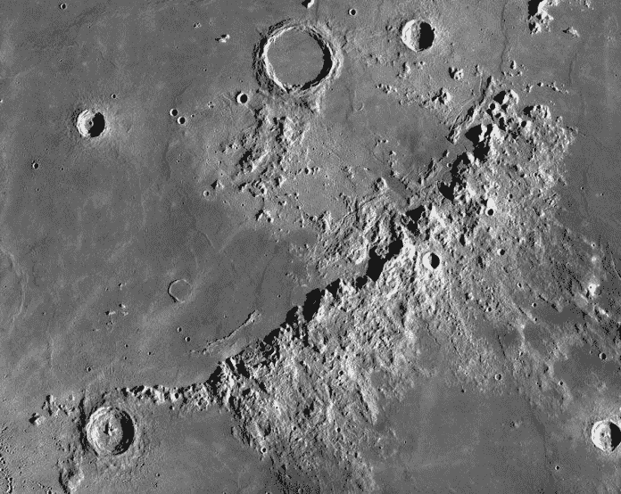
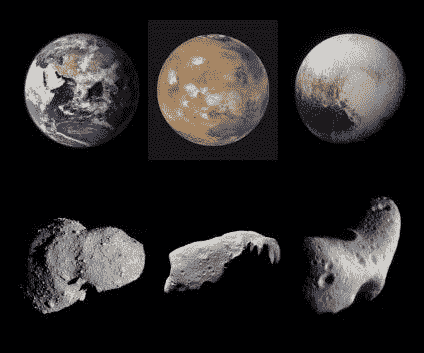
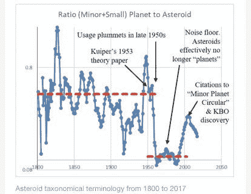
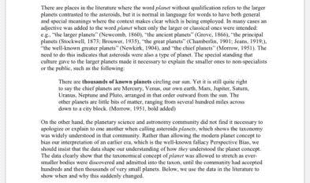
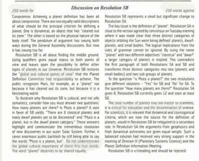

# 为什么行星对文化如此重要？

> 原文：<https://medium.datadriveninvestor.com/why-are-planets-so-darned-important-to-culture-eb91036f927?source=collection_archive---------11----------------------->

## 今天对太阳系物体的概念已经发生了很大的变化

冥王星不再是行星了吗？这个问题困扰着物理学家、前 ABC 新闻科学编辑、作家兼教师[*Michael Guillen*](https://twitter.com/DrMGuillen)*博士。他认为这种* [*的科学愚昧必须改变*](https://www.foxnews.com/opinion/pluto-no-longer-a-planet-michael-guillen) *。*

*“是或不是行星”的尘埃也同样困扰着中佛罗里达大学的行星科学家* [*菲利普·梅茨格*](https://twitter.com/DrPhiltill) 博士*。他接手了 Guillen 的事业，在 Twitter 上来回穿梭了三个世纪，展示了当科学家获得投票权时会发生什么:*

迈克尔·吉伦在《行星》杂志上发表评论。他说得对，像“行星”这样的概念不应该被投票表决。科学的要点是进化我们对事物的概念化。在科学和文化的拉锯战中,“星球”是如何进化的，这是一段深刻而有趣的历史。

在“行星”的演化过程中有四个主要事件第一次是哥白尼革命，科学家们拒绝了动力学概念——流浪的恒星绕着地球转——而代之以地球物理学概念:行星是像地球一样的物体，不管它们绕着什么转。

这个概念被天文学家接受了 300 多年，直到 20 世纪的某个时候。大约在 1920 年，有证据表明，科学家们只是忘记了卫星也是一种行星。那时，教科书上对“行星”的定义不再包括卫星作为行星。

我说他们“只是忘记了”，因为我们可以看到，在行星科学中没有发生任何事情来改变定义。相反，我们看到术语的使用慢慢转变为纯粹的高斯过程——非驱动扩散过程——直到卫星很少被称为行星。

从那时起，教科书不再给出自伽利略以来存在了 300 多年的历史定义。行星必须直接围绕恒星运行的观点是默认引入的，没有科学依据。动力学悄悄地回到了行星的概念中。

这为 2006 年的糟糕选举埋下了伏笔。

# 文化偏见影响每个人

当我们问，*为什么*天文学家默认将“轨道”放回到行星的概念中，没有已知的答案，除了它一定是文化[偏见](http://www.datadriveninvestor.com/glossary/bias/)。科学家也受到文化的影响。

*为什么*文化默认卫星不是行星，认为行星必须直接围绕恒星运行？我在记录中看不到任何答案，除了它类似于更古老的地心说，即行星以整齐的顺序有序排列。

另一方面，在 20 世纪 60 年代，行星科学家又开始称卫星为“行星”。那时，航天器任务正在访问这些行星，我们重新发现，我们从伽利略那里得到的历史概念——纯粹的地球物理，不涉及物体轨道——仍然有用。

但可悲的是，这个团体那时已经分裂了，最多，天文学家没有在比较行星学中处理地质学。因此，他们再也没有回到历史上有用的“行星”概念大多数天文学家将轨道动力学作为他们概念的一部分。

历史上，直接围绕恒星运行的行星被称为“主行星”——或简称为“行星”——而“次行星”也被称为“卫星”或“月亮”。《副星球》太啰嗦，所以失宠了。因此，天文学家忘记了卫星是行星。

在哥白尼革命之后，这是行星概念发生的第二次变化。一代天文学家没有被明确告知动力学与行星无关。这就是搞砸的全部原因。

这发生在 1920 年到 1960 年间。

# 行星开拓者

概括一下:伽利略发现了月球山脉，所以他提出了“行星”的新概念。它们是像地球一样的地球物理物体，包括卫星。这个新概念是从与新理论的结合中诞生的，因此它取代了旧的动力学概念。他不得不为此与文化作斗争。

然后，在 300 年的时间里，天文学家继续将卫星作为实际的行星，因为理论没有变化，因此没有动机去伪造一个新的“行星”概念。300 年来，每本教科书都明确地说卫星是行星。

但是，慢慢地，天文学家改变了术语，忘记了“次级行星”这个术语没有科学推动这种变化。没有人认为卫星与行星不同。相反，卫星和主行星的*共性*经常出现在科学论文中。

因此，“行星”概念的第二个主要变化似乎主要是文化影响，而不是科学影响。这将需要更多的空间来充分提出这一论点，一篇论文即将发表。

“行星”概念的第三个主要变化涉及行星的*大小*。19 世纪有一个长期的趋势，那就是发现越来越小的小行星，它们都被列为主行星。根据杰拉德·柯伊伯 1953 年的一篇论文，它们突然被认定为非行星。

皮埃尔·西蒙·拉普拉斯的旧行星形成理论被认为是由小行星证明的。因此，包括小行星在内的“行星”概念与这一理论相一致。柯伊伯 1953 年关于吸积理论的论文将“行星”概念分成了两组，因此小行星成为了非行星。

文献计量学显示，20 世纪 50 年代末，天文学家很快就不再称小行星为“行星”。在柯伊伯 1953 年的论文之前，理论论文称它们为行星，然后*立即*停止称它们为行星。

那么，这第三个概念变化的本质是什么呢？

# 生活开始了争斗

伽利略给了我们一个概念，行星是一个像地球一样的地球物理复合体。所有的天文学家开始争论所有行星的复杂性，甚至他们都拥有生命的想法。通过包括越来越小的小行星，我们实际上破坏了这个概念。

通过将小行星从“行星”的概念中移除，科学家们恢复了伽利略的概念，即它们是类似地球的复杂地球物理物体。这是由科学推动的，将行星概念与理论结合起来。这很好。科学应该是这样运作的。

奇怪的是，在第三种情况下，科学家们不必与文化斗争，他们也没有屈服于文化。文化从来没有*接受小行星是行星。科学很高兴地转向了文化已经拥有的概念。没有人像伽利略那样被审判。*

第三个概念变化的本质是行星在地球物理上是复杂的，但小行星不是。论文认为谷神星*是*行星正是因为这个原因。

这个概念有效地支持了新的*理论*，这就是科学的工作方式。

# 轨道清理发明

现在，行星概念的第四件大事:2006 年的投票。他们说行星是“清理轨道的物体”这是一个与我们以前完全不同的概念。它被设计用来选择大致相同的八个或九个物体，但为了做到这一点，他们发明了一种轨道清理的想法，这在以前从未有过。

它的动机是科学和文化的相互作用，但这一次天文学家无意中拒绝了文化的科学。看看*双方*的论点。

据我所知，潜在的动机是维护行星是“特殊的”这一理念，反映了文化所渴望的自然的有序性。这很容易陷入困境:卫星不是行星的想法已经给大多数天文学家持有的概念注入了动力。

它并不是像小行星那样被新发展的理论所驱动。但是存在主义——通过将当前的信念投射到生活在过去的人身上来错误地解释过去的事件——被用来曲解小行星如何变成非行星的历史。

存在主义也使当今的天文学家不能理解卫星一直是真正的行星，自从哥白尼革命以来甚至更早，直到最近“绕恒星运行”从来不是行星概念的一部分——除了在文化中。

文化和科学的相互作用令人着迷。我们看到在影响“行星”概念的四个不同事件中，它有四种不同的表现方式这让你想知道，为什么行星对文化如此重要？文化不在乎甲虫的定义。

**关于作者**

吉姆·卡扎曼是[拉戈金融服务公司](http://largofinancialservices.com/)的经理，曾在空军和联邦政府的公共事务部门工作。你可以在[推特](https://twitter.com/JKatzaman)、[脸书](https://www.facebook.com/jim.katzaman)和 [LinkedIn](https://www.linkedin.com/in/jim-katzaman-33641b21/) 上和他联系。

*原载于 2020 年 2 月 23 日 http://www.datadriveninvestor.com***。**