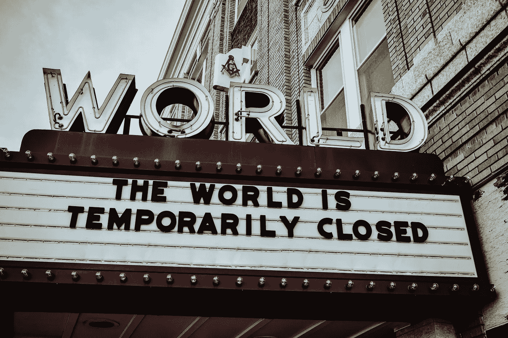

# 为什么经济下滑时股票会上涨？

> 原文：<https://medium.datadriveninvestor.com/why-are-stock-markets-going-up-while-the-economy-is-falling-cec9d027fc5d?source=collection_archive---------1----------------------->

## 为什么这种不和谐没有你想象的那么奇怪

对于那些一直关注经济并投资股市的人来说，我相信你可能已经注意到今年发生了一些非常奇怪的事情。一方面，你看着股票市场，认为我们可能正处于最有成效的阶段，市场在过去八个月里上涨了 50%以上。但另一方面，2020 年也是有史以来失业率最高的一年。

Photo by [Edwin Hooper](https://unsplash.com/@edwinhooper?utm_source=unsplash&utm_medium=referral&utm_content=creditCopyText) on [Unsplash](https://unsplash.com/s/photos/pandemic?utm_source=unsplash&utm_medium=referral&utm_content=creditCopyText)

我们正处于一个非常奇怪的时代:人们可能会认为股市会像经济一样低迷，但实际上它们都在大幅上涨。总的来说，经济表现不仅仅比去年差一点点，而是比前几年差很多。

那么，为什么会出现这种矛盾的行为呢？为什么股市和失业率都创下新高？

# 现在的经济和股票市场

就经济而言，它在 2020 年表现不佳的唯一原因是因为疫情(及其糟糕的操控)，这显然导致了我们都知道的锁定。直到 2019 年，经济一直以每年高达+4%的相当稳定和积极的速度增长，这意味着它正在做它应该做的事情:每年生产越来越多的商品。但由于人们购买量减少，企业关闭，今年企业的销售额远不如 2019 年。2020 年第一季度和第二季度，美国经济分别萎缩了 4.8%和 31.4%，尽管接下来的一个季度确实出现了反弹，但**年化 GDP 仍比去年少 3.5%** 。其他许多指标也是如此，比如消费者支出和储蓄。

US unemployment as of October 2020 — BBC.com

然后是房间里的大象，另一个在 2020 年达到历史高点的指标:失业率。加上糟糕的国内生产总值表现，由于经济不景气，许多人失去了工作，4 月份**失业率飙升至历史最高的 14%** 水平，同月福利申请达到 3000 万。随着失业率的上升(甚至只是害怕失去工作)，随着人们在财务上挣扎，支出明显减少得更多。显然不仅仅是美国受到影响，美国之所以成为基准是因为它是世界上最大的经济体，拥有最发达的股票市场。

与此同时，股市出现了截然不同的情况。在三月份的首次下跌后，股票现在上涨了 45%以上，标准普尔 500 从 2200 美元攀升至 3700 美元的**历史新高**，所有其他主要指数如道琼斯、纳斯达克和罗素 2000 指数也公布了类似的结果。至少表面上是这样。

Major US indexes throughout 2020 — source: tradingview.com

# 为什么股票和经济通常是不同的？

但为什么当经济衰退时，股市会攀升如此之高？首先要理解的是，**股票市场是投资者对未来的预测，**因此，市场上涨意味着投资者相信经济(以及经济背后的企业)未来会表现良好，反之亦然。经济学上对股票价格的定义是*现在* *未来收益的价值*，而不是当前收益的价值。当好消息传来时，市场并不总是上涨:只有当好于投资者的预期时，市场才会上涨。这正是正在发生的事情:这并不意味着现在一切都很好，这只是意味着投资者预测他们将在未来几个月或几年内。

事实上，**股市通常会先于经济对变化做出反应**:在 2008 年的衰退中，股市先于经济下跌，在 2007 年 10 月下跌，而经济一直下跌到 2008 年。一些人甚至可以说，投资者在 2020 年 3 月有点晚了，因为只有当中国和欧洲部分地区已经锁定时，市场才会崩溃。

归根结底，股票市场在过去两个月上涨的根本原因是因为投资者看好美国，这意味着他们认为事情会变得更好。如果你想证明这一点，只要将美国指数与其他主要国家指数进行比较，你就会发现，没有一个指数像标准普尔 500 指数或纳斯达克指数那样有所回升。
现在，投资者贪婪有几个关键原因。首先，政府通过向企业提供流动性的刺激计划，成功地打消了他们的疑虑。其次，美联储正试图以接近历史最低水平的利率(允许廉价借贷)刺激经济，并通过加大印钞计划来维持债务排放。第三，疫情的卫生方面:随着疫苗的生产和分发，企业将有望重新启动恢复正常的进程，重新雇用工人，为客户服务并创造收入，这正是投资者所希望的。

# 但那仍然不是它

最后，*市场*表现良好还有一个重要原因:**标准普尔 500 指数(S & P 500)远离实体经济**。在基本层面上，实体经济是由中小型企业组成的，而标准普尔指数只涵盖 500 家最大的企业。今天，构成该指数的大公司正在公布创纪录的利润，而公众却远远落在后面:这些公司完全脱离了我们城镇中的小企业和商店。他们只占美国所有公司的 0.1%，雇佣的员工相对较少，因为标准普尔 500 指数只占美国总劳动力的 15%。

最重要的是，**上涨的甚至不是整个 S&P500**。如果你看看构成该指数的 500 家公司，只有三分之一的公司今年实际上是正数。这意味着这 500 只股票中有 300 多只现在的交易价格低于去年。即使只看指数的不同部门，11 个部门中有 5 个今年的收益率为负，最差的是能源部门，为-37%。

这是因为指数的加权方式。仅六大科技巨头(谷歌、亚马逊、苹果、微软、脸书和特斯拉)就占据了纳斯达克 100 指数的 45%和 S&P500 的 23%。如果我们把 S&P500 最大的 10 家公司排除在外，剩下的 490 只股票的交易价格将比今年 1 月低 4%。与此同时，排名前 10 的股票现在的交易价为+30%，由于它们的权重，它们极大地推动了整个指数的上涨。

Stock components of the Nasdaq — source: slickcharts.com

最终，市场今年看到的很大一部分增长归因于我们衡量股市表现的方式。如果排名前 10 的股票表现很好，他们会设法拉高整个指数，而不管那些较小的股票。

最后，股市普遍上涨还有一个决定性因素，这是因为没有其他地方可以投资。由于创纪录的低利率，投资者在如何处理他们的资金方面没有太多选择。他们可以把它们存在银行里(由于通货膨胀侵蚀它们，几乎得不到任何利息)，或者把它们放在债券里，基本上是长期锁定，回报率非常低。毫不奇怪，在这种情况下，甚至比特币也获得了很大的吸引力。

澄清一下:我并不是说投资者通过看涨市场和将资金投入科技股来玩这个游戏。看涨的投资者在历史上也给市场带来了泡沫，一些人说这种情况今天也在发生。我想只有时间才能证明投资者在 2020 年是否做了正确的事情。

喜欢这篇文章，并想阅读更多？通过我的推荐链接成为一名普通会员——这不会改变你什么，但会支持我成为一名作家。

 [## 用我的推荐链接加入媒体。

### 作为一个媒体会员，你的会员费的一部分会给你阅读的作家，你可以完全接触到每一个故事…

medium.com](https://medium.com/@ThomasH_/membership)