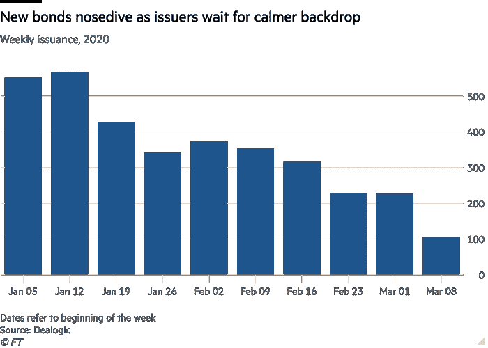

# 为什么这么不稳定-市场先生？

> 原文：<https://medium.datadriveninvestor.com/why-are-the-markets-so-volatile-cd21779d4075?source=collection_archive---------17----------------------->

冠状病毒残酷地揭露了我们的错误

尽管世界各国央行竭尽全力保护本国经济，但美国股市和全球股指没有显示出平静的迹象。

**各国央行做了什么？**

1.  在短短三周内，美国美联储将利率下调了 1.5 个百分点，将其联邦基金的目标区间定在 0%至 0.25%。
2.  美联储还宣布，T2 将“增持至少 5000 亿美元的美国国债，增持至少 2000 亿美元的机构抵押贷款支持证券。”。
3.  英国银行将利率下调至 0.1%的历史最低水平[。降低了对银行的资本要求，并推出了 2000 亿美元的债券购买计划。](https://www.ft.com/content/2c441124-69f0-11ea-800d-da70cff6e4d3)
4.  欧洲央行没有下调已经为负的利率，但宣布了一系列改善贷款的措施。启动了 7500 亿€疫情紧急购买计划( [PEPP](https://www.ecb.europa.eu/press/pr/date/2020/html/ecb.pr200318_1~3949d6f266.en.html) )，这将允许欧洲央行购买政府、机构和公司债券。

Image Courtesy: [Visual Capitalist](https://www.visualcapitalist.com/chart-the-downward-spiral-in-interest-rates/)

**央行举措的后效**

尽管大量资金流入金融体系，但全球股市还是出现了暴跌。标准普尔 500(美国)在一个月内下跌了 28%，德国 DAX 指数下跌了 38%，英国富时 100 指数下跌了 32%，日本日经 225 指数下跌了 29%。

每一个主要市场都已经深入熊市，恐慌没有消退的迹象。

 [## 经济就是包容人|数据驱动的投资者

### 建模，数据，最重要的是，人 Tayo Oyedeji 博士在他的食谱中混合了所有这些成分，为一个…

www.datadriveninvestor.com](https://www.datadriveninvestor.com/2019/03/06/economy-is-all-about-including-people/) 

**为什么央行降低利率和购买资产没有帮助？**

外表可能具有欺骗性。

尽管全球指数继续走低，但说各国央行采取的措施没有起到任何作用是不正确的。它确实阻止了全球金融体系陷入深度冻结，如果发生这种情况，将会带来一系列新的麻烦，使经济陷入深度衰退。

**为什么全球金融体系难以跟上？**

因为过去的错误会萦绕心头。

与人类过度消费的特点相似，全球各地的企业都在试图利用低利率的优势，陷入债务狂欢。

一些公司增加了债务，为股票回购计划提供资金，并提高股息。在世界各地的投资者会议上，人们会一遍又一遍地听到类似下面这样的陈述。

> “在过去的 3 年里，我们在业务上投资了大约 70 亿美元来推动增长。麦当劳首席财务官凯文·奥赞在 2020 年 2 月与分析师的电话会议上表示:“我们将每股股息提高了 30%以上，支付了 100 亿美元的股息，通过购买 150 亿美元的库存股票，我们将流通股减少了约 10%。”

这家汉堡连锁店的长期债务从 2014 年 12 月的 149.3 亿美元增加到 2019 年 12 月的 341.2 亿美元。麦当劳不是唯一一家增加债务的公司，即使是像甲骨文这样以现金储备而不是债务积累而闻名的科技公司，也增加了债务，以提高现在在企业界被称为“股东回报”的东西。

> “根据 FactSet Research 的数据，尽管它([甲骨文](https://www.cnbc.com/2019/12/05/oracle-shows-buybacks-can-go-too-far.html))仍然是拥有最多现金的 10 家美国公司之一，但它的净现金(现金减去短期和长期债务)为负 170 亿美元。自 2016 年以来，这一数字下降了约 320 亿美元，因为这家软件巨头借入了大量廉价债务来为回购提供资金。”—蒂姆·穆拉尼

不仅仅是甲骨文和麦当劳，许多公司都试图利用低利率销售公司债券。仿佛美好的时光会永远延续下去。

**第二十二条军规**

冠状病毒传播造成的经济不确定性正迫使现金不足的公司筹集资金来支付运营费用，在债务到期时偿还债务，并在收入基础萎缩的同时完成上述所有工作。

**债券市场陷入困境**

去年( [2019](https://www.dealogic.com/insight/dcm-highlights-full-year-2019/) )，全球向投资者出售了价值 7.148 万亿美元的债券。今年 3 月，“根据 Dealogic 的数据，只有 40 家拥有投资级信用评级的公司发行了债券。”

由于三重打击，债券市场正在收紧。

信贷市场上的需求与供给之所以无处不在，是因为过度杠杆化的公司正试图筹集现金，而交易对手——必须给你贷款的一方——担心你的生存能力和偿还债务的能力，因此要求更高的回报。

因此，债券发行已经慢如蜗牛。公司不再发行商业票据(短期债务)，而是降低信用额度。资金匮乏的投资者抛售他们持有的短期债券，使得本已脆弱的需求与供应动态变得更加复杂。这就是为什么商业票据的收益率比长期债券增长得更快。

信贷收紧对股市不利，因为它迫使急需现金的个人和机构出售其高流动性资产，从而加剧了持续的抛售。

投资者正在卖出他们能卖出的一切。就连通常被视为避险投资的黄金也遭遇抛售。当恐惧占上风时，现金仍然是王道。

有了 2008 年金融危机的经验，各国央行正在尽一切可能改善局面。降低利率，进行资产购买，并尽可能直接干预。

但问题是——货币政策只能缓解部分问题，而不是全部。只要病毒继续传播，全球经济将继续放缓，商业收益萎缩，并迫使一些公司关闭。

**能做些什么？**

考虑到企业界的高杠杆性质，长期放缓可能是灾难性的。全球领导人现在别无选择，只能直接解决所有问题的根源。

1.  减缓冠状病毒的传播
2.  尽早找到疫苗。

一旦做到这一点，情绪就会转变，给我们足够的空间来改善经济形势。然后，他们必须鼓励企业去杠杆化，除非他们想为未来培育债券市场泡沫。