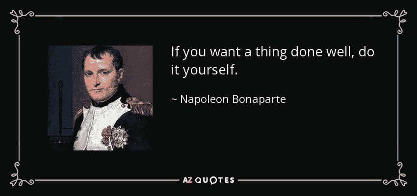

# 7 个股市“抽水和倾倒”大师的响亮信号

> 原文：<https://medium.datadriveninvestor.com/why-are-there-so-many-stock-market-experts-on-social-media-91bbbdfe1b18?source=collection_archive---------6----------------------->

## 为你自己省下一些钱和痛苦的挫败感。

Photo by [Jason Briscoe](https://unsplash.com/@jsnbrsc?utm_source=medium&utm_medium=referral) on [Unsplash](https://unsplash.com?utm_source=medium&utm_medium=referral)

请接受一个人的建议，他之前加入了这些服务中的一个，损失了一大笔钱。我来这里不是为了宣传任何东西，而是为了背后的真相。

我敢打赌，几乎每个社交媒体上的人都至少看过一个这样的广告:

> “我刚刚在 10 分钟内赚了 5000 美元！立即注册，获取我的每日提醒！”

为自己辩护的是，这些服务中的大多数实际上提供了对股市的准确解释。但是他们没有提供教育价值。这些提醒订阅服务只告诉他们的客户做什么，而不是教育客户关于市场的不同方面。因此，阻碍了客户的学习曲线。

[TheEdgeMarkets](https://www.theedgemarkets.com/article/cover-story-when-will-stock-market-party-end)

股票市场本质上是一个巨大的拍卖场所。价格上涨的原因是，在某一特定时间点，买方多于卖方。比方说，ABC 股票的当前价格是 50 美元，市场上有 20 个感兴趣的买家。这些买家会提高他们的出价来购买股票。如果当前需求大于当前供给，则股价上涨，反之亦然。请记住，这一概念适用于所有资产类别，包括加密货币、外汇、期货和期权。

 [## 收盘，但没有雪茄-股票市场目标在停滞的 COVID 救济中创新高|数据驱动…

### 专家聊天程序:一个协作市场，在这里人们可以和能够解决他们问题的专家聊天。是……

www.datadriveninvestor.com](https://www.datadriveninvestor.com/2020/08/18/close-but-no-cigar-stock-market-targets-record-highs-amidst-stalled-covid-relief/) 

任何想了解市场如何运作的人都可以很容易地通过谷歌或者去 [Investopedia](https://www.investopedia.com/articles/investing/082614/how-stock-market-works.asp) 了解它。因此，从某种意义上说，这些股市“大师”只是向不知情的公众宣传现成的知识。相信我，如果他们成功了，这是一个非常有利可图的生意。例如，每月 100 美元的订阅服务相当于一个客户每年 1200 美元。再乘以 20 个客户(这是个小数字)，每年就是 24，000 美元。除了他们的其他产品和一贯的市场操纵，这是一个负载的钱！

# 那么这些大师们是如何操纵市场的呢？

**第一步:让尽可能多的人注册他们的股票提醒和时事通讯。**

**第二步:找一只没人关心或交易的股票。不动的东西。**

第三步:购买股票，想买多少就买多少。

第四步:提醒关注者说:“我已经以 *x* 的价格买了 ABC 的股票，这是今天的精选，保证盈利！”

*追随者购买，哄抬价格。当跟风者都涌入一只股票时，价格飙升是不可避免的，因为买家比卖家多。(供不应求)*

**第五步:在股价飙升时卖出自己的股票。**

**第六步:发送警告说:“我已经退出我的职位，因为我不再喜欢它了。”**

当追随者收到这个警报时，他们也冲向出口，引起了巨大的恐慌。(供大于求)

**第七步:在社交媒体上发帖:“我刚刚在 5 分钟内赚了 2000 美元！你看多容易啊！”**

然后整个循环继续，因为社交媒体的追随者感觉他们错过了一定数量的利润，因为他们不在聊天室。每天冲洗并重复这一过程，难怪这些大师中的一些人能买得起豪车。

这是专门针对那些在股票市场寻找“快速赚钱”的人。我不想打击你，但是在股票市场上没有快速赚钱的方法，事实上，可能正好相反。

留意那些保证在股票市场获利的人，那些炫耀豪车、手表或大量现金的人，那些让你给他们账户汇钱的人，那些告诉你在股票市场交易很容易的人。如果你看到任何这些，你最好跑路，因为你的钱最有可能出现在他们的账户里。

Photo by [Sebastian Herrmann](https://unsplash.com/@officestock?utm_source=medium&utm_medium=referral) on [Unsplash](https://unsplash.com?utm_source=medium&utm_medium=referral)

那么外卖是什么？坦率地说，我认为最先开发这种商业模式的人是某种类型的天才。因为他们知道大多数人通常懒得去了解股票市场，只想跟随别人。我在股票市场交易了大约 3 年，看到很多人破产，因为他们听从了大师的警告，所以不要这么做。

花一些时间来正确地掌握股票市场的概念和价格变动背后的原因。如果你能做到这一点，你就比其他跟随警报的参与者有更大的机会在市场中成功。

Source: [Forbes](https://www.forbes.com/sites/jurgenappelo/2015/11/27/if-you-want-something-done-delegate-it-yourself/#602c3bf941ba)

*嘿，既然你在这里，为什么不加入我的* [***邮件列表***](https://marcuschan.ck.page/76504d9d12)**来看看你收件箱里偶尔出现的精彩故事，或者考虑成为会员***来阅读我所有的故事！☺***

****访问专家视图—** [**订阅 DDI 英特尔**](https://datadriveninvestor.com/ddi-intel)**