# 为什么人们不隔离？

> 原文：<https://medium.datadriveninvestor.com/why-arent-people-quarantining-b8a28950d416?source=collection_archive---------1----------------------->

## 因果关系

## 运用博弈论、心理学和神经科学来理解非隔离者

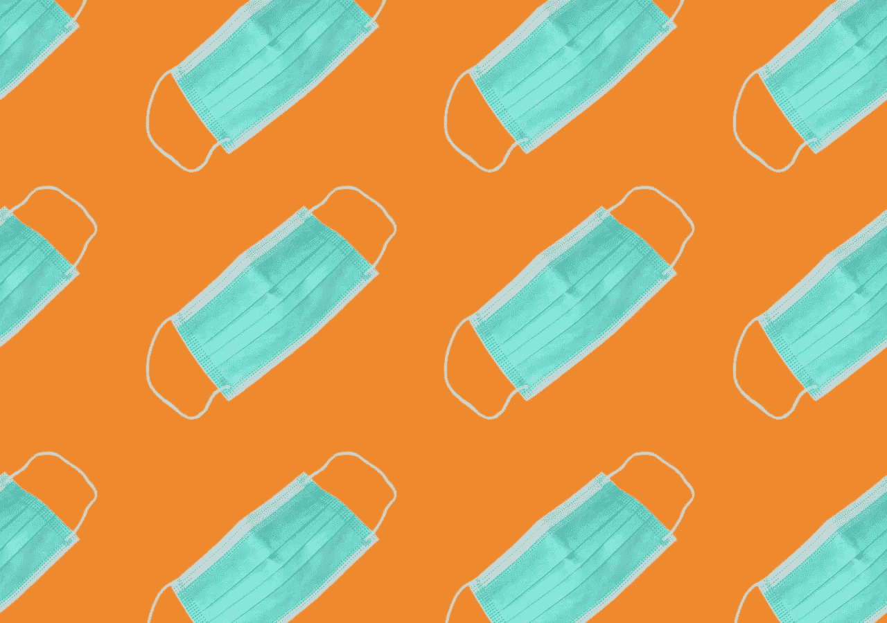

Source: [Murto Hilali](https://medium.com/@hilali.murto)

如果说 2019 年是革命之年，那么 2020 年就是危机之年。幸运的是，仍然有一些革命的点缀。真的，真的，愚蠢的革命。

反对社会距离措施的抗议活动已经在温哥华、密歇根和明尼苏达出现。没错——那些被政府征召坐在沙发上看一整天网飞的人很沮丧。

> 活着是多么美好的时光。

这对我们来说很难，我明白。我们正在进入衰退，人们将失去工作，卫生纸已经取代美元成为全球货币。

> 但是另一种选择是成百上千条生命的损失(T2)。

严肃地说，人们因为他们的收入和孩子的教育受到威胁而抗议是可以理解的，我同情他们——但是那些有特权的人呢，他们可以隔离[，但仍然选择不](https://globalnews.ca/news/6700878/spring-break-2020-coronavirus/)？

我们的父母和祖父母经历了战争+不能在一个周末狂看五季《办公室》。与他们必须做的相比，我们已经做得很容易了。

[](https://www.datadriveninvestor.com/2020/03/23/coronavirus-a-to-panic-z-between-the-lines/) [## 冠状病毒；惊慌失措；字里行间的 z |数据驱动的投资者

### 围绕冠状病毒的话题；更准确地说，新冠肺炎几乎占据了整个新闻预报的头条…

www.datadriveninvestor.com](https://www.datadriveninvestor.com/2020/03/23/coronavirus-a-to-panic-z-between-the-lines/) 

那么，为什么人们呆在家里这么难呢？(显然不包括必要的工人)

*   那只是一种理论…一种游戏理论 *(博弈论，也是 MatPat)*
*   **“拼实力！”** *(社会文化心理学，也是格莱美提名的嘻哈/R & B 组《公敌》，1988)*
*   **“孤独……我好孤独。”** *(神经生物学，也是阿肯，2004)*

*(TL；博士在最后)*

# 你让假的人向你展示假的爱

## 所以从逻辑上讲，你应该背叛你的整个社区。

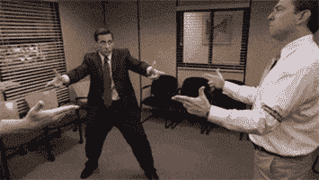

A visual representation of game theory. | Source: Giphy

博弈论着眼于理性人之间的战略互动，并对他们的互动进行数学建模。仅举几个例子，它被用于经济学和计算机科学等领域。

*(为了这个活动，我必须要求，我们都假装是理性的人。)*

我们可以用**收益矩阵**来模拟隔离/出去的决策:

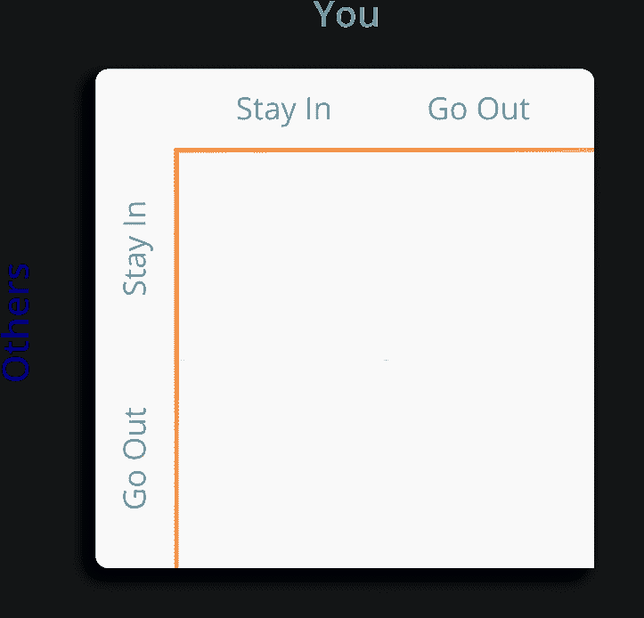

Source: [Murto Hilali](https://medium.com/@hilali.murto)

**‘你’**就是你，‘**其他人’**就是你所在社区、工作场所、班级等的人。你们都有同样的一套决策，或者说**策略**，可供你们选择:**留在**(隔离)或者**出去**(不隔离)。你们选择的不同策略的组合导致了**四种不同的收益:**

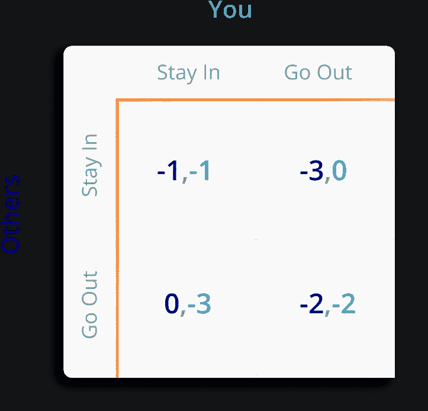

Dark blue = Others’ benefit, Light blue = Your benefit.

## 左上角—最佳集体成果

这些数字代表效用月数(MOUs)。如果**你**和**其他人**选择**留在，** *(即大家都隔离)* 双方都只损失一个 MOU (-1)，因为我们都把曲线压平，更快找到解决方案。加油团队！

## 右下角——最糟糕的集体结果

如果双方**外出，** *(无人隔离)*，那么病毒传播更快，政府实施更长时间的隔离:每个人损失 2 MOUs。:(

## 右上——背叛他人，获得成功

如果**你**加入黑暗面**出去，**你失去 0 个 MOUs。当其他人都困在家里的时候，你在你的班级、工作场所、社区等的竞争对手面前获得了优势。没有竞争，你变得超高效，从你的时间中挤出 **2 MOUs** ，让你领先于其他人。

其他**人**也可以这样做，但选择不这样做，所以这代表了在他们因为隔离而失去的 1 个月的基础上的 2 个月的机会成本，使**其他**人的收益为-3。

## 左下角——其他人背叛了你，你被耍了

同样的原理反过来也适用。如果**你留在**而**其他人出去了，**他们失去 0 个 MOUs，你得到-3 的收益。

## 你是做什么的？

作为一个完全理性的人，你的目标是**最大化你的个人收益**，在这种情况下，这意味着**最小化你**失去的**。因此，让我们来看看每个**策略**的最佳+最坏情况。**

## **如果你选择留在:**

你最好的情况*(收益最高的组合)*是**别人留在:** *-1* MOU，或者损失一个月。

你的最坏情况*(最低收益)*发生在**别人** **出去:** *-3* MOUs。


## 如果你选择外出:

最好的情况是当**其他人留在:** *0* MOUs 丢失

最坏的情况是**别人出去:** *-2* MOUs。

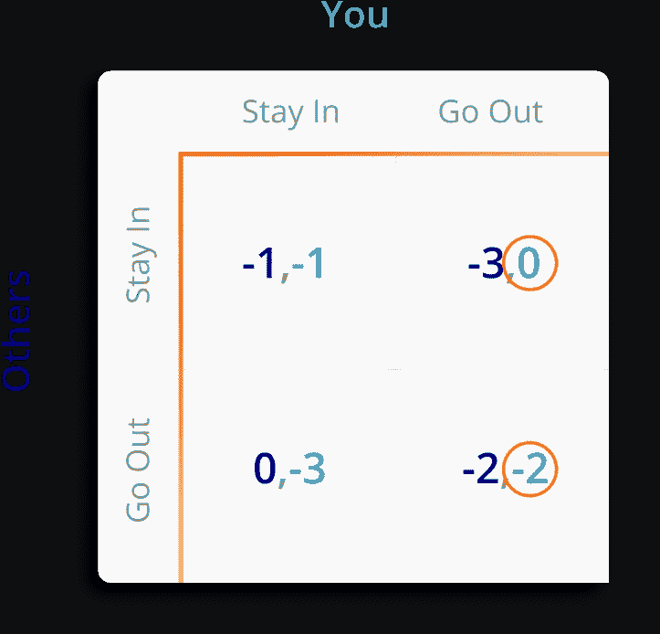

```
**Stay In:** *Best Payoff* = **-1**, *Worst Payoff* = **-3****Go Out:** *Best Payoff* = **0**, *Worst Payoff* = **-2****0** > **-1**, **-2** > **-3**
```

如果**你**选择**出去，**那么你的最好和最坏情况都会更好，所以作为一个理性的人，这就是你选择的策略。然而，**别人**会经历和**你**完全一样的思考过程。

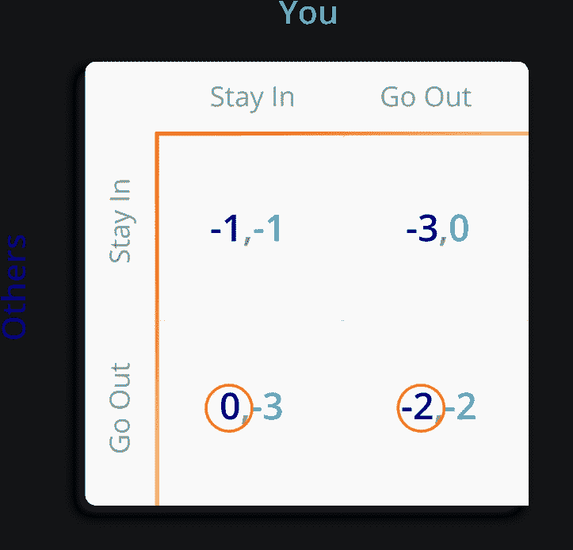

Best and worst-case scenarios for staying in (left) and going out (right).

有了同样的选择，他们的目标也是**尽量减少 MOUs 丢失**——这意味着他们也会选择**外出**。

你和其他人**都出去了，**导致了**最坏的可能结果** (-2，-2)——感染扩散了，我们都得花更多的时间隔离。

这是一个**囚徒困境博弈**，双方的逻辑思维总会产生一个全局劣势**纳什均衡**(两个玩家都出局，这对所有人来说都很烂)。

## 人们选择不隔离，因为从他们的立场来看，这是最理性的做法。

但是没有人是完全理性的，我怀疑每个非隔离者在决定离开家的时候都会经历这个思考过程。

那么还有什么在起作用呢？

# 坚持到底

## 大多数西方文化对权威都有问题

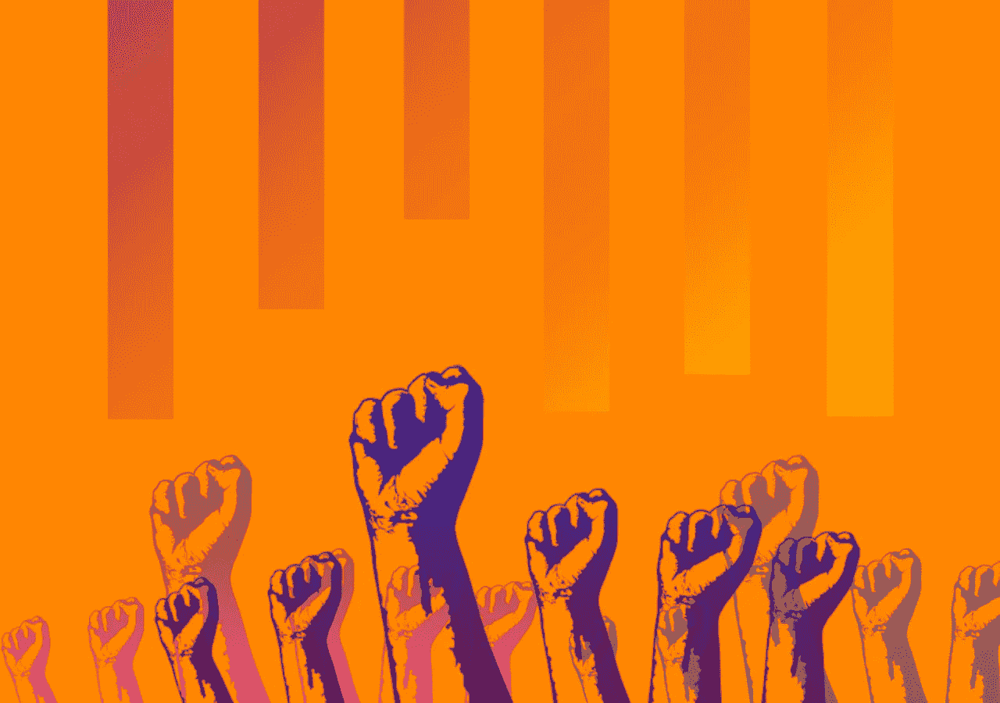

Source: [Murto Hilali](https://medium.com/@hilali.murto)

当社会文化心理学家比较不同文化时，他们使用一组**维度**作为标准。把它们想象成迈尔斯-布里格斯的性格特征，但适用于不同的民族和文化群体。

其中一个维度是**动力距离指数、**或 **PDI。PDI 衡量的是社会中权力较小的人接受严格的社会等级制度的意愿。**

PDI 得分高的国家(俄国、中国、厄瓜多)倾向于接受不平均的权力分配，并对长辈和权威表现出尊重。PDI 分数低的国家是这样的:

Source: [GIPHY](https://gph.is/g/4AyzgMQ)

开玩笑的。

低 PDI 国家(德国、瑞典、美国)倾向于更多地质疑权威，社会结构也不那么等级森严。

我们文化中的 PDI 可以通过**声音效应**影响我们的行为，这种效应看你对权威决定的反应如何，取决于你被允许有多少**输入(声音)**。

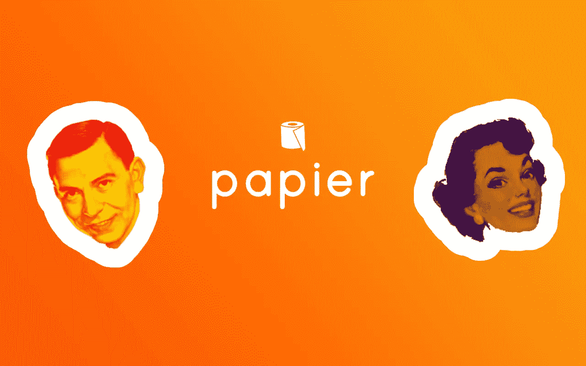

Source: [Murto Hilali](https://medium.com/@hilali.murto)

假设你在我的热门新技术创业公司**工作，我们在区块链卖人工智能卫生纸。我们正在经历一些会影响你工作生活的重大变化——包括一位新经理，我信任的知己之一，费尔南多和埃斯梅拉达。**

*   **如果你有 Fernando，一个在做决定前会咨询你和其他人的意见的人，你对***paper***有多忠诚？**
*   **如果你有埃斯梅拉达，她根本不在乎你的意见，会在没有你的情况下做决定，你会有多忠诚？**

**布罗克纳*等人(2001)* 给了*(高 PDI)**(低 PDI)* 美国学生一个类似的场景，看看他们的文化的 PDI 分数会如何影响他们对当局决定的反应。**

**参与者都处于相似的情况下——他们在一个变化的公司，新的经理，等等。在*高嗓门*的情况下，经理就像费尔南多一样——乐于向你咨询。在*低声*的情况下，经理就像埃斯梅拉达——不太愿意接受意见。**

**随后，参与者通过一份调查问卷被问及他们的组织承诺(在这种情况下，这代表了他们对这种情况的满意程度)，结果显示如下:**

**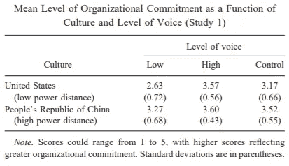**

**Screenshot by Author**

*   **在*高声*的情况下，中国和美国学生对公司的投入程度大致相同，即他们对高水平的声音/投入反应积极。**
*   **在*低声*的情况下，美国参与者表现出**比中国学生明显更少的组织承诺**，也就是说，他们不喜欢自己的低水平投入。**

**因此，虽然我们所有的 T21 人都喜欢高水平的参与，但像美国和加拿大的 PDI 公民这样的低水平公民真的不喜欢他们在决策中没有发言权——接受政府的单方面决定在我们的文化中是不存在的。**

**[](https://www.themoscowtimes.com/2020/04/21/russian-opposition-plans-online-coronavirus-lockdown-protest-a70065) [## 俄罗斯反对派计划网上冠状病毒封锁抗议-莫斯科时报

### 俄罗斯反对派呼吁下周举行网上抗议，向克里姆林宫施压，要求给予人民经济援助…

www.themoscowtimes.com](https://www.themoscowtimes.com/2020/04/21/russian-opposition-plans-online-coronavirus-lockdown-protest-a70065) 

需要更多证据吗？俄罗斯发生了抗议——但它们是关于对中小企业的财政援助。它们发生在网上，密歇根州。

也就是说，一些美国人和加拿大人可能对权力距离有很高的个人信仰，这与他们的文化截然不同——那他们呢？** 

# **大脑想要大脑想要的**

## **你的大脑是孤独的**

**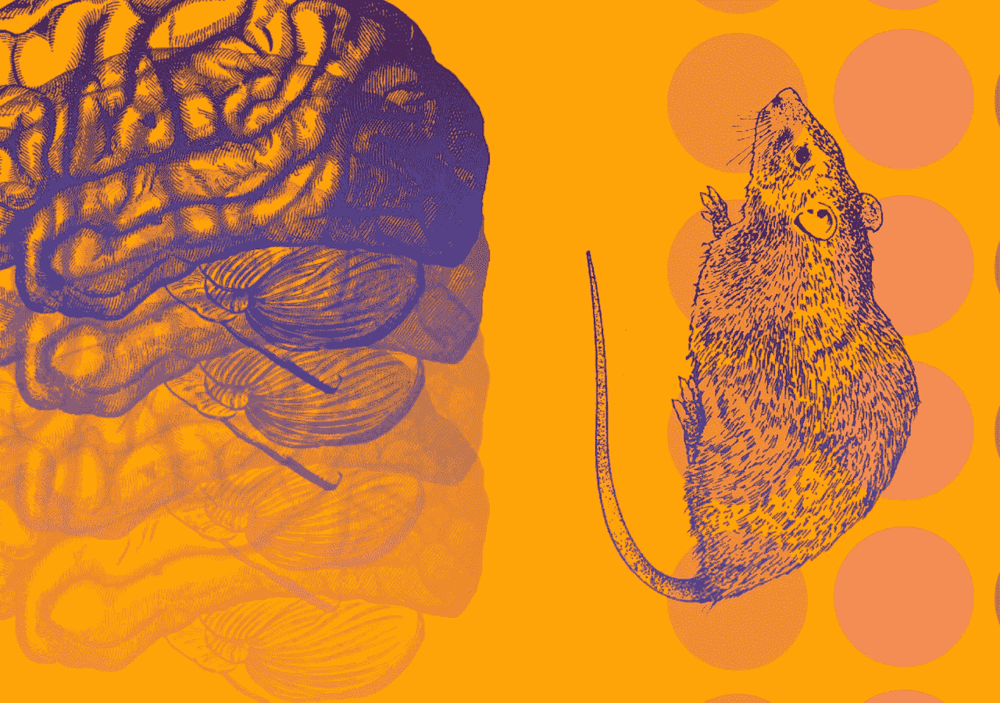**

**Source: [Murto Hilali](https://medium.com/@hilali.murto)**

**在我们担心新冠肺炎之前，科学家们非常担心全球性的孤独流行病。大约五分之一的美国和英国成年人说他们总是或经常感到孤独，这是个问题…**

> **“与孤独作斗争的人最终会缩短寿命，而且他们患心脏病、抑郁症、痴呆症、焦虑症和许多其他疾病的风险也会增加。”——[维维克·穆尔蒂](https://www.vivekmurthy.com/)，前 [S *美国的乌尔容将军*](https://freakonomics.com/podcast/loneliness/) *。***

**我们的祖先需要社会群体来帮助他们生存和照顾他们的后代。如果我们在公共场合看到前任，我们需要他们在我们周围形成一道保护墙。**

**还是只有我？**

## **照多巴胺说的做。**

**隔离限制了我们大多数人想要拥有的社会交往水平，所以我们试图恢复它是有意义的。这种行为的神经学基础在于大脑的[****中缝背核****](https://www.psychologytoday.com/ca/blog/brain-chemistry/201712/the-neuroscience-loneliness)**区域中的**多巴胺**。****

******多巴胺**是一种**化学信使**，它向大脑发送信号(一种*神经递质*)，并与良好的感觉相关——吃美食、听有趣的笑话、积极的社会互动。****

****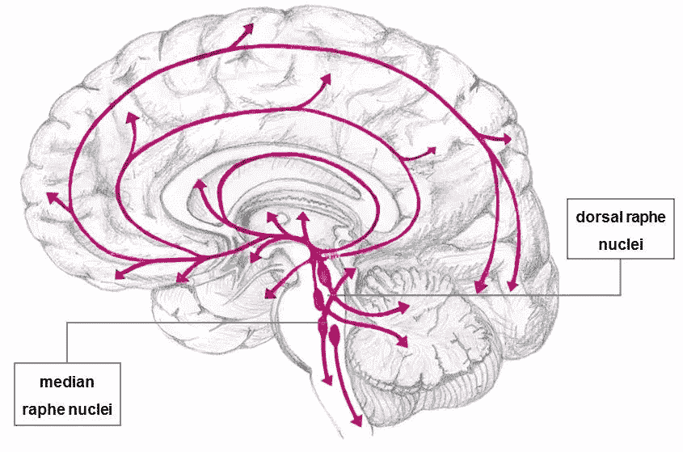****

****Source: 3 5-HT projections throughout the human brain originating from the raphe nuclei in the midbrain. Tarland, Emilia & Zentek, Jürgen & Fink, Heidrun. (2019).****

****DRN 是大脑中血清素含量特别高(另一种神经递质)的区域，与睡眠周期和抑郁有关。****

****Matthews *等人* (2016)的研究表明，当小鼠被置于**社会隔离**时，DRN 中的**多巴胺能神经元被激活**。****

****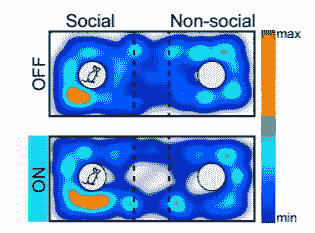****

****“Representative spatial heat maps showing the location of a ChR2-expressing mouse” | Red indicates more time spent in the area. | Source: Matthews et al. (2016)****

****他们让这些老鼠完成三室任务。鼠标从中心区域(虚线所示)开始，可以向任何一侧移动。社交侧(左侧)有另一个鼠标在里面，非社交侧是空的。****

****当研究人员打开多巴胺能神经元时，老鼠在社交区域花费的时间甚至比神经元关闭时还要多。****

## ****这是什么意思？****

****当处于社会隔离状态时，DRN 中的多巴胺能神经元会激活；就像老鼠一样，它们会激励我们寻求更多的社会互动。****

****饥饿和疼痛是你身体的警告信号:****

> ****尽快去找食物和/或医疗援助！****

****同样，孤独是你的大脑告诉你，你缺乏生存所需的社会交往，所以走出去获得它们吧！****

****(不过，不要真的去。只要跳上派对或者变焦或者你们这些天在做的任何事情。)****

********

****Photo by [Gabriel Benois](https://unsplash.com/@gabrielbenois?utm_source=medium&utm_medium=referral) on [Unsplash](https://unsplash.com?utm_source=medium&utm_medium=referral)****

# ****TL；为什么人们不隔离？****

*   ****根据博弈论，这是唯一理性的决定，因为如果你出去而不是呆在家里，你的最好+最坏情况会更好。****
*   ****无视权威(低 PDI)是我们文化的一部分，所以当政府在没有我们的情况下做决定时，我们不会做出很好的反应。****
*   ****你大脑的中缝背核神经元开始放电，激发你寻找社会互动。****

## ****为什么这对我很重要？****

*   ****在选择犯罪伙伴时，找一个完全不理智、可以牺牲的人——比如弟弟妹妹。否则，囚徒困境会毁了你们俩。****
*   ****如果你想发起一场无政府主义者的起义，这里是个不错的地方。此外，申请加入***paper***现已开放。****
*   ****孤独就像饥饿，只有当你做点什么的时候才会停止——打电话给你的朋友。****

```
****This article is part of ***Causality***, a column where I use different sciences + disciplines to answer questions I have about the world.**** 
```

****[](https://medium.com/datadriveninvestor/how-much-is-a-human-life-worth-744ded9a2640) [## 一条人命值多少钱？

### 对于政策制定者目前正在努力解决的问题，这是一个经济学和生物化学的答案

medium.com](https://medium.com/datadriveninvestor/how-much-is-a-human-life-worth-744ded9a2640) [](https://medium.com/swlh/why-are-you-so-into-tiktok-6b5d5f296ab8) [## 你为什么这么喜欢抖音？

### 经济学、人工智能和神经化学可以解释该平台的流行

medium.com](https://medium.com/swlh/why-are-you-so-into-tiktok-6b5d5f296ab8) 

嗨！我叫 Murto，是加拿大多伦多的一名 18 岁的企业家和学生。如果你对我的这篇文章有任何反馈，或者你只是想聊天，请通过 [LinkedIn](https://www.linkedin.com/in/murto-hilali-7a6068136/) 联系我。后续步骤:

*   *战胜你的敌人*
*   *和你喜欢的人谈谈*
*   *祝你今天愉快*

*谢谢！*****