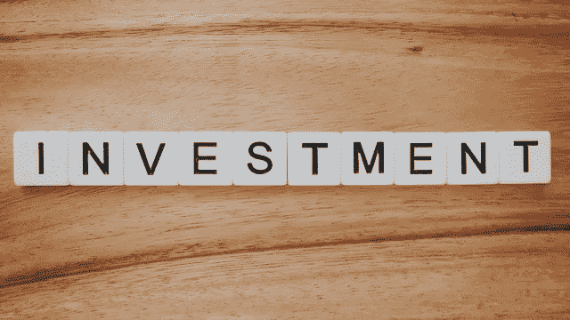
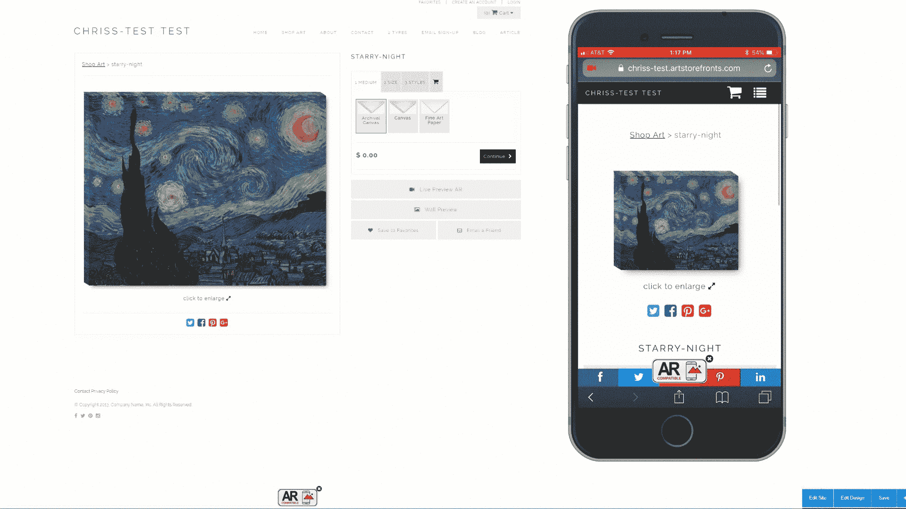

# 为什么现在艺术是一种投资

> 原文：<https://medium.datadriveninvestor.com/why-art-as-an-investment-now-e4dba7acd622?source=collection_archive---------19----------------------->

从历史来看，在混乱的金融时代，艺术品是一种稳健的投资

Photo by [Precondo CA](https://unsplash.com/@precondo?utm_source=unsplash&utm_medium=referral&utm_content=creditCopyText) on [Unsplash](https://unsplash.com/s/photos/investor?utm_source=unsplash&utm_medium=referral&utm_content=creditCopyText)

如果你几个月前在考虑投资什么，在冠状病毒衰退之前，你可能会和你的经纪人谈论股票。

更谨慎的投资者可能已经购买了黄金。

我认为，如果我们都有一台时光倒流的机器，我们就应该购买艺术品。

在新冠肺炎危机期间，人们对艺术的兴趣大增。艺术家们一直在疯狂地创作，以帮助我们度过和应对不断变化和不确定的时代。

艺术的弹性应该是我们在历史上都见过的。

 [## 一个企业在肚子上移动:如何照顾直觉|数据驱动的投资者

### 事实证明，直觉不仅仅是一种感觉。科学很清楚:你的直觉比你知道的更多…

www.datadriveninvestor.com](https://www.datadriveninvestor.com/2018/11/09/a-business-moves-on-its-stomach-how-to-make-allowances-for-gut-feelings/) 

如果历史是正确的，投资艺术品不仅有助于你的健康和康复，还能确保你的投资账户。

现在是购买艺术品用于投资和支持小型独立企业主的大好时机。和你的顾问谈谈，看看艺术品对你来说是不是一项好的投资。

[根据 NYU](https://www.stern.nyu.edu/om/faculty/moses/FineArt/Recessionart5.pdf) 的一项研究，在战争时期，如一战和二战期间，艺术品的表现优于股票指数。

该研究还发现，“除了收藏者享受的审美愉悦之外，艺术品似乎还是一种很好的长期价值储存手段……(因为)在 20 世纪 60 年代至 80 年代初的经济衰退中，整体艺术品价格指数没有下降……”。

在 2000 年代末的经济衰退期间，世界艺术指数再次表明，艺术投资是一个好买卖。

根据《T4》的一篇文章，“……梅·摩西世界所有艺术品指数，投资级艺术品的价值在 2011 年增长了 10.2%，超过了标准普尔 500 指数和富时所有股票总回报指数。”

总部位于伦敦的美术基金集团建议他们的客户将 5%的资产投资于艺术品。

[Fine Art Views](https://fineartviews.com/blog/101634/is-a-bad-economy-good-for-art) 的一篇文章甚至说,“当市场变得不稳定时，对珠宝、古董、收藏品和艺术品等更稳定资产的投资就会增加。这些商品被视为能够保持长期价值的有形资产。”

正如《福布斯》报道的那样，“一个人总是可以‘充满信心地投资艺术，因为一件艺术品永远不会破产’”。

所有这些对普通投资者来说意味着什么？

现在是购买艺术品的最佳时机。

我们正在经历一场前所未有的复兴。艺术家们成群结队地在网上免费提供内容。

对于投资者来说，现在是寻找和了解你感兴趣投资的艺术家的时候了。

据[商业内幕](https://www.businessinsider.com/how-to-buy-art-2012-2#first-figure-out-what-kind-of-art-you-like-1)报道，购买艺术品的第一步是去看很多艺术品。现在，这些艺术品和艺术家都在网上，供你免费观看。

现在是就你感兴趣的作品向艺术家提问的好时机。Artbusiness.com 建议你仔细研究艺术家和作品，并提出问题。

艺术家现在比以往更多地在线，并利用变焦会议等新媒体在他们的网站上为你提供他们的艺术和增强现实的私人展览，向你展示他们的艺术在你的墙上会是什么样子。

Augmented Reality Example

艺术家也在社交媒体上制作内容，让你与他们建立关系，这样你才能真正了解你投资的艺术背后的人。

知道艺术家对他们的艺术是认真的，会让你安心，你的投资会在未来继续保值。

随着冠状病毒经济衰退期间艺术的复兴，投资艺术是一种既能确保你的财产投资又能支持小企业主的好方法。和你的顾问谈谈，看看艺术品对你来说是不是一项好的投资。

~贝丝·谢里丹是德克萨斯州休斯顿的美术摄影师和作家。通过[她的网站](https://www.bethsheridan.com/newsletter-sign-up)注册她的免费艺术通讯，了解她最新的项目和摄影技巧。~