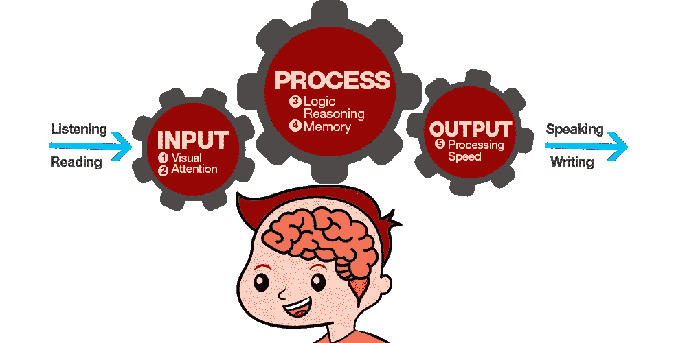
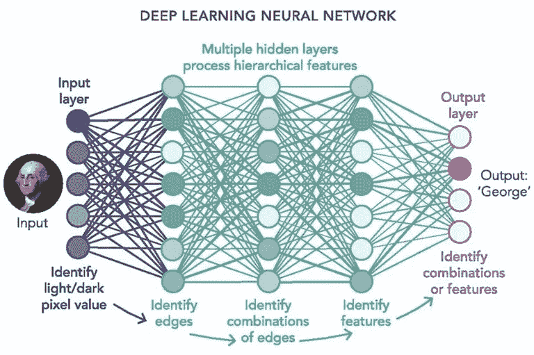

# 为什么人工智能不能取代人类智能？

> 原文：<https://medium.datadriveninvestor.com/why-artificial-intelligence-cannot-replace-human-intelligence-2af556db743e?source=collection_archive---------6----------------------->

Photo by [Franck V.](https://unsplash.com/@franckinjapan?utm_source=medium&utm_medium=referral) on [Unsplash](https://unsplash.com?utm_source=medium&utm_medium=referral)

现在每个人都在谈论**人工智能**，这看起来像一种趋势。他们说，一百年后，我们将被拥有强大人工智能的自动机所控制。现在，允许机器在创纪录的时间内学习和处理数以千计的信息的不同技术正在传播。那么，我们会被硅片取代吗？人类注定要灭绝并被自己创造的东西所取代吗？好吧，如果这种良心可以和人类的相比，那么答案肯定是肯定的！

但在分析所有这些之前，有必要问自己这个重要的问题:

> *什么是智力？什么时候我们可以认为一个人聪明？*

智力没有官方定义，但它被认为是个人**适应**的能力，或者更确切地说是他如何**解决**新的**问题**或**实现目标**。

至于机器，人类也有物质资源，可以用来解决新问题和实现目标。事实上，人类使用五官和大脑来捕捉感知、处理信息和行动。

Original source: [https://englisheagle.com.my/5-brain-abilities/](https://englisheagle.com.my/5-brain-abilities/)

因此，如果人脑是整个过程中最重要的工具，我们可以假设，就其大脑结构而言，一个人可能比另一个人更聪明(这一辩论仍然在我们的社会中引起很多争议)。

**大脑**就其复杂性而言，是一个由数十亿**神经元**组成的人体器官，这些神经元通过称为轴突或树突的纤维连接在一起，轴突或树突在神经元之间传递生物电脉冲。

Photo by [Josh Riemer](https://unsplash.com/@joshriemer?utm_source=medium&utm_medium=referral) on [Unsplash](https://unsplash.com?utm_source=medium&utm_medium=referral)

以一种非常综合的方式，我们可以说，当我们学习时，神经元之间的连接被创建(或新的神经元被创建)，而不是当我们想要记住在那一刻之前发现的事情时，神经元被激活。这是神经学研究告诉我们的，但仍有许多有待发现。要记住的最令人印象深刻的事情是神经元细胞多年来产生(甚至退化)的能力，因此“人类”智能使用的资源会随着时间的推移而变化。

然而，关于人工智能，我们可以说，它强烈依赖于机器，即计算机可用的资源，这些资源是永久的和有限的。

我们可以将人脑比作计算机的存储器和处理器，而不是将组织结构比作机器实现的算法(几乎经常是深度学习神经网络)。

与能够再生形成物理结构的元素的人脑不同，机器具有先验定义的物理能力，它们可以不时修改的只是处理信息的逻辑。有人会说，通过**机器学习**，机器会像人类在生命的最初几年一样慢慢学习。这是真的，但从物理学的角度来看，机器从诞生之日起就以同样的方式工作，这是它们区别于人类的地方。

> 人工智能模拟人类智能。

实际上，深度学习是人工智能的一个研究领域，我们发现它与人脑处理信息的方式有相似之处。深度学习利用**神经网络**让机器“思考”

什么是神经网络？抽象现实的机器使用算法。因此，为了抽象大脑(现实)，机器使用这些令人垂涎的神经网络。

Original source: [https://bit.ly/2C4cK5U](https://bit.ly/2C4cK5U)

正如我们从图像中看到的，这个概念与上面描述的人脑几乎相同。有许多单位(神经元)接收感知作为输入。感知对机器来说就像新的体验，导致新神经元的诞生或它们之间的连接。让我们考虑深度学习最著名的应用之一:**图像分类**。该网络接收一幅图像作为输入，从中提取特征，并根据其被“训练”的方式，识别该图像并输出信息。如果我们想一想，人脑也是这样做的:当它想学习一些东西时，它通过轴突在神经元细胞之间建立新的连接，神经网络在接受训练时也是如此，当它想记住一些东西时，它激活现有的神经元，这对应于当它们想推断或提供信息/推断时，激活形成神经网络的单元。

到目前为止，神经网络似乎可以像人脑一样工作，但这不是真的。事实上，有两个重点需要关注:

1.  人类的神经元能够根据特定的需要自我毁灭和再生。
2.  人工智能不具备*“直觉”*，即利用很少的数据做出推论或得出结论的能力。直觉是“创造力”的姐妹，这是人工智能未知的另一个特征。

当这两个特征中至少有一个是机器具备的时候，那么这篇文章的标题可能就没有意义了。