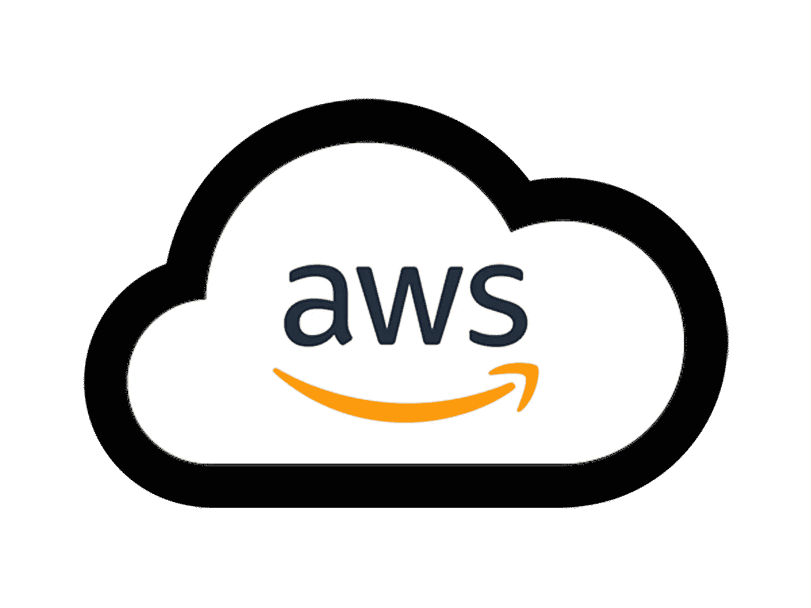

# 为什么 AWS 在云计算领域领先，以及 AWS 的优势。

> 原文：<https://medium.datadriveninvestor.com/why-aws-is-leading-in-the-cloud-computing-sector-and-advantages-of-aws-a8fa54d666f9?source=collection_archive---------28----------------------->

## 先说个故事吧...

[FROM](https://aws.amazon.com/amazon-linux-ami/)

你只是想象你创建了一个网上购物门户。在开始阶段，门户网站从数量不多的用户开始。但是最近在黑色星期五和 T2 的其他节日有很多访客，门户网站看到很多访客，服务器被激活，流量和崩溃。你失去了市场。有什么方法可以在不投资新服务器的情况下提高性能？一种根据任何给定时间点的网站访客数量增加或减少容量的方法。是的，有 AWS 或者亚马逊网络服务。在我们知道 AWS 如何解决您的问题之前。让我们看看什么是 AWS 以及 AWS 是如何达到这些位置的。

## 使用 AWS 还是亚马逊网络服务？

AWS 或亚马逊网络服务是亚马逊的云计算平台。是的，亚马逊不仅仅是一个在线零售商，就像许多领先的平台一样，AWS 包含了

**⁍Infrastructure 即服务**

**⁍Platform 即服务**

**⁍Software 即服务**

## AWS 为组织提供工具，如

**⁍电脑电源**

**⁍Database 存储**

**⁍Content 快递服务**

政府机构、教育机构、非营利组织和私人组织都使用 AWS。AWS 由 24 个产品类别组成，如网络开发工具，以词安全和政府，并包含特定的服务，如亚马逊 ec2 的虚拟计算机，亚马逊 route 53 的可扩展域名系统和 AWS amplify 的构建应用程序 AWS 甚至有游戏，消息，虚拟现实和一般业务生产力的服务。基本上，AWS 为几乎每个人提供了一些东西，每项服务都可以根据用户的特定需求进行配置。随着时间的推移，AWS 增加了一些服务，有助于打造一个高度可用、可扩展、低成本的基础架构平台。

## 自动气象站的历史

**2002 年**

AWS 于 2002 年首次推出，作为一种为开发者提供工具和服务的手段，并为 Amazon.com 网站整合了一些功能。

**2006 年**

2006 年，它推出了第一款云服务。

**2016**

AWS 超过了 100 亿美元的收入目标。

**现在**

AWS 有超过一千个云服务，跨越了广泛的领域。全球超过 45%的市场都在使用 AWS 云服务平台

**什么是 AWS？**

[FROM](https://adamtheautomator.com/aws-ec2-snapshots-powershell/)

AWS 或 Amazon Web Services 是一个安全的云计算平台，它提供

**⁍Computing 动力**

**⁍Database**

**⁍Networking**

**⁍Content 储物还有更多**

该平台是一种现收现付的模式。这意味着你需要支付 AWS 提供的服务器数量

## AWS 的其他一些优势包括

## 安全性

AWS 提供了一个安全可爱的平台，提供端到端的隐私和安全

## 经验

您可以从基础架构管理包中获益，这是 14 年来积累的经验。

## 灵活的

它允许用户选择操作系统、语言、数据库和其他服务。

## 使用方便

用户和主机应用程序快速安全。

## 可攀登的

根据用户需求，应用程序可以放大或缩小。

AWS 在各个领域提供了广泛的服务

## 您可以为您的在线门户网站启动一个应用程序吗？借助亚马逊？

## 计算服务

是的，您可以通过 AWS 提供计算服务，从开发、部署、运行到根据需求扩展或缩减应用程序，全程支持应用程序开发流程

## 受欢迎的服务包括

**⁍** EC2

**⁍** AWS lambda

**⁍** 亚马逊轻售

**⁍** 弹性豆茎

## 存储数据

为了存储您的网站数据，您可以使用 AWS 存储服务，让他存储访问、发现和分析数据，以确保降低成本和加快创新。

这个领域中的流行服务包括

**⁍** 亚马逊 S3

⁍**EBS**

**⁍** S3 冰川

**⁍** 弹性文件存储

## 用户数据

您可以使用 AWS 服务保存您的用户数据，这是您可以优化和管理的

这个领域中的流行服务包括

⁍亚马逊 RDS

⁍迪纳摩 DB

**⁍** 红移

## 网络服务

如果您的业务开始发展，如果您需要分离基础架构或扩展，您可以使用 AWS 提供的网络服务

一些流行的网络服务包括

⁍亚马逊 VPC

**⁍** 亚马逊路线 53

**⁍** 弹性负载均衡

AWS 提供服务的其他领域包括

**⁍** 分析学

**⁍** 区块链

**⁍** 集装箱

**⁍** 机器学习

⁍物联网

# 别忘了留下你的回答。✌

大家敬请关注！！为了把我的故事发到你的邮箱里，请订阅我的时事通讯。

感谢您的阅读！不要忘记给你的掌声，分享你的回答，并与朋友分享！