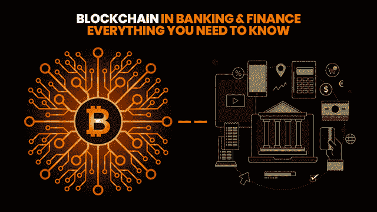
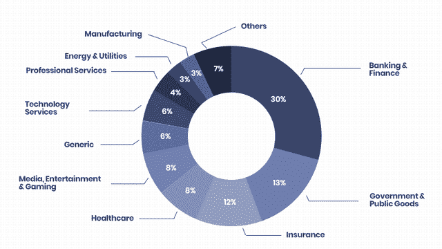
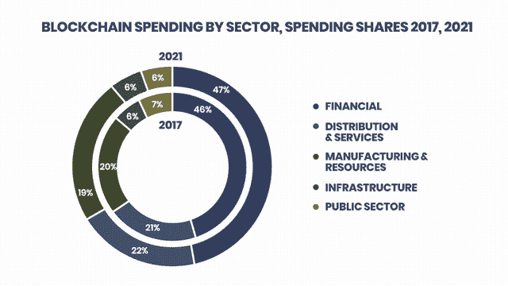
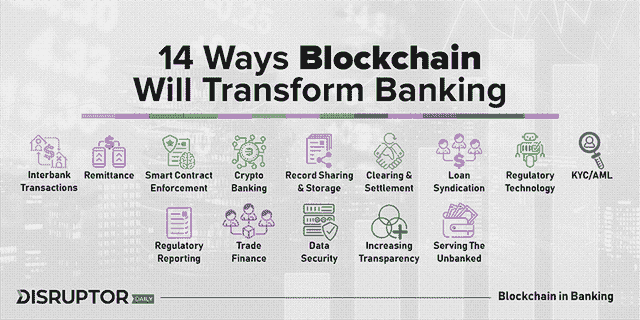
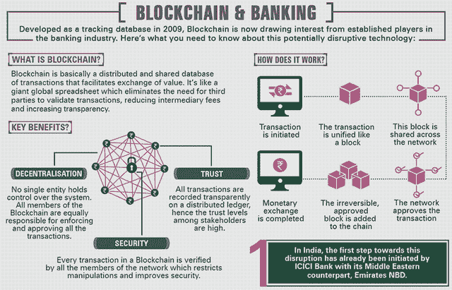
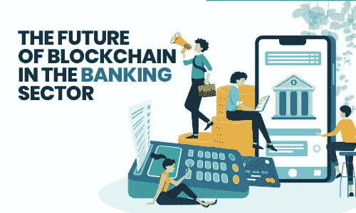

# 为什么银行在寻找基于区块链的支付系统

> 原文：<https://medium.datadriveninvestor.com/why-banks-are-looking-for-blockchain-based-payment-systems-ead1fbf38afc?source=collection_archive---------2----------------------->

区块链技术目前正在蓬勃发展。有许多行业正从中受益，并使其过程安全稳定。如果您属于银行和金融部门，您可以考虑在您的流程中实施这项技术，以便使其更加安全。

## 以下是区块链技术在不同领域的分歧:

[图像来源](https://blockgeeks.com/guides/blockchain-and-finance/)

## 现在看看 2017 年至 2021 年区块链科技的支出:

[图片来源](https://www.idc.com/getdoc.jsp?containerId=IDC_P37345)

很明显，区块链作为一种技术是数据仓库和计算的未来。每个行业——无论是教育、医疗保健、金融还是银行——迟早都会发现自己在使用这项技术。尽管这是金融或银行服务领域讨论最多的技术之一。

> 区块链的发展很好地归因于比特币等加密货币的兴起，没有它就不会存在。加密货币背后的整个想法就是区块链技术的形成。

这是一个完全分布式、数字化的交易分类账，网络中的所有计算机都可能存在大量无法区分的副本。因此，每个人都可以查看以前的交易，也可以记录新的交易，但是一旦被链授权，就不能被操纵或破坏。这种权力下放消除了对任何形式的中间人的需要。

> 区块链验证和转移转换价值的基本能力是它应对银行业面临的所有问题的原因。

它的线性模型允许您跟踪一个或所有的更改，并防止它们被违反。区块链遵循一个链编码系统，除了为所有连接它到下一个链块的块分配一个唯一的哈希。

 [## 2019 年十大区块链课程|数据驱动的投资者

### 渴望在区块链发展吗？你想知道区块链是如何工作的，但不知道在哪里？或者就是太多了…

www.datadriveninvestor.com](https://www.datadriveninvestor.com/2019/03/08/top-10-blockchain-courses/) 

即使有人破解了密码，对一个块中记录的任何事务所做的任何更改都将改变“碎片”，因此，将不得不使用大量的力量来调整链中的所有其他块。特别是，这使得整个过程变得毫无用处，这在一开始实际上是不可能的。

> 下面的详细分析讨论了区块链技术将为当今的银行和金融机构提供的不同领域。

***让我们快速浏览一下在银行业使用区块链的各种好处。稍后，我们还将看到支付行业中的区块链用例以及投资银行中的区块链用例。那么让我们开始:***

## ***区块链对减少欺诈帮助巨大***

区块链被认为是减少金融和银行界欺诈的新技术，45%的金融[银行中介&银行中介](https://www.forbes.com/sites/forbestechcouncil/2017/07/31/are-technology-firms-the-next-financial-service-providers/)，如汇款服务和外汇，普遍面临金融犯罪。大多数基于中央数据库的全球银行系统更容易受到网络攻击，因为当黑客入侵系统时，他们可以获得完全的访问权限。

这项技术使我们能够摆脱目前通过互联网对我们的金融机构犯下的一些罪行。这是为什么许多金融公司选择区块链应用开发公司的服务来拥有他们自己的基于区块链的应用的主要原因之一。

## ***区块链有助于了解你的客户(KYC)***

根据汤森路透的一项调查，各种金融机构每年在“了解你的客户”( KYC)项目上花费 6000 万至 5 亿美元。这些规则旨在帮助减少洗钱和恐怖活动，这些活动要求公司验证和识别其客户。区块链将允许公司访问其他公司客户的验证信息，从而避免重复的 KYC 过程。降低合规部门的管理成本非常重要。

## ***通过智能合约实现安全存储***

区块链也有助于智能合同，因为它有助于存储任何类型的数字信息，包括计算机代码，只需键入两个或更多键即可完成。金融合同和交易可以根据指定的标准通过编程这个符号来解决。

## ***加速资金清算和结算***

糟糕的贷款网络和证券需要数十亿美元来支持投资银行的运营。如今，它是通过大量报告和手动调整来管理的。澳大利亚证券交易所是最著名的重组例子之一，旨在将大多数清算和交易后解决方案转移到区块链系统。

## ***区块链对贸易融资帮助巨大***

如今，贸易融资仍然依赖于通过传真或邮件在世界范围内发送的纸张，如信用证、提单。许多人认为区块链作为一种技术是一个简单的解决方案，尤其是因为许多人需要访问相同的信息。这也是供应链管理的一个非常重要的组成部分，区块链可以在这个领域提供大量的元素。汇丰银行商业银行创新主管 Ramachandran 预测，计算所有商业生态系统(如糖或能源)需要 5 年时间，但区块链技术有潜力“完全改变游戏”。

## ***区块链帮助银团贷款***

当一家美国公司通过银团贷款筹集资金时，银行平均需要 19 天才能完成交易。当贷款在银行或贷款人之间交换以还清初始贷款时，许多通信仍然是传真的。然而，他指出，为不同的块找到以快速变化的方式相互通信的关键方法，以跨所有系统借出反射属性是一个重大挑战。然而，作为商业融资，区块链技术不会解决联合市场的所有缺点。

## ***加速&安全支付系统***

区块链技术在支付过程中可能会非常具有变革性。这将允许以更低的成本在您的组织和您的客户之间以及银行之间处理支付时获得更多的银行安全性。区块链将消除支付处理系统中的所有中介。

## ***好的&安全的交易平台***

借助基于区块链的技术，我们的交易平台发生了更大范围的变化，运营和欺诈风险显著降低。纳斯达克和澳大利亚证券交易所是几个实体。

# **以下是一些与区块链技术相关的预测**

*   到 2030 年，全球几乎所有政府都将采用某种虚拟货币
*   到 2030 年，一项由区块链发起的跨境自主身份标准将对个人以及实物和[虚拟资产生效](https://www.yourtechdiet.com/blogs/blockchain-stats-facts-trends-2019/)
*   世界贸易的主要部分也将使用区块链技术进行
*   到 2030 年，世界生活水平的显著提高将归功于区块链的发展。

## ***目前区块链在银行业的应用&金融机构***

如今，区块链作为一种技术正在获得发展势头，并在银行和金融机构中广泛采用。根据最近的一项研究发现，来自大约 15 个地区的多达 84%的高管表示，他们已经在其组织中以某种形式实施了分类帐。特别是，美国的采用率很高，一些知名企业表现出了兴趣。

## **这里有 3 个特别的例子，我们将在下面进行分析**

*   美国银行对这项技术背后的潜力非常感兴趣。该基金会已经在美国专利商标局注册了钥匙链专利。他的愿景是创建保护记录和提供数据验证的书籍。
*   法定人数是 JP 摩根的一部分。他是智能合同和分发书籍的推动者。Quorum 的首要任务是创造区块链解决方案，以及寻找创新的方法来实施它。
*   高盛正在扩大对一个名为 Circle 的项目的重大投资。该部门的目标是解决即使在今天仍困扰加密技术的加密货币。事实上，该项目是区块链历史上获得资金最多的创业公司之一，相对来说比较简单。

## **区块链银行业的未来**

鉴于目前的趋势，我们只能期待更多的使用和开发来消除实现陷阱。77%的金融科技公司计划到 2020 年使用区块链，这表明许多公司对自己能做的事情感到满意。

此外，随着上述项目(定额组和圈子)来自这些大机构，人们将获得更多的意识和信心，在块作为一个可行的商业方法。

目前，这项技术需要一些工作来有效地集成。可扩展性、合作和能源使用只是需要克服的技术制度的几个例子，以便从区块中获得有效的结果。区块链在短时间内走了很长的路。那时，我成功了，很明显，唯一的方法就是前进。

# ***区块链如何在银行应用&金融机构行业***

据《哈佛商业评论》报道，区块链将会像互联网影响媒体一样影响银行。从银行和金融机构的角度来看，这很可怕，因为在 20 世纪 90 年代，当预测人们将很快在网上而不是在报纸上阅读他们的新闻时，主流媒体对此进行了嘲笑。除此之外，二十年后，加密货币和区块链对银行和其他金融机构构成了类似的威胁。

然而，这些机构不必担心，因为区块链为他们面临的许多问题提供了解决方案。除此之外，这项技术还具备解决金融问题所需的所有有趣特性。它是透明的、安全的、相对便宜的和集中的。

这项技术在交换数据、信息以及最重要的金钱时提供了出色的安全性。除此之外，消费者还可以在去中心化的帮助下，利用低成本的透明网络基础设施。所有这些特性使区块链成为银行和其他金融机构更可靠、更有前途的按需解决方案。

迄今为止，我们有像 Bitpesa 这样的公司使用区块链来增加发展中国家的 B2B 支付。在过去五年的运营中，该公司已经处理了超过 3.4 亿美元的交易，拥有 25，000 多个客户。除此之外，ripple 是另一家致力于提供区块链商业解决方案，帮助银行解放和清算的公司。

由于 SWIFT 信息是单向的，类似于电子邮件，这意味着在各方检测到交易之前，交易无法完成，Ripple 提供了 x Current 软件，该软件可与银行现有的账簿和数据库直接集成。这为银行提供了更快的双向通信协议，允许实时消息传递和解决问题。

# **结论**

我希望通过这篇博客，你能清楚地知道区块链是何时以及如何开始的？毫无疑问，区块链在银行和金融行业的重要性与日俱增，这是因为该技术为该行业带来了各种好处。如今，许多银行和金融公司都在选择来自一家著名的区块链应用程序开发公司的**区块链应用程序开发解决方案，以保持自己在竞争中的领先地位。**

**如果您想为您的业务创建一个基于区块链的 web 或 [**移动应用**](https://www.xicom.biz/offerings/mobile-app-development/) ，您可以联系任何优秀的区块链支付公司，他们可以根据您的具体业务需求定制区块链解决方案。**