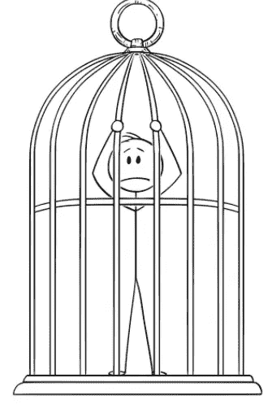

# 为什么薪酬过高并不总是对你有好处

> 原文：<https://medium.datadriveninvestor.com/why-being-overpaid-is-not-always-good-for-you-c0425f594cce?source=collection_archive---------3----------------------->

Source — [www.pinterest.com](http://www.pinterest.com)

# 介绍

当谈到找工作时，工资总是任何人在选择公司、个人资料和地点时考虑的一个重要因素。每个人都参加过讲座，读过一些文章，这些文章重申其他因素，如 ***良好的工作生活平衡、友好的同事、有趣的项目等等*** 同样重要，甚至更重要。但是尽管如此，让我们面对现实吧， ***薪水仍然是大多数人最关心的问题。***

现在，一份工作的薪水只受一个因素的影响——技能和资格需求之间的差距。这种差距还取决于许多因素，其中一些因素解释如下。

1.  ***获得技能所需的投资(时间或金钱)*** 。例如，顶级商学院毕业生的学费非常高，不是每个人都能负担得起的。医生必须在学术上投入很多年，才能开始拿到薪水。
2.  ***与工作相关的艰辛*** 。例如，考虑到工作的性质，商船队或石油工程对许多人没有吸引力。
3.  ***工作简介的感知复杂性*** 。技术角色通常被认为是“不是每个人都喜欢的”或“为聪明人保留的”。因此，数据科学家和软件开发人员需求量很大。

Courtesy — [https://timesofindia.indiatimes.com/](https://timesofindia.indiatimes.com/)

因此， ***比*** 的“多工作，多赚钱”甚至“聪明工作，多赚钱”要复杂得多。你们中的一些人可能会认为，如果这是真的，这个世界是如此不公平！嗯，那是完全不同的讨论，关于这个我宁愿写一本书也不愿写一篇小文章。在这里，我们关心的是如何认识到如果你的工资过高，它并不总是对你有好处，以及如果你发现自己处于这种情况下，你能做些什么。

# 道德与实践的角度

被多付的一个角度是 ***道德*** 。几乎所有财务状况良好的人都会在某个时候产生这种想法。总有许多人更加努力地工作，有些人甚至冒着健康危险，工资却比 T42 低得多。虽然这是一个不幸的问题，但它并没有真正给你带来挑战。它只是 ***点燃了对他人*** 的普遍同情感。我们不是来谈这个的。

另一个角度是 ***实用*** 。在本文的剩余部分，每当我使用“支付过高”这个词时，我都会提到这一点。在这里，你实际上得到的 ***比你应得的*** 要多。你不可能在其他地方得到同样技能水平的薪酬待遇。你只是碰巧得到了这份工作，因为你在正确的时间出现在了正确的地方，或者其他一些运气的组合。你的薪酬高于行业标准 ***，却没有任何与能力相关的理由*** 。而这个 ***会让你不仅有罪恶感还会有不安全感*** 。将你自己与你的同龄人相比，会让你充满自我怀疑，从而产生自卑感。

# 薪酬过高的问题

你内心的想法并不是薪酬过高的唯一负面因素。首先，如果你的上司认为你的报酬很高，那么你会被期望 ***比你的能力*** 付出更多，不仅是在努力工作的时间上，而且是在承担的责任上。鉴于你的技能水平，其中一些可能非常不现实。但是你会被期望公平对待你的薪水，否则会传达一个非常错误的信息。 ***好的不会足够好*** 。

其次，如果你的同事也有相同的观点，(假设他们对你的收入有一个粗略的估计)这会导致关系紧张。 因此，工作场所会变得相当有毒。从长远来看，这也可能对你的职业发展产生负面影响。毕竟，在领导岗位上，你的下属对你的看法至关重要。

最后但并非最不重要的一点是，支付你过高薪酬的公司可能对你的评估有误 。但这并不意味着每个公司都会这么做。在某种程度上，你正 ***困在你当前的角色*** 中，这意味着你将不得不处理抛给你的一切。任何工作转换都会有巨大的 ***机会成本*** 。此外，如果你对低工资持开放态度，招聘人员会持怀疑态度。因为技能的差距，他们不会给你更高甚至相同的报酬。除非你决定休息一下，或者去接受教育/创业， ***否则你的退出选择有限*** 。

Courtesy — www.vectorstock.com

# 你工资高吗？如果是，你该怎么做？

你要做的就是问自己一个问题——***如果你今天去别的地方应聘*** 你会很难拿到同样的工资吗？如果你诚实的回答是 ***是的，那么你的薪水过高了*** ，就是这样。你越来越高，超过了业界的普遍看法对你的评价。然而，与其担心潜在的问题，你可以做的是。你知道 ***你已经拥有的能力和你期望拥有的能力之间存在差距*** 。最显而易见的解决方案是尝试与 ***弥合*** 的差距。这可以通过三个简单的步骤来完成。

1.  ***研究什么是期望*** 出一个人的职位和工资水平。看看其他公司的招聘信息(你的简历和级别)中的首选资格应该会有所帮助。有一个导师的指导也是有帮助的。
2.  ***列出你需要学习的东西*** ，才有资格获得这些工作中的好分数。对于多年的经验和教育背景，你并不能马上做什么。这个列表应该只包含需要获得的技能。
3.  制定一个 ***计划*** 开始一步一步走*。花 1-2 个小时 (每天)额外工作，专门用于学习，这可能是个好主意。*

*当你开始的时候，你可能会觉得自己一事无成。坚持不懈，完成你的目标。这是 ***而不是*** 的锻炼计划，在该计划中，您将在您的体重计上看到数字结果。这更多的是 ***性质上的*** 。你甚至不会意识到你在进步。一个晴朗的日子， ***突然，你会注意到你走过的地面*** 。这就是它的美妙之处。你太专注于你的旅程了，以至于忘记了你正在向你的目的地前进。显然，这需要*一大堆的投入。**

****

**Courtesy — www.vectorstock.com**

# **结论**

**这篇文章的标题是——为什么工资过高并不总是对你有好处。但是现在你想想，它真的 ***取决于你对它*** 的反应。如果薪酬过高的感觉让你更加努力，让自己变得有价值，这是一个令人敬畏的祝福！你有一个 ***提升自己技能的巨大动力，同时你也赚了几个外快*** 。只要你采取正确的方式，工资过高就不是问题。如果你不这样做，它确实 ***对一个人的职业轨迹*** 构成潜在风险。总之底线是不变的，不管薪水是否过高，我们都应该不断提高自己的技能。**